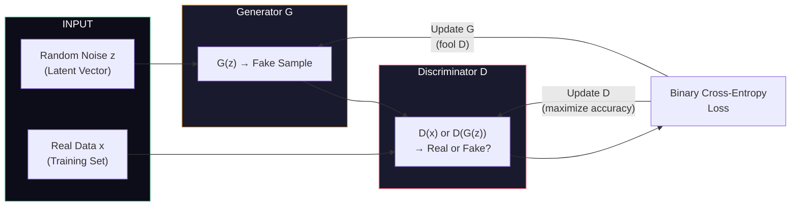
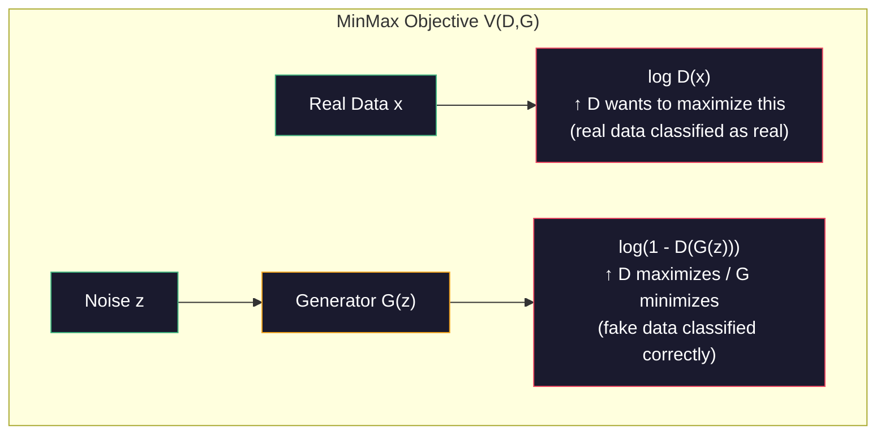
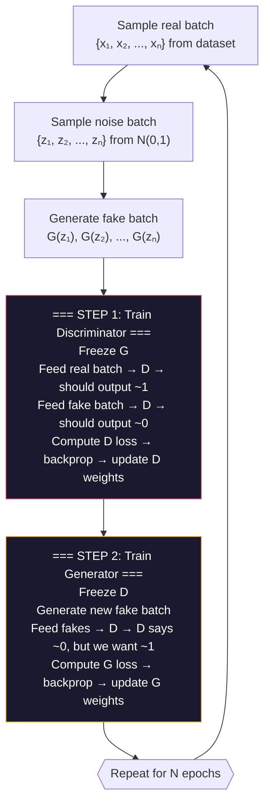
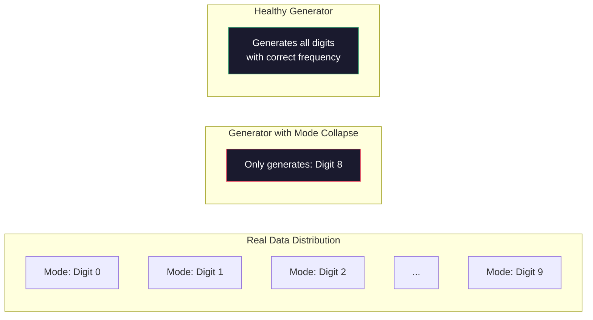
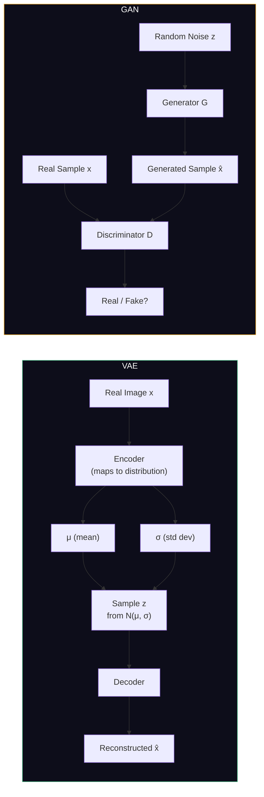

# Advanced AI — Part 1: Generative Adversarial Networks (GANs)

---

**Series:** Advanced Artificial Intelligence — BE Computer Engineering (Sem VIII, C-Scheme)
**Part:** 1 of 8
**Exam Papers:** May 2024 (QP CODE: 10054668) · May 2025 (QP CODE: 10081862)
**Reading time:** ~45 minutes

---

## Exam Questions Covered in This Article

> **May 2024 — Q1(a) [5 Marks]**
> *"Differentiate between Generative Adversarial Network and Variational Auto Encoder."*

> **May 2025 — Q1(a) [5 Marks]**
> *"Differentiate between Generative Adversarial Network and Variational Auto Encoder."*

> **May 2024 — Q2(a) [10 Marks]**
> *"Elaborate on the architecture and challenges of training GANs, particularly focusing on issues like training instability and mode collapse."*

> **May 2025 — Q2(b) [4 Marks]**
> *"Explain the MinMax loss function used in GAN, along with the components of GAN."*

---

## Table of Contents

1. [The Core Idea: Two Networks Fighting Each Other](#1-the-core-idea-two-networks-fighting-each-other)
2. [GAN Architecture in Detail](#2-gan-architecture-in-detail)
3. [The Generator](#3-the-generator)
4. [The Discriminator](#4-the-discriminator)
5. [The MinMax Loss Function](#5-the-minmax-loss-function)
6. [The Training Loop Step-by-Step](#6-the-training-loop-step-by-step)
7. [Training Challenges: Instability and Mode Collapse](#7-training-challenges-instability-and-mode-collapse)
8. [GAN vs Variational Autoencoder: The Full Comparison](#8-gan-vs-variational-autoencoder-the-full-comparison)
9. [Key Takeaways](#9-key-takeaways)

---

## 1. The Core Idea: Two Networks Fighting Each Other

### Formal Definition

A **Generative Adversarial Network (GAN)** is a framework for estimating generative models via an adversarial process. It simultaneously trains two models:

- A **generative model G** that captures the data distribution $p_{data}$
- A **discriminative model D** that estimates the probability that a sample came from the training data rather than from G

Formally, given a data distribution $p_{data}(x)$ over data $x$, the GAN framework defines:
- $p_z(z)$: a prior on input noise variables $z$ (typically Gaussian or uniform)
- $G(z; \theta_G)$: a differentiable function mapping from noise space to data space, parameterized by $\theta_G$
- $D(x; \theta_D)$: a differentiable function outputting a scalar in $[0,1]$, parameterized by $\theta_D$

**Historical context:** GANs were invented by **Ian Goodfellow et al. in 2014** and introduced in the paper *"Generative Adversarial Nets"* at NIPS 2014. The paper was rejected by multiple top venues before acceptance — it is now one of the most cited papers in all of deep learning.

### The Intuition: Counterfeiter and Detective

Before we look at equations or diagrams, understand the intuition. Every other generative model before GANs tried to explicitly model the probability distribution of data — that is, they tried to learn *exactly what the data looks like mathematically*, which is extremely hard for complex things like faces or paintings.

Ian Goodfellow's 2014 insight was radical: **don't model the distribution directly. Instead, set up a competition between two neural networks and let them teach each other.**

The analogy that best captures this:

> Imagine a **counterfeiter** who makes fake currency, and a **detective** who tries to catch the fakes. The counterfeiter gets better at faking because the detective keeps catching them. The detective gets better at detecting because the counterfeiter keeps improving. After enough rounds, the counterfeiter produces fakes so good that even the best detective cannot tell the difference.

In a GAN:
- The **counterfeiter** is the **Generator** (G)
- The **detective** is the **Discriminator** (D)
- The **currency** is whatever you want to generate: images, audio, text

Neither network is told explicitly what "real" or "fake" looks like in terms of mathematical rules. They learn entirely through competition with each other.

### Why GANs Are Revolutionary

Before GANs, generative models (VAEs, Boltzmann Machines, Pixel-level models) produced blurry or low-quality samples. GANs changed this by:

1. **Implicit density estimation**: G doesn't need to model $p_{data}$ explicitly — it just needs to match it well enough to fool D
2. **Adversarial loss**: The loss function (D's judgment) is learned, not fixed — it adapts to become harder over time
3. **No reconstruction loss**: Unlike autoencoders, GANs don't minimize pixel-wise MSE, so they can produce sharp, high-frequency details

**The price of this power:** GANs are extremely difficult to train. The adversarial dynamic creates instability that simpler generative models don't have. This is why the GAN research field (2014–present) has been largely about making GAN training work reliably.

---

## 2. GAN Architecture in Detail



The two networks share no weights. They are trained alternately, not simultaneously. The only connection between them is the loss signal: D tells G how convincing its fakes are, and G's output gives D harder examples to learn from.

---

## 3. The Generator

### What It Does

The Generator takes a **random noise vector z** (sampled from a simple distribution, usually Gaussian or uniform) and maps it to a **realistic-looking data sample** — for example, a 28×28 image of a digit.

$$G: z \rightarrow \hat{x}$$

Where:
- $z \in \mathbb{R}^{d}$ is a low-dimensional random noise vector (e.g., 100 dimensions)
- $\hat{x}$ is a generated sample (e.g., a 784-dimensional pixel vector for a 28×28 image)

### Architecture

The Generator is typically a series of **transposed convolution layers** (also called deconvolution or upsampling layers) that progressively upsample from a small latent code to a full-resolution output.

```
z (100-dim noise)
        ↓
  Dense Layer → 4×4×512 feature maps
        ↓
  Upsample → 8×8×256
        ↓
  Upsample → 16×16×128
        ↓
  Upsample → 32×32×64
        ↓
  Output → 64×64×3 (color image)
```

### Key Properties

| Property | Detail |
|----------|--------|
| **Input** | Random noise vector z (the "seed" of creativity) |
| **Output** | A generated data sample (image, audio, etc.) |
| **Goal** | Fool the Discriminator — make output indistinguishable from real data |
| **Activation (final layer)** | `tanh` for images (output range: [-1, 1]) |
| **Loss signal** | Comes from the Discriminator's verdict on G's output |
| **Never sees** | Real data directly — only learns from D's feedback |

---

## 4. The Discriminator

### What It Does

The Discriminator takes either a **real data sample** (from the training set) or a **fake sample** (from G) and outputs a **probability** that the sample is real.

$$D: x \rightarrow [0, 1]$$

Where:
- $D(x) \approx 1$ means "this looks real"
- $D(x) \approx 0$ means "this looks fake"

### Architecture

The Discriminator is essentially a **standard binary classifier**. For images, it uses convolutional layers to progressively downsample, then a sigmoid output.

```
Input image (real or fake)
        ↓
  Conv → 32×32×64  (downsample)
        ↓
  Conv → 16×16×128
        ↓
  Conv → 8×8×256
        ↓
  Flatten → Dense Layer
        ↓
  Sigmoid → Probability [0, 1]
```

| Property | Detail |
|----------|--------|
| **Input** | Real image OR generated image |
| **Output** | Probability that input is real (scalar between 0 and 1) |
| **Goal** | Correctly classify real vs fake |
| **Activation (final layer)** | `sigmoid` |
| **Loss signal** | How often it is fooled by G |
| **Sees** | Both real data and G's generated data |

---

## 5. The MinMax Loss Function

> **This section directly answers May 2025 Q2(b) — "Explain the MinMax loss function used in GAN, along with the components of GAN."**

### The Objective

The entire GAN training framework is captured in a single equation called the **minimax objective** (or adversarial loss):

$$\min_G \max_D \; V(D, G) = \mathbb{E}_{x \sim p_{data}(x)}[\log D(x)] + \mathbb{E}_{z \sim p_z(z)}[\log(1 - D(G(z)))]$$

This equation looks intimidating but breaks into two clean parts. Let's understand each.

### Breaking Down the Equation

| Term | Meaning | Who benefits? |
|------|---------|--------------|
| $\mathbb{E}_{x \sim p_{data}(x)}[\log D(x)]$ | Expected log-probability that D says "real" for **real samples** | D wants this **high** (correctly identify real data) |
| $\mathbb{E}_{z \sim p_z(z)}[\log(1 - D(G(z)))]$ | Expected log-probability that D says "fake" for **generated samples** | D wants this **high** (correctly identify fakes); G wants this **low** (fool D) |

### The Two Players' Objectives

**Discriminator wants to MAXIMIZE V:**  
D wants to correctly label real data as real (maximize $\log D(x)$) and correctly label fakes as fake (maximize $\log(1 - D(G(z)))$).

**Generator wants to MINIMIZE V:**  
G wants to produce fakes that D labels as real, so it wants to minimize $\log(1 - D(G(z)))$ — equivalently, it wants $D(G(z))$ to be close to 1 (D thinks fake is real).

### In Practice: The Non-Saturating Loss

In the original formulation, G minimizes $\log(1 - D(G(z)))$. But this saturates early in training — when D is much stronger than G (which is always true at the start), the gradient signal to G becomes vanishingly small.

**Practical fix:** Instead of minimizing $\log(1 - D(G(z)))$, G **maximizes** $\log(D(G(z)))$.

This gives the same equilibrium but provides much stronger gradients early in training.



### Equilibrium: The Nash Equilibrium

Training converges when neither player can improve by changing their strategy — a **Nash Equilibrium** in game theory terms. 

**Formal definition of Nash Equilibrium in GANs:**  
A pair $(G^*, D^*)$ is a Nash Equilibrium of the GAN game if:
1. $G^*$ minimizes $V(D^*, G)$ — G cannot do better given D's strategy
2. $D^*$ maximizes $V(D, G^*)$ — D cannot do better given G's strategy

Goodfellow proved that the **global optimal solution** is $p_G = p_{data}$ (the generator perfectly matches the real distribution), at which point:

$$D^*(x) = \frac{p_{data}(x)}{p_{data}(x) + p_G(x)} = \frac{p_{data}(x)}{2 \cdot p_{data}(x)} = \frac{1}{2} \quad \text{for all } x$$

The Discriminator is completely confused — it gives 50% probability to every sample being real, because G's distribution has become identical to the real data distribution. This is the ideal end state.

**Is this global optimum reachable in practice?**  
Theoretically yes; practically no. Real GANs use finite neural networks with finite training time, and the loss landscape has many local Nash Equilibria and saddle points. The global optimum is an ideal target, not a guaranteed outcome.

### Proof of Optimality: Two-Stage Analysis

**Stage 1: Optimal D given G**

For any Generator G, the optimal Discriminator is:

$$D^*(x) = \frac{p_{data}(x)}{p_{data}(x) + p_G(x)}$$

**Proof:** $V(D, G) = \int_x [p_{data}(x) \log D(x) + p_G(x) \log(1 - D(x))] dx$

Setting $\frac{\partial}{\partial D(x)} [p_{data}(x) \log D(x) + p_G(x) \log(1-D(x))] = 0$:

$$\frac{p_{data}(x)}{D(x)} - \frac{p_G(x)}{1 - D(x)} = 0 \implies D^*(x) = \frac{p_{data}(x)}{p_{data}(x) + p_G(x)}$$

**Stage 2: Global minimum of $V(G, D^*)$**

Substituting $D^*$ back:

$$C(G) = \mathbb{E}_{x \sim p_{data}}\left[\log \frac{p_{data}(x)}{p_{data}(x) + p_G(x)}\right] + \mathbb{E}_{x \sim p_G}\left[\log \frac{p_G(x)}{p_{data}(x) + p_G(x)}\right]$$

$$= -\log 4 + 2 \cdot JS(p_{data} \| p_G)$$

Since $JS \geq 0$ with equality iff $p_G = p_{data}$, the global minimum is $C(G^*) = -\log 4$ achieved at $p_G = p_{data}$. QED.

---

## 6. The Training Loop Step-by-Step

GAN training alternates between updating D and updating G. **They are never updated at the same time.**



**Why freeze one network while updating the other?**  
If both networks update simultaneously, you get a chaotic system where the loss landscape shifts under both networks' feet at every step. Alternating updates stabilizes the competition.

**How many D updates per G update?**  
Often 1:1, but some implementations update D multiple times (k=1 to 5) per G update to keep D stronger, providing a cleaner learning signal to G.

---

## 7. Training Challenges: Instability and Mode Collapse

> **This section directly answers May 2024 Q2(a) — "Elaborate on the architecture and challenges of training GANs, particularly focusing on issues like training instability and mode collapse."**

GAN training is notoriously difficult. Unlike standard neural network training (minimize loss → done), GANs are finding a Nash Equilibrium in a two-player game — which is fundamentally harder.

### Challenge 1: Training Instability

**What it is:**  
The generator and discriminator oscillate without converging. The loss curves fluctuate wildly instead of steadily improving. In extreme cases, one network collapses entirely.

**Why it happens (deep explanation):**  
The GAN objective is a **minimax saddle-point problem** — not a standard minimization problem. Gradient descent was designed for finding minima, not saddle points. 

In the loss landscape, the GAN equilibrium is a point where:
- Moving along G's axis: it's a minimum (G wants to minimize V)
- Moving along D's axis: it's a maximum (D wants to maximize V)

Standard gradient descent applied to both simultaneously causes **rotational dynamics** around the saddle point instead of converging to it. The loss oscillates in circles.

**Technical root cause:** Consider a simple linear GAN example: $G$ outputs a scalar $g$, $D$ outputs $d \cdot g$ (where $d$ is the discriminator parameter). The gradient updates are:
- $g \leftarrow g - \alpha_G \cdot \nabla_g V = g - \alpha_G \cdot d$
- $d \leftarrow d + \alpha_D \cdot \nabla_d V = d + \alpha_D \cdot g$

This is a differential equation $\dot{g} = -d$, $\dot{d} = g$ — whose solution is circular orbits $(g(t) = \cos(t), d(t) = \sin(t))$. The system orbits the equilibrium forever without converging.

**Symptoms:**
- Loss curves that oscillate without decreasing
- Generated images that suddenly degrade after many good epochs
- D loss going to 0 (D wins completely) or 0.5 with random outputs (D gives up)

**Solutions:**

| Technique | How It Helps |
|-----------|-------------|
| **Learning rate tuning** | Use lower LR for D than G (e.g., D: 0.0001, G: 0.0002) |
| **One-sided label smoothing** | Label real samples as 0.9 instead of 1.0 — prevents D from becoming overconfident |
| **Gradient penalty (WGAN-GP)** | Constrains D's gradient norm, preventing it from growing unbounded |
| **Spectral normalization** | Normalizes D's weight matrices to control Lipschitz constant |
| **Different architectures** | DCGAN-specific architectural choices (no pooling, batch norm) stabilize training significantly |
| **Two time-scale update rule** | Use different learning rates for G and D — proven to converge in theory |

### Challenge 2: Mode Collapse

**What it is:**  
The Generator "cheats" by learning to produce only a **single type** (or very few types) of output, regardless of the input noise. For instance, a GAN trained on a handwritten digit dataset might only generate the digit "8" even though it should generate 0–9.

**Why it happens (deep explanation):**  
G's only goal is to fool D. If G finds that producing one specific type of output (e.g., very sharp, clear-looking "8") always fools D, it has no incentive to explore other modes of the data distribution. G collapses to this local optimum.

The name comes from probability theory: the real data distribution has many **modes** (peaks — one for each digit, one for each person's face, etc.). Mode collapse means G only captures one or a few of these peaks.

**Why D can't fix this:** When G collapses to one mode, D eventually learns to detect that mode as fake (it's always the same). G then switches to a different mode. G and D cycle through modes without G ever covering all of them simultaneously. This is called **mode cycling**.

**Formal perspective:** Mode collapse is G finding a degenerate Nash Equilibrium — a valid game-theoretic fixed point, but not the desired one (which requires $p_G = p_{data}$).



**Solutions:**

| Technique | How It Helps |
|-----------|-------------|
| **Minibatch discrimination** | D looks at a batch of G's outputs, not just one — if all look the same, it detects the collapse |
| **Unrolled GANs** | G optimizes against a future version of D, giving it a longer-horizon view |
| **Wasserstein loss (WGAN)** | Replaces the original loss with Earth Mover's Distance — much more robust to mode collapse (covered in Part 2) |
| **Feature matching** | G's loss is based on matching intermediate D features, not just the final output |
| **Diverse noise vectors** | Encourage G to use more of the input noise space (information bottleneck) |

### Challenge 3: Evaluation Difficulty

Unlike a classifier (where accuracy is clear), there's no simple single metric for GAN quality. The most widely used metric is **Fréchet Inception Distance (FID)** — lower FID = better quality and diversity. But even FID has limitations.

**FID definition:**  
FID computes the Fréchet distance between two multivariate Gaussians fitted to the feature distributions of real and generated images (using InceptionV3 features):

$$FID = \|\mu_r - \mu_g\|^2 + Tr(\Sigma_r + \Sigma_g - 2(\Sigma_r \Sigma_g)^{1/2})$$

Lower FID = generated distribution is closer to real distribution in feature space. FID captures both quality (sharp, realistic images) and diversity (covering all modes).

---

## 8. GAN vs Variational Autoencoder: The Full Comparison

> **This section directly answers May 2024 & 2025 Q1(a) — "Differentiate between Generative Adversarial Network and Variational Auto Encoder."**

Both GANs and VAEs are **deep generative models** — they can generate new data samples. But they achieve this through fundamentally different approaches.

### Conceptual Difference

A **VAE** learns the *explicit probability distribution* of data by encoding it into a compact latent space and reconstructing it. It can tell you exactly how likely a new sample is.

A **GAN** learns to *implicitly approximate* the data distribution through adversarial competition. It cannot explicitly evaluate the likelihood of a new sample, but it can generate extremely sharp, realistic outputs.



### Side-by-Side Comparison Table

| Dimension | GAN | VAE |
|-----------|-----|-----|
| **Core Mechanism** | Adversarial training (Generator vs Discriminator) | Variational inference (encode → reparameterize → decode) |
| **Number of Networks** | 2 (G and D) | 2 (Encoder and Decoder) |
| **Training Objective** | MinMax loss (no explicit likelihood) | ELBO — Evidence Lower Bound (reconstruction loss + KL divergence) |
| **Latent Space** | Unstructured — z is just noise | Structured — z follows N(0,1) by design |
| **Output Quality** | Very sharp, photorealistic | Slightly blurry (due to pixel-wise reconstruction loss) |
| **Output Diversity** | Can suffer mode collapse | Covers data distribution more smoothly |
| **Likelihood Estimation** | Cannot compute — implicit model | Can estimate (ELBO is a lower bound on log-likelihood) |
| **Training Stability** | Notoriously unstable | Stable — standard gradient descent on single loss |
| **Latent Space Interpolation** | Possible but less smooth | Excellent — smooth, meaningful interpolations |
| **Control over generation** | Harder (noise input is unstructured) | Easier — you can sample specific regions of latent space |
| **Original Paper** | Goodfellow et al., 2014 | Kingma & Welling, 2013 |
| **Best suited for** | High-quality image synthesis | Representation learning, anomaly detection, data generation with control |

### When to Use Which?

Use a **GAN** when:
- Your primary goal is generating the most photorealistic samples possible
- You don't need to estimate probabilities
- You're willing to invest effort in training stability

Use a **VAE** when:
- You need a structured latent space for interpolation or editing
- You want stable, reproducible training
- You need to detect anomalies (VAE can score how "unusual" a sample is)

---

## 9. Key Takeaways

**GAN in three sentences:**  
A GAN pits a Generator against a Discriminator in a minimax game. The Generator maps random noise to realistic data samples; the Discriminator classifies real vs fake. Training ends when neither player can improve — the Nash Equilibrium — at which point generated samples are indistinguishable from real ones.

**MinMax Loss in one sentence:**  
$\min_G \max_D V(D,G) = \mathbb{E}[\log D(x)] + \mathbb{E}[\log(1-D(G(z)))]$ — D maximizes correct classification; G minimizes the chance D detects its fakes.

**Key training challenges:**
- **Instability** — Loss oscillates; solved by learning rate tuning, label smoothing, spectral normalization
- **Mode collapse** — G generates only one type; solved by minibatch discrimination, WGAN loss, feature matching
- **Vanishing gradients** — D becomes too strong early; solved by non-saturating loss, careful balancing

**GAN vs VAE in one sentence:**  
GANs produce sharper outputs through adversarial competition but are unstable and lack a structured latent space; VAEs train stably with a principled probabilistic framework but produce slightly blurrier outputs.

---

*Next: [Part 2 — Wasserstein GAN (WGAN)](02-wgan.md) — How Earth Mover's Distance fixes GAN instability and what Lipschitz continuity actually means.*
