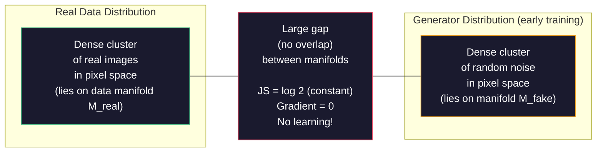
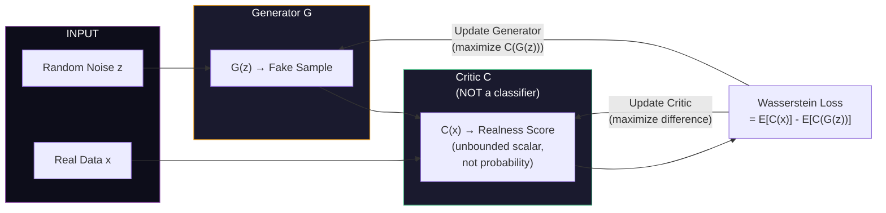
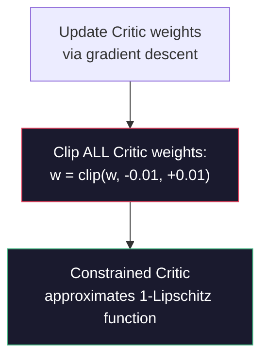

# Advanced AI — Part 2: Wasserstein GAN (WGAN)

---

**Series:** Advanced Artificial Intelligence — BE Computer Engineering (Sem VIII, C-Scheme)
**Part:** 2 of 8
**Exam Papers:** May 2024 (QP CODE: 10054668) · May 2025 (QP CODE: 10081862)
**Reading time:** ~35 minutes

---

## Exam Questions Covered in This Article

> **May 2024 — Q3(b) [10 Marks]**
> *"Explain WGAN in detail."*

> **May 2025 — Q2(a) [4 Marks]**
> *"Explain WGAN in details."*

---

## Table of Contents

1. [Why the Original GAN Loss Fails](#1-why-the-original-gan-loss-fails)
2. [The Problem with JS Divergence](#2-the-problem-with-js-divergence)
3. [Earth Mover's Distance — A Better Metric](#3-earth-movers-distance--a-better-metric)
4. [The Wasserstein GAN Architecture](#4-the-wasserstein-gan-architecture)
5. [The Critic vs the Discriminator](#5-the-critic-vs-the-discriminator)
6. [Weight Clipping: Enforcing the Constraint](#6-weight-clipping-enforcing-the-constraint)
7. [WGAN Training Algorithm](#7-wgan-training-algorithm)
8. [WGAN-GP: The Gradient Penalty Improvement](#8-wgan-gp-the-gradient-penalty-improvement)
9. [Advantages of WGAN over Vanilla GAN](#9-advantages-of-wgan-over-vanilla-gan)
10. [Key Takeaways](#10-key-takeaways)

---

## 1. Why the Original GAN Loss Fails

In Part 1, we saw that GANs suffer from two major problems: training instability and mode collapse. These problems are not just implementation bugs — they are **consequences of using the wrong mathematical measure of distance between distributions**.

To understand WGAN, you first need to understand what the original GAN is actually computing, and why that computation breaks.

### What is the GAN Really Measuring?

When a GAN trains its Discriminator to classify real vs fake, it is implicitly measuring the **Jensen-Shannon (JS) divergence** between the real data distribution $p_{data}$ and the generator's distribution $p_G$.

$$JS(p_{data} \| p_G) = \frac{1}{2} KL\left(p_{data} \bigg\| \frac{p_{data}+p_G}{2}\right) + \frac{1}{2} KL\left(p_G \bigg\| \frac{p_{data}+p_G}{2}\right)$$

This is a mathematically valid divergence measure. The problem is what happens when the two distributions **don't overlap**.

---

## 2. The Problem with JS Divergence

### Formal Definitions: KL and JS Divergence

Before identifying the problem, understand what KL and JS divergence actually measure.

**Kullback-Leibler (KL) Divergence** measures how different distribution $Q$ is from a reference distribution $P$:

$$KL(P \| Q) = \int p(x) \log \frac{p(x)}{q(x)} \, dx$$

Properties of KL:
- $KL(P \| Q) \geq 0$ always (Gibbs inequality)
- $KL(P \| Q) = 0$ if and only if $P = Q$ everywhere
- **Not symmetric**: $KL(P \| Q) \neq KL(Q \| P)$
- **Undefined** if $q(x) = 0$ at any point where $p(x) > 0$ (division by zero)

**Jensen-Shannon (JS) Divergence** is a symmetrized, smoothed version of KL:

$$JS(P \| Q) = \frac{1}{2} KL\left(P \bigg\| \frac{P+Q}{2}\right) + \frac{1}{2} KL\left(Q \bigg\| \frac{P+Q}{2}\right)$$

Properties of JS:
- Symmetric: $JS(P \| Q) = JS(Q \| P)$
- Bounded: $0 \leq JS(P \| Q) \leq \log 2$
- The original GAN's Discriminator, at its optimal point, implicitly computes JS divergence between $p_{data}$ and $p_G$

### The Non-Overlapping Distributions Problem

At the beginning of GAN training (and often throughout), the real data distribution $p_{data}$ and the generator distribution $p_G$ occupy completely different regions of the data space. A real face image and a randomly generated image have essentially **no overlap**.

**Why no overlap?** High-dimensional image data ($64 \times 64 \times 3 = 12,288$ dimensions) concentrates on a very thin manifold. The real images lie on one manifold; early Generator output lies on an entirely different manifold. The probability that a random Generator sample lands on the same manifold as a real image is essentially zero.

When two distributions have non-overlapping support (no common region), the mixture $\frac{P+Q}{2}$ has both $P$ and $Q$ as components but they never "blend". In this case, the KL terms in JS simplify:

$$KL\left(P \bigg\| \frac{P+Q}{2}\right) = \log 2 \quad \text{(when P and Q are disjoint)}$$

Therefore:

$$JS(p_{data} \| p_G) = \frac{1}{2} \cdot \log 2 + \frac{1}{2} \cdot \log 2 = \log 2 \quad \text{(constant)}$$

This is catastrophic for training. The gradient of a constant is **zero**. A zero gradient means no learning signal. **The Generator cannot learn.**

### Proof That JS = log 2 When Distributions Are Disjoint

When $p_{data}$ and $p_G$ have disjoint support:
- For any $x$ where $p_{data}(x) > 0$: $p_G(x) = 0$, so $\frac{p_{data}+p_G}{2}(x) = \frac{p_{data}(x)}{2}$
- Therefore: $\frac{p_{data}(x)}{\frac{p_{data}+p_G}{2}(x)} = \frac{p_{data}(x)}{p_{data}(x)/2} = 2$
- So: $KL\left(p_{data} \| \frac{p_{data}+p_G}{2}\right) = \int p_{data}(x) \log 2 \, dx = \log 2$

By symmetry, the same holds for the second KL term. Hence $JS = \log 2$. QED.

### What This Means for the Discriminator

At the optimal Discriminator, the GAN training signal to G is:

$$\nabla_G \mathcal{L} = \nabla_G [2 \cdot JS(p_{data} \| p_G) - 2\log 2] = \nabla_G [2 \cdot \log 2 - 2\log 2] = \nabla_G [0] = 0$$

**The gradient is identically zero.** No information about which direction G should move to improve. Training stops or oscillates wildly.

### Visualizing the Problem



With JS divergence, the "distance" between these two clusters is always $\log 2$ — a constant — regardless of whether the gap between them is 1 unit or 1000 units. The GAN literally cannot tell if it's getting closer to the real distribution.

This explains training instability: the Discriminator saturates (JS = log 2), the gradient to G vanishes, G cannot improve, and training oscillates or collapses.

### The Gradient Vanishing Intuition

Think of it like trying to navigate in a fog where your compass just says "lost" — it can't tell you whether you're 1 km or 100 km from your destination. Without knowing the direction or degree of deviation, you cannot make progress. JS divergence with disjoint supports is exactly this: a compass stuck at one value no matter where you are.

---

## 3. Earth Mover's Distance — A Better Metric

WGAN replaces JS divergence with **Earth Mover's Distance (EMD)**, also called the **Wasserstein-1 distance**.

### The Intuition

Imagine the two distributions are piles of dirt (real data) and holes (fake data). Earth Mover's Distance is the **minimum total amount of work needed to move the dirt to fill the holes** — where work = mass of dirt × distance moved.

Unlike JS divergence, EMD gives a **meaningful gradient even when distributions don't overlap**. If the real distribution is 100 units away from the fake distribution, EMD = 100. If it's 50 units away, EMD = 50. The gradient always points in the direction that closes the gap.

### The Mathematical Definition

$$W(p_{data}, p_G) = \inf_{\gamma \sim \Pi(p_{data}, p_G)} \mathbb{E}_{(x, y) \sim \gamma}[\|x - y\|]$$

Where:
- $\Pi(p_{data}, p_G)$ is the set of **all possible joint distributions** (transport plans) whose marginals are $p_{data}$ and $p_G$
- Each $\gamma$ is a coupling — a plan describing "move unit of mass from location $x$ (real) to location $y$ (fake)"
- The infimum finds the **most efficient transport plan**

### A Concrete 1D Example

Suppose real data is distributed as $p_{data} = \mathcal{N}(0, 1)$ and Generator produces $p_G = \mathcal{N}(\delta, 1)$ (same shape, just shifted by $\delta$):

- **JS divergence**: $= \log 2$ if $\delta$ is large enough (no overlap) — useless, no gradient
- **Wasserstein distance**: $= \delta$ always — perfectly proportional to how far apart they are, always provides gradient

This is why even when distributions are completely non-overlapping, WGAN can still "feel" the direction to move.

### Formal Properties of Wasserstein Distance

The Wasserstein-1 distance has mathematically desirable properties:

1. **Symmetry**: $W(P, Q) = W(Q, P)$
2. **Non-negativity**: $W(P, Q) \geq 0$; equals 0 iff $P = Q$
3. **Triangle inequality**: $W(P, R) \leq W(P, Q) + W(Q, R)$
4. **Continuity**: $W$ varies continuously even when distributions have disjoint support
5. **Weak convergence**: Sequences of distributions converging in $W$ converge in the weak topology (JS doesn't have this property)

These properties make it a proper **metric** on probability distributions — unlike JS divergence in the non-overlapping case.

### The Kantorovich-Rubinstein Duality

Computing the infimum over all joint distributions is intractable. The Wasserstein distance has a computationally useful dual form called the **Kantorovich-Rubinstein duality**:

$$W(p_{data}, p_G) = \sup_{\|f\|_L \leq 1} \mathbb{E}_{x \sim p_{data}}[f(x)] - \mathbb{E}_{x \sim p_G}[f(x)]$$

Where the supremum is taken over all **1-Lipschitz functions** $f$.

This is the key insight that makes WGAN practical: instead of computing the transport plan directly (intractable), we train a **neural network to approximate the optimal 1-Lipschitz function $f$** — this is the Critic.

### Why This Is Better

| Property | JS Divergence | Earth Mover's Distance |
|----------|--------------|----------------------|
| **Gradient when no overlap** | Zero (constant log 2) | **Non-zero, meaningful** |
| **Sensitive to distribution distance** | No — always log 2 when disjoint | **Yes** — proportional to gap |
| **Continuous** | Not always | **Always continuous** |
| **Training stability** | Poor | **Much better** |
| **Weak convergence metric** | No | **Yes** |
| **Tractable dual form** | No clean dual | **Yes (Kantorovich-Rubinstein)** |
| **Interpretability** | None (saturates) | Loss value correlates with image quality |

---

## 4. The Wasserstein GAN Architecture

WGAN has the **same two-network structure** as a vanilla GAN. The architecture of the networks themselves doesn't need to change dramatically. What changes is:

1. The **loss function** used to train both networks
2. The name and role of the Discriminator (now called the **Critic**)
3. A **weight clipping** constraint on the Critic



### The WGAN Objective

$$\min_G \max_{C \in \mathcal{L}_1} \; \mathbb{E}_{x \sim p_{data}}[C(x)] - \mathbb{E}_{z \sim p_z}[C(G(z))]$$

Where:
- $C$ is the Critic (constrained to be 1-Lipschitz functions, denoted $\mathcal{L}_1$)
- $C(x)$ is the Critic's "realness score" for real data
- $C(G(z))$ is the Critic's "realness score" for generated data

**Critic wants to MAXIMIZE the difference:** It wants to give high scores to real data and low scores to fake data, maximizing the gap.

**Generator wants to MAXIMIZE $C(G(z))$:** It wants to produce fakes that the Critic gives high scores to — i.e., fakes that look real.

---

## 5. The Critic vs the Discriminator

### Formal Definition: Lipschitz Continuity

Before comparing Critic and Discriminator, understand the mathematical constraint that defines the Critic.

A function $f: \mathbb{R}^n \rightarrow \mathbb{R}$ is **K-Lipschitz** if there exists a constant $K \geq 0$ such that for all $x_1, x_2$:

$$|f(x_1) - f(x_2)| \leq K \cdot \|x_1 - x_2\|$$

In words: **the output of $f$ cannot change faster than $K$ times the rate at which the input changes.** If you move the input by distance $d$, the output moves by at most $K \cdot d$.

A **1-Lipschitz function** (K=1) satisfies:
$$|f(x_1) - f(x_2)| \leq \|x_1 - x_2\| \quad \text{for all } x_1, x_2$$

**Why does WGAN need 1-Lipschitz?**  
From the Kantorovich-Rubinstein duality, the Wasserstein distance equals the supremum over all 1-Lipschitz functions. For the Critic to approximate this supremum correctly, it must be constrained to the 1-Lipschitz function class. Without this constraint, the Critic could output arbitrarily large values, giving meaningless gradients to G.

**Visual intuition:** A 1-Lipschitz function is like a surface where you can never step off a cliff steeper than 45 degrees. The Discriminator (with sigmoid) can be arbitrarily steep; the Critic (with Lipschitz constraint) must be smooth.

### This is a key conceptual distinction that the exam frequently tests.

| Property | Discriminator (GAN) | Critic (WGAN) |
|----------|--------------------|--------------:|
| **Output** | Probability [0, 1] | Unbounded real number (any scalar) |
| **Final activation** | Sigmoid | **No activation** (linear output) |
| **Interpretation** | "Probability this is real" | "Realness score" (higher = more real) |
| **Loss function** | Binary cross-entropy | Wasserstein loss (simple mean difference) |
| **Role** | Binary classifier | Regression-style scorer |
| **Training goal** | Minimize classification error | Maximize score difference between real and fake |
| **Mathematical constraint** | None (outputs probability naturally) | **Must be 1-Lipschitz** |
| **Gradient behavior** | Saturates (sigmoid → 0 gradient) | Never saturates (unbounded) |
| **Convergence criterion** | D loss around 0.5 (confused D) | Wasserstein distance → 0 |

The Critic is not a classifier. It doesn't output a probability. It outputs a **scalar score** — a higher number means "more real-like." There's no upper or lower bound. Real images might get scores like +3.5, fakes might get scores like -2.1. The Critic is trying to maximize this gap.

### Why No Sigmoid on the Critic?

The sigmoid function compresses all values to $[0, 1]$:
$$\sigma(x) = \frac{1}{1+e^{-x}}$$

This is fine for binary classification (probability between 0 and 1). But it causes **gradient saturation**: for large positive or negative inputs, $\sigma'(x) \approx 0$ — the gradient vanishes. 

For the Critic, we want the output to be **unrestricted** so that:
1. The gradient can be non-zero everywhere
2. The score difference between real and fake can grow without bound as training improves
3. The Lipschitz constraint (not sigmoid) is what bounds the function, not artificial output compression

---

## 6. Weight Clipping: Enforcing the Constraint

The Wasserstein distance formula requires the Critic to be a **1-Lipschitz function**. This means:

$$|C(x_1) - C(x_2)| \leq |x_1 - x_2| \quad \text{for all } x_1, x_2$$

In plain language: the Critic's output cannot change faster than the distance between its inputs. This prevents the Critic from assigning arbitrarily extreme scores.

### How WGAN Enforces This: Weight Clipping

After each Critic update, WGAN **clips all Critic weights** to a small range $[-c, c]$ (e.g., $c = 0.01$):

$$w \leftarrow \text{clip}(w, -c, c)$$



**The limitation of weight clipping:**  
Weight clipping is a crude approximation. It forces the network to use only small weights, which can limit its capacity and cause it to converge to very simple functions (batch norm helps compensate). This led to the development of WGAN-GP (Gradient Penalty) as a better alternative.

---

## 7. WGAN Training Algorithm

Unlike vanilla GAN (where D and G alternate equally), WGAN trains the Critic **more often** than the Generator — typically 5 Critic steps for every 1 Generator step. This ensures the Critic provides an accurate Wasserstein estimate before updating G.

```
For each training iteration:
│
├─ For k = 1 to n_critic (e.g., k = 5):
│   │
│   ├─ Sample real batch {x₁,...,xₘ} from real data
│   ├─ Sample noise batch {z₁,...,zₘ} from N(0,1)
│   ├─ Generate fake batch {G(z₁),...,G(zₘ)}
│   ├─ Compute Critic loss:
│   │   L_C = E[C(G(z))] - E[C(x)]   ← maximize this gap in real - fake direction
│   ├─ Update Critic weights via Adam/RMSProp
│   └─ Clip Critic weights to [-c, c]
│
└─ Update Generator:
    ├─ Sample noise batch {z₁,...,zₘ}
    ├─ Generate fake batch {G(z₁),...,G(zₘ)}
    ├─ Compute Generator loss:
    │   L_G = -E[C(G(z))]   ← maximize realness score
    └─ Update Generator weights via Adam/RMSProp
```

**Note on optimizers:** The original WGAN paper recommends **RMSProp** (not Adam) for WGAN training. Adam's momentum can interfere with the clipping constraint and cause instability.

---

## 8. WGAN-GP: The Gradient Penalty Improvement

The authors of WGAN quickly identified that weight clipping is a weak way to enforce the Lipschitz constraint. **WGAN-GP (Gradient Penalty)** replaces weight clipping with a differentiable penalty term added directly to the Critic's loss.

### The Gradient Penalty

Instead of clipping weights, WGAN-GP adds a penalty that enforces the gradient norm to be close to 1:

$$\mathcal{L}_{GP} = \lambda \; \mathbb{E}_{\hat{x} \sim p_{\hat{x}}}\left[(\|\nabla_{\hat{x}} C(\hat{x})\|_2 - 1)^2\right]$$

Where:
- $\hat{x}$ is a **random interpolation** between a real sample and a generated sample: $\hat{x} = \epsilon x + (1 - \epsilon) G(z)$, with $\epsilon \sim U[0,1]$
- $\lambda$ is a penalty coefficient (typically $\lambda = 10$)
- $\|\nabla_{\hat{x}} C(\hat{x})\|_2$ is the L2 norm of the Critic's gradient at $\hat{x}$

**The full WGAN-GP Critic loss:**

$$\mathcal{L}_C = \mathbb{E}[C(G(z))] - \mathbb{E}[C(x)] + \lambda \; \mathbb{E}\left[(\|\nabla_{\hat{x}} C(\hat{x})\|_2 - 1)^2\right]$$

### WGAN vs WGAN-GP

| Property | WGAN | WGAN-GP |
|----------|------|---------|
| **Lipschitz enforcement** | Weight clipping | Gradient penalty on interpolated samples |
| **Network capacity** | Reduced (small weights) | Full capacity preserved |
| **Stability** | Better than vanilla GAN | Even better than WGAN |
| **Batch normalization** | Causes issues with clipping | Not recommended — use Layer Norm instead |
| **Complexity** | Simple | Slightly more complex (gradient computation) |
| **Convergence speed** | Slower | Faster, more reliable |

---

## 9. Advantages of WGAN over Vanilla GAN

| Problem in Vanilla GAN | WGAN Solution |
|------------------------|--------------|
| **Vanishing gradients** (JS divergence constant when no overlap) | EMD gives non-zero, meaningful gradient always |
| **Mode collapse** (G generates only one type) | Critic's unbounded scoring prevents G from collapsing to a single mode |
| **Training instability** (loss oscillates wildly) | Loss curve is **interpretable** — lower Wasserstein distance = better quality |
| **No metric for quality** (D loss doesn't correlate with image quality) | Critic loss **does correlate** with perceptual image quality |
| **Discriminator too powerful** | Critic doesn't saturate (no sigmoid) — always provides useful gradient |

**The most practically important advantage:** In vanilla GANs, the D loss going to 0 means D is too strong and G is getting no signal — but the loss gives you no warning. In WGAN, the Critic loss is directly interpretable: as it decreases over training, image quality genuinely improves. You can **use the loss as a training progress metric**.

### Theoretical Guarantees of WGAN

The original WGAN paper (Arjovsky et al., 2017) proved several important theoretical results:

1. **Theorem 1 (Gradient saturation):** Under mild conditions, the optimal GAN Discriminator causes the gradient to G to be zero almost everywhere (JS gradient problem).

2. **Theorem 2 (Wasserstein continuity):** $W(p_G, p_{data})$ is continuous everywhere and differentiable almost everywhere with respect to the Generator's parameters. This guarantees a useful training signal.

3. **Theorem 3 (Approximation):** A neural network with the Lipschitz constraint can approximate the 1-Lipschitz function in the Kantorovich-Rubinstein dual, giving a practical estimator for the Wasserstein distance.

**In practice, what these theorems mean:**
- If the Critic is well-trained (enough Critic steps per Generator step), the Wasserstein estimate is accurate
- The Generator receives gradients that genuinely indicate how to improve its distribution
- Training converges more reliably than vanilla GAN

### WGAN Limitations

WGAN is better than vanilla GAN but not perfect:

| Limitation | Description |
|-----------|-------------|
| **Weight clipping capacity** | Clipping weights restricts the function class the Critic can approximate — may not find the true optimal 1-Lipschitz function |
| **Batch normalization conflict** | Weight clipping + batch normalization causes problems (batch norm changes the effective weight range) |
| **Still can fail** | With poor hyperparameters or architecture, WGAN can still diverge |
| **Gradient penalty computation** | WGAN-GP adds compute cost (gradient of gradient computation) |
| **n_critic sensitivity** | If Critic isn't trained enough, Wasserstein estimate is inaccurate → bad Generator gradients |

### Summary: Why WGAN Matters

WGAN is a landmark paper not just because it improved GAN training, but because it **diagnosed the root cause of GAN failure**: the wrong choice of divergence measure. It showed that the type of mathematical distance you use to compare distributions is not a technicality — it is the fundamental driver of training stability.

This insight influenced all subsequent GAN development: WGAN-GP, SN-GAN, BigGAN, StyleGAN all incorporate WGAN's lesson that the Critic must provide stable, non-vanishing gradients to the Generator.

---

## 10. Key Takeaways

**WGAN in three sentences:**  
WGAN replaces the JS divergence-based loss of vanilla GANs with Earth Mover's Distance (Wasserstein-1 distance), which provides meaningful gradients even when real and fake distributions don't overlap. The Discriminator is replaced by a Critic that outputs an unbounded realness score instead of a probability. Weight clipping (or gradient penalty in WGAN-GP) enforces the required Lipschitz constraint on the Critic.

**The core insight:**  
The problem with vanilla GAN training instability is mathematical, not architectural. Using the wrong divergence measure (JS) causes zero gradients. WGAN fixes this by using the right divergence measure (Earth Mover's Distance).

**For your exam, remember these four key differences:**
1. **Critic, not Discriminator** — outputs scalar score, not probability
2. **No sigmoid** — linear output layer
3. **Wasserstein loss** — mean difference between real and fake scores
4. **Weight clipping** (or gradient penalty) — enforces Lipschitz constraint

---

*Previous: [Part 1 — GAN Fundamentals](01-gans-fundamentals.md)*  
*Next: [Part 3 — Advanced GANs: CGAN, DCGAN, CycleGAN](03-advanced-gans.md)*
