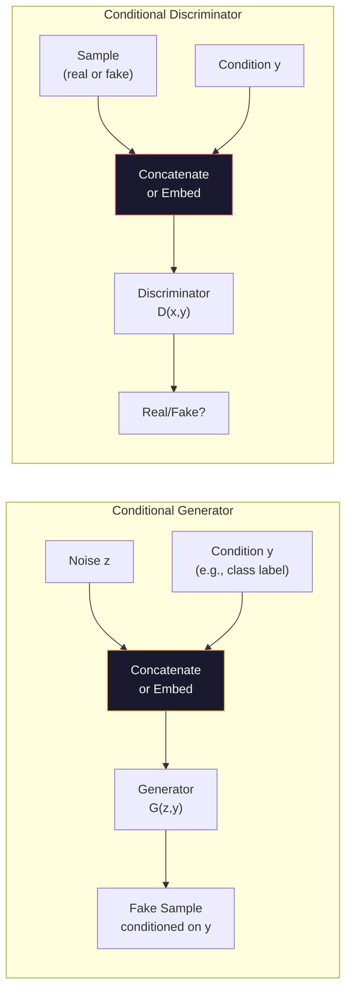
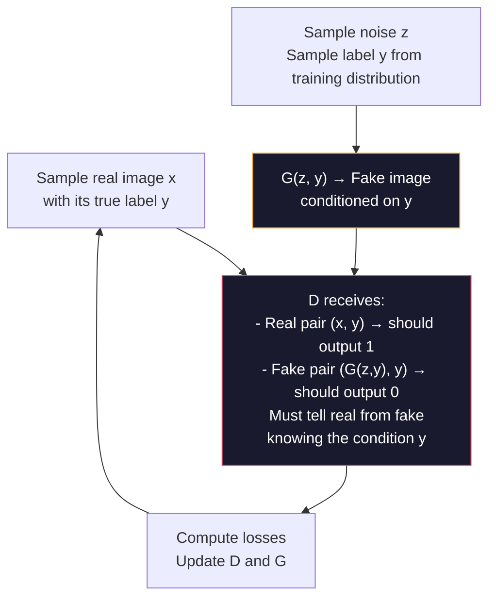
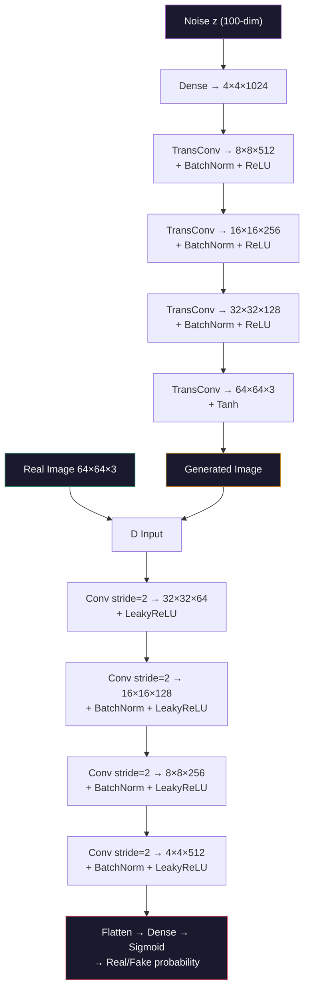

# Advanced AI — Part 3: Advanced GANs — Conditional GAN, DCGAN, and CycleGAN

---

**Series:** Advanced Artificial Intelligence — BE Computer Engineering (Sem VIII, C-Scheme)
**Part:** 3 of 8
**Exam Papers:** May 2024 (QP CODE: 10054668) · May 2025 (QP CODE: 10081862)
**Reading time:** ~40 minutes

---

## Exam Questions Covered in This Article

> **May 2024 — Q4(b) [10 Marks]**
> *"Explain Conditional GAN in detail."*

> **May 2025 — Q3(b) [4 Marks]**
> *"Explain DCGAN in detail."*

> **May 2025 — Q5(b) [4 Marks]**
> *"Explain CycleGAN in detail."*

---

## Table of Contents

1. [Why We Need Advanced GAN Variants](#1-why-we-need-advanced-gan-variants)
2. [Conditional GAN (cGAN) — Controlled Generation](#2-conditional-gan-cgan--controlled-generation)
3. [DCGAN — Deep Convolutional GAN](#3-dcgan--deep-convolutional-gan)
4. [CycleGAN — Unpaired Image-to-Image Translation](#4-cyclegan--unpaired-image-to-image-translation)
5. [Comparison of All Three Variants](#5-comparison-of-all-three-variants)
6. [Key Takeaways](#6-key-takeaways)

---

## 1. Why We Need Advanced GAN Variants

The original GAN is **unconditional** — you give it random noise and it produces *some* sample from the learned distribution. If your GAN learned on a dataset of handwritten digits, it might generate a 3, or a 7, or a 9 — you have no control over *which* digit comes out.

This is a severe limitation for real applications. In practice, you almost always want to control what you generate. You want to say: "Generate a digit 3" — not "generate some random digit."

The three GAN variants in this article solve three distinct real-world problems:

| Variant | Problem It Solves |
|---------|-------------------|
| **Conditional GAN (cGAN)** | I want to control *what category* of data gets generated |
| **DCGAN** | Original GAN is architecturally unstable with images — use CNNs properly |
| **CycleGAN** | I want to translate images from domain A to domain B *without paired training data* |

---

## 2. Conditional GAN (cGAN) — Controlled Generation

### The Core Idea

In a vanilla GAN, the Generator receives only random noise $z$. There is no mechanism to request a specific class of output.

A **Conditional GAN** adds a **condition variable $y$** to both the Generator and the Discriminator. This condition encodes the desired output class (or any other attribute), making the generation **controllable**.

**Formal Definition:**  
A conditional GAN extends the GAN framework by conditioning both networks on additional information $y$:

$$G: (z, y) \rightarrow \hat{x}$$
$$D: (x, y) \rightarrow [0,1]$$

The condition $y$ can be:
- A **class label** (e.g., "generate digit 5") — typically one-hot encoded
- A **text embedding** (e.g., "a bird with yellow wings") — dense vector
- Another **image** (e.g., a segmentation map → photo-realistic image) — spatial tensor
- A **continuous attribute** (e.g., age: 0.3, smile intensity: 0.7)

**Historical context:** Conditional GAN was proposed by **Mirza and Osindero (2014)** in *"Conditional Generative Adversarial Nets"* — just months after the original GAN paper. It is one of the most important GAN variants because most practical applications require controlled generation.

### Architecture



### How the Condition is Injected

There are several ways to provide the condition $y$ to the network:

| Method | How It Works | When Used |
|--------|-------------|-----------|
| **Concatenation** | Convert $y$ to a one-hot vector, concatenate with $z$ (for G) or with input image (for D) | Simple, works well for small number of classes |
| **Embedding** | Learn a dense embedding of $y$, add it to feature maps | Large number of classes |
| **Auxiliary Classifier (AC-GAN)** | D has an extra output head that predicts the class — provides stronger conditioning signal | When classification accuracy matters |
| **Feature-level injection (FiLM)** | Inject condition into intermediate layers via Feature-wise Linear Modulation: scale and shift feature maps | Text-to-image, complex conditions |

### FiLM Conditioning (Feature-wise Linear Modulation)

FiLM is a powerful injection method. Given condition $y$, learn two functions $\gamma(y)$ and $\beta(y)$ (scale and shift), and apply them to intermediate feature maps $F_l$:

$$\text{FiLM}(F_l \mid y) = \gamma(y) \odot F_l + \beta(y)$$

This allows the condition to multiplicatively modulate which features are active — much more expressive than simple concatenation.

### The cGAN Objective

The cGAN objective is exactly the vanilla GAN objective, with both networks conditioned on $y$:

$$\min_G \max_D \; V(D, G) = \mathbb{E}_{x,y}[\log D(x \mid y)] + \mathbb{E}_{z,y}[\log(1 - D(G(z \mid y)))]$$

The Discriminator now asks: "Is this sample real *given that it was supposed to be class y*?" This is stronger than just asking "is this real?" — it can penalize a Generator that produces a valid-looking image of the wrong class.

**Key difference from vanilla GAN:** A vanilla D that sees a perfectly realistic image of a dog when the condition was "cat" should output 0 (fake) — the sample is inconsistent with the condition. This forces G to respect the conditioning signal.

### Training Dynamics



**Key training detail:** Both the real and fake pairs include the condition $y$. A fake pair where the image is of class $y$ but the condition says $y'$ should be classified as fake by D. This forces G to correctly follow the condition.

### What Happens Without Conditioning D?

If only G receives the condition but D does not:
- D just checks "is this image realistic?" regardless of class
- G can produce a realistic image of the wrong class and fool D
- The conditioning signal in G becomes meaningless — G learns to ignore $y$

This is why **both G and D must receive the condition** — a common exam question.

### Applications of cGAN

| Application | Condition | Output |
|-------------|-----------|--------|
| **Digit generation** | Class label (0–9) | Handwritten digit of that class |
| **Face attribute control** | Age, gender, hairstyle | Face with those attributes |
| **Image-to-image translation** | Input image (e.g., edges) | Photo-realistic output |
| **Text-to-image synthesis** | Text description | Image matching the description |
| **Super-resolution** | Low-res image | High-res version |
| **Medical image synthesis** | Patient scan | Augmented/synthesized scans |

### cGAN vs Vanilla GAN

| Property | Vanilla GAN | Conditional GAN |
|----------|------------|----------------|
| **Generator input** | Noise $z$ only | Noise $z$ + condition $y$ |
| **Discriminator input** | Data sample $x$ | Data sample $x$ + condition $y$ |
| **Control over output** | None | Full control via $y$ |
| **Applications** | Unsupervised generation | Controlled generation, translation |
| **Training data requirement** | Unlabeled images | **Labeled images** (each sample needs a condition label) |
| **Complexity** | Lower | Higher (both networks are larger) |

---

## 3. DCGAN — Deep Convolutional GAN

### The Problem DCGAN Solves

The original GAN used **fully-connected (dense) neural networks** for both G and D. This works for small, simple datasets but fails completely for real images because:

- Fully-connected layers do not exploit the **spatial structure** of images
- They require enormously many parameters even for modest image sizes
- The training is extremely unstable for high-dimensional image data

**DCGAN (Deep Convolutional GAN)**, introduced by Radford et al. in 2015, established a set of architectural guidelines that make GANs train stably and efficiently on images using **convolutional layers**.

### DCGAN Architectural Guidelines

These are the specific design choices that make DCGAN stable:

| Component | Vanilla GAN | DCGAN Rule | Why |
|-----------|------------|------------|-----|
| **Downsampling in D** | Max pooling | **Strided convolutions** | Learned downsampling is more expressive than fixed max pooling |
| **Upsampling in G** | Upsampling + conv | **Transposed convolutions** | Learned upsampling preserves spatial structure |
| **Normalization** | None | **Batch Normalization** on all layers except D input and G output | Stabilizes gradients, prevents mode collapse |
| **Activation in G** | Varies | **ReLU on all layers, Tanh on output** | ReLU for internal layers; tanh bounds output to [-1,1] |
| **Activation in D** | Sigmoid | **LeakyReLU on all layers** | Leaky ReLU prevents dead neurons; allows gradient to flow for negative values |
| **Fully connected layers** | Used throughout | **Removed entirely** | Convolutional feature maps capture spatial hierarchy; FC adds unnecessary parameters |

### DCGAN Generator Architecture

```
Input: 100-dimensional noise vector z

Dense → reshape to 4×4×1024
                ↓
TransposedConv(512) + BatchNorm + ReLU  →  8×8×512
                ↓
TransposedConv(256) + BatchNorm + ReLU  →  16×16×256
                ↓
TransposedConv(128) + BatchNorm + ReLU  →  32×32×128
                ↓
TransposedConv(3) + Tanh                →  64×64×3  ← Output image
```

The Generator **starts small** (4×4) and progressively **upsamples** to the full resolution. Each transposed convolution doubles the spatial dimensions.

### DCGAN Discriminator Architecture

```
Input: 64×64×3 image (real or fake)

Conv(64, stride=2) + LeakyReLU         →  32×32×64
        ↓
Conv(128, stride=2) + BatchNorm + LeakyReLU  →  16×16×128
        ↓
Conv(256, stride=2) + BatchNorm + LeakyReLU  →  8×8×256
        ↓
Conv(512, stride=2) + BatchNorm + LeakyReLU  →  4×4×512
        ↓
Flatten → Dense(1) + Sigmoid            →  Probability
```

The Discriminator **starts at full resolution** and progressively **downsamples**, extracting increasingly abstract features, ending with a single probability.

### Full DCGAN Flow



### Why Each DCGAN Choice Matters

**Strided convolutions over pooling:**  
Pooling (max, average) uses a fixed rule to reduce spatial dimensions. Strided convolutions *learn* the best way to downsample — they can decide which information to discard and which to keep based on training data.

**No fully connected layers:**  
A fully connected layer applied to a feature map loses all spatial information (collapses rows and columns together). Keeping the network fully convolutional preserves spatial structure throughout.

**BatchNorm everywhere except first D layer and last G layer:**  
The first D layer needs to see the raw image without normalization. The last G layer's Tanh activation already normalizes output. Adding BatchNorm elsewhere prevents the internal covariate shift that causes training instability.

**LeakyReLU in D:**  
Standard ReLU sets all negative values to zero, which means neurons with large negative activations receive **zero gradient** — the "dying ReLU" problem. LeakyReLU passes small negative values (typically 0.2× the input), keeping gradients flowing.

### Batch Normalization: Why It Stabilizes GAN Training

**Batch Normalization (BN)** normalizes the output of a layer across the batch dimension:

$$\text{BN}(x) = \gamma \cdot \frac{x - \mu_B}{\sqrt{\sigma_B^2 + \epsilon}} + \beta$$

Where $\mu_B$ and $\sigma_B^2$ are the mean and variance computed over the current mini-batch, and $\gamma$, $\beta$ are learned scale/shift parameters.

**Why BN helps GAN training:**
1. **Prevents internal covariate shift**: Each layer's input distribution stays stable as parameters change during training — layers don't constantly chase a shifting target
2. **Acts as regularization**: The batch-level statistics add stochasticity, reducing overfitting
3. **Allows higher learning rates**: With normalized activations, you can train faster without divergence
4. **Prevents weight explosion**: Without BN, weights can grow unboundedly in GAN training, causing instability

**Why BN is excluded from D's first layer:**  
The first D layer sees raw image pixels. Normalizing them would change the actual pixel values, destroying low-level information (color, brightness contrast) that D needs to distinguish real from fake.

**Why BN is excluded from G's last layer:**  
The Tanh activation on G's output already bounds values to [-1,1]. Adding BN before Tanh would fight against it, causing erratic output.

### Transposed Convolution: How It Upsamples

The **transposed convolution** (also called deconvolution or fractionally-strided convolution) is G's upsampling mechanism.

A regular convolution with stride $s$ reduces spatial dimensions by $s$. A transposed convolution with stride $s$ **increases** spatial dimensions by $s$:

- Input: $n \times n$ feature map
- Transposed conv (stride 2, kernel 4×4): output is $(2n) \times (2n)$ (doubles dimensions)

**How it works:**
1. Insert $(s-1)$ zeros between each input element (dilate the input)
2. Apply regular convolution on the dilated input

The learned kernels determine how to "spread" information from a compact latent code into a full spatial feature map.

**Checkerboard artifacts:** A known problem with transposed convolutions — if kernel size is not divisible by stride, uneven overlap creates grid-like artifacts in generated images. DCGAN uses kernel=4, stride=2 to avoid this.

---

## 4. CycleGAN — Unpaired Image-to-Image Translation

### The Problem CycleGAN Solves

A Conditional GAN does image-to-image translation (e.g., edges → photo), but it requires **paired training data**: for every input image, you need the exact corresponding output image. Creating such paired datasets is expensive or impossible.

For example:
- Converting **horse photos** to **zebra photos**: There's no way to take the exact same photo with both a horse and a zebra at the same location.
- Converting **summer photos** to **winter photos**: You'd have to wait 6 months to take the same photo.
- Converting **monet paintings** to **photographs**: Monet didn't photograph his subjects.

**CycleGAN** solves this by enabling image-to-image translation **without paired examples**. You just need a collection of images from domain A (e.g., horses) and a separate, unrelated collection from domain B (e.g., zebras).

### The Core Idea: Cycle Consistency

CycleGAN uses **two Generator-Discriminator pairs** that translate in opposite directions, plus a constraint called **cycle consistency**.

- **Generator G**: Domain A → Domain B (horse → zebra)
- **Generator F**: Domain B → Domain A (zebra → horse)
- **Discriminator $D_A$**: Tells if an image is a real domain A image
- **Discriminator $D_B$**: Tells if an image is a real domain B image

**Cycle Consistency Constraint:**  
If you translate a horse to a zebra using G, then translate that zebra back to a horse using F, you should get back the original horse. This forces G and F to be inverse functions of each other.

$$F(G(x)) \approx x \quad \text{(forward cycle)}$$
$$G(F(y)) \approx y \quad \text{(backward cycle)}$$

Without this constraint, G could translate every horse to the same zebra (mode collapse), and F would just map it back to some random horse.

### CycleGAN Architecture

```mermaid
flowchart TD
    subgraph "Forward Direction: A → B"
        XA["Image x from Domain A\n(horse)"]
        G["Generator G\nA → B"]
        FAKE_B["G(x) = Fake B image\n(fake zebra)"]
        DB["Discriminator D_B\nIs this a real zebra?"]
        XA --> G --> FAKE_B --> DB
    end

    subgraph "Backward Direction: B → A"
        YB["Image y from Domain B\n(zebra)"]
        F["Generator F\nB → A"]
        FAKE_A["F(y) = Fake A image\n(fake horse)"]
        DA["Discriminator D_A\nIs this a real horse?"]
        YB --> F --> FAKE_A --> DA
    end

    subgraph "Cycle Consistency"
        FAKE_B2["G(x) (fake zebra)"] --> F2["Generator F"]
        F2 --> RECON_A["F(G(x)) ≈ x?\n(reconstructed horse)"]
        FAKE_A2["F(y) (fake horse)"] --> G2["Generator G"]
        G2 --> RECON_B["G(F(y)) ≈ y?\n(reconstructed zebra)"]
    end

    style G fill:#1a1a2e,stroke:#f5a623,color:#ffffff
    style F fill:#1a1a2e,stroke:#f5a623,color:#ffffff
    style DB fill:#1a1a2e,stroke:#e94560,color:#ffffff
    style DA fill:#1a1a2e,stroke:#e94560,color:#ffffff
    style RECON_A fill:#1a1a2e,stroke:#43b581,color:#ffffff
    style RECON_B fill:#1a1a2e,stroke:#43b581,color:#ffffff
```



### The CycleGAN Loss Function

CycleGAN has three loss terms combined:

**1. Adversarial Loss (for both G and F):**  
Standard GAN loss — G fools $D_B$, F fools $D_A$.

$$\mathcal{L}_{GAN}(G, D_B, A, B) = \mathbb{E}_{y \sim B}[\log D_B(y)] + \mathbb{E}_{x \sim A}[\log(1 - D_B(G(x)))]$$

**2. Cycle Consistency Loss:**  
Penalize the difference between original and reconstructed images.

$$\mathcal{L}_{cyc}(G, F) = \mathbb{E}_{x \sim A}[\|F(G(x)) - x\|_1] + \mathbb{E}_{y \sim B}[\|G(F(y)) - y\|_1]$$

(L1 loss gives slightly less blurry results than L2 loss.)

**3. Identity Loss (optional but improves results):**  
When G receives an image already in domain B, it should return it unchanged. This preserves color and structure.

$$\mathcal{L}_{id}(G, F) = \mathbb{E}_{y \sim B}[\|G(y) - y\|_1] + \mathbb{E}_{x \sim A}[\|F(x) - x\|_1]$$

**Full objective:**

$$\mathcal{L}_{total} = \mathcal{L}_{GAN}(G, D_B) + \mathcal{L}_{GAN}(F, D_A) + \lambda \cdot \mathcal{L}_{cyc}(G, F)$$

Where $\lambda$ (typically 10) balances adversarial and cycle consistency losses.

### What the Cycle Consistency Constraint Prevents

```
Without cycle consistency:
Horse x → G → "Some random zebra that fools D_B"
(G just maps everything to one convincing-looking zebra — mode collapse)

With cycle consistency:
Horse x → G → Fake Zebra → F → Must reconstruct original horse x
(G must produce a zebra that retains enough information to recover x)
```

This forces G to translate only the domain-specific features (stripe pattern for zebra) while preserving all content-specific features (the horse's shape, pose, background).

### Why L1 Loss in Cycle Consistency (Not L2)?

The cycle consistency loss uses **L1 (mean absolute error)** rather than L2 (mean squared error):

$$\mathcal{L}_{cyc} = \|F(G(x)) - x\|_1$$

**Why L1?**  
- L2 loss heavily penalizes large errors and lightly penalizes small ones — it tends to average out details, producing blurry reconstructions
- L1 loss penalizes all errors equally — it preserves sharper details and edges in the reconstructed image
- L1 is more robust to outliers (a few very different pixels in reconstruction don't dominate the gradient)

This is a common choice in image-to-image translation tasks generally (not just CycleGAN).

### Limitations of CycleGAN

Despite its power, CycleGAN has important limitations:

| Limitation | Description |
|-----------|-------------|
| **Cannot change geometric structure** | Can change texture (horse→zebra stripes) but struggles to change shape (apple→orange works poorly) |
| **Mode collapse** | G may still collapse to one translation per domain |
| **Slow training** | Two full GAN training loops simultaneously |
| **Requires matched domains** | Works best when domains have similar overall structure but different style |
| **No semantic guidance** | Cannot ensure a specific horse becomes a specific type of zebra |

### CycleGAN Applications

| Application | Domain A | Domain B |
|-------------|---------|---------|
| **Horse ↔ Zebra** | Horse photos | Zebra photos |
| **Summer ↔ Winter** | Summer scenes | Winter scenes |
| **Monet ↔ Photo** | Monet paintings | Photographs |
| **Apple ↔ Orange** | Apple images | Orange images |
| **Day ↔ Night** | Daytime photos | Nighttime photos |
| **MRI ↔ CT scan** | MRI scans | CT scans |
| **Sketch ↔ Photo** | Sketches/drawings | Photographs |

---

## 5. Comparison of All Three Variants

| Property | Conditional GAN | DCGAN | CycleGAN |
|----------|----------------|-------|----------|
| **Problem solved** | Controlled class-specific generation | Stable, high-quality image generation using CNNs | Unpaired image-to-image translation |
| **Number of G networks** | 1 | 1 | 2 (G and F) |
| **Number of D networks** | 1 | 1 | 2 ($D_A$ and $D_B$) |
| **Requires paired data?** | Yes (labeled data) | No (just images) | **No** (unpaired collections) |
| **Key innovation** | Conditioning mechanism ($y$) | Architectural guidelines (conv, BN, LeakyReLU) | Cycle consistency loss |
| **Key loss** | Conditional BCE | BCE + architectural stability | Adversarial + cycle consistency |
| **Control over output** | Full (via condition $y$) | None (unconditional) | Direction of translation |
| **Best for** | Class-conditioned generation | High-quality realistic image synthesis | Style/domain transfer |
| **Example use case** | "Generate a cat" vs "Generate a dog" | Bedroom image synthesis (LSUN dataset) | Horse → Zebra transformation |

---

## 6. Key Takeaways

**Conditional GAN in two sentences:**  
cGAN adds a condition label $y$ to both G and D, enabling controlled generation. Both networks receive (data, condition) pairs; D must determine if a sample is real *and* matches its condition.

**DCGAN in two sentences:**  
DCGAN replaces dense layers with convolutional layers and establishes specific architectural rules: strided convolutions (no pooling), transposed convolutions (no simple upsampling), BatchNorm everywhere except first D layer and last G layer, ReLU in G and LeakyReLU in D. These choices eliminate training instability for image generation.

**CycleGAN in three sentences:**  
CycleGAN enables image-to-image translation without paired training data using two Generator-Discriminator pairs. It adds a cycle consistency loss: translating A→B→A must reconstruct the original A image. This constraint forces the generators to preserve content while changing only domain-specific style.

---

*Previous: [Part 2 — WGAN](02-wgan.md)*  
*Next: [Part 4 — Autoencoders: VAE, Sparse AE, Contractive AE](04-autoencoders.md)*
