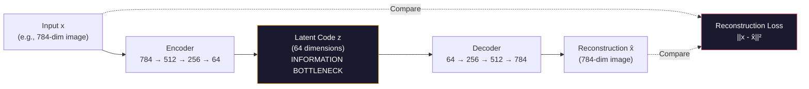
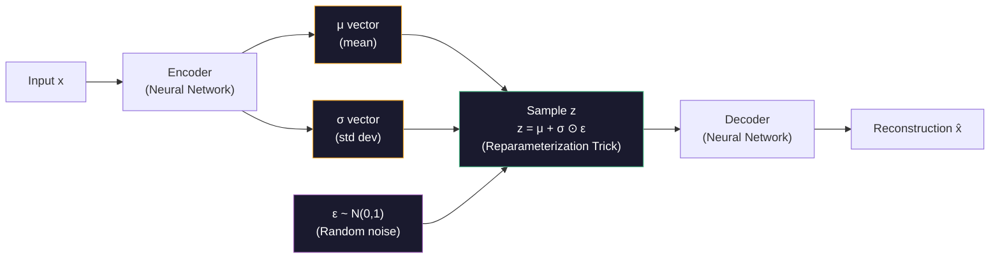
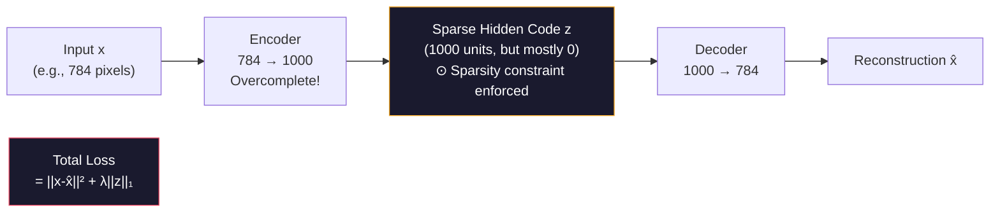
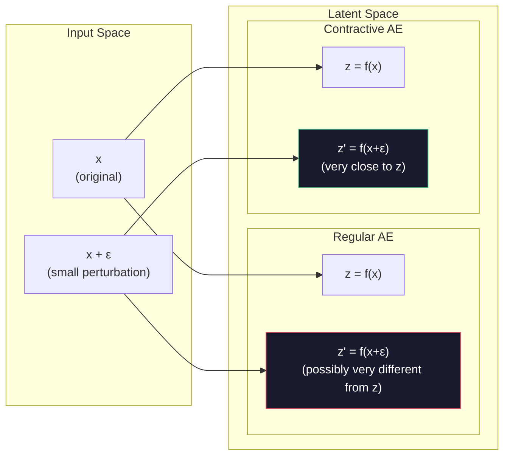

# Advanced AI — Part 4: Autoencoders — VAE, Sparse, and Contractive

---

**Series:** Advanced Artificial Intelligence — BE Computer Engineering (Sem VIII, C-Scheme)
**Part:** 4 of 8
**Exam Papers:** May 2024 (QP CODE: 10054668) · May 2025 (QP CODE: 10081862)
**Reading time:** ~45 minutes

---

## Exam Questions Covered in This Article

> **May 2024 — Q1(b) [5 Marks]**
> *"Explain Sparse autoencoders."*

> **May 2024 — Q4(a) [10 Marks]**
> *"Explain Variational Auto Encoders in detail."*

> **May 2025 — Q1(b) [5 Marks]**
> *"Explain Contractive autoencoders."*

> **May 2025 — Q4(a) [5 Marks]**
> *"Explain Sparse autoencoders in detail."*

---

## Table of Contents

1. [The Basic Autoencoder: Foundation](#1-the-basic-autoencoder-foundation)
2. [Variational Autoencoder (VAE)](#2-variational-autoencoder-vae)
3. [The ELBO Loss Function in Detail](#3-the-elbo-loss-function-in-detail)
4. [Sparse Autoencoder](#4-sparse-autoencoder)
5. [Contractive Autoencoder](#5-contractive-autoencoder)
6. [Complete Comparison: All Autoencoder Types](#6-complete-comparison-all-autoencoder-types)
7. [Key Takeaways](#7-key-takeaways)

---

## 1. The Basic Autoencoder: Foundation

Before diving into the advanced variants, understand the base architecture that all three build on.

### What Is an Autoencoder?

An **autoencoder** is a neural network trained to **compress data and then reconstruct it**. The name comes from the fact that it encodes data for itself (auto = self): the network learns to be its own compression codec.

**Formal definition:** An autoencoder is a function $f: \mathcal{X} \rightarrow \mathcal{X}$ that can be decomposed as:
$$f = g \circ h$$

Where:
- **Encoder** $h: \mathcal{X} \rightarrow \mathcal{Z}$: Maps input $x$ to a compressed representation $z$ (the latent code)
- **Decoder** $g: \mathcal{Z} \rightarrow \mathcal{X}$: Maps latent code $z$ back to a reconstruction $\hat{x} = g(z)$

The constraint that makes this useful: the **dimensionality of $\mathcal{Z}$ is much smaller than $\mathcal{X}$** (the bottleneck).

**Historical context:** Autoencoders were proposed by **Rumelhart et al. in 1986** as a method for learning compressed representations. They predate deep learning and were originally used for dimensionality reduction (an alternative to PCA). Deep autoencoders with multiple layers became practical after the deep learning renaissance (2006+).



The training objective is simply:

$$\mathcal{L} = \|x - g(h(x))\|^2 \quad \text{(Reconstruction Loss / Mean Squared Error)}$$

### The Bottleneck Principle

The magic of autoencoders comes from the **bottleneck**: the latent space $z$ has far fewer dimensions than the input $x$. This forces the network to learn a **compact, meaningful representation** — it must learn which features are essential and which can be discarded.

**Why the bottleneck works:**  
Consider a 784-dimensional input compressed to 32 dimensions. The autoencoder must find 32 numbers that can faithfully reconstruct 784 numbers. It can only succeed if it discovers the underlying structure in the data — the actual dimensions of variation (pose, color, shape) which are far fewer than the raw pixel count.

If you train an autoencoder on face images, the 64-dimensional latent code might encode:
- Face shape (oval, round, square)
- Hair color and length
- Skin tone
- Expression (happy, neutral, surprised)
- Age characteristics

Everything else gets compressed away.

**Autoencoder vs PCA:**

| Property | PCA | Autoencoder |
|----------|-----|-------------|
| **Transformation** | Linear only | **Non-linear** (captures complex structure) |
| **Components** | Orthogonal eigenvectors | Arbitrary learned features |
| **Training** | Analytical (eigendecomposition) | Gradient descent |
| **Reconstruction quality** | Lower (linear) | **Higher** (non-linear captures manifold) |
| **Interpretability** | Higher (principal components) | Lower |

### Limitation of Basic Autoencoders

The basic autoencoder is useful for compression and feature learning, but its latent space has a critical flaw: **it is not well-structured for generation**.

If you randomly sample a point $z$ from the latent space and feed it to the Decoder, you'll likely get garbage. The encoder has no reason to organize the latent space in any particular way — it just finds *some* mapping that works for reconstruction, not one that's smooth or continuous.

The three variants (VAE, Sparse, Contractive) each address a different limitation:
- **VAE** → Makes the latent space structured for generation
- **Sparse AE** → Forces the latent code to only use a few neurons at a time (feature sparsity)
- **Contractive AE** → Makes the representation robust to small input perturbations

---

## 2. Variational Autoencoder (VAE)

> **This section directly answers May 2024 Q4(a) — "Explain Variational Auto Encoders in detail."**

### The Core Problem with Basic AE for Generation

In a basic autoencoder, each training example $x$ maps to exactly **one point** $z$ in the latent space. The encoder learns a deterministic function $z = f(x)$.

Because these points can be scattered anywhere, the space **between them is undefined** — if you sample a point between two known latent codes, the decoder has no idea what to produce.

VAEs fix this by making the encoder output a **probability distribution** instead of a point.

### The VAE Insight: Encode to a Distribution

Instead of mapping input $x$ to a single point $z$, the **VAE Encoder** maps $x$ to the **parameters of a Gaussian distribution**:

$$q_\phi(z \mid x) = \mathcal{N}(\mu, \sigma^2)$$

Where:
- $\mu$ (mean vector) — the center of the distribution in latent space
- $\sigma$ (standard deviation vector) — the spread of the distribution
- $\phi$ — encoder parameters

The latent code $z$ is then **sampled** from this distribution rather than computed directly.



### The Reparameterization Trick

Sampling from a distribution is not differentiable — you cannot backpropagate through a random operation. The VAE solves this with the **reparameterization trick**.

**The Problem:**  
The encoder outputs $(\mu, \sigma)$ and we need to sample $z \sim \mathcal{N}(\mu, \sigma^2)$. But the sampling operation:
$$z \sim \mathcal{N}(\mu, \sigma^2)$$
is **stochastic** — it involves drawing a random number. The gradient $\frac{\partial \mathcal{L}}{\partial \mu}$ and $\frac{\partial \mathcal{L}}{\partial \sigma}$ cannot be computed through a random node.

**The Solution:**  
Instead of sampling $z$ directly, separate the stochasticity into an external variable $\varepsilon$:

$$z = \mu + \sigma \odot \varepsilon \quad \text{where} \quad \varepsilon \sim \mathcal{N}(0, 1)$$

**Why this works:**  
- $\varepsilon$ is sampled externally — it is not a learnable parameter
- $z$ is now a **deterministic function** of $\mu$, $\sigma$, and $\varepsilon$
- Gradients $\frac{\partial z}{\partial \mu} = 1$ and $\frac{\partial z}{\partial \sigma} = \varepsilon$ exist and are clean
- Standard backpropagation works normally through $\mu$ and $\sigma$

```
WITHOUT reparameterization:
  x → Encoder → [μ, σ] → Sample z  ← Stochastic node blocks gradients!
                                       No gradient flows to Encoder

WITH reparameterization:
  x → Encoder → [μ, σ]
  ε ~ N(0,1)        ← External random noise (not a parameter)
  z = μ + σ × ε    ← Differentiable! Gradients flow through μ and σ cleanly
```

**Generality:** The reparameterization trick can be applied to any distribution that can be expressed as a deterministic transformation of a simple noise distribution. For Gaussians: $\mathcal{N}(\mu, \sigma^2) = \mu + \sigma \cdot \mathcal{N}(0,1)$.

### The Prior Constraint: KL Divergence Term

Training the VAE with only reconstruction loss would allow the encoder to learn **any** distribution — it would just produce very narrow, non-overlapping distributions (practically the same as deterministic encoding).

To force the latent space to be **smooth and well-organized**, VAE adds a **KL divergence term** that pushes all the encoder distributions toward a standard Normal distribution $\mathcal{N}(0, 1)$:

$$KL(q_\phi(z \mid x) \| p(z)) = KL(\mathcal{N}(\mu, \sigma^2) \| \mathcal{N}(0, 1))$$

This has a closed-form solution:

$$KL = -\frac{1}{2} \sum_{j=1}^{d} \left(1 + \log \sigma_j^2 - \mu_j^2 - \sigma_j^2\right)$$

**What this constraint does geometrically:**  
It forces all latent distributions to stay close to the origin with unit variance. This means the entire latent space becomes dense and organized — every region of the space corresponds to a meaningful interpolation between training examples.

---

## 3. The ELBO Loss Function in Detail

> **This section directly answers May 2024 Q2(b) — "Explain the MinMax loss function used in GAN, along with the components of GAN" — for VAE equivalent (ELBO).**

The VAE trains by maximizing the **Evidence Lower BOund (ELBO)**, equivalently by minimizing:

$$\mathcal{L}_{VAE} = \underbrace{\mathbb{E}_{q_\phi(z|x)}[-\log p_\theta(x \mid z)]}_{\text{Reconstruction Loss}} + \underbrace{KL(q_\phi(z \mid x) \| p(z))}_{\text{Regularization Loss}}$$

### Derivation of the ELBO

The theoretical foundation of VAE comes from **variational inference**. We want to maximize the log-likelihood of the data:

$$\log p_\theta(x) = \log \int p_\theta(x \mid z) \cdot p(z) \, dz$$

This integral is intractable (cannot be computed in closed form for deep networks). The ELBO provides a lower bound that can be optimized instead.

Using **Jensen's inequality** and introducing the approximate posterior $q_\phi(z \mid x)$:

$$\log p_\theta(x) \geq \mathbb{E}_{q_\phi(z|x)}\left[\log \frac{p_\theta(x \mid z) \cdot p(z)}{q_\phi(z \mid x)}\right] = \mathbb{E}_{q_\phi(z|x)}[\log p_\theta(x \mid z)] - KL(q_\phi(z \mid x) \| p(z))$$

This is the **ELBO**. The gap between $\log p_\theta(x)$ and ELBO is exactly $KL(q_\phi(z|x) \| p_\theta(z|x))$ — the KL between our approximate posterior and the true posterior. Maximizing ELBO minimizes this gap.

### Term 1: Reconstruction Loss

$$\mathbb{E}[-\log p_\theta(x \mid z)] \approx \|x - \hat{x}\|^2$$

This is the standard **mean squared error** (for continuous data) or **binary cross-entropy** (for binary data) between original $x$ and reconstruction $\hat{x}$. It forces the decoder to accurately reconstruct inputs.

**Why VAEs produce blurry images:**  
The decoder outputs $\hat{x}$ = mean of $p_\theta(x|z)$ (a Gaussian), and the MSE loss encourages averaging — blurry images are "safe" from an MSE perspective because they minimize mean pixel error. This is a fundamental limitation compared to GANs.

### Term 2: KL Divergence (Regularization)

$$KL(q_\phi(z \mid x) \| \mathcal{N}(0, 1)) = -\frac{1}{2} \sum_j (1 + \log \sigma_j^2 - \mu_j^2 - \sigma_j^2)$$

This forces the encoder's distribution to stay close to standard Normal. It prevents the encoder from learning degenerate point distributions (σ → 0) and ensures the latent space is continuous.

**Intuition:**  
Without KL term: Encoder makes each $\sigma_j \rightarrow 0$ (deterministic encoding). Latent codes become isolated points. Sampling from the space between them produces garbage.  
With KL term: All posterior distributions must stay close to $\mathcal{N}(0,1)$, forcing codes to overlap, creating a continuous dense latent space.

### The Tension Between the Two Terms

These two loss terms are in **creative tension**:

| Term | Wants | Effect if Only This Term |
|------|-------|--------------------------|
| **Reconstruction Loss** | Exact, precise reconstructions | Encoder collapses to deterministic mapping (σ → 0), latent codes are isolated points |
| **KL Divergence** | All distributions equal to N(0,1) | Encoder ignores input (μ → 0, σ → 1), decoder learns only average of all data |

The balance between them forces a **useful, smooth latent space**: compact enough to decode accurately, broad enough to enable interpolation and sampling.

### The $\beta$-VAE Extension

**$\beta$-VAE** (Higgins et al., 2017) adds a weighting parameter $\beta > 1$ on the KL term:

$$\mathcal{L}_{\beta\text{-VAE}} = \mathbb{E}[-\log p_\theta(x \mid z)] + \beta \cdot KL(q_\phi(z \mid x) \| p(z))$$

Higher $\beta$ produces more **disentangled** representations where each latent dimension independently controls one factor of variation (pose, color, scale).

### VAE Properties: What You Get

| Property | Value |
|----------|-------|
| **Latent space structure** | Continuous, smooth Gaussian distributed |
| **Generation quality** | Slightly blurry (MSE loss averages pixel values) |
| **Training stability** | High — single gradient descent objective |
| **Latent space interpolation** | Excellent — meaningful transitions between any two points |
| **Anomaly detection** | Built-in — anomalies have high KL divergence or high reconstruction error |
| **Sampling** | Simply sample z ~ N(0,1) and decode |

---

## 4. Sparse Autoencoder

> **This section directly answers May 2024 Q1(b) and May 2025 Q4(a) — "Explain Sparse autoencoders."**

### The Motivation: Biological Inspiration

Neuroscientists studying the visual cortex found something interesting: at any given moment, only a **small fraction of neurons** are active in response to any stimulus. The brain uses **sparse representations**.

Sparse autoencoders enforce this same constraint artificially: the **latent code $z$ must be sparse** — most of its components must be close to zero, with only a few "active" at any time.

### What Sparsity Means

In a regular autoencoder with 1000 hidden units, all 1000 units might activate significantly for every input. In a sparse autoencoder, you might require that only 50 of the 1000 units are significantly non-zero for any given input.

```
Regular AE hidden layer for input x:
[0.87, 0.64, 0.91, 0.73, 0.55, 0.82, 0.69, 0.77, ...]
 ← all units active, large values throughout

Sparse AE hidden layer for same input x:
[0.00, 0.00, 0.93, 0.00, 0.00, 0.00, 0.78, 0.00, ...]
 ← only 2 units active, rest are ~0
```

### How Sparsity is Enforced

Sparsity is enforced by adding a **penalty term to the loss function** that discourages hidden unit activations from being large.

**Method 1: L1 Regularization on activations**

$$\mathcal{L}_{sparse} = \|x - \hat{x}\|^2 + \lambda \sum_j |z_j|$$

The L1 term drives many activation values exactly to zero (unlike L2 which just makes them small). $\lambda$ controls the strength of the sparsity constraint.

**Method 2: KL divergence sparsity penalty**

Instead of L1, measure the KL divergence between the actual average activation of each hidden unit $\hat{\rho}_j$ and a target sparsity parameter $\rho$ (e.g., $\rho = 0.05$ meaning 5% average activation):

$$\mathcal{L}_{sparse} = \|x - \hat{x}\|^2 + \beta \sum_j KL(\rho \| \hat{\rho}_j)$$

Where:
$$KL(\rho \| \hat{\rho}_j) = \rho \log \frac{\rho}{\hat{\rho}_j} + (1-\rho) \log \frac{1-\rho}{1-\hat{\rho}_j}$$

This KL term is zero when $\hat{\rho}_j = \rho$ (average activation equals target) and positive otherwise — it strongly penalizes units that are too active.

**Why KL sparsity over L1?**  
L1 penalizes based on the magnitude of each individual activation. KL sparsity operates on the *average* activation across the dataset — it allows some inputs to strongly activate a unit as long as most inputs don't. This models the biological observation more accurately: a feature detector should fire for specific stimuli, not uniformly suppress everything.

### Connection to Dictionary Learning

Sparse autoencoders are closely related to **dictionary learning** (also called sparse coding), a classical signal processing technique:

$$x \approx Dz \quad \text{subject to} \quad \|z\|_0 \leq k$$

Where $D$ is a dictionary of basis vectors (atoms) and $z$ is a sparse code selecting at most $k$ atoms. The encoder learns which dictionary atoms to combine, and the decoder learns the atoms themselves.

**Overcomplete dictionaries:** In dictionary learning, the dictionary $D$ can have more columns than the input dimension (overcomplete). This allows a richer vocabulary of features at the cost of needing sparsity to make representation unique. The same principle applies in sparse autoencoders — a hidden layer larger than the input is useful when combined with strong sparsity.

**Connection to neuroscience:** The mammalian V1 (primary visual cortex) appears to implement sparse coding — Gabor filters (oriented edge detectors) emerge as the optimal basis for sparse coding of natural images (Olshausen & Field, 1996). This connects the mathematical principle to biological plausibility.

### The Architecture



**Note the overcomplete hidden layer:** Unlike the regular autoencoder (which compresses to fewer dimensions than input), a sparse autoencoder often has a **larger** hidden layer than the input. This is allowed because sparsity, not size, is the constraint.

### What Sparse Autoencoders Learn

The key benefit of sparsity: each hidden unit learns to respond to a **specific, interpretable feature**.

In a sparse autoencoder trained on face images:
- Unit 47 might fire only when there's a left eyebrow
- Unit 312 might fire only when there's a smile
- Unit 789 might fire only for a specific lighting condition

This is in contrast to a dense autoencoder where units respond to complex, entangled combinations of features.

**This interpretability makes sparse autoencoders valuable for:**

| Application | How Sparsity Helps |
|-------------|-------------------|
| **Feature extraction** | Each active unit = one interpretable feature |
| **Anomaly detection** | Anomalies require many units to activate (high total activation) |
| **Pretraining** | Sparse features transfer well to downstream tasks |
| **LLM interpretability** | Understanding what features language models represent (active research area 2024-2025) |

---

## 5. Contractive Autoencoder

> **This section directly answers May 2025 Q1(b) — "Explain Contractive autoencoders."**

### The Motivation: Robustness to Small Perturbations

When you look at a photo of a cat and slightly adjust the brightness — the image is still a cat. Any sensible representation of the image should change very little in response to this small perturbation.

The basic autoencoder has no such guarantee. Small changes in input can cause large changes in the latent code.

A **Contractive Autoencoder (CAE)** enforces robustness by penalizing **sensitivity of the latent code to input changes**. The word "contractive" comes from the fact that the encoder mapping is forced to be *contractive* (shrinking) — small input changes produce even smaller latent code changes.

### The Core Idea: Penalize the Jacobian

The sensitivity of the latent code $z$ to input changes is captured by the **Jacobian matrix** of the encoder:

$$J_f(x) = \frac{\partial f(x)}{\partial x} = \left[\frac{\partial z_i}{\partial x_j}\right]$$

This is a matrix where entry $(i, j)$ tells you how much latent unit $i$ changes when input dimension $j$ changes by a small amount.

If the encoder is **insensitive to inputs**, these values should all be small — the Jacobian's Frobenius norm should be small.

### The CAE Loss Function

CAE adds the **Frobenius norm of the Jacobian** as a regularization penalty:

$$\mathcal{L}_{CAE} = \|x - \hat{x}\|^2 + \lambda \|J_f(x)\|_F^2$$

Where the Frobenius norm is:

$$\|J_f(x)\|_F^2 = \sum_{i,j} \left(\frac{\partial z_i}{\partial x_j}\right)^2$$

This term penalizes large partial derivatives — it directly penalizes the encoder for being too sensitive to any input dimension.

### What the Jacobian Penalty Does Geometrically



The CAE forces the learned manifold to be locally flat and smooth. Nearby inputs in the input space map to nearby points in the latent space.

### Why Is the Jacobian Norm Tractable?

For a sigmoid activation function $\sigma$, the Jacobian of each hidden unit $h_j$ with respect to input $x_i$ has a convenient form:

$$\frac{\partial h_j}{\partial x_i} = h_j(1 - h_j) \cdot W_{ji}$$

So the full Jacobian penalty simplifies to:

$$\|J_f(x)\|_F^2 = \sum_j (h_j(1-h_j))^2 \cdot \|W_j\|^2$$

This is computationally efficient — it can be computed during the forward pass without explicitly constructing the full Jacobian matrix.

### The Tension in CAE

Just like VAE's two loss terms, CAE has a creative tension:

| Term | Wants | Effect |
|------|-------|--------|
| **Reconstruction loss** | Accurate reconstruction for every input variation | Encoder must be sensitive to all input details |
| **Jacobian penalty** | Insensitive encoding | Encoder ignores as many input dimensions as possible |

The resolution: the encoder learns to be **sensitive only to the most important directions of variation** in the data (the data manifold) and **insensitive to directions that are just noise** (perpendicular to the manifold).

---

## 6. Complete Comparison: All Autoencoder Types

| Property | Basic AE | VAE | Sparse AE | Contractive AE |
|----------|----------|-----|-----------|----------------|
| **Constraint** | None (just compress + reconstruct) | Latent ~ N(0,1) | Latent must be sparse (mostly zeros) | Encoding must be insensitive to small input changes |
| **Loss function** | MSE reconstruction | MSE + KL divergence | MSE + L1/KL sparsity penalty | MSE + Frobenius norm of Jacobian |
| **Latent space** | Unstructured | Smooth, continuous, Gaussian | Sparse, overcomplete possible | Locally flat / robust |
| **Good for generation?** | No (not smooth) | **Yes** | No (not designed for it) | No (not designed for it) |
| **Interpretability** | Low | Medium | **High** (each unit = a feature) | Medium |
| **Robustness to noise** | Low | Medium | Low | **High** |
| **Training stability** | High | High | High | Medium (Jacobian computation) |
| **Typical use** | Compression, dimensionality reduction | **Generative modeling**, interpolation | Feature learning, interpretability | Robust feature learning |
| **Key innovation** | Bottleneck compression | Probabilistic encoding + ELBO | Activation sparsity regularization | Jacobian norm regularization |

---

## 7. Key Takeaways

**Basic AE in one sentence:** Compresses input through a bottleneck and reconstructs it, learning a compact representation — but the latent space is unstructured.

**VAE in three sentences:**  
VAE encodes input to a Gaussian distribution (μ, σ) instead of a point, using the reparameterization trick for differentiability. The ELBO loss combines reconstruction loss with KL divergence, which forces the latent space to follow a standard Normal prior. This produces a smooth, continuous latent space ideal for generation — sample z ~ N(0,1) and decode to get a realistic new sample.

**Sparse AE in two sentences:**  
Sparse AE adds an L1 or KL sparsity penalty to the reconstruction loss, forcing most hidden units to be zero at any given time. This makes the representation highly interpretable — each active unit corresponds to one specific learned feature.

**Contractive AE in two sentences:**  
Contractive AE adds the Frobenius norm of the encoder's Jacobian as a penalty, forcing the latent representation to be insensitive to small perturbations in the input. The encoder learns to respond only to the true underlying data manifold while ignoring noise directions.

---

*Previous: [Part 3 — Advanced GANs](03-advanced-gans.md)*  
*Next: [Part 5 — Transfer Learning and Pre-trained Models](05-transfer-learning.md)*
