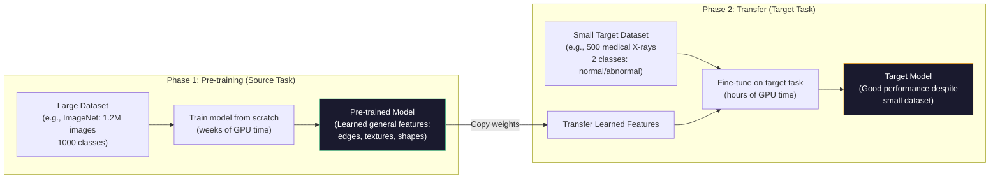
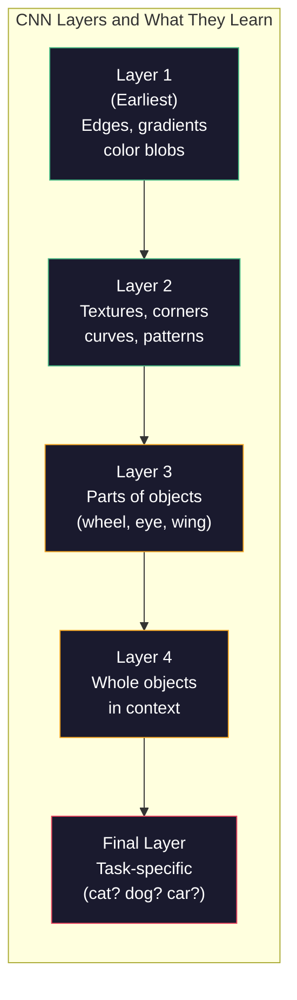
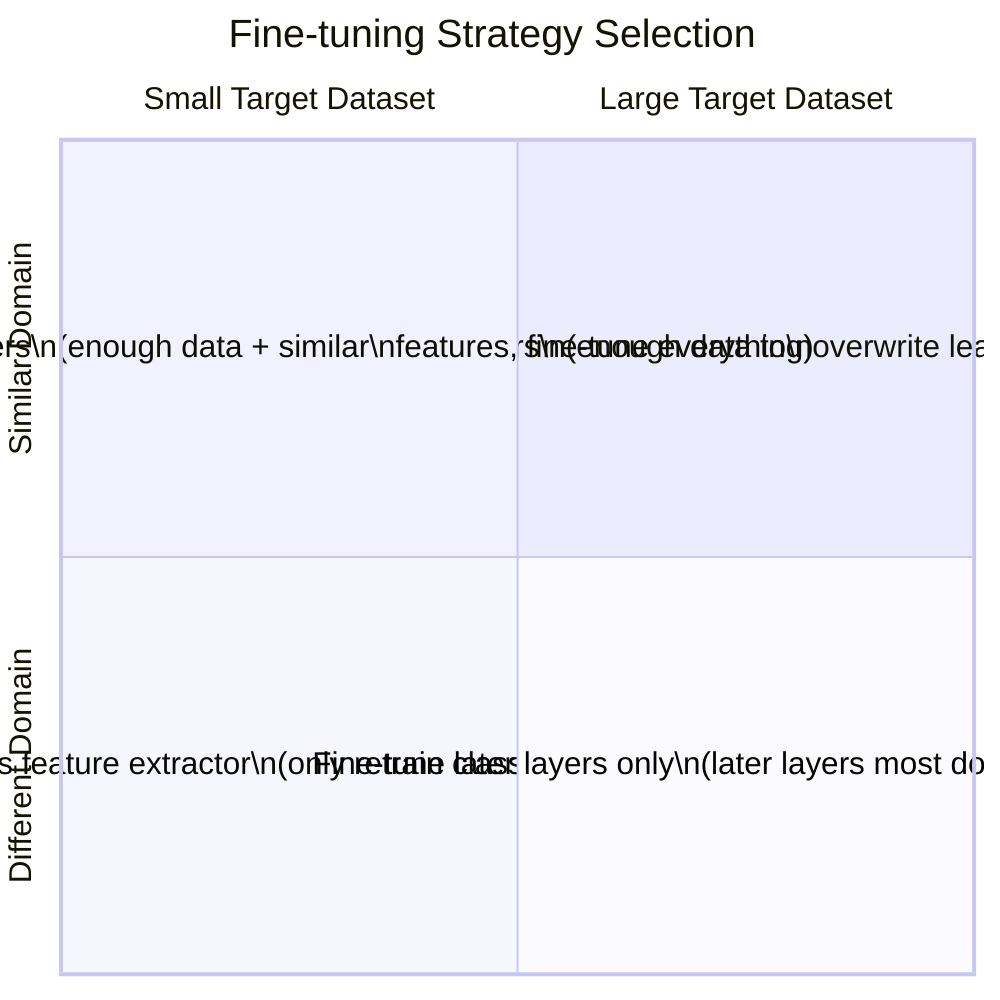

# Advanced AI — Part 5: Transfer Learning and Pre-trained Models

---

**Series:** Advanced Artificial Intelligence — BE Computer Engineering (Sem VIII, C-Scheme)
**Part:** 5 of 8
**Exam Papers:** May 2024 (QP CODE: 10054668) · May 2025 (QP CODE: 10081862)
**Reading time:** ~35 minutes

---

## Exam Questions Covered in This Article

> **May 2024 — Q1(c) [5 Marks]**
> *"What are the benefits of pre-trained models?"*

> **May 2025 — Q1(c) [5 Marks]**
> *"What are the benefits of pre-trained models?"*

> **May 2024 — Q3(a) [10 Marks]**
> *"Explain transfer learning. Describe different types of transfer learning."*

> **May 2025 — Q3(a) [4 Marks]**
> *"Explain transfer learning. Describe different types of transfer learning."*

---

## Table of Contents

1. [The Problem Transfer Learning Solves](#1-the-problem-transfer-learning-solves)
2. [What Is Transfer Learning?](#2-what-is-transfer-learning)
3. [How Neural Networks Learn Transferable Features](#3-how-neural-networks-learn-transferable-features)
4. [Types of Transfer Learning](#4-types-of-transfer-learning)
5. [Fine-tuning Strategies in Detail](#5-fine-tuning-strategies-in-detail)
6. [Benefits of Pre-trained Models](#6-benefits-of-pre-trained-models)
7. [Domain Adaptation and Dataset Shift](#7-domain-adaptation-and-dataset-shift)
8. [Real-world Examples](#8-real-world-examples)
9. [Key Takeaways](#9-key-takeaways)

---

## 1. The Problem Transfer Learning Solves

Training a deep neural network from scratch requires:
- **Millions** of labeled examples (ImageNet has 1.2M images, GPT-3 trained on ~500B tokens)
- **Weeks or months** of compute time on high-end GPUs
- **Significant budget** — training GPT-4 reportedly cost ~$100 million

Most real-world problems don't have millions of labeled examples and don't have access to that compute. A hospital might have 500 labeled X-rays. A startup might have 10,000 customer reviews. A researcher might have 200 samples of a rare plant species.

**Without transfer learning:** You cannot train a useful deep model on 500 examples. You'll massively overfit.

**With transfer learning:** You borrow knowledge from a model trained on millions of examples, fine-tune it on your 500 examples, and get results that rival training on much larger datasets.

This is the core premise: **knowledge learned for one task can be reused for a different but related task.**

---

## 2. What Is Transfer Learning?

**Transfer learning** is a machine learning approach where a model trained on one task (the **source task**) is reused as the starting point for a model on a different task (the **target task**).

**Formal definition (Pan & Yang, 2010 — the canonical survey):**

Given a **source domain** $\mathcal{D}_S$ and **source task** $\mathcal{T}_S$, and a **target domain** $\mathcal{D}_T$ and **target task** $\mathcal{T}_T$, transfer learning aims to improve learning of the target predictive function $f_T(\cdot)$ using the knowledge in $\mathcal{D}_S$ and $\mathcal{T}_S$, where $\mathcal{D}_S \neq \mathcal{D}_T$ or $\mathcal{T}_S \neq \mathcal{T}_T$.

A **domain** $\mathcal{D}$ consists of:
- **Feature space** $\mathcal{X}$ (what the inputs look like — e.g., RGB pixel values)
- **Marginal distribution** $P(X)$ (the distribution of inputs — e.g., distribution over all possible photos)

Two domains differ if they have different feature spaces OR different marginal distributions:
$$\mathcal{D}_S \neq \mathcal{D}_T \iff \mathcal{X}_S \neq \mathcal{X}_T \text{ or } P(X_S) \neq P(X_T)$$

A **task** $\mathcal{T}$ consists of:
- **Label space** $\mathcal{Y}$ (what the outputs look like — e.g., 1000 ImageNet class names)
- **Conditional distribution** $P(Y \mid X)$ (the mapping from inputs to outputs — the function being learned)

Two tasks differ if they have different label spaces OR different mappings:
$$\mathcal{T}_S \neq \mathcal{T}_T \iff \mathcal{Y}_S \neq \mathcal{Y}_T \text{ or } P(Y_S \mid X_S) \neq P(Y_T \mid X_T)$$

**Concrete examples of what "different" means:**

| Scenario | Same/Different? | Example |
|----------|----------------|---------|
| ImageNet → Medical X-rays | Different domains (P(X) differs: photos vs. X-rays) + Different tasks | Common transfer case |
| Positive/Negative review → Toxic/Non-toxic | Same domain (text), different tasks (different label spaces) | Task transfer |
| English NLP → French NLP | Different domains (different feature space: English vs French text) | Cross-lingual |
| Cats vs Dogs → Cats vs Horses | Same domain (photos), different label space | Label transfer |



### Key Terminology

| Term | Definition |
|------|-----------|
| **Source domain** | The domain the pre-trained model was trained on (e.g., ImageNet photos) |
| **Target domain** | The domain you want to apply the model to (e.g., medical X-rays) |
| **Source task** | The task the pre-trained model was trained for (e.g., classify 1000 object categories) |
| **Target task** | The task you want to solve (e.g., classify X-rays as normal/abnormal) |
| **Fine-tuning** | Continuing training of some or all weights of the pre-trained model on the target task |
| **Feature extraction** | Using the pre-trained model as a fixed feature extractor — only the final classifier is trained |

### Negative Transfer: When Transfer Learning Hurts

Transfer learning generally helps — but not always. **Negative transfer** occurs when knowledge from the source task *hurts* performance on the target task compared to training on the target task alone.

**When negative transfer occurs:**
1. **Domains are too different:** Source features are irrelevant or misleading for target (e.g., pre-training on food photos and transferring to ECG signal classification)
2. **Opposite statistical patterns:** Source data has inverse relationships to target (e.g., sentiment words have opposite polarity in different domains)
3. **Conflicting inductive biases:** Source task requires sensitivity to features that target task should be invariant to

**Example of negative transfer:**  
A face recognition model pre-trained on Western faces transferred to satellite image analysis — the convolutional filters learned for detecting human facial geometry are not just unhelpful for aerial imagery, they may actively bias the model toward wrong features.

**How to detect negative transfer:**  
Compare fine-tuned model performance against training from scratch on target data only. If fine-tuned performs worse, you have negative transfer.

**Mitigation strategies:**
- Use a more neutral pre-training domain (e.g., general ImageNet rather than task-specific data)
- Fine-tune more aggressively (retrain from earlier layers)
- Domain adaptation techniques (adversarial domain alignment)

---

## 3. How Neural Networks Learn Transferable Features

To understand *why* transfer learning works, you need to understand what each layer of a deep network learns.

In a convolutional neural network trained on images, the layers learn increasingly abstract features:



**The critical insight:** Early layers (edges, textures, curves) are **universal** — they are useful for almost any visual task. An edge detector learned on dog photos works just as well for detecting edges in X-rays or satellite images.

Only the final few layers are task-specific. Transfer learning works by keeping the general early layers (which required millions of examples to learn) and replacing/retraining only the task-specific final layers (which need far fewer examples).

### Scientific Evidence: Yosinski et al. (2014)

The transferability of features was rigorously studied by **Yosinski et al. in "How Transferable are Features in Deep Neural Networks?" (NIPS 2014)**.

Key findings:
1. **Layers 1–3 are "general"**: Features from early layers transfer well to any task — they look like Gabor filters and color blobs (similar to what neuroscientists find in V1)
2. **Layers 7–8 are "specific"**: Features from final layers are task-specific and transfer poorly
3. **Middle layers are in between**: Layers 4–6 show decreasing transferability
4. **Fine-tuned models always outperform randomly initialized models**: Even when all layers are retrained, starting from a pre-trained initialization consistently leads to better final performance

**Why early layers are universal:**  
All natural images share statistical properties — edges, corners, and textures appear in every visual scene regardless of category. A network trained on any sufficiently diverse image dataset will develop similar low-level filters in early layers.

### Frozen vs. Trainable Layers

| Layer Type | Why to Freeze | Why to Train |
|-----------|---------------|--------------|
| **Early layers** (edges, textures) | Already general — retraining wastes data and risks destroying good features | When source and target are very different domains |
| **Middle layers** (object parts) | Moderately general | When target has medium-sized dataset |
| **Final layers** (task-specific) | Not applicable — must retrain these | Always |
| **Head** (output layer) | Not applicable | Always — it must match target's classes |

---

## 4. Types of Transfer Learning

> **This section directly answers May 2024 Q3(a) and May 2025 Q3(a) — "Describe different types of transfer learning."**

Transfer learning is not a single technique — it is a family of approaches categorized by how much the source and target domains/tasks overlap.

### Type 1: Inductive Transfer Learning

**What it is:** Source and target tasks are **different**, regardless of whether the source and target domains are same or different.

**Sub-types:**

**a) Multi-task learning**  
Model learns source and target tasks simultaneously, sharing lower-level representations. Loss is the sum of losses for all tasks.

```
Input → Shared Layers → [Head 1: Task A] [Head 2: Task B] [Head 3: Task C]
```
Example: A single model learns to detect objects AND segment them AND estimate depth — sharing the visual feature extractor.

**b) Self-taught learning**  
Source domain has unlabeled data; target domain has labeled data. Learn general features from the large unlabeled source, apply to labeled target.  
Example: Pre-train on unlabeled text (millions of web pages), fine-tune on labeled sentiment analysis data.

### Type 2: Transductive Transfer Learning

**What it is:** Source and target tasks are the **same**, but the **domains are different**.

**Sub-types:**

**a) Domain Adaptation**  
Source and target have the same features/labels but different data distributions.  
Example: A sentiment classifier trained on movie reviews (source domain) applied to product reviews (target domain) — same task (positive/negative), different writing style.

**b) Sample Selection Bias Correction**  
Training data was collected with a bias that doesn't match test conditions. The model is adapted to correct for this bias.  
Example: A self-driving car model trained on sunny California roads must adapt to rainy Seattle roads.

### Type 3: Unsupervised Transfer Learning

**What it is:** Both source and target tasks are **unsupervised**, and the goal is to improve the target task's representation quality.

Example: Use an autoencoder pre-trained on large unlabeled datasets to extract features, then apply these features to a target clustering or anomaly detection task.

### Type 4: Fine-tuning (Most Common in Practice)

Fine-tuning is the dominant form of transfer learning in deep learning. A model pre-trained on a large dataset is further trained ("fine-tuned") on a smaller target dataset.

**Four fine-tuning strategies based on dataset size and domain similarity:**



---

## 5. Fine-tuning Strategies in Detail

### Strategy 1: Feature Extraction (Frozen Base)

All pre-trained weights are **frozen** (not updated during training). Only the new task-specific head is trained.

```
Pre-trained Model
│
├── Layer 1 (FROZEN) ← weights stay fixed
├── Layer 2 (FROZEN)
├── Layer 3 (FROZEN)
├── ...
└── Feature Vector → [NEW] Dense → [NEW] Output Layer ← only these train
```

**When to use:** Small target dataset, similar source and target domains.  
**Why:** With little data, fine-tuning all weights leads to catastrophic overfitting. Frozen early layers provide strong general features.

### Strategy 2: Fine-tune All Layers

All pre-trained weights are updated, starting from the pre-trained initialization.

**When to use:** Large target dataset. Domain similarity doesn't matter much with enough data.  
**Important:** Use a **much lower learning rate** (e.g., 10× smaller) than you'd use for training from scratch — you want to nudge the weights, not overwrite them.

### Strategy 3: Partial Fine-tuning (Layer-wise)

Freeze the early layers (general features), fine-tune only the later layers (task-specific features).

```
Pre-trained Model
│
├── Layer 1 (FROZEN) ← general edges/textures
├── Layer 2 (FROZEN) ← general shapes
├── Layer 3 (TRAIN)  ← task-specific parts
├── Layer 4 (TRAIN)  ← task-specific objects
└── Output Layer (TRAIN) ← new task head
```

**When to use:** Medium-sized dataset, different domain.  
**Why:** Later layers encode source-task-specific features (ImageNet categories) that don't transfer — retrain them. Early layers encode universal features — keep them.

### Strategy 4: Progressive Fine-tuning

Start with only the head trainable, gradually unfreeze earlier layers over training epochs.

```
Epoch 1-10:   Only head trains
Epoch 11-20:  Head + Layer 4 train
Epoch 21-30:  Head + Layer 3 + Layer 4 train
...
```

---

## 6. Benefits of Pre-trained Models

> **This section directly answers May 2024 & 2025 Q1(c) — "What are the benefits of pre-trained models?"**

### 1. Dramatically Reduced Training Data Requirements

A model trained from scratch on a medical image task needs hundreds of thousands of examples to avoid overfitting. With a pre-trained ImageNet model, you can achieve strong performance with just a few hundred examples. The model already "knows" what edges, textures, and shapes look like — it just needs to learn which patterns indicate the specific condition.

**Impact:** Enables deep learning in domains where data is scarce — healthcare, legal, scientific research, rare languages.

### 2. Dramatically Reduced Training Time and Compute Cost

Training ResNet-50 from scratch on ImageNet takes ~14 days on 8 GPUs. Fine-tuning it for a new task takes hours on a single GPU. GPT-style language model pre-training costs millions of dollars. Fine-tuning costs hundreds of dollars.

| Scenario | Training Time | GPU Cost |
|----------|--------------|---------|
| ResNet-50 from scratch (ImageNet) | ~14 days / 8 GPUs | Very High |
| Fine-tune ResNet-50 (new task) | ~2–4 hours / 1 GPU | Low |
| BERT pre-training | ~4 days / 64 TPUs | Very High |
| Fine-tune BERT (text classification) | ~1 hour / 1 GPU | Very Low |

### 3. Better Generalization (Especially with Small Datasets)

Pre-trained features are learned from massive, diverse datasets. They capture robust, generalizable representations. Starting from these features provides strong **inductive bias** — the model's initial assumptions about the world are already good.

Starting from random initialization, a model can only learn what the small training set teaches it. Starting from ImageNet features, it has strong priors about how visual data works.

### 4. Improved Performance — Better Starting Point

Even with large target datasets, starting from a pre-trained model almost always outperforms starting from scratch. The pre-trained weights are in a "good neighborhood" of the loss landscape — a region of weight space that corresponds to genuinely useful feature representations.

Random initialization starts in a random, likely-poor region of the loss landscape. Pre-trained initialization starts near a well-optimized region.

### 5. Serves as a Foundation for Many Tasks (Foundation Models)

Modern pre-trained models (BERT, GPT, CLIP, ResNet, ViT) are **foundation models** — trained once, deployed for dozens of different tasks through fine-tuning:

| Pre-trained Model | Original Task | Tasks It's Been Fine-tuned For |
|------------------|--------------|-------------------------------|
| **BERT** | Masked language modeling | Question answering, sentiment, NER, summarization, classification |
| **ResNet/ViT** | ImageNet classification | Medical imaging, satellite analysis, defect detection, face recognition |
| **CLIP** | Image-text matching | Zero-shot classification, image search, visual Q&A |
| **Whisper** | Speech transcription | Translation, speaker identification, accent adaptation |

### 6. Enables Learning in Data-Scarce Domains

Many important real-world domains have fundamental data limitations:
- **Rare diseases**: Only hundreds of confirmed cases globally
- **Endangered species**: Only dozens of photographs
- **Historical documents**: Only a few thousand digitized pages
- **Safety-critical events**: Cannot generate more examples of plane crashes

Pre-trained models allow meaningful learning in these domains, democratizing AI access to fields that couldn't previously use deep learning.

### Summary Table

| Benefit | Impact |
|---------|--------|
| Less data needed | 10–100× reduction in required labeled examples |
| Less training time | 10–100× reduction in compute time |
| Better performance | Consistently better than training from scratch |
| Better generalization | Robust features from large, diverse pre-training |
| Faster iteration | Can experiment with architectures in hours, not weeks |
| Domain democratization | Enables AI in healthcare, science, low-resource languages |

---

## 6.5. Catastrophic Forgetting

A critical problem in fine-tuning: when you train a pre-trained model on the target task, gradient descent can **overwrite** the weights that encoded source knowledge. This is called **catastrophic forgetting** (also called catastrophic interference).

### The Problem

When fine-tuning on a small target dataset:
- Gradient updates are computed from target data only
- Weights adjust to minimize target loss
- Weights that encoded source features (but are not needed for target) can drift arbitrarily
- After fine-tuning, model may have forgotten how to do the source task entirely

**Example:** Fine-tune a general visual model on chest X-rays for 50 epochs. After fine-tuning, it may no longer recognize dogs or cars — the knowledge of general visual concepts was overwritten.

**Why this matters for transfer learning:**  
The early layers encode truly useful, generalizable features. If catastrophic forgetting destroys these during fine-tuning, you've lost the main benefit of transfer learning.

### Solutions

**1. Low Learning Rate**  
Use a 10–100× smaller learning rate than you'd use for training from scratch. This limits how much each gradient step moves the weights. A common strategy: learning rate $10^{-4}$ for fine-tuning vs $10^{-2}$ for training from scratch.

**2. Layer-Differential Learning Rates**  
Use progressively smaller learning rates for earlier layers:

```
Output Layer: lr = 1e-3
Layer 4:       lr = 1e-4   (10× smaller)
Layer 3:       lr = 1e-5   (100× smaller)  
Layer 2:       lr = 1e-6   (1000× smaller)
Layer 1:       lr = 1e-7   (10000× smaller — almost frozen)
```

**3. Elastic Weight Consolidation (EWC)**  
EWC (Kirkpatrick et al., 2017 — from DeepMind) adds a regularization penalty that penalizes changing weights that were important for the source task:

$$\mathcal{L}_{EWC}(\theta) = \mathcal{L}_{target}(\theta) + \frac{\lambda}{2} \sum_i F_i (\theta_i - \theta^*_i)^2$$

Where:
- $\theta^*_i$ = the optimal weights on the source task (before fine-tuning starts)
- $F_i$ = the Fisher information of weight $i$ (how important weight $i$ was for the source task)
- $\lambda$ = hyperparameter controlling the trade-off

The **Fisher information** $F_i$ acts as a per-weight "importance score" — weights that were critical for the source task get a high $F_i$, causing the penalty to strongly resist changing them. Weights that were unimportant get low $F_i$, allowing them to adapt freely.

**Intuition:** EWC is like saying "change these weights freely, but please don't change *these important ones* too much."

**4. Progressive Freezing**  
Freeze all layers initially, train only the head. Then unfreeze one layer at a time, training each for a few epochs before unfreezing the next. This controlled approach prevents sudden large weight changes.

---

## 7. Domain Adaptation and Dataset Shift

**Domain shift** occurs when the distribution of training data (source) differs from the distribution of deployment data (target). This is one of the most common reasons AI systems fail in production.

### Types of Dataset Shift

| Type | Description | Example |
|------|-------------|---------|
| **Covariate shift** | Input distribution changes, but relationship between inputs and labels stays the same | Train on daytime images, deploy on nighttime images |
| **Label shift** | Output distribution changes | Spam classifier trained when 10% spam; deployed when 50% spam |
| **Concept drift** | Relationship between inputs and labels changes over time | Fraud detection — fraudsters adapt to evade the model |
| **Domain shift** | Both input distribution and label relationship change | English sentiment model applied to French text |

Transfer learning with domain adaptation specifically addresses these shifts by adjusting the model to the target distribution.

---

## 8. Real-world Examples

| Domain | Source Model | Source Task | Target Task |
|--------|-------------|------------|------------|
| **Medical Imaging** | ResNet (ImageNet) | 1000-class photo classification | Detect tumors in chest X-rays |
| **NLP** | BERT (Wikipedia+Books) | Masked language modeling | Legal document classification |
| **Agriculture** | ResNet (ImageNet) | Object recognition | Identify crop diseases from leaf photos |
| **Autonomous Driving** | Model trained in simulation | Navigate simulated roads | Navigate real streets (sim-to-real transfer) |
| **Drug Discovery** | ChemBERTa (molecular data) | Molecular property prediction | Predict drug-protein binding |
| **Astronomy** | CNN (galaxy classification) | Classify galaxy morphology | Detect anomalous astronomical events |

---

## 9. Key Takeaways

**Transfer learning in two sentences:**  
Transfer learning reuses knowledge from a model trained on a large source task as the starting point for a related target task. Early network layers learn universal, transferable features (edges, textures); only final layers are task-specific.

**Four types of transfer learning:**
1. **Inductive** — different tasks (multi-task learning, self-taught learning)
2. **Transductive** — same task, different domains (domain adaptation)
3. **Unsupervised** — both tasks unsupervised (representation transfer)
4. **Fine-tuning** — the dominant practical approach (freeze/unfreeze layers selectively)

**Benefits of pre-trained models:**  
Less data needed · Less training time · Better performance · Better generalization · Democratizes AI to data-scarce domains

**The core intuition:**  
Pre-trained models have already paid the cost of learning what the world looks like. Fine-tuning just teaches them what *your specific problem* looks like, using that already-learned world knowledge.

---

*Previous: [Part 4 — Autoencoders](04-autoencoders.md)*  
*Next: [Part 6 — Ensemble Methods: Random Forest, AdaBoost, XGBoost](06-ensemble-methods.md)*
