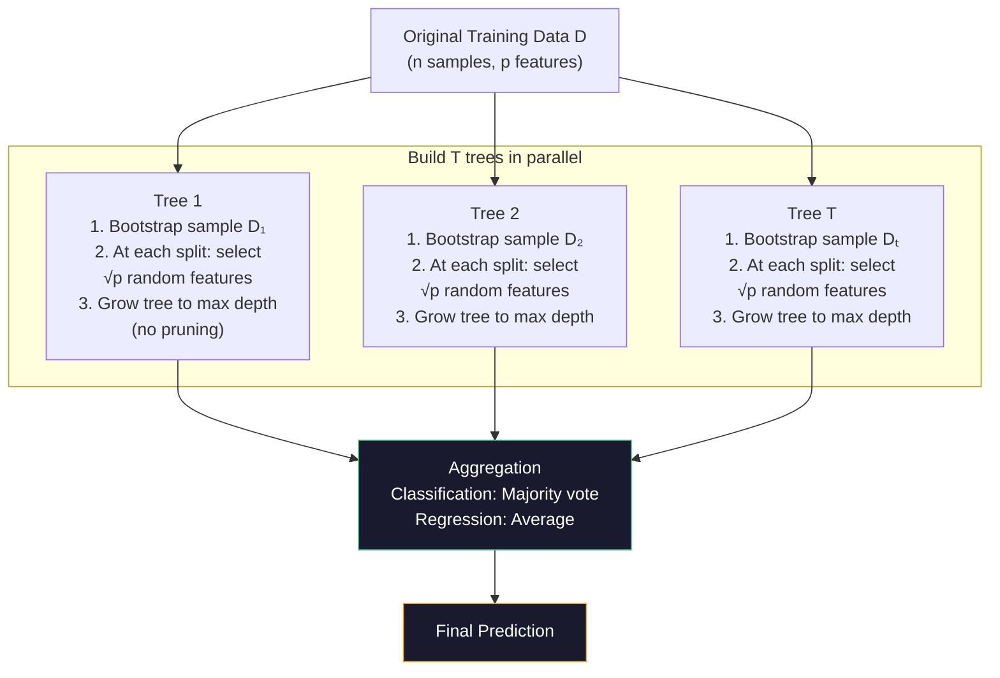
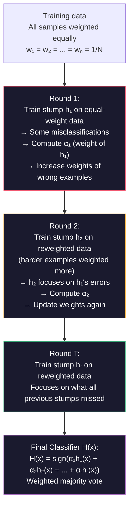

# Advanced AI — Part 6: Ensemble Methods — Random Forest, AdaBoost, and XGBoost

---

**Series:** Advanced Artificial Intelligence — BE Computer Engineering (Sem VIII, C-Scheme)
**Part:** 6 of 8
**Exam Papers:** May 2024 (QP CODE: 10054668) · May 2025 (QP CODE: 10081862)
**Reading time:** ~40 minutes

---

## Exam Questions Covered in This Article

> **May 2024 — Q1(d) [5 Marks]**
> *"Explain Random Forest algorithm."*

> **May 2024 — Q6(b) [10 Marks]**
> *"Explain AdaBoost in detail."*

> **May 2025 — Q1(d) [5 Marks]**
> *"Explain XGBoost regression."*

> **May 2025 — Q4(b) [4 Marks]**
> *"Explain AdaBoost in detail."*

---

## Table of Contents

1. [Ensemble Learning: The Core Idea](#1-ensemble-learning-the-core-idea)
2. [Decision Trees: The Building Block](#2-decision-trees-the-building-block)
3. [Bagging vs Boosting](#3-bagging-vs-boosting)
4. [Random Forest](#4-random-forest)
5. [AdaBoost (Adaptive Boosting)](#5-adaboost-adaptive-boosting)
6. [XGBoost (Extreme Gradient Boosting)](#6-xgboost-extreme-gradient-boosting)
7. [Complete Comparison](#7-complete-comparison)
8. [Key Takeaways](#8-key-takeaways)

---

## 1. Ensemble Learning: The Core Idea

"Two heads are better than one" — this folk wisdom is the foundation of ensemble learning.

A single decision tree, no matter how well-tuned, has limitations: it can overfit, it's sensitive to noise, and it has limited representational power. **Ensemble learning** combines the predictions of multiple individual models (called **weak learners** or **base learners**) to produce a combined prediction that is stronger than any individual model.

### The Bias-Variance Decomposition

To understand *why* ensembles work, you need the **bias-variance decomposition** of prediction error.

For a regression task with expected squared error:

$$\text{Error}(x) = \text{Bias}^2 + \text{Variance} + \text{Irreducible Noise}$$

Where:
$$\text{Bias} = E[\hat{f}(x)] - f(x) \quad \text{(systematic error — how far off the mean prediction is from the truth)}$$
$$\text{Variance} = E\left[(\hat{f}(x) - E[\hat{f}(x)])^2\right] \quad \text{(spread of predictions — how much predictions vary across datasets)}$$

**Irreducible noise:** The inherent randomness in data — cannot be reduced.

| Model Type | Bias | Variance | Example |
|-----------|------|----------|---------|
| Shallow decision stump | High (underfits) | Low | "Is age > 30?" |
| Deep, unpruned tree | Low | High (overfits) | Perfectly memorizes training set |
| Random Forest | Low | **Lower** (averaging reduces variance) | Forest of deep trees |
| AdaBoost | **Lower** (sequential correction reduces bias) | Low | Many weighted stumps |

**The key insight:**
- **Bagging (Random Forest)** reduces **variance** by averaging many high-variance, low-bias models
- **Boosting (AdaBoost, XGBoost)** reduces **bias** by combining many low-variance, high-bias models

### Why Averaging Reduces Variance

If you have $T$ independent models each with variance $\sigma^2$ and correlation $\rho$ between them, their average has variance:

$$\text{Var}\left(\frac{1}{T}\sum_{t=1}^T h_t\right) = \rho \sigma^2 + \frac{1-\rho}{T} \sigma^2$$

As $T \rightarrow \infty$, the second term → 0. The first term remains — it's the **irreducible correlation**.

This is why Random Forest needs **decorrelated trees** (random feature selection). Without decorrelation ($\rho = 1$, all trees identical), averaging provides no variance reduction. With low $\rho$ (diverse trees), the second term rapidly shrinks toward zero as you add trees.

### The Mathematical Intuition

If you have 100 classifiers that are each individually right 70% of the time (and their errors are independent), combining them by majority vote gives you:

$$P(\text{majority correct}) = \sum_{k=51}^{100} \binom{100}{k} (0.7)^k (0.3)^{100-k} \approx 98\%$$

Independence of errors is the key condition. Ensemble methods achieve this through:
- **Bagging**: Train each model on a different random subset of data (Random Forest)
- **Boosting**: Train models sequentially, each one focusing on the errors of the previous one (AdaBoost, XGBoost)

---

## 2. Decision Trees: The Building Block

All three methods (Random Forest, AdaBoost, XGBoost) use **decision trees** as their base learners. Understanding the tree is essential.

A **decision tree** is a flowchart of if-else questions that partitions the feature space into regions. At each internal node, it asks a question about one feature (e.g., "Is age > 30?"). At each leaf, it makes a prediction.

```
                    [Age > 30?]
                   /           \
               Yes              No
         [Income > 50k?]    → Predict: Low Risk
         /            \
       Yes              No
   → Predict:      → Predict:
   Low Risk        High Risk
```

### Split Criteria: How Does the Tree Choose Which Question to Ask?

At each node, the tree searches for the best split — the feature and threshold that best separates the classes. This requires a **purity measure**.

**Gini Impurity:**

$$\text{Gini}(t) = 1 - \sum_{k=1}^{K} p_k^2$$

Where $p_k$ is the proportion of class $k$ at node $t$, and $K$ is the number of classes.

- $\text{Gini} = 0$: Node is perfectly pure (all one class)
- $\text{Gini} = 0.5$: Node is maximally impure (equal class split for 2 classes)

**Information Gain (Entropy-based):**

$$H(t) = -\sum_{k=1}^{K} p_k \log_2 p_k \quad \text{(Entropy)}$$

$$IG(t, \text{split}) = H(\text{parent}) - \sum_{\text{child } c} \frac{n_c}{n} H(c)$$

Where $n_c$ is the number of samples in child $c$ and $n$ is the number in the parent.

Information gain measures how much a split reduces entropy. The tree chooses the split that maximizes information gain.

**Comparison:**

| Criterion | Measures | Notes |
|-----------|---------|-------|
| **Gini impurity** | Probability of wrong random classification | Faster to compute (no log), default in sklearn |
| **Entropy/Info Gain** | Average information content | Theoretically cleaner, tends to prefer balanced splits |
| **Gain Ratio** | Info gain normalized by split entropy | Penalizes splits with many children (avoids ID3's bias toward many-valued features) |

**Weak learner:** A decision tree with depth 1 (a single split, called a "decision stump") is deliberately weak — it can only ask one question. Ensemble methods combine many such stumps.

**Strong learner:** A deep, fully-grown decision tree can fit training data perfectly — but typically overfits badly.

---

## 3. Bagging vs Boosting

These are the two fundamental strategies for building ensembles, and they differ in a fundamental way:

| Property | Bagging | Boosting |
|----------|---------|---------|
| **Training order** | **Parallel** — all models trained independently | **Sequential** — each model depends on the previous |
| **Data sampling** | Each model trained on a random **bootstrap sample** | Each model trained with **reweighted samples** (focusing on previous errors) |
| **Model combination** | **Equal voting** — all models have equal say | **Weighted voting** — accurate models have more weight |
| **Primary goal** | Reduce **variance** (overfitting) | Reduce **bias** (underfitting) |
| **Typical base learner** | Deep trees (high variance, low bias) | Shallow stumps (low variance, high bias) |
| **Sensitivity to outliers** | Low | Higher (outliers get high weight) |
| **Speed** | Fast (parallel training) | Slower (sequential) |
| **Example** | Random Forest | AdaBoost, Gradient Boosting, XGBoost |

---

## 4. Random Forest

> **This section directly answers May 2024 Q1(d) — "Explain Random Forest algorithm."**

### The Core Idea

Random Forest builds many decision trees, each trained on a **different random sample of data and a different random subset of features**, then **aggregates their predictions by majority vote** (classification) or **averaging** (regression).

The word "random" refers to two sources of randomness:
1. **Random data sampling** (bootstrapping): Each tree sees a different ~63% subset of training data
2. **Random feature selection**: At each split, only a random subset of features is considered

### Why Two Sources of Randomness?

Without feature randomness (only data bootstrapping), trees would all look similar — the most important features would dominate every tree's splits. The random feature selection **decorrelates the trees**, ensuring their errors are more independent, which dramatically improves the ensemble.

### The Bootstrap Sampling Process

Each tree gets its own training dataset via **bootstrap sampling** (sampling with replacement):

```
Original dataset: [x₁, x₂, x₃, x₄, x₅, x₆, x₇, x₈, x₉, x₁₀]

Tree 1 bootstrap:  [x₃, x₃, x₁, x₇, x₂, x₉, x₄, x₁, x₆, x₈]  ← some repeated, some missing
Tree 2 bootstrap:  [x₅, x₂, x₂, x₈, x₁, x₆, x₁₀, x₃, x₅, x₇]
Tree 3 bootstrap:  [x₁, x₉, x₄, x₄, x₇, x₂, x₈, x₅, x₆, x₁]
...
```

Samples not selected (~37%) form the **Out-of-Bag (OOB)** set — they can be used to evaluate the tree without a separate validation set.

### The Random Forest Training Algorithm



### Feature Importance in Random Forest

A natural by-product of training: you can measure how much each feature contributes to prediction quality by tracking how much each feature reduces impurity (Gini impurity or entropy) across all trees and splits.

This gives you a **feature importance score** — a powerful tool for understanding which variables are actually predictive.

### Random Forest Hyperparameters

| Parameter | What It Controls | Typical Values |
|-----------|-----------------|----------------|
| `n_estimators` | Number of trees | 100–500 |
| `max_features` | Features considered per split | √p (classification), p/3 (regression) |
| `max_depth` | Maximum tree depth | None (grow fully) |
| `min_samples_split` | Minimum samples to split a node | 2–10 |
| `bootstrap` | Whether to bootstrap sample | True |

### Advantages and Disadvantages

| Advantage | Disadvantage |
|-----------|-------------|
| High accuracy, robust | Less interpretable than single tree |
| Handles high-dimensional data | Slower prediction (many trees) |
| Built-in feature importance | Large memory footprint |
| Robust to outliers and noise | Can overfit with very noisy data |
| Works well out-of-the-box | Not ideal for very sparse data |

---

## 5. AdaBoost (Adaptive Boosting)

> **This section directly answers May 2024 Q6(b) and May 2025 Q4(b) — "Explain AdaBoost in detail."**

### The Core Idea

AdaBoost trains a sequence of **weak classifiers** (typically decision stumps — depth-1 trees). After each classifier is trained, **misclassified examples get higher weights** so the next classifier focuses more on the hard cases.

The analogy: A teacher gives a test. Students who get questions wrong study those questions harder for the next test. After many rounds, each student specializes in the questions they initially struggled with. The teacher combines everyone's answers, giving more weight to the students who performed best.

### The Algorithm Step-by-Step

**Initialization:**  
Start with equal weights for all training examples:
$$w_i^{(1)} = \frac{1}{N}, \quad i = 1, \ldots, N$$

**For each round $t = 1, 2, \ldots, T$:**

**Step 1:** Train a weak classifier $h_t$ on the **weighted** training data.

**Step 2:** Compute the **weighted error rate** $\varepsilon_t$:
$$\varepsilon_t = \sum_{i=1}^{N} w_i^{(t)} \cdot \mathbf{1}[y_i \neq h_t(x_i)]$$

(Sum of weights of misclassified samples — lower is better.)

**Step 3:** Compute the **classifier weight** $\alpha_t$:
$$\alpha_t = \frac{1}{2} \ln\left(\frac{1 - \varepsilon_t}{\varepsilon_t}\right)$$

| $\varepsilon_t$ | $\alpha_t$ | Meaning |
|----------------|-----------|---------|
| 0.0 (perfect) | → +∞ | Extremely trusted |
| 0.5 (random) | = 0 | No trust — ignored |
| 1.0 (wrong) | → −∞ | Extremely distrusted (flip its predictions) |

**Step 4:** Update the sample weights:
$$w_i^{(t+1)} = w_i^{(t)} \cdot \exp\left(-\alpha_t \cdot y_i \cdot h_t(x_i)\right)$$

- **Correctly classified** ($y_i = h_t(x_i)$): weight multiplied by $e^{-\alpha_t}$ → weight **decreases**
- **Misclassified** ($y_i \neq h_t(x_i)$): weight multiplied by $e^{+\alpha_t}$ → weight **increases**

**Step 5:** Normalize weights so they sum to 1.

**Final Prediction:**
$$H(x) = \text{sign}\left(\sum_{t=1}^{T} \alpha_t \cdot h_t(x)\right)$$

Final output is the **weighted majority vote** of all classifiers.

### Visualizing AdaBoost



### Why AdaBoost Works

Each stump is a weak classifier — no better than a slightly informed guess (say, 55% accuracy). But they each "specialize" in different parts of the error space. When you combine them with their learned weights, you get a strong classifier that correctly handles all the difficult cases.

Mathematically, AdaBoost is minimizing **exponential loss** on the training data:

$$\mathcal{L}_{exp} = \sum_{i=1}^N \exp\left(-y_i \cdot F(x_i)\right)$$

where $F(x) = \sum_{t=1}^T \alpha_t h_t(x)$ is the ensemble's margin. The sequential weight updates are exactly gradient descent on this loss in "function space."

### AdaBoost Training Error Bound

A powerful theoretical guarantee: the training error of the AdaBoost ensemble is bounded above by:

$$\text{Training error} \leq \prod_{t=1}^{T} 2\sqrt{\varepsilon_t(1-\varepsilon_t)} = \prod_{t=1}^{T} \sqrt{1 - 4\gamma_t^2}$$

Where $\gamma_t = 0.5 - \varepsilon_t$ is the **edge** of classifier $t$ above random guessing.

**What this means:** If every weak classifier has edge $\gamma_t \geq \gamma > 0$ (even a tiny improvement above random), then:

$$\text{Training error} \leq \left(1 - 4\gamma^2\right)^{T/2} \leq e^{-2T\gamma^2}$$

This **decreases exponentially** in the number of rounds $T$! As you add more classifiers, training error drops to zero exponentially fast — as long as each weak classifier does better than random.

This is the **Boosting Theorem** (Schapire, 1990 — the original boosting result). It proves that many weak learners can combine into an arbitrarily strong learner.

### Sensitivity to Outliers

AdaBoost's weight update mechanism is its weakness: outliers (mislabeled data, truly hard examples) get ever-increasing weights. Eventually, a single noisy outlier can consume most of the total weight, causing the ensemble to waste many classifiers trying to handle one bad data point.

This makes AdaBoost **sensitive to noise and outliers** — more so than Random Forest or XGBoost (which use bounded loss functions).

---

## 6. XGBoost (Extreme Gradient Boosting)

> **This section directly answers May 2025 Q1(d) — "Explain XGBoost regression."**

### Background: Gradient Boosting

XGBoost is an efficient implementation of **Gradient Boosting**. Before XGBoost, understand the base idea:

In Gradient Boosting, each new tree is trained to predict the **residual errors** of the ensemble so far — not the original target. Each tree corrects the mistakes of all previous trees combined.

**Round 1:** Train tree $h_1$ to predict $y$. Compute residuals: $r_1 = y - h_1(x)$
**Round 2:** Train tree $h_2$ to predict residuals $r_1$. Update: $F_2(x) = h_1(x) + \eta \cdot h_2(x)$
**Round t:** Train tree $h_t$ to predict current residuals $r_{t-1}$. Update: $F_t(x) = F_{t-1}(x) + \eta \cdot h_t(x)$

Where $\eta$ is the **learning rate** (shrinkage) — controls how much each tree contributes.

### What Makes XGBoost "Extreme"?

XGBoost is Gradient Boosting with a set of engineering and algorithmic improvements that make it **much faster, more accurate, and more regularized**:

### XGBoost Objective Function

XGBoost minimizes an objective that includes both a **loss function** and **regularization**:

$$\mathcal{L} = \sum_{i=1}^{n} l(y_i, \hat{y}_i) + \sum_{k=1}^{K} \Omega(h_k)$$

Where:
- $l(y_i, \hat{y}_i)$ is the loss function (MSE for regression, log-loss for classification)
- $\Omega(h_k) = \gamma T + \frac{1}{2}\lambda \sum_{j=1}^{T} w_j^2$ is the regularization term
  - $T$ = number of leaves in the tree
  - $w_j$ = leaf weights (prediction values)
  - $\gamma$ penalizes having too many leaves (tree complexity)
  - $\lambda$ is L2 regularization on leaf weights

### The Second-Order Taylor Approximation

XGBoost's key mathematical innovation: instead of just using the gradient (first derivative) of the loss to fit each tree, it uses both the **first derivative (gradient)** and the **second derivative (Hessian)** — a second-order Taylor expansion:

$$\mathcal{L}^{(t)} \approx \sum_{i=1}^{n} \left[g_i f_t(x_i) + \frac{1}{2} h_i f_t^2(x_i)\right] + \Omega(f_t)$$

Where:
- $g_i = \partial_{\hat{y}^{(t-1)}} l(y_i, \hat{y}^{(t-1)})$ — first derivative (gradient)
- $h_i = \partial^2_{\hat{y}^{(t-1)}} l(y_i, \hat{y}^{(t-1)})$ — second derivative (Hessian)

**Why use second derivatives?**  
The Hessian tells you the *curvature* of the loss — not just which direction to go (gradient), but how fast to step. This produces better tree structures with fewer iterations.

### XGBoost Key Features

| Feature | Description | Benefit |
|---------|-------------|---------|
| **Regularization (L1 + L2)** | Added directly to objective | Prevents overfitting — this alone makes XGBoost better than vanilla Gradient Boosting |
| **Second-order optimization** | Uses both gradient and Hessian | Better splits, faster convergence |
| **Approximate split finding** | Quantile sketching for split candidates | Handles large datasets efficiently |
| **Sparsity-aware splits** | Handles missing values natively | No preprocessing needed for NaN values |
| **Column subsampling** | Sample features like Random Forest | Better generalization, faster training |
| **Parallel tree construction** | Build trees in parallel at node level | Significantly faster than standard GBM |
| **Cache-aware access patterns** | Optimized memory access | Faster for large datasets |
| **Out-of-core computation** | Disk-based processing | Handles datasets larger than RAM |

### XGBoost for Regression

For regression, the loss function is:

$$l(y_i, \hat{y}_i) = \frac{1}{2}(y_i - \hat{y}_i)^2$$

Gradients and Hessians:
$$g_i = \hat{y}_i - y_i \quad \text{(residual)}$$
$$h_i = 1 \quad \text{(constant for squared loss)}$$

For regression, the optimal leaf weight $w_j^*$ for leaf $j$ containing sample set $I_j$:

$$w_j^* = -\frac{\sum_{i \in I_j} g_i}{\sum_{i \in I_j} h_i + \lambda} = -\frac{\sum_{i \in I_j} (\hat{y}_i - y_i)}{|I_j| + \lambda}$$

This is essentially the mean residual at that leaf, with L2 regularization shrinking it toward zero.

### XGBoost vs AdaBoost vs Random Forest

| Property | Random Forest | AdaBoost | XGBoost |
|----------|--------------|---------|--------|
| **Strategy** | Bagging | Boosting (adaptive weights) | Boosting (gradient + Hessian) |
| **Base learners** | Deep trees (full depth) | Stumps (depth 1) | Shallow trees (depth 3–8) |
| **Parallelism** | Full parallel | Sequential only | Parallel at node level |
| **Regularization** | None (tree depth limits it) | None explicitly | Built-in L1, L2, leaf penalty |
| **Missing values** | Requires imputation | Requires imputation | **Handles natively** |
| **Speed** | Fast (training) | Medium | Very fast (optimized) |
| **Accuracy** | Very good | Good | **State of the art on tabular data** |
| **Overfitting risk** | Low | High (sensitive to noise/outliers) | Low (built-in regularization) |

---

## 7. Complete Comparison

| Dimension | Random Forest | AdaBoost | XGBoost |
|-----------|--------------|---------|--------|
| **Type** | Bagging | Boosting | Gradient Boosting |
| **Trees** | Parallel, independent | Sequential, dependent | Sequential, dependent |
| **Error focus** | Reduces variance | Reduces bias | Reduces bias + variance |
| **Output** | Majority vote / average | Weighted vote | Sum of tree predictions |
| **Key innovation** | Feature randomness | Adaptive sample weights | Second-order optimization + regularization |
| **Best for** | High-dimensional data, noisy datasets | Binary classification with clean data | General purpose, tabular data competitions |
| **Interpretability** | Medium (feature importance) | Medium | Medium (SHAP values) |

---

## 8. Key Takeaways

**Random Forest:** Builds many fully-grown decision trees in parallel, each on a random bootstrap sample using a random subset of features. Combines by majority vote. Reduces variance without increasing bias.

**AdaBoost:** Builds weak stumps sequentially. Each stump focuses on the mistakes of all previous stumps by increasing the weights of misclassified samples. Final prediction is a weighted vote where more accurate stumps get more weight. Loss function: exponential.

**XGBoost:** Gradient Boosting + regularization + second-order optimization. Each tree predicts the residuals of the ensemble using both gradient and Hessian. Regularization (L1, L2, leaf penalty) prevents overfitting. Fastest and most accurate among the three for tabular data.

**The pattern to remember:**
- Random Forest = many trees, **parallel**, each sees different data + features → reduce variance
- AdaBoost = many stumps, **sequential**, each sees harder examples → reduce bias
- XGBoost = shallow trees, **sequential**, each corrects residuals with math optimization → reduce both

---

*Previous: [Part 5 — Transfer Learning](05-transfer-learning.md)*  
*Next: [Part 7 — Probabilistic Models: GMM, HMM, MRF, Bayesian Networks](07-probabilistic-models.md)*
