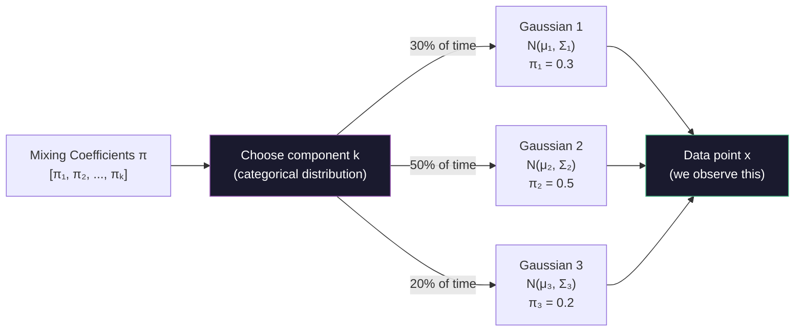
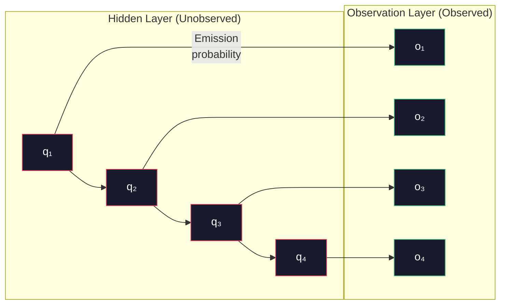
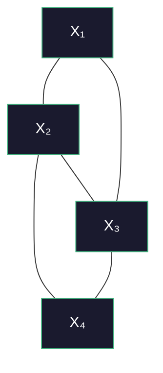
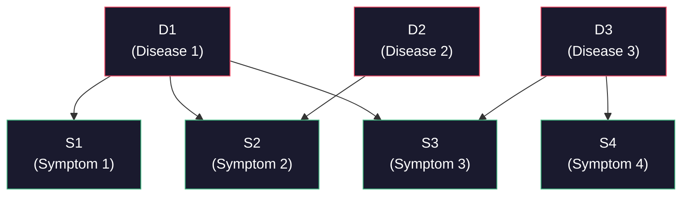

# Advanced AI — Part 7: Probabilistic Models — GMM, HMM, Markov Random Fields, and Bayesian Networks

---

**Series:** Advanced Artificial Intelligence — BE Computer Engineering (Sem VIII, C-Scheme)
**Part:** 7 of 8
**Exam Papers:** May 2024 (QP CODE: 10054668) · May 2025 (QP CODE: 10081862)
**Reading time:** ~50 minutes

---

## Exam Questions Covered in This Article

> **May 2024 — Q5(a) [10 Marks]**
> *"Explain Gaussian Mixture Models."*

> **May 2024 — Q5(b) [10 Marks]**
> *"Explain Hidden Markov Models."*

> **May 2024 — Q2(b) [10 Marks]**
> *"A patient goes to the doctor for a medical condition... Draw the Bayesian network... Write the expression for the joint probability distribution... What is the number of independent parameters required?"*

> **May 2025 — Q5(a) [4 Marks]**
> *"Explain Gaussian Mixture Models."*

> **May 2025 — Q6(b) [4 Marks]**
> *"Explain Markov Random Field in detail."*

---

## Table of Contents

1. [Gaussian Mixture Models (GMM)](#1-gaussian-mixture-models-gmm)
2. [The EM Algorithm for GMM](#2-the-em-algorithm-for-gmm)
3. [Hidden Markov Models (HMM)](#3-hidden-markov-models-hmm)
4. [The Three Problems of HMMs](#4-the-three-problems-of-hmms)
5. [Markov Random Fields (MRF)](#5-markov-random-fields-mrf)
6. [Bayesian Networks](#6-bayesian-networks)
7. [Complete Comparison Table](#7-complete-comparison-table)
8. [Key Takeaways](#8-key-takeaways)

---

## 1. Gaussian Mixture Models (GMM)

> **This section directly answers May 2024 Q5(a) and May 2025 Q5(a) — "Explain Gaussian Mixture Models."**

### The Motivation: When One Gaussian Isn't Enough

A Gaussian distribution (Normal distribution) describes data that clusters around a single mean in a bell-curve shape. But real data often has **multiple clusters** — for example:
- Heights of adults: separate peaks for children, adult women, adult men
- Customer spending: budget shoppers cluster around one value, luxury shoppers around another
- Pixel intensities in an image: background pixels cluster differently from foreground

No single Gaussian can describe data with multiple peaks. But a **weighted sum of multiple Gaussians** can model any complex distribution.

### What is a GMM?

A **Gaussian Mixture Model** is a probabilistic model that assumes all data points are generated from a **mixture of $K$ Gaussian distributions**, with unknown parameters.

$$p(x) = \sum_{k=1}^{K} \pi_k \cdot \mathcal{N}(x \mid \mu_k, \Sigma_k)$$

Where:
- $K$ = number of Gaussian components (clusters)
- $\pi_k$ = **mixing coefficient** — the probability of being in cluster $k$ (must sum to 1: $\sum_k \pi_k = 1$)
- $\mu_k$ = **mean** vector of the $k$-th Gaussian
- $\Sigma_k$ = **covariance matrix** of the $k$-th Gaussian
- $\mathcal{N}(x \mid \mu_k, \Sigma_k)$ = the $k$-th Gaussian's probability density at $x$

### Generative Interpretation

Think of GMM as a two-step generative process:
1. **Choose a cluster**: Sample $z \in \{1, \ldots, K\}$ according to the mixing coefficients $\pi_k$
2. **Generate a point**: Sample $x$ from the chosen Gaussian $\mathcal{N}(x \mid \mu_z, \Sigma_z)$



### GMM Parameters to Learn

Given a dataset of $N$ points $\{x_1, \ldots, x_N\}$, we want to learn:
- $\pi_k$ for each $k$ — mixing coefficients
- $\mu_k$ for each $k$ — means
- $\Sigma_k$ for each $k$ — covariance matrices

The challenge: we don't know **which cluster each data point belongs to**. This is a **latent variable** problem — cluster assignments $z$ are hidden.

### GMM vs K-Means

| Property | K-Means | GMM |
|----------|---------|-----|
| **Cluster assignment** | Hard — each point belongs to exactly one cluster | **Soft** — each point has a probability of belonging to each cluster |
| **Cluster shape** | Spherical only (all clusters same size/shape) | **Any shape** (covariance matrix captures orientation and scale) |
| **Output** | Cluster labels | Probability distribution over clusters |
| **Uncertainty** | None | **Built-in** — you know how confident the assignment is |
| **Algorithm** | Lloyd's algorithm | EM algorithm |
| **Sensitive to initialization** | Yes | Yes |

---

## 2. The EM Algorithm for GMM

GMM is trained using the **Expectation-Maximization (EM) algorithm** — an iterative procedure for finding maximum likelihood estimates when latent variables are present.

### The Core Idea

EM alternates between two steps:
- **E-step (Expectation):** Given current parameters, compute the expected cluster assignments (soft assignments) for each data point
- **M-step (Maximization):** Given the current soft assignments, update the parameters to maximize the likelihood

### The Responsibility

The key quantity is the **responsibility** $r_{ik}$: the posterior probability that data point $x_i$ belongs to cluster $k$:

$$r_{ik} = \frac{\pi_k \mathcal{N}(x_i \mid \mu_k, \Sigma_k)}{\sum_{j=1}^{K} \pi_j \mathcal{N}(x_i \mid \mu_j, \Sigma_j)}$$

This is Bayes' theorem: how much does component $k$ "claim responsibility" for generating $x_i$?

### The EM Steps for GMM

```
Initialize: Set μₖ (e.g., K-Means result), Σₖ (e.g., identity matrices), πₖ = 1/K

Repeat until convergence:

E-step: For each point i and cluster k:
    rᵢₖ = πₖ · N(xᵢ|μₖ,Σₖ) / Σⱼ πⱼ · N(xᵢ|μⱼ,Σⱼ)

M-step: Update parameters using weighted averages:
    Nₖ = Σᵢ rᵢₖ           (effective number of points in cluster k)
    πₖ = Nₖ / N             (new mixing coefficient)
    μₖ = (1/Nₖ) Σᵢ rᵢₖ xᵢ  (new mean)
    Σₖ = (1/Nₖ) Σᵢ rᵢₖ (xᵢ-μₖ)(xᵢ-μₖ)ᵀ  (new covariance)

Check: Has log-likelihood converged?
```

### GMM Applications

| Application | How GMM Is Used |
|-------------|-----------------|
| **Image segmentation** | Cluster pixels into background/foreground/object regions |
| **Anomaly detection** | Data points with low $p(x)$ are anomalies |
| **Density estimation** | Estimate the true distribution of any data |
| **Speaker identification** | Model the distribution of each speaker's voice features |
| **Document clustering** | Group documents by topic (soft clustering) |

### EM Convergence Guarantee

The EM algorithm has a crucial theoretical property: **log-likelihood is guaranteed to be non-decreasing across iterations**.

**Formal statement:** For any parameter update from $\theta^{(t)}$ to $\theta^{(t+1)}$ via one EM iteration:
$$\log p(X \mid \theta^{(t+1)}) \geq \log p(X \mid \theta^{(t)})$$

**Why this holds (intuition):**  
The E-step computes a lower bound on $\log p(X|\theta)$. The M-step maximizes this lower bound. Since the lower bound at the new parameters is at least as large as at the old parameters, and the true log-likelihood is always ≥ the lower bound value, the log-likelihood cannot decrease.

**Implication:** EM is guaranteed to converge — eventually the log-likelihood stops improving. However, it may converge to a **local maximum**, not the global maximum. Different random initializations lead to different solutions.

**The Singularity Problem in GMM:**  
EM for GMM can encounter a degenerate singularity: if one Gaussian collapses to a single data point ($\mu_k \rightarrow x_i$, $\sigma_k \rightarrow 0$), the likelihood of that component → ∞. This is numerically unstable. Solution: add a small minimum variance constraint $\sigma_k \geq \epsilon_{min}$.

---

## 3. Hidden Markov Models (HMM)

> **This section directly answers May 2024 Q5(b) — "Explain Hidden Markov Models."**

### The Motivation: Sequential, Time-Varying Data

GMM is great for i.i.d. data (each point independent). But many real-world phenomena are **sequential** — the current state depends on the previous state:

- A spoken word is a sequence of phonemes — and which phoneme comes next depends on the current one
- Stock prices: today's price influences tomorrow's
- DNA sequences: each base pair influences adjacent ones
- Weather: today's weather influences tomorrow's

**Hidden Markov Models** extend Markov chains to model sequential data where the underlying **state is hidden (unobserved)** and we can only observe noisy emissions from those states.

### Building Blocks

**Markov Assumption:** The current state depends only on the **immediately preceding state** (first-order Markov property):

$$P(q_t \mid q_1, q_2, \ldots, q_{t-1}) = P(q_t \mid q_{t-1})$$

This is a simplification that makes the model tractable while still capturing useful temporal patterns.

**Hidden States vs Observations:**

| Concept | Description | Example (Speech) | Example (Weather) |
|---------|-------------|-----------------|------------------|
| **Hidden state $q_t$** | True underlying system state at time $t$ — not observed directly | Phoneme being spoken | Actual weather (sunny/rainy/cloudy) |
| **Observation $o_t$** | What we actually see/measure | Acoustic features (MFCC) | Person's activity (umbrella/sunglasses) |



### HMM Components (The Five Elements)

An HMM is completely defined by five components, often written as $\lambda = (N, M, A, B, \pi)$:

| Symbol | Name | Description |
|--------|------|-------------|
| $N$ | Number of states | $Q = \{q_1, q_2, \ldots, q_N\}$ |
| $M$ | Number of observation symbols | $V = \{v_1, v_2, \ldots, v_M\}$ |
| $A$ | **Transition probability matrix** | $a_{ij} = P(q_t = j \mid q_{t-1} = i)$ — probability of moving from state $i$ to state $j$ |
| $B$ | **Emission probability matrix** | $b_j(o_t) = P(o_t \mid q_t = j)$ — probability of observing $o_t$ when in state $j$ |
| $\pi$ | **Initial state distribution** | $\pi_i = P(q_1 = i)$ — probability of starting in state $i$ |

### A Concrete Example: Weather HMM

**Scenario:** A friend is in a different city. You cannot see the weather, but they tell you their activity each day: Walk (W), Shop (S), or Clean (C). You want to infer the weather from their activities.

**Hidden states:** {Sunny, Rainy}  
**Observations:** {Walk, Shop, Clean}

**Transition matrix A:**
```
              To: Sunny  To: Rainy
From: Sunny:  [  0.8,     0.2  ]
From: Rainy:  [  0.4,     0.6  ]
```

**Emission matrix B:**
```
              Walk  Shop  Clean
State: Sunny: [0.6,  0.3,  0.1]
State: Rainy: [0.1,  0.4,  0.5]
```

**Initial distribution:** $\pi = [0.6, 0.4]$ (60% chance of starting sunny)

---

## 4. The Three Problems of HMMs

Every application of HMMs involves one of three fundamental problems:

### Problem 1: Evaluation (Likelihood)
**Question:** Given a model $\lambda = (A, B, \pi)$ and an observation sequence $O = (o_1, o_2, \ldots, o_T)$, what is the probability $P(O \mid \lambda)$ that the model generated this sequence?

**Use case:** Which HMM (out of several trained models) best matches an observed sequence? (Used in speech recognition to pick the most likely word.)

**Algorithm:** **Forward Algorithm** (dynamic programming)  
Compute $\alpha_t(j) = P(o_1, o_2, \ldots, o_t, q_t = j \mid \lambda)$ recursively:

$$\alpha_t(j) = b_j(o_t) \cdot \sum_{i=1}^{N} \alpha_{t-1}(i) \cdot a_{ij}$$

### Problem 2: Decoding
**Question:** Given a model $\lambda$ and observation sequence $O$, what is the **most likely hidden state sequence** $Q^* = \arg\max P(Q \mid O, \lambda)$?

**Use case:** Given a speech signal, what sequence of phonemes was spoken?

**Algorithm:** **Viterbi Algorithm** (dynamic programming — similar to forward algorithm but takes max instead of sum)

$$\delta_t(j) = \max_{q_1, \ldots, q_{t-1}} P(o_1, \ldots, o_t, q_t = j \mid \lambda)$$

**Viterbi Recurrence:**

$$\delta_t(j) = b_j(o_t) \cdot \max_{i} \left[\delta_{t-1}(i) \cdot a_{ij}\right]$$

The backpointer $\psi_t(j)$ records which previous state gave the maximum:

$$\psi_t(j) = \arg\max_{i} \left[\delta_{t-1}(i) \cdot a_{ij}\right]$$

**Viterbi Algorithm Steps:**

```
1. INITIALIZATION (t=1):
   δ₁(j) = πⱼ · bⱼ(o₁)    for all states j
   ψ₁(j) = 0               (no predecessor at t=1)

2. RECURSION (t=2,...,T):
   δₜ(j) = bⱼ(oₜ) · max_i[δₜ₋₁(i) · aᵢⱼ]
   ψₜ(j) = argmax_i[δₜ₋₁(i) · aᵢⱼ]

3. TERMINATION:
   P* = max_j[δT(j)]        (probability of best path)
   q*T = argmax_j[δT(j)]   (last state of best path)

4. BACKTRACKING (reconstruct path):
   q*t = ψt+1(q*t+1)        for t=T-1, T-2, ..., 1
```

**Trellis diagram intuition:**  
The Viterbi algorithm fills a grid (trellis) of size $N \times T$ (states × time steps), where each cell holds the probability of the best path ending in that state at that time. Backpointers trace the optimal path through the trellis.

**Numerical underflow:** For long sequences, multiplying many small probabilities causes underflow (rounds to zero). Solution: work in **log space** and use additions instead of multiplications.

**Complexity:** $O(N^2 T)$ — linear in sequence length, quadratic in number of states.

### Problem 3: Learning
**Question:** Given a set of observation sequences, find the model parameters $\lambda = (A, B, \pi)$ that maximize $P(O \mid \lambda)$.

**Use case:** Train an HMM on data (e.g., recorded speech samples).

**Algorithm:** **Baum-Welch Algorithm** — a special case of the EM algorithm applied to HMMs.

| Problem | Input | Output | Algorithm |
|---------|-------|--------|-----------|
| **Evaluation** | Model + observation sequence | Probability P(O\|λ) | Forward Algorithm |
| **Decoding** | Model + observation sequence | Most likely state sequence | Viterbi Algorithm |
| **Learning** | Observation sequences (no model) | Model parameters (A, B, π) | Baum-Welch (EM) |

### HMM Applications

| Application | Hidden States | Observations |
|-------------|--------------|-------------|
| **Speech recognition** | Phonemes / words | Acoustic features (MFCC) |
| **Handwriting recognition** | Character strokes | Pen positions |
| **Bioinformatics** | Gene regions | DNA base sequences |
| **Financial modeling** | Market regimes (bull/bear) | Stock prices |
| **Natural language processing** | Part-of-speech tags | Words |
| **Activity recognition** | Activities (walking/running) | Accelerometer readings |

---

## 5. Markov Random Fields (MRF)

> **This section directly answers May 2025 Q6(b) — "Explain Markov Random Field in detail."**

### From HMM to MRF: Undirected Models

HMMs are **directed graphical models** — arrows show causal direction (state at $t$ causes observation at $t$). But in many problems, variables influence each other **symmetrically** with no clear causal direction:

- **Image segmentation**: Neighboring pixels influence each other's labels
- **Social networks**: Friends influence each other's opinions symmetrically
- **Physics**: Spins of adjacent atoms in a magnet influence each other

For these problems, **Markov Random Fields (MRF)** — also called **Markov Networks** or **Undirected Graphical Models** — are more appropriate.

### What Is a Markov Random Field?

An MRF is an **undirected graph** $G = (V, E)$ where:
- Each node $v \in V$ represents a random variable $X_v$
- Each edge $(u, v) \in E$ represents a direct probabilistic dependency between $X_u$ and $X_v$



### The Markov Property in MRFs

The **global Markov property** of an MRF: a variable $X_v$ is conditionally independent of all other variables given its **neighbors** in the graph:

$$X_v \perp X_{V \setminus (N(v) \cup \{v\})} \mid X_{N(v)}$$

Where $N(v)$ is the set of neighbors of $v$.

In simple terms: **a node is independent of all distant nodes, given only its immediate neighbors.** You don't need to know anything about the rest of the network once you know what your neighbors are doing.

### Clique Potentials: The Joint Distribution

The joint probability distribution of an MRF is defined via **potential functions** (also called clique potentials or factor functions) $\psi_C(X_C)$ over **cliques** (fully connected subgraphs) of the graph:

$$P(X_1, X_2, \ldots, X_n) = \frac{1}{Z} \prod_{C \in \mathcal{C}} \psi_C(X_C)$$

Where:
- $\mathcal{C}$ is the set of all maximal cliques
- $\psi_C(X_C) \geq 0$ is the potential function for clique $C$ (encodes compatibility between values)
- $Z = \sum_X \prod_C \psi_C(X_C)$ is the **partition function** — a normalizing constant ensuring the distribution sums to 1

**Why potentials, not probabilities?** Potential functions don't need to be proper probability distributions — they just encode how "compatible" or "preferred" certain combinations of values are. They get normalized by $Z$ to form a valid distribution.

### MRF for Image Segmentation Example

In image segmentation, each pixel $i$ has a label $X_i$ (e.g., foreground/background). The MRF models:

- **Unary potential** $\psi_i(X_i)$: How much does pixel $i$'s color suggest it should be foreground vs background?
- **Pairwise potential** $\psi_{ij}(X_i, X_j)$: How much should adjacent pixels with similar colors have the same label?

$$P(\mathbf{X} \mid \text{image}) \propto \prod_i \psi_i(X_i) \cdot \prod_{(i,j) \in E} \psi_{ij}(X_i, X_j)$$

The inference goal: find the label assignment $\mathbf{X}^*$ that maximizes this joint probability.

### Directed (Bayesian Network) vs Undirected (MRF) Comparison

| Property | Bayesian Network (Directed) | Markov Random Field (Undirected) |
|----------|----------------------------|----------------------------------|
| **Graph type** | Directed Acyclic Graph (DAG) | Undirected graph |
| **Conditional independence** | d-separation criterion | Markov blanket = neighbors |
| **Joint distribution** | Product of conditional distributions $P(X_i \mid Pa(X_i))$ | Product of clique potentials / Z |
| **Parameters** | Conditional probability tables (interpretable) | Potential functions (less interpretable) |
| **Causal direction** | Models causality explicitly | Models correlation symmetrically |
| **Normalization** | Automatic (conditionals sum to 1) | Requires computing $Z$ (often intractable) |
| **Best for** | Causal reasoning, inference with known causal structure | Symmetric interactions (images, physics, social networks) |

---

## 6. Bayesian Networks

> **This section directly answers May 2024 Q2(b) — the Bayesian network problem with diseases and symptoms.**

### What Is a Bayesian Network?

A **Bayesian Network** (also called a Belief Network or Directed Graphical Model) is a **Directed Acyclic Graph (DAG)** where:
- Each node represents a random variable
- Each directed edge $A \rightarrow B$ represents that $A$ directly influences $B$
- Each node has a **Conditional Probability Table (CPT)** giving $P(X \mid \text{Parents}(X))$

### The Medical Diagnosis Problem (May 2024 Q2b — Fully Solved)

**Problem Statement:**
> A patient goes to the doctor for a medical condition. The doctor suspects three diseases as the cause: D1, D2, D3, which are marginally independent from each other. There are four symptoms S1, S2, S3, S4:
> - S1 depends only on D1
> - S2 depends on D1 and D2
> - S3 depends on D1 and D3
> - S4 depends only on D3
> All variables are Boolean (true/false). Draw the Bayesian network, write the joint probability distribution, and find the number of independent parameters.

**Step 1: Drawing the Bayesian Network**



**Step 2: Joint Probability Distribution**

By the chain rule applied to the graph structure:

$$P(D1, D2, D3, S1, S2, S3, S4) = P(D1) \cdot P(D2) \cdot P(D3) \cdot P(S1 \mid D1) \cdot P(S2 \mid D1, D2) \cdot P(S3 \mid D1, D3) \cdot P(S4 \mid D3)$$

The key insight: D1, D2, D3 are marginally independent (no edges between them), so they appear as $P(D1) \cdot P(D2) \cdot P(D3)$ with no conditioning.

**Step 3: Number of Independent Parameters**

For each Boolean variable, a CPT has $2^{|\text{Parents}|}$ rows, each requiring 1 independent parameter (since $P(\text{True}) + P(\text{False}) = 1$, one determines the other):

| Variable | Parents | Rows in CPT | Independent Parameters |
|----------|---------|-------------|----------------------|
| D1 | None | $2^0 = 1$ | 1 |
| D2 | None | $2^0 = 1$ | 1 |
| D3 | None | $2^0 = 1$ | 1 |
| S1 | D1 | $2^1 = 2$ | 2 |
| S2 | D1, D2 | $2^2 = 4$ | 4 |
| S3 | D1, D3 | $2^2 = 4$ | 4 |
| S4 | D3 | $2^1 = 2$ | 2 |

**Total independent parameters = 1 + 1 + 1 + 2 + 4 + 4 + 2 = 15**

**Compare to no independence assumptions:** Without the conditional independence structure, specifying the full joint distribution over 7 Boolean variables requires $2^7 - 1 = 127$ parameters. The Bayesian network structure reduces this to just **15** — a 8.5× reduction.

---

## 7. Complete Comparison Table

| Property | GMM | HMM | MRF | Bayesian Network |
|----------|-----|-----|-----|-----------------|
| **Graph type** | None (mixture model) | Directed (chain) | Undirected | Directed Acyclic Graph |
| **Data type** | Static, i.i.d. | Sequential/temporal | Spatial/symmetric | General (any structure) |
| **Latent variables** | Cluster assignments $z$ | Hidden states $q_t$ | None (typically) | Varies |
| **Key equation** | $p(x) = \Sigma \pi_k \mathcal{N}(x\|\mu_k,\Sigma_k)$ | Product of transitions + emissions | Product of clique potentials / Z | Product of conditionals |
| **Training algorithm** | EM algorithm | Baum-Welch (EM) | Contrastive divergence / MCMC | Maximum likelihood or EM |
| **Inference** | Compute $r_{ik}$ responsibilities | Forward/Backward/Viterbi | Belief propagation / MCMC | Belief propagation |
| **Primary use** | Clustering, density estimation | Speech recognition, sequence labeling | Image segmentation, physics | Medical diagnosis, causal reasoning |

---

## 8. Key Takeaways

**GMM in two sentences:**  
A GMM models data as a weighted sum of $K$ Gaussian distributions, each with its own mean and covariance. The unknown cluster assignments are latent variables; parameters are learned via EM (E-step computes soft cluster responsibilities; M-step updates means, covariances, and mixing coefficients).

**HMM in three sentences:**  
An HMM models sequential data where the underlying system state is hidden and only noisy observations are available. It is defined by transition probabilities (between states), emission probabilities (state → observation), and initial state distribution. The three problems are evaluation (forward algorithm), decoding (Viterbi), and learning (Baum-Welch/EM).

**MRF in two sentences:**  
An MRF is an undirected graphical model where the joint distribution is a product of clique potentials divided by the partition function $Z$. The Markov property means each variable is independent of all non-neighbors given its neighbors — this is ideal for modeling symmetric, spatial interactions like pixel neighborhoods.

**Bayesian Network in two sentences:**  
A Bayesian network is a DAG where each node has a conditional probability table given its parents, and the joint distribution is the product of all these conditionals. The structure encodes conditional independence, dramatically reducing the number of parameters needed compared to the full joint distribution.

---

*Previous: [Part 6 — Ensemble Methods](06-ensemble-methods.md)*  
*Next: [Part 8 — Metaverse and 2D Learning Limitations](08-metaverse-2d-limitations.md)*
