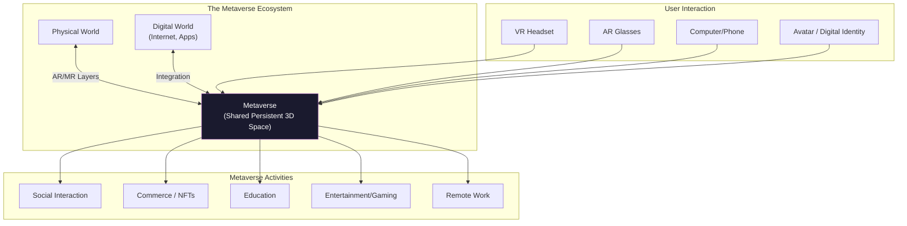
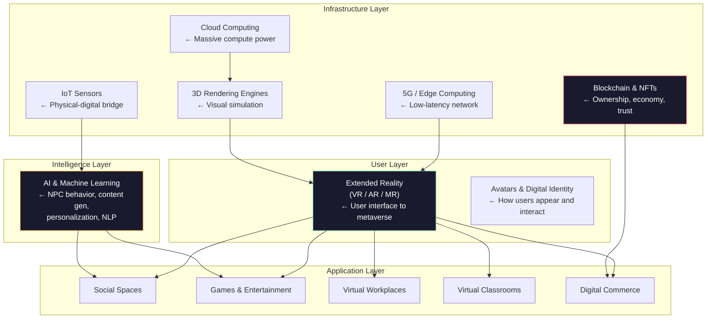

# Advanced AI — Part 8: Metaverse and 2D Learning Environment Limitations

---

**Series:** Advanced Artificial Intelligence — BE Computer Engineering (Sem VIII, C-Scheme)
**Part:** 8 of 8
**Exam Papers:** May 2024 (QP CODE: 10054668) · May 2025 (QP CODE: 10081862)
**Reading time:** ~30 minutes

---

## Exam Questions Covered in This Article

> **May 2024 — Q6(a) [10 Marks]**
> *"What is metaverse? Explain the characteristics and components of the metaverse."*

> **May 2025 — Q6(a) [4 Marks]**
> *"What is metaverse? Explain the characteristics and components of the metaverse."*

> **May 2024 — Q1(e) [5 Marks]**
> *"Explain the limitations of 2D learning environments."*

> **May 2025 — Q1(e) [5 Marks]**
> *"Explain the limitations of 2D learning environments."*

---

## Table of Contents

1. [The Metaverse: What It Is](#1-the-metaverse-what-it-is)
2. [Characteristics of the Metaverse](#2-characteristics-of-the-metaverse)
3. [Components of the Metaverse](#3-components-of-the-metaverse)
4. [AI's Role in the Metaverse](#4-ais-role-in-the-metaverse)
5. [Limitations of 2D Learning Environments](#5-limitations-of-2d-learning-environments)
6. [How the Metaverse Addresses 2D Learning Limitations](#6-how-the-metaverse-addresses-2d-learning-limitations)
7. [Key Takeaways](#7-key-takeaways)

---

## 1. The Metaverse: What It Is

### Origin of the Term

The word **metaverse** was coined by Neal Stephenson in his 1992 science fiction novel *Snow Crash*, describing a virtual reality-based successor to the internet where users interact as avatars in a shared 3D world. The concept gained mainstream attention when Facebook rebranded to **Meta** in 2021, declaring the metaverse its next major computing platform.

### Definition

The **metaverse** is a **persistent, shared, three-dimensional virtual world** that:
- Exists continuously, even when no individual user is present
- Blends physical and digital reality (AR/VR/XR)
- Allows users to interact, work, socialize, create, and transact in real time
- Is accessible through multiple devices (VR headsets, AR glasses, computers, phones)
- Has a functioning economy with digital assets, property, and commerce



---

## 2. Characteristics of the Metaverse

> **This section directly addresses both May 2024 and May 2025 Q6(a) — "Explain the characteristics of the metaverse."**

### 1. Persistence

The metaverse continues to exist and evolve whether or not any particular user is present. Changes made by one user (building a structure, planting a tree, writing on a wall) persist and are visible to all future users. This mirrors the physical world's continuity.

**Contrast with:** Traditional multiplayer games that reset between sessions, or video calls that disappear when participants leave.

### 2. Synchronous and Live

All users share the **same experience in real time**. Events happen simultaneously for all participants. A concert in the metaverse is experienced live, together — not as a recorded video each user watches separately.

### 3. Unbounded Concurrent Users

The metaverse can support a **massive number of simultaneous users** all sharing the same virtual spaces. There is no practical limit on how many people can inhabit a virtual world together — unlike a physical stadium with a hard capacity limit.

### 4. Full Economic Functionality

Users can **own, buy, sell, and invest in** virtual assets within the metaverse. This includes:
- Virtual real estate (plots of land in platforms like Decentraland)
- Digital art and collectibles (NFTs)
- Virtual goods (clothing, vehicles, tools for avatars)
- Services (education, entertainment, events)

The economy uses **cryptocurrencies and blockchain** for transparent, secure transactions.

### 5. Interoperability

Assets, avatars, and identities can move **across different metaverse platforms**. An avatar created in one platform can be used in another. A digital asset purchased in one world has value and visibility in others. This is the "portability" of digital identity.

**Current reality:** True interoperability is still largely aspirational — most current platforms are walled gardens. The open metaverse vision requires universal standards.

### 6. Individual Agency

Users are **active participants and creators**, not passive consumers. They can:
- Build and modify virtual environments
- Create and monetize their own content
- Define their own digital identity and avatar
- Form communities and governance systems

### 7. Blend of Physical and Digital (Continuity of Reality)

The metaverse is not purely virtual — it connects seamlessly with the physical world through **Augmented Reality (AR)** and **Mixed Reality (MR)**. Digital information overlays on physical environments, and physical events have simultaneous virtual counterparts.

### Summary of Characteristics

| Characteristic | Description |
|----------------|-------------|
| **Persistence** | Exists continuously; changes are permanent |
| **Synchronous** | Real-time shared experience |
| **Concurrent users** | Supports massive simultaneous participation |
| **Economic system** | Full ownership, trade, and investment in digital assets |
| **Interoperability** | Cross-platform identity and asset portability |
| **Individual agency** | Users are creators, not just consumers |
| **Reality continuum** | Seamlessly blends physical and digital worlds |

---

## 3. Components of the Metaverse

> **This section directly addresses both May 2024 and May 2025 Q6(a) — "Explain the components of the metaverse."**

The metaverse is not a single technology — it is a **convergence of many technologies and systems**:

### Component 1: Extended Reality (XR) — The Interface Layer

This is how users perceive and interact with the metaverse. Three sub-technologies:

**Formal definitions:**

- **Virtual Reality (VR):** A fully computer-generated environment that replaces the user's real-world sensory input with synthetic sensory input. Users are completely isolated from the physical environment. Technical requirements: display refresh rate ≥ 90 Hz (to prevent motion sickness), latency < 20ms (motion-to-photon latency), field of view ≥ 100°.

- **Augmented Reality (AR):** Digital information (text, images, 3D objects) is **overlaid onto the physical world** in real time. The physical world remains visible. Key technical challenge: **real-time spatial registration** — aligning virtual objects precisely with physical space as the user moves. Examples: Apple Vision Pro, Google Glass, Pokémon GO.

- **Mixed Reality (MR):** A superset of AR — not just overlaying information, but allowing **digital and physical objects to interact** with each other. A virtual ball can land on a physical table; a digital character can hide behind a real chair. Requires real-time depth sensing and environment understanding. Example: Microsoft HoloLens.

**The XR Continuum (Milgram's Reality-Virtuality Continuum, 1994):**

```
Reality ←————————————————————————————→ Virtuality
[Real World] [AR] [Mixed Reality] [VR] [Virtual World]
```

| Technology | Physical World Visible? | Digital Objects Interact with Physical? | Example |
|------------|------------------------|----------------------------------------|---------|
| **AR** | Yes | No (overlay only) | Pokémon GO |
| **MR** | Yes | **Yes** | HoloLens construction planning |
| **VR** | **No** | N/A (fully virtual) | Oculus Quest |

### Component 2: Blockchain and Decentralization

Blockchain provides the **trust and ownership layer** of the metaverse:
- **NFTs (Non-Fungible Tokens)**: Prove ownership of unique digital assets — art, land, avatars, items
- **Cryptocurrency**: Enables trustless economic transactions (ETH, MANA, SAND)
- **Smart Contracts**: Automatic, self-executing agreements (e.g., royalties paid automatically on NFT resales)
- **Decentralized ownership**: No single company controls everything — ownership is distributed

### Component 3: 3D Rendering and Graphics

The visual engine powering the metaverse:
- **Real-time 3D graphics engines**: Unreal Engine 5, Unity — render photorealistic virtual worlds at interactive frame rates (60–120 FPS)
- **Digital twin technology**: Exact 3D virtual replicas of real-world objects, spaces, or systems that are synchronized in real-time with their physical counterparts. A digital twin of a factory mirrors every machine's state, enabling remote monitoring and simulation
- **Spatial computing**: Computer systems that understand and reason about **3D space** in real time — tracking where objects are in 3D, understanding depth and physical layout, enabling interactions between virtual and physical objects
- **Photogrammetry and neural rendering**: Capturing real objects and converting them to 3D models using photos or neural networks (NeRF — Neural Radiance Fields)

### Component 4: AI and Machine Learning

AI is the intelligence layer that makes the metaverse dynamic and responsive:
- **Intelligent NPCs (Non-Player Characters)**: AI-driven characters that interact naturally with users
- **Content generation**: AI generates environments, objects, and textures procedurally
- **Natural Language Processing**: Enables voice interaction and communication translation across languages
- **Personalization**: AI adapts experiences to individual users

### Component 5: Internet of Things (IoT)

Connects physical objects and sensors to the metaverse:
- Real-world data (temperature, motion, biometrics) feeds into virtual environments
- Physical actions in the real world have consequences in the virtual world
- Enables true physical-digital integration (e.g., a physical factory mirrored in a digital twin)

### Component 6: Network Infrastructure (5G/6G + Edge Computing)

The metaverse requires enormous bandwidth and ultra-low latency:
- **5G/6G networks**: Provide the raw bandwidth and speed for high-quality immersive experiences
- **Edge computing**: Process data close to the user to minimize latency — critical for VR (>20ms latency causes motion sickness)
- **Cloud computing**: Provides the massive compute required to render and simulate persistent worlds

### Component 7: Digital Avatars and Identity

Users are represented as **avatars** — customizable digital representations:
- Can be photorealistic human replicas or fantastical creatures
- Carry persistent identity across sessions
- Represent user's digital ownership and social status

### Complete Architecture View



---

## 4. AI's Role in the Metaverse

The metaverse and AI are deeply intertwined. AI is not just a component — it is what makes the metaverse *intelligent and scalable*:

| AI Function | Metaverse Application |
|-------------|----------------------|
| **Generative AI** | Create vast virtual worlds, textures, objects procedurally — without manual design of every element |
| **Computer Vision** | Track user movements, gestures, and expressions in real time for realistic avatar control |
| **NLP** | Real-time translation between languages in social spaces; voice commands; AI assistants |
| **Reinforcement Learning** | Train intelligent NPCs that learn from interactions with users |
| **Recommendation Systems** | Personalize the metaverse experience — suggest experiences, communities, products |
| **Physics Simulation** | AI accelerates realistic physics simulations for objects, fluids, cloth |

---

## 5. Limitations of 2D Learning Environments

> **This section directly answers May 2024 & 2025 Q1(e) — "Explain the limitations of 2D learning environments."**

A **2D learning environment** refers to the traditional digital learning setup: screen-based, flat interfaces — video lectures, PDFs, PowerPoint slides, text chats, forums. Essentially, anything you access on a standard computer or phone screen without immersion.

### Limitation 1: Lack of Immersion and Engagement

**Problem:** In a 2D environment, learners are **passive observers**. They watch videos, read text, and click through slides. There is no physical presence or immersion.

**Consequence:** Attention spans drop rapidly. Studies show lecture attention span averages ~10-15 minutes before declining sharply. Without sensory engagement, information retention is lower (the brain encodes information better when multiple senses are involved — visual, auditory, kinesthetic).

**Edgar Dale's Cone of Experience (1969):**  
Educational researcher Edgar Dale proposed that learners retain different amounts of information depending on how actively engaged they are:

| Learning Activity | Approximate Retention |
|------------------|----------------------|
| Reading text | ~10% after 2 weeks |
| Hearing a lecture | ~20% after 2 weeks |
| Seeing a demonstration | ~30% after 2 weeks |
| Discussing, doing a presentation | ~50% after 2 weeks |
| Simulating the real experience | ~70% after 2 weeks |
| **Doing the real thing / simulating** | **~90% after 2 weeks** |

Traditional 2D learning falls in the bottom of the cone (reading, watching). Metaverse immersive learning moves to the top (simulating, doing).

**MOOC Dropout Statistics:**  
The failure of 2D online learning at scale is quantified:
- Stanford's early MOOCs had completion rates as low as ~5%
- Coursera's average completion rate: ~3–6% across all courses
- edX reports similar figures — a 2019 MIT study found median completion rate of 3.13%
- These are widely cited as evidence of 2D engagement failure

**Compare to:** A VR simulation where a medical student actually "performs" a surgery — the physical and spatial engagement dramatically improves retention and skill development.

### Limitation 2: No Spatial or Embodied Learning

**Problem:** Many subjects inherently require **3D spatial understanding**: surgery, architecture, chemistry (molecular structures), geology (rock formations), mechanical engineering (assembly), astronomy.

**Consequence:** In 2D, you can *describe* how a protein folds or how to assemble an engine. But the learner cannot rotate it, zoom in, disassemble it, or feel the spatial relationships. This is fundamentally inferior for subjects requiring spatial cognition.

**Example:** A medical student learning anatomy from 2D diagrams vs. exploring a 3D interactive human body model — the 3D learner builds far better spatial mental models.

### Limitation 3: Limited Collaboration and Social Presence

**Problem:** Real-world collaboration involves **physical co-presence** — standing around a whiteboard, pointing at objects together, reading body language and facial expressions. 2D environments reduce this to text chat and video boxes.

**Consequence:** The sense of "being together" — called **social presence** — is greatly reduced in 2D environments. This leads to:
- Reduced motivation (you're not accountable to a community)
- Poorer teamwork (harder to coordinate without spatial awareness)
- Weaker social bonds (courses feel more transactional)

### Limitation 4: No Experiential Learning for Dangerous or Expensive Scenarios

**Problem:** Some learning is best done by doing — but the real scenario is too **dangerous, expensive, or impossible** to replicate:
- Pilots cannot train only in real planes (crashes are fatal and expensive)
- Surgeons cannot practice on real patients
- Firefighters cannot set real buildings on fire for training
- Astronauts cannot train in actual space

2D environments can only show videos or diagrams of these scenarios — no hands-on practice.

**Consequence:** Learners must eventually "learn by doing" in the real environment, which is risky and expensive.

### Limitation 5: Low Motivation and High Dropout Rates

**Problem:** Online 2D learning has catastrophically high dropout rates. Massive Open Online Courses (MOOCs) on platforms like Coursera and edX typically see **less than 10% completion rates**.

**Root causes:**
- No accountability structures (no teacher watching, no classmates noticing)
- No intrinsic motivation from the environment (a classroom creates social norms of attention)
- Easy to pause, defer, or abandon
- Content passivity (watching > doing)

### Limitation 6: Inability to Represent Real-World Scale and Context

**Problem:** A 2D screen cannot convey true **scale, depth, and physical context**. Understanding the scale of the universe, the size of a cell organelle, or the height of a skyscraper's structural elements requires actual spatial experience.

**Consequence:** Learners develop distorted intuitions about scale and physical relationships that must be corrected with real-world exposure.

### Limitation 7: Accessibility and Interface Constraints

**Problem:** Standard 2D interfaces require specific cognitive skills — reading, clicking, navigating menus. They may be poorly accessible for:
- Learners with dyslexia or reading difficulties
- Learners from low-literacy backgrounds
- Young children who haven't developed abstract 2D spatial reasoning

### Summary Table: 2D Learning Limitations

| Limitation | Root Cause | Impact |
|------------|-----------|--------|
| **Low engagement** | Passive consumption, no immersion | Low retention, attention drop-off |
| **No spatial learning** | Flat 2D interface | Poor 3D comprehension for spatial subjects |
| **Weak social presence** | Video boxes replace physical co-presence | Reduced motivation, weak collaboration |
| **No experiential learning** | Cannot simulate dangerous/expensive real scenarios | Skills gap between training and practice |
| **High dropout** | No accountability, passive content | <10% MOOC completion rates |
| **No scale/context** | Screen cannot convey spatial scale | Distorted physical intuitions |
| **Accessibility limits** | Requires reading/screen navigation | Excludes certain learner populations |

---

## 6. How the Metaverse Addresses 2D Learning Limitations

| 2D Limitation | Metaverse Solution |
|---------------|-------------------|
| Low engagement | Full VR immersion activates spatial and embodied cognition |
| No spatial learning | 3D objects, environments, and physics simulations |
| Weak social presence | Avatars in shared spaces create genuine sense of co-presence |
| No experiential learning | Safe simulations of surgery, piloting, firefighting, etc. |
| High dropout | Gamification, social accountability, embodied learning increases completion |
| No scale/context | True-scale representations of molecules, buildings, planets |

---

## 7. Key Takeaways

**Metaverse in two sentences:**  
The metaverse is a persistent, shared, 3D virtual world that blends physical and digital reality, enabling users to interact, create, work, and transact in real time. It is not one technology but a convergence of VR/AR, blockchain, AI, 5G, and 3D rendering.

**Seven characteristics:** Persistence · Synchronous · Concurrent users · Economic functionality · Interoperability · Individual agency · Reality continuum

**Seven components:** Extended Reality · Blockchain/NFTs · 3D Graphics Engines · AI/ML · IoT · Network Infrastructure · Avatars/Identity

**2D learning limitations (memorize these 5):**
1. Passive content → low engagement and retention
2. Flat interface → no spatial/embodied learning
3. No physical co-presence → weak social engagement, high dropout
4. Cannot simulate real dangerous scenarios → skills gap
5. No scale/depth → distorted physical intuitions

---

*Previous: [Part 7 — Probabilistic Models](07-probabilistic-models.md)*  
*Back to: [Series Index](index.md)*
