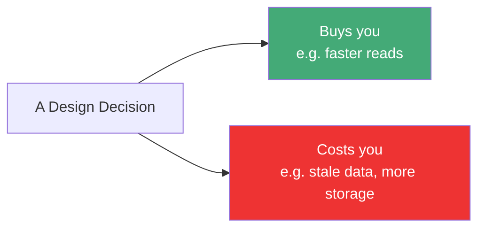
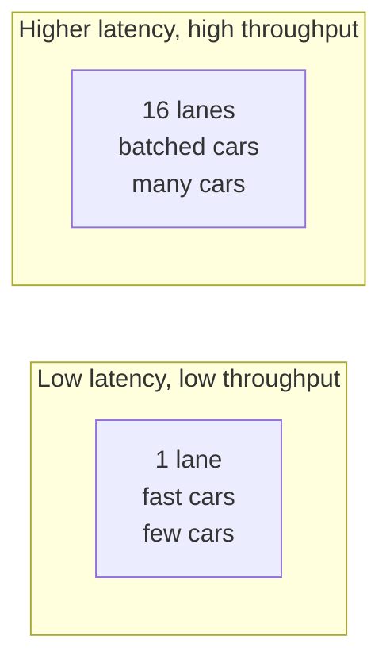
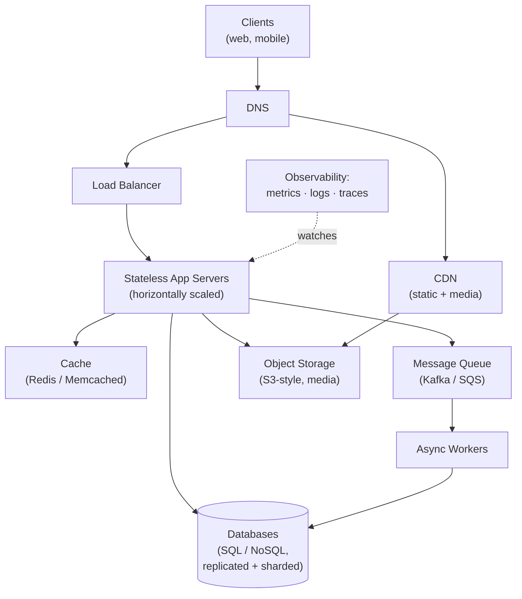
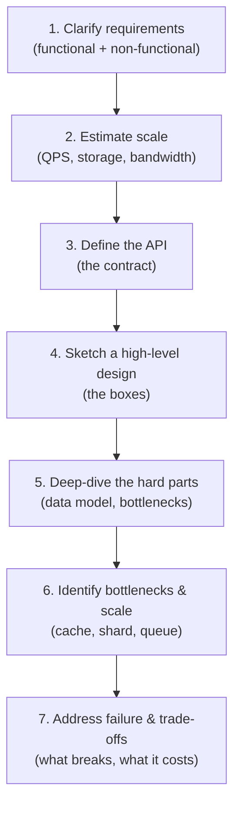
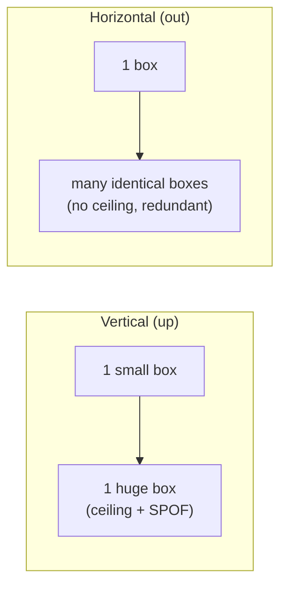

# System Design Deep Dive Series — Part 0: The Foundation — Thinking in Systems, Estimation, and Trade-offs

---

**Series:** System Design Deep Dive — From First Principles to Production Distributed Systems
**Part:** 0 of 11 (Foundation)
**Audience:** Engineers who can build a feature but freeze at "how would this handle 10 million users?"
**Reading time:** ~40 minutes

---

## Why This Part Exists

The rest of this series talks about sharding, quorum reads, consistent hashing, tail latency, and back-pressure. If those words feel like jargon you nod along to but couldn't defend in an interview, this part is for you.

This is not a catalog of technologies. You won't find "use Kafka for X, Cassandra for Y" here. Instead, this part builds the **mental model** that makes every later decision obvious:

- What system design actually is, and why there are no "correct" answers
- The physical numbers every engineer should have memorized (latency, throughput, storage)
- Back-of-the-envelope estimation — turning "10 million users" into servers, storage, and bandwidth
- The core vocabulary: latency vs throughput, availability, percentiles, SLA/SLO/SLI
- The single idea the whole field rotates around: **every decision is a trade-off**

Master this part and the rest of the series becomes a set of levers you already understand. Skip it and you'll memorize patterns without knowing when they apply.

Let's build the foundation.

---

## 1. What System Design Actually Is

Writing code is about correctness: given an input, produce the right output. System design is about everything *around* correctness — the constraints that only show up when many people use your software at once.

A single-user to-do app and Twitter both "store posts and show them." The code that stores one post is trivial. The difference is entirely in the non-functional requirements:

- Twitter must serve **hundreds of millions** of users
- A timeline must load in **under a few hundred milliseconds**
- The service must stay up when a data center **catches fire**
- It must not **lose** your posts
- It must do all of this **without spending infinite money**

**System design is the discipline of arranging components so that a system meets its non-functional requirements — scale, latency, availability, durability, and cost — under real-world failure.**

### Functional vs Non-Functional Requirements

Every design starts by separating these two:

| Type | Question it answers | Examples |
|------|--------------------|----------|
| **Functional** | *What* does the system do? | "Users can post tweets", "followers see them in a timeline" |
| **Non-functional** | *How well* must it do it? | "p99 latency < 200ms", "99.99% available", "handle 500K reads/sec" |

Beginners obsess over functional requirements. Senior engineers know the functional part is usually easy — the entire challenge lives in the non-functional constraints. When someone asks you to "design Instagram," they are really asking "how do you serve a billion image requests a day cheaply and reliably?"

### There Are No Correct Answers, Only Trade-offs

This is the single most important mindset shift. In an algorithms interview, binary search is objectively better than linear scan. In system design, there is no equivalent. Every choice buys you something and costs you something else:



Add a cache and reads get 50× faster — but now you can serve stale data and you've added a component that can fail. Shard your database and you scale writes infinitely — but cross-shard queries become painful and transactions get harder. **The job is not to eliminate downsides; it's to choose which downsides you can live with.**

Whenever this series recommends something, it will name the cost too. Train yourself to ask "and what does this cost me?" after every decision.

---

## 2. The Numbers Every Engineer Should Know

You cannot reason about performance without a sense of physical reality. These are the "latency numbers every programmer should know," rounded to memorable values. Internalize the *ratios*, not the exact digits.

| Operation | Time | Relative |
|---|---|---|
| L1 cache reference | 1 ns | — |
| Branch mispredict | 3 ns | 3× |
| L2 cache reference | 4 ns | 4× |
| Mutex lock/unlock | 17 ns | 17× |
| Main memory (RAM) reference | 100 ns | 100× |
| Compress 1 KB with Zippy | 2,000 ns (2 µs) | 2,000× |
| Read 1 MB sequentially from RAM | 3 µs | — |
| Send 1 KB over 1 Gbps network | 10 µs | — |
| Read 4 KB randomly from SSD | 150 µs | — |
| Read 1 MB sequentially from SSD | 1 ms | — |
| Round trip within same data center | 500 µs (0.5 ms) | — |
| Read 1 MB sequentially from disk (HDD) | 20 ms | — |
| Disk seek (HDD) | 10 ms | — |
| Round trip across the Atlantic | 150 ms | — |

### The Takeaways That Actually Matter

You don't need to recite this table. You need five conclusions burned into your intuition:

1. **Memory is ~100,000× faster than a disk seek.** This is *why caching exists* and why in-memory stores like Redis are transformative. (See the Redis series for the deep version of this.)
2. **SSD random reads are ~100× slower than RAM but ~100× faster than HDD seeks.** SSDs changed what databases can do.
3. **Sequential access crushes random access** at every level. Reading 1 MB sequentially from SSD (~1 ms) is far cheaper than 250 random 4 KB reads (~37 ms). This is why databases and Kafka store data in sorted, append-only, sequential layouts.
4. **A network round trip inside a data center (~0.5 ms) is cheap; across the world (~150 ms) is expensive.** Every cross-region hop is a tax. This is why we replicate data close to users.
5. **The speed of light is a hard limit.** Light travels ~300 km/ms in fiber (with routing overhead, effectively less). New York to London is ~5,500 km — physics alone forces ≥ ~28 ms one way, ~56 ms round trip, before any processing. No amount of engineering beats this; you can only avoid the round trip.

### Throughput Rules of Thumb

Latency is "how long one operation takes." Throughput is "how many per second." Rough single-machine ceilings on commodity hardware:

| Component | Rough throughput |
|---|---|
| Modern NIC | 10–100 Gbps |
| Single SSD | 500 MB/s – several GB/s |
| PostgreSQL (simple queries, one node) | thousands – tens of thousands/sec |
| Redis (single instance) | ~100K+ ops/sec |
| A well-tuned web server (per node) | thousands of req/sec |

These are order-of-magnitude anchors. When someone says "we need 2 million writes per second," you should immediately think: *that's not one Postgres box; that's a sharded or distributed store.*

---

## 3. Back-of-the-Envelope Estimation

Estimation is the skill that separates people who *design* systems from people who *guess*. The goal is not precision — it's getting within an order of magnitude fast, so you know whether you need one server or one thousand.

### The Method

1. Start from **users** (DAU — daily active users).
2. Convert to **requests** (actions per user per day).
3. Convert daily to **per-second** (÷ 86,400, then multiply by a peak factor).
4. Derive **storage** (bytes per item × items per day × retention).
5. Derive **bandwidth** (request size × requests per second).
6. Derive **memory** for caching the hot set.

Two constants worth memorizing:

- **Seconds in a day ≈ 86,400 ≈ 10⁵.** (Rounding to 100,000 keeps mental math easy.)
- **Peak traffic is often 2–3× the average.** Traffic is not uniform across the day.

### Worked Example: Designing a Twitter-like Service

Let's estimate from scratch. Assume:

- **300 million** daily active users (DAU)
- Each user reads their timeline **20 times/day**
- Each user posts **2 tweets/day** (writes are much rarer than reads — this is typical)
- Average tweet: **300 bytes** of text + metadata
- Store tweets for **5 years**

**Read QPS (queries per second):**

```
Timeline reads/day = 300M users × 20 = 6 billion reads/day
Average read QPS    = 6,000,000,000 / 100,000 ≈ 60,000 reads/sec
Peak read QPS       ≈ 60,000 × 3 ≈ 180,000 reads/sec
```

**Write QPS:**

```
Tweets/day    = 300M × 2 = 600 million writes/day
Average write = 600,000,000 / 100,000 ≈ 6,000 writes/sec
Peak write    ≈ 18,000 writes/sec
```

Immediately we've learned the most important fact about this system: **the read:write ratio is 10:1.** This is a *read-heavy* system, which tells us caching and read replicas will be central. (A different service — say, an IoT sensor ingestion pipeline — would be write-heavy, and the design would look completely different.)

**Storage:**

```
Tweets/day  = 600 million
Bytes/day   = 600M × 300 bytes ≈ 180 GB/day
Per year    = 180 GB × 365 ≈ 66 TB/year
Over 5 years ≈ 330 TB (text/metadata only)
```

330 TB of text is large but not exotic — this fits on a sharded cluster. But notice we ignored images and video. If 10% of tweets carry a 2 MB image:

```
Media/day = 60M images × 2 MB = 120 TB/day (!)
```

Media dwarfs text by ~600×. **Lesson: always ask what the *biggest* object is.** In most consumer systems, media/blob storage — not the "main" data — is the dominant cost, and it belongs in object storage (S3-style) behind a CDN, not in your database.

**Bandwidth (read side):**

```
Peak read QPS × avg response size
= 180,000 × 300 bytes (text only) ≈ 54 MB/s
```

Trivial for text. But if timelines embed images served through your servers, bandwidth explodes — another reason media goes through a CDN, not your app tier.

**Cache memory (hot set):**

A common heuristic: 20% of content drives 80% of traffic. Cache the hot 20% of a day's tweets:

```
Hot set = 20% × 180 GB ≈ 36 GB
```

36 GB fits comfortably in RAM across a small Redis cluster. This single number justifies an entire caching layer.

### What the Estimate Bought Us

In five minutes of arithmetic, without drawing a single box, we now know:

- It's **read-heavy (10:1)** → cache aggressively, use read replicas
- Peak is **~180K reads/sec** → far beyond one database → we'll shard and cache
- **Media dominates storage** → object storage + CDN, never the DB
- Hot set is **~36 GB** → a modest cache tier handles most reads

Every architectural decision that follows is now grounded in numbers instead of vibes. **Always estimate before you architect.**

---

## 4. The Core Vocabulary

These terms recur in every part of this series and every design interview. Precision here prevents confusion later.

### Latency vs Throughput

- **Latency:** how long a single operation takes (e.g., 50 ms per request).
- **Throughput:** how many operations complete per unit time (e.g., 100K requests/sec).

They are related but independent. A highway analogy: latency is how long *your* car takes to cross the bridge; throughput is how many cars cross per minute. Adding lanes (parallelism) increases throughput without changing one car's crossing time. A higher speed limit lowers latency. **You can improve one without the other, and optimizing for one can hurt the other** (batching improves throughput but adds latency).



### Percentiles: Why "Average" Lies

Never describe latency with an average. Averages hide the pain. Use **percentiles**:

- **p50 (median):** half of requests are faster than this.
- **p99:** 99% of requests are faster; 1% are slower.
- **p999:** the worst 0.1%.

Why this matters: imagine 99 requests at 10 ms and 1 request at 5,000 ms. The average is ~60 ms — sounds fine. But **1% of your users waited 5 seconds.** At scale, "1%" is millions of people, and a single page load often makes dozens of internal calls, so the *chance any one of them hits your p99* compounds. This is **tail latency**, and taming it is a recurring theme (Part 8).

> Rule: SLAs are written on tail latency (p99/p999), never on the mean.

### Availability: Counting the Nines

Availability is the percentage of time a system is up and serving correctly. It's measured in "nines":

| Availability | Downtime per year | Downtime per day |
|---|---|---|
| 99% ("two nines") | 3.65 days | 14.4 min |
| 99.9% ("three nines") | 8.77 hours | 1.44 min |
| 99.99% ("four nines") | 52.6 min | 8.6 sec |
| 99.999% ("five nines") | 5.26 min | 0.86 sec |

Each additional nine is roughly **10× harder and more expensive**. Five nines means your system can be fully down for only ~5 minutes *per year* — that demands multi-region redundancy, automated failover, and rigorous operational discipline. Most products target three or four nines; five nines is reserved for things like payment rails and telecom.

**Availability multiplies across dependencies.** If your service calls three others, each 99.9% available, and needs all of them:

```
0.999 × 0.999 × 0.999 ≈ 0.997 → only 99.7%
```

Your ceiling is *lower* than any single dependency. This is why reducing hard dependencies (and adding fallbacks) directly raises availability.

### SLA, SLO, SLI

Three related but distinct terms:

- **SLI (Indicator):** the actual measured metric, e.g. "p99 latency = 180 ms, success rate = 99.95%."
- **SLO (Objective):** the internal target, e.g. "p99 < 200 ms and success rate ≥ 99.9%."
- **SLA (Agreement):** the *external* contractual promise to customers, with penalties, e.g. "99.9% uptime or you get a refund."

Rule of thumb: **SLA is looser than SLO.** You promise customers 99.9% (SLA) but target 99.95% internally (SLO) so you have headroom before breaching the contract. We return to these in Part 9 with **error budgets**.

### Durability vs Availability

Two words beginners conflate:

- **Availability:** can I access the system *right now*?
- **Durability:** once the system accepted my data, will it *ever be lost*?

A system can be durable but unavailable (your data is safe on disk, but the server is rebooting) or available but not durable (it responds fast but loses writes on a crash). Object stores like S3 advertise "eleven nines of durability" (99.999999999%) — you effectively never lose an object — separately from their availability number.

---

## 5. The Building Blocks (A Map of the Series)

Before we go deep, here's the map. Almost every large system is assembled from the same ~10 primitives. Each later part of this series takes one and drills into it.



| Primitive | Job | Covered in |
|---|---|---|
| **Load balancer** | Spread requests across servers, hide failures | Part 1 |
| **Stateless app tier** | Do work; scale by adding identical boxes | Part 1 |
| **Database (SQL/NoSQL)** | Store data durably, query it | Part 2 |
| **Replication & sharding** | Scale reads and writes, survive node loss | Part 3 |
| **Cache & CDN** | Serve hot data fast, offload the origin | Part 4 |
| **Consistency model** | Decide how fresh/agreed data must be | Part 5 |
| **Message queue** | Decouple producers from consumers, absorb spikes | Part 6 |
| **API layer & gateway** | Define how clients talk to you | Part 7 |
| **Redundancy & failover** | Keep running through failure | Part 8 |
| **Observability** | Know what the system is doing | Part 9 |

If a system looks intimidating, decompose it into these blocks. There are fewer fundamental pieces than it appears.

---

## 6. A Framework for Approaching Any Design

Whether in an interview or a design doc, use the same repeatable structure. Flailing is the number one failure mode; a framework prevents it.



1. **Clarify requirements.** Never start drawing. Ask: Who uses this? What are the top 2–3 features? How many users? Read-heavy or write-heavy? What's the consistency/latency bar? Narrow the scope explicitly — "I'll focus on posting and reading the timeline; I'll skip DMs."
2. **Estimate scale.** Do the arithmetic from Section 3. This decides everything.
3. **Define the API.** A handful of endpoints (`postTweet(userId, text)`, `getTimeline(userId, page)`). This forces clarity on inputs, outputs, and data flow.
4. **High-level design.** Draw the boxes from Section 5 that you actually need. Show the request flow.
5. **Deep-dive the hard parts.** Data model, the one query that's hard, the one operation that's hot. This is where you show depth.
6. **Find bottlenecks and scale them.** "The DB can't take 180K reads/sec, so I add a cache and read replicas here."
7. **Discuss failure and trade-offs.** "If the cache dies, we get a thundering herd on the DB; here's how I'd mitigate it." Naming the weaknesses of your own design is what senior engineers do.

We'll apply this exact framework end-to-end in Part 11's case studies.

---

## 7. Scaling: Up vs Out (Preview)

One concept is worth planting now because it underlies everything: **the difference between scaling up and scaling out.**

- **Vertical scaling (up):** buy a bigger machine — more CPU, RAM, faster disk. Simple, no code changes, but there's a hard ceiling (the biggest box money can buy) and it's a single point of failure.
- **Horizontal scaling (out):** add more machines and spread load across them. Effectively unlimited, and redundant by nature — but requires your system to be **stateless** and introduces coordination problems (which this whole series is largely about solving).



The mantra of modern system design: **scale out, not up.** Cloud infrastructure, load balancers, and distributed databases all exist to make horizontal scaling practical. Part 1 goes deep on exactly how.

The catch that creates most of the difficulty in this series: the moment you have *more than one* machine holding state, you must answer hard questions — Which copy is authoritative? What if they disagree? What if one dies mid-write? That's the subject of Parts 3 and 5.

---

## 8. Common Beginner Mistakes

Patterns that signal inexperience in a design discussion — and what to do instead:

| Mistake | Why it's wrong | Do instead |
|---|---|---|
| Jumping to solutions before requirements | You solve the wrong problem | Clarify and estimate first |
| Designing for infinite scale on day one | Massive over-engineering, wasted cost | Design for ~10× current load; plan the *next* step |
| Treating the database as infinitely fast | The DB is almost always the first bottleneck | Estimate QPS; add cache/replicas early in your reasoning |
| Ignoring failure | Everything fails at scale | Assume every component can and will die |
| No numbers | "It'll be fine" is not a design | Always back claims with estimates |
| One perfect answer | There isn't one | Present options and their trade-offs |
| Forgetting the network | Cross-region calls cost 100+ ms | Keep chatty calls local; batch remote ones |

> The most senior-sounding sentence in any design discussion is: *"It depends — here's the trade-off."*

---

## 9. Summary and What's Next

The foundation you now have:

- **System design is about non-functional requirements** — scale, latency, availability, durability, cost — under failure.
- **There are no correct answers, only trade-offs.** Always ask "what does this cost me?"
- **Know the numbers.** Memory ≫ SSD ≫ disk; local network is cheap, cross-region is expensive; sequential beats random everywhere.
- **Estimate before you architect.** Users → requests → QPS → storage → bandwidth → cache. The read:write ratio and the biggest object drive the whole design.
- **Speak the vocabulary precisely:** latency vs throughput, percentiles and tail latency, nines of availability, SLA/SLO/SLI, durability vs availability.
- **Use the framework:** clarify → estimate → API → high-level → deep-dive → scale → failure.
- **Scale out, not up** — and everything hard about this series flows from having more than one machine.

Everything from here is a *lever*. Each part takes one primitive and shows you exactly what it buys and what it costs.

**Next up — Part 1: Scaling — Vertical, Horizontal, and Load Balancing.** We take that "add more identical boxes" idea and make it real: how load balancers distribute traffic, why statelessness is non-negotiable, the difference between L4 and L7 balancing, health checks, and the algorithms that decide which server gets your request.
