# System Design Deep Dive Series — Part 1: Scaling — Vertical, Horizontal, and Load Balancing

---

**Series:** System Design Deep Dive — From First Principles to Production Distributed Systems
**Part:** 1 of 11
**Prerequisite:** [Part 0 — The Foundation](system-design-deep-dive-part-0.md)
**Reading time:** ~40 minutes

---

## Why This Part Exists

In Part 0 we ended on a mantra: **scale out, not up.** This part turns that slogan into working machinery. By the end you'll understand exactly what happens between a user typing a URL and one of your hundred servers handling the request — and why that machinery is the backbone of every system in this series.

We'll cover:

- Vertical vs horizontal scaling, and the real reasons horizontal wins at scale
- Why **statelessness** is the non-negotiable prerequisite for scaling out
- What a load balancer actually is and does
- **L4 vs L7** load balancing — the single most-asked scaling distinction
- Load balancing **algorithms** and when each applies
- **Health checks**, and how load balancers hide dead servers
- Sticky sessions, connection draining, and the load balancer as a single point of failure (and how to fix that)
- Where DNS and Anycast fit in

Let's make scaling real.

---

## 1. The Starting Point: One Server

Every system begins as a single box. The app, the database, and maybe a cache all run on one machine. A user's request flows straight in:

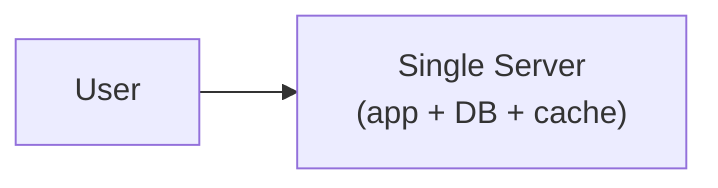

This is perfect for a prototype. It's also a machine with two fatal properties:

1. **It has a ceiling.** CPU, RAM, disk, and network are finite. When traffic exceeds what one box can do, you're stuck.
2. **It's a single point of failure (SPOF).** When it dies — and hardware always eventually dies — your entire product is down.

Scaling is the process of removing both properties. There are two directions to go.

---

## 2. Vertical Scaling (Scale Up)

**Vertical scaling** means making the single machine more powerful: more CPU cores, more RAM, faster NVMe disks, a bigger NIC. In the cloud it's a dropdown — change the instance from `4 vCPU / 16 GB` to `64 vCPU / 256 GB`.

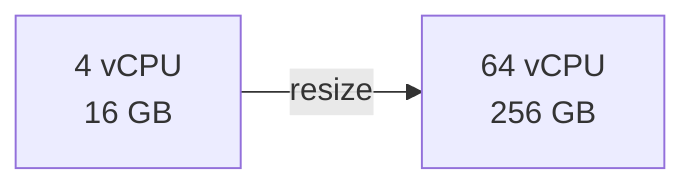

**Advantages:**

- **Dead simple.** No code changes. Your app doesn't even know it happened.
- **No distributed-systems problems.** One machine means one source of truth — no coordination, no consistency headaches.
- **Great for stateful components** that are hard to distribute, like a primary SQL database.

**Disadvantages:**

- **Hard ceiling.** There's a biggest machine money can buy. Once you're on it, you're done scaling up.
- **Cost is non-linear.** The top-end instance often costs far more than 2× the mid-tier one for 2× the resources. You pay a premium for the biggest box.
- **Still a single point of failure.** A 256 GB machine crashes just as completely as a 16 GB one. Bigger ≠ redundant.
- **Downtime to resize.** Resizing usually requires a reboot.

**When vertical scaling is right:** early on, and for components that resist distribution — most notably the write primary of a relational database. It's completely valid to scale a Postgres primary vertically for a long time before sharding. Don't distribute what you don't have to.

---

## 3. Horizontal Scaling (Scale Out)

**Horizontal scaling** means adding *more machines* and spreading the work across them.

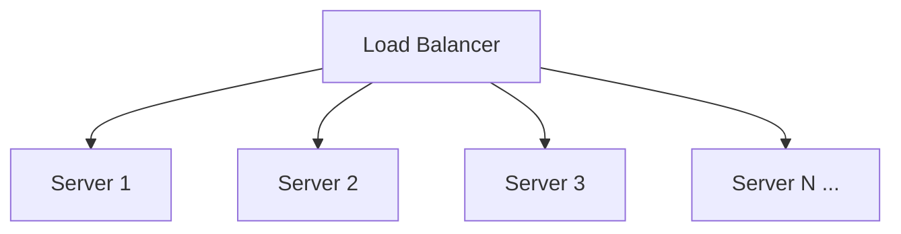

**Advantages:**

- **No real ceiling.** Need more capacity? Add more boxes. This is how systems reach millions of requests per second.
- **Redundancy is built in.** If one of ten servers dies, the other nine keep serving. This is the path to high availability.
- **Cost scales linearly** with commodity hardware — ten cheap boxes instead of one exotic one.
- **Elastic.** Add servers for a traffic spike (Black Friday), remove them after. (More in Part 8.)

**Disadvantages:**

- **Complexity.** You now need a load balancer and a way to keep servers identical.
- **State is a problem.** If a user's data lives on one specific server, the whole model breaks. This is the crux — see the next section.
- **Distributed-systems problems appear:** coordination, consistency, partial failure. Much of this series exists to solve them.

The industry consensus for the application tier: **scale out.** The application layer is *made* to be horizontally scaled — and the enabler is statelessness.

---

## 4. The Prerequisite: Statelessness

Here's the make-or-break idea. Horizontal scaling only works if **any server can handle any request.** That requires your app servers to be **stateless** — they hold no client-specific data between requests.

### The Problem With Stateful Servers

Suppose a user logs in and Server 1 stores their session in local memory. The load balancer sends their *next* request to Server 2, which has never heard of them. The user is mysteriously logged out. Worse, if Server 1 dies, every session on it vanishes.

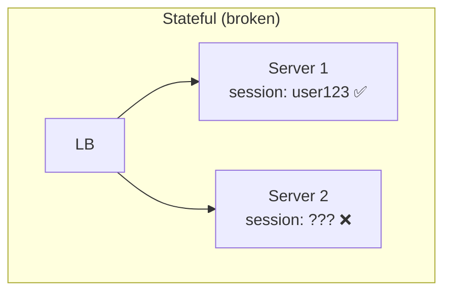

### The Fix: Externalize State

Move all shared state *out* of the app servers into a store they all share — a database, a distributed cache like Redis, or a token that carries its own state (a signed JWT).

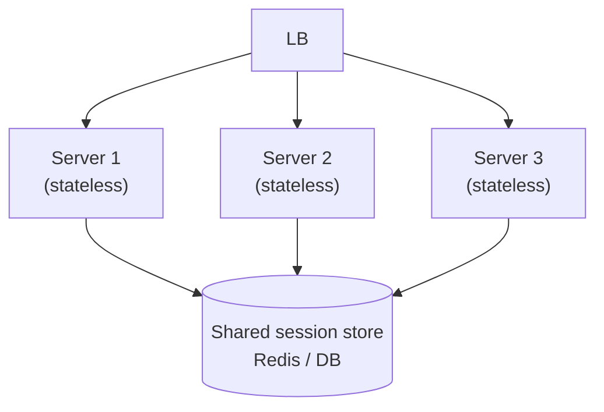

Now every server is interchangeable. Any of them can look up `user123`'s session from Redis. You can add, remove, or restart servers freely, and the load balancer can route a user's requests anywhere. **Stateless app tier + externalized state = the foundation of horizontal scaling.**

> This is why "the app tier is stateless, state lives in the data tier" is a mantra. It's not dogma — it's the property that makes everything else possible.

---

## 5. The Load Balancer

Once you have many identical servers, something must decide *which one* gets each request. That's the **load balancer (LB)**. It sits between clients and your server pool as the single entry point, and it does far more than round-robin:

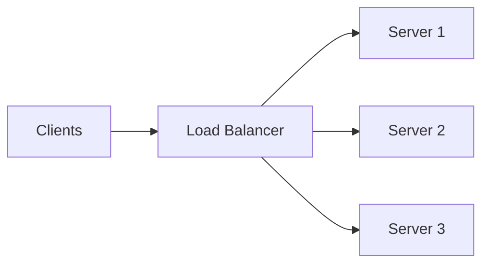

A load balancer's jobs:

1. **Distribute load** across healthy servers using some algorithm.
2. **Health-check** servers and stop sending traffic to dead ones (fault tolerance).
3. **Hide the fleet** behind one address, so clients don't know or care how many servers exist.
4. **Enable elasticity** — servers can be added/removed without clients noticing.
5. Often also: **terminate TLS**, do basic **rate limiting**, and route by path/host (L7).

Examples: hardware (F5), software (**NGINX**, **HAProxy**, **Envoy**), and cloud-managed (**AWS ELB/ALB/NLB**, GCP Cloud Load Balancing). Managed LBs are themselves horizontally scaled and highly available, which is why cloud users rarely build their own.

---

## 6. L4 vs L7 Load Balancing

This is the distinction interviewers love, and it maps directly to the OSI network model. A load balancer can operate at **Layer 4 (transport)** or **Layer 7 (application)**.

### Layer 4 (Transport Layer — TCP/UDP)

An **L4** load balancer routes based only on IP addresses and ports. It does *not* look inside the packets — it doesn't know about HTTP, URLs, cookies, or headers. It forwards TCP/UDP connections to backends, essentially as a very fast packet/connection router.

- **Pros:** extremely fast and cheap (minimal processing), protocol-agnostic (works for any TCP/UDP traffic, not just HTTP).
- **Cons:** can't make smart decisions — no routing by URL path, no per-request logic, can't inspect or modify HTTP.

### Layer 7 (Application Layer — HTTP/HTTPS)

An **L7** load balancer understands the application protocol (usually HTTP). It can read the URL, headers, cookies, and method, so it can make **content-aware** decisions:

- Route `/api/*` to the API fleet and `/images/*` to the media fleet.
- Route based on a cookie (sticky sessions), header, or hostname (virtual hosting).
- Terminate TLS, add/inspect headers, do path rewriting, compression, and request-level rate limiting.

- **Pros:** smart, flexible routing; the basis for API gateways and modern microservice routing.
- **Cons:** more work per request, so somewhat slower/more expensive than L4 (though modern L7 LBs are extremely fast).

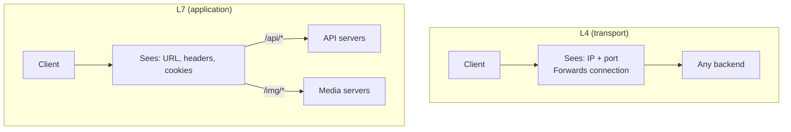

| | **L4** | **L7** |
|---|---|---|
| Operates on | IP + port (TCP/UDP) | HTTP request (URL, headers, cookies) |
| Routing decisions | Connection-level | Content-aware, per-request |
| Speed | Fastest | Fast, slightly more overhead |
| TLS termination | No (passes through) | Yes |
| Path/host routing | No | Yes |
| Typical use | Raw throughput, non-HTTP | Web apps, APIs, microservices |
| AWS example | NLB | ALB |

**Rule of thumb:** use **L7** for HTTP web apps and APIs (the common case — you want smart routing and TLS termination). Use **L4** when you need maximum throughput, non-HTTP protocols, or want to pass TLS through untouched.

---

## 7. Load Balancing Algorithms

How does the LB pick a server? The algorithm matters more than beginners expect.

### Round Robin

Cycle through servers in order: 1, 2, 3, 1, 2, 3… Simple and fair *when all servers and all requests are equal*.

- **Weakness:** ignores that some requests are heavy and some servers are busier. A server stuck on a slow request still gets its turn.
- **Variant — Weighted Round Robin:** give beefier servers a higher weight so they receive proportionally more traffic. Useful in heterogeneous fleets.

### Least Connections

Send the next request to the server with the **fewest active connections**. This adapts to reality: a server bogged down by long-lived requests naturally receives fewer new ones.

- **Best for:** requests with variable duration (e.g., some hit a slow query, some return instantly). Generally a better default than round robin for real workloads.
- **Variant — Least Response Time:** factor in measured latency too.

### IP Hash / Consistent Hashing

Hash a key (often the client IP, or a request attribute) to pick the server: `server = hash(clientIP) % N`. The same client consistently lands on the same server — a poor-man's session stickiness.

- **Weakness of plain `% N`:** when `N` changes (a server is added or removed), *almost every* key remaps to a different server. For caches, that means a near-total cache wipe.
- **The fix — consistent hashing:** map servers and keys onto a hash ring; adding/removing a server only remaps the keys in its arc (~`1/N` of them). This is foundational for distributed caches and sharded stores — we cover it in depth in **Part 3**.

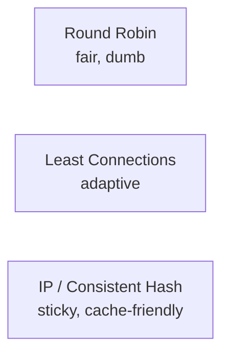

### Which to Choose

| Algorithm | Use when |
|---|---|
| Round robin | Servers equal, requests uniform, simplicity wins |
| Weighted round robin | Servers have different capacities |
| Least connections | Request durations vary (most real web traffic) — good default |
| Least response time | You want to chase tail latency and can measure it |
| Consistent hashing | You need the same key on the same node (caches, shards) |

---

## 8. Health Checks: Hiding Dead Servers

A load balancer's most underrated job is **not sending traffic to broken servers.** It continuously probes each backend:

- **Active health checks:** the LB periodically hits an endpoint like `GET /healthz` and expects `200 OK` within a timeout. Miss a few in a row → mark the server **unhealthy** and pull it from rotation. Pass again → put it back.
- **Passive health checks:** the LB watches real traffic; if a server starts returning errors or timing out, it's ejected.

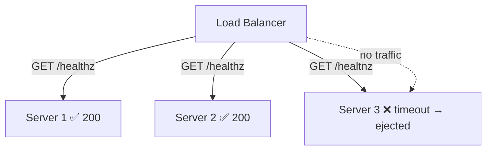

Design your health endpoint carefully:

- **Shallow check:** "is the process up?" (returns 200 if the server is running).
- **Deep check:** "can I actually serve — is the DB reachable, are dependencies OK?" More accurate, but dangerous: if a shared DB blips, *every* server fails its deep check simultaneously and the LB ejects your entire fleet, turning a minor issue into a total outage. A common practice is a shallow liveness check plus a smarter readiness check with hysteresis.

Health checks are what convert "we have redundancy" into "we actually survive a server death without human intervention." We build on this heavily in Part 8.

---

## 9. Sticky Sessions and Connection Draining

### Sticky Sessions (Session Affinity)

Sometimes you *want* a client pinned to one server — usually because that server holds session state locally. An L7 LB can do this with a cookie, or an L4 LB via IP hash.

**Use sparingly.** Stickiness reintroduces the statefulness we worked to eliminate: it unbalances load (a "sticky" server can get hot), and if that server dies, its users lose their sessions anyway. The better answer is almost always to externalize session state (Section 4) and keep servers stateless. Stickiness is a crutch, not a strategy.

### Connection Draining (Graceful Shutdown)

When you remove a server — a deploy, a scale-down — you don't want to kill in-flight requests. **Connection draining** tells the LB: "stop sending *new* requests to this server, but let existing requests finish (up to a timeout) before we take it down." This makes deploys and autoscaling invisible to users. Always enable it.

---

## 10. The Load Balancer Is a SPOF (and the Fix)

We added a load balancer to eliminate the single point of failure among app servers — but now the *load balancer itself* is a single point of failure. If it dies, nothing reaches the healthy servers behind it.

The fix is redundancy at the LB layer too:

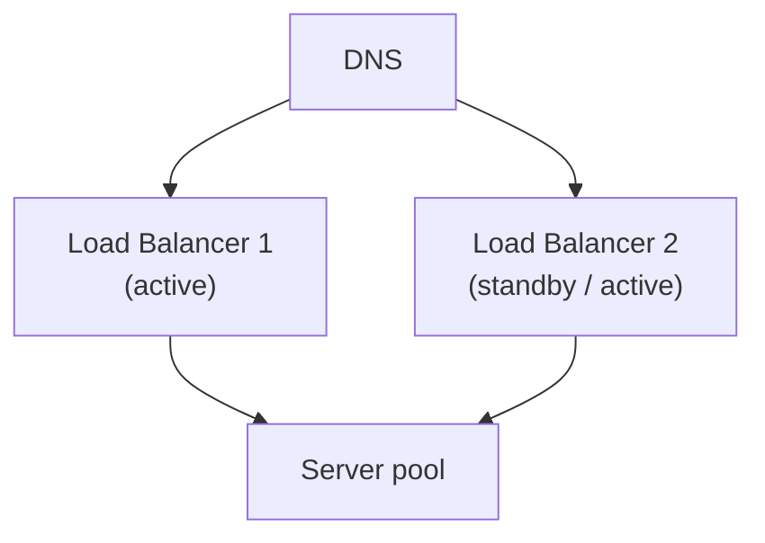

Common approaches:

- **Active-passive with a floating (virtual) IP:** two LBs share a virtual IP; if the active one fails, the standby takes over the IP (e.g., via keepalived/VRRP). Failover is fast and clients don't notice.
- **Active-active behind DNS/Anycast:** multiple LBs all serve traffic; DNS or Anycast routing spreads clients across them, and a dead one is simply routed around.
- **Managed cloud LBs** (ALB/NLB, Cloud LB) handle this internally — they're already redundant multi-node services, which is a big reason to use them rather than self-host.

The general principle, which recurs throughout Part 8: **every component in the critical path must be redundant, or it's a SPOF.** Removing one SPOF often reveals the next one.

---

## 11. Zooming Out: DNS, Anycast, and Global Scale

Load balancers spread traffic *within* a region. To scale *globally* and route users to the nearest data center, two more layers come into play before the LB:

- **DNS** turns `example.com` into an IP. **GeoDNS** returns *different* IPs based on the user's location, steering them toward the closest region. It's coarse (DNS is cached, changes propagate slowly) but it's the first hop of global routing.
- **Anycast:** the same IP is announced from many locations, and internet routing (BGP) delivers the user to the nearest one automatically. CDNs and large LBs use Anycast so that one address is served by dozens of edge locations. Failover is handled by the network itself.

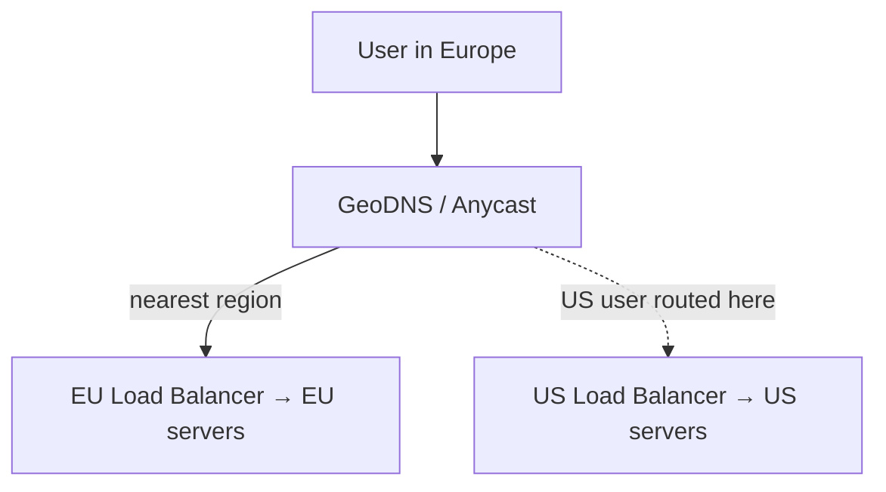

So the full picture of "how a request finds a server" is a hierarchy: **DNS/Anycast picks the region → the regional load balancer picks a healthy server → that stateless server handles the request, reading shared state from the data tier.** Global routing (multi-region) is explored more in Part 8.

---

## 12. Putting It Together

Here's the scalable web tier we've assembled in this part:

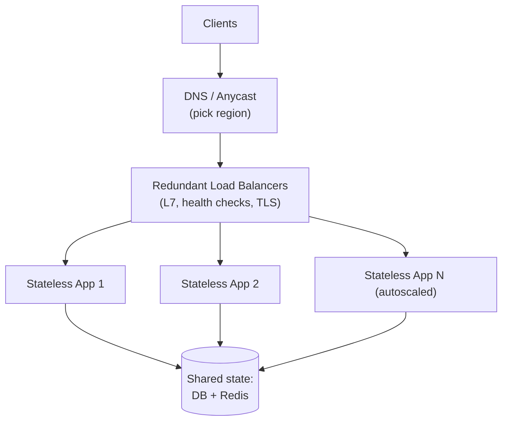

This tier can grow from 3 servers to 3,000 by changing one number, survive individual server deaths without human intervention, and deploy without dropping requests. That's the payoff of horizontal scaling done right.

But notice what we've quietly assumed: a **shared data tier** that all these servers hammer. We've scaled the *stateless* part beautifully and shoved all the hard problems into that one box labeled "DB." That box is now the bottleneck — and scaling *it* is much harder, because data has state, and state can't just be duplicated for free.

---

## 13. Summary and What's Next

- **Vertical scaling** (bigger box) is simple and right for stateful components early on, but has a ceiling, a cost premium, and remains a SPOF.
- **Horizontal scaling** (more boxes) has no ceiling and gives redundancy — it's the default for the app tier — but demands **statelessness** and introduces distributed-systems complexity.
- **Externalize state** (DB, Redis, tokens) so any server can serve any request. This is the enabler for everything.
- A **load balancer** distributes traffic, health-checks servers, hides the fleet, and enables elasticity.
- **L4** balances on IP/port (fast, dumb); **L7** balances on HTTP content (smart, TLS termination, path routing). Use L7 for web apps/APIs.
- Pick algorithms deliberately: **least connections** is a strong default; **consistent hashing** when the same key must hit the same node.
- **Health checks** turn redundancy into automatic fault tolerance — but avoid deep checks that can eject your whole fleet at once.
- Use **connection draining** for graceful deploys; avoid **sticky sessions** by staying stateless.
- The **LB itself must be redundant**, or you've just moved the SPOF. Removing one SPOF reveals the next.

**Next up — Part 2: Databases and Data Modeling — SQL vs NoSQL.** We turn to that "DB" box we kept leaning on. What does a relational database actually guarantee (ACID)? When do you reach for NoSQL, and which flavor? How do indexes work, and why does data modeling decide your performance long before any cache does? This is where the real scaling challenges begin.
