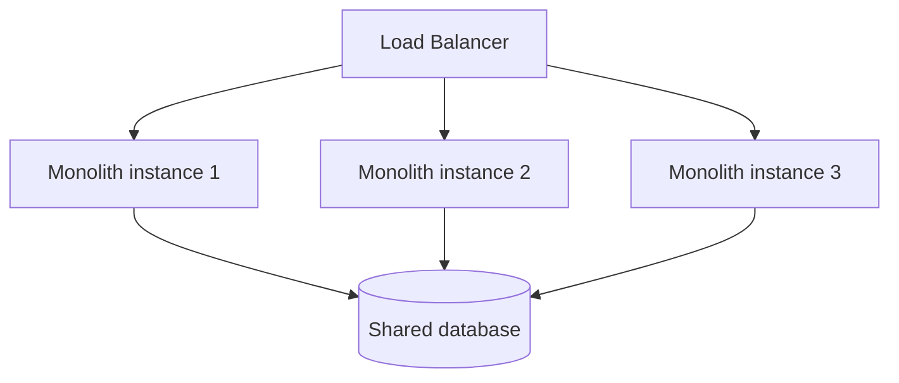
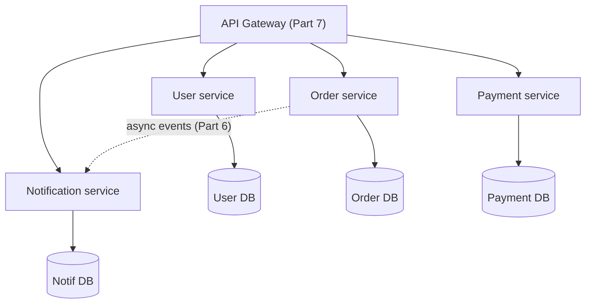
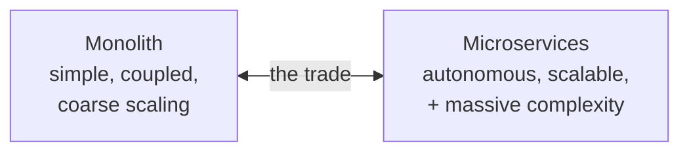
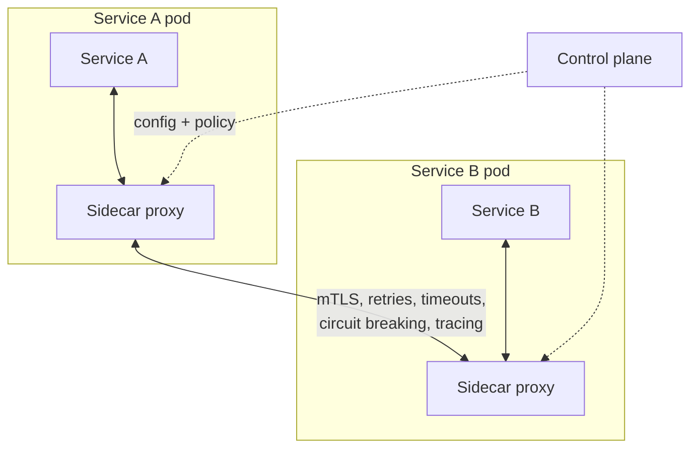
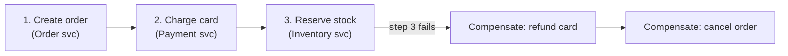
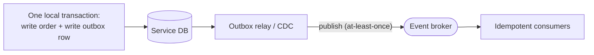

# System Design Deep Dive Series — Part 10: Monolith vs Microservices and the Service Mesh

---

**Series:** System Design Deep Dive — From First Principles to Production Distributed Systems
**Part:** 10 of 11
**Prerequisite:** [Part 9 — Observability and Operations](system-design-deep-dive-part-9.md)
**Reading time:** ~45 minutes

---

## Why This Part Exists

For several parts we've casually said "services" (plural) — a payment service, an order service, a notification service. This part confronts the assumption head-on: **should your system be many services at all?**

The monolith-vs-microservices debate is the most over-hyped and misunderstood decision in modern architecture. Microservices were sold as the way to build "at scale," and a generation of teams split their systems into dozens of services *before* they had the scale, the team size, or the operational maturity to justify it — inheriting every hard problem from Parts 5–9 (distributed consistency, messaging, resilience, observability) in exchange for benefits they didn't yet need.

This part gives you the honest trade-off. We'll define both architectures, work through the real (not hyped) pros and cons, cover **Conway's Law** and why org structure decides architecture, the operational tax microservices impose, how services **find and secure** each other (service discovery, service mesh), and the **distributed-data** problems (sagas, the dual-write problem) that splitting creates. The goal: know *when* to split, and — just as important — when not to.

---

## 1. The Monolith

A **monolithic** application is built and deployed as a **single unit**: all features (users, orders, payments, notifications) live in one codebase, run in one process (replicated behind a load balancer — Part 1), and typically share one database.

"Monolith" is often said with a sneer, undeservedly. Its advantages are real and substantial:

- **Simplicity.** One codebase, one build, one deploy, one thing to run locally. A new engineer is productive fast.
- **Easy, fast communication.** Modules call each other via **in-process function calls** — nanoseconds, no network, no serialization, no partial failure. All the distributed-systems pain of Parts 5–8 simply doesn't exist inside a monolith.
- **Simple transactions.** A single database means real **ACID transactions** across the whole operation (Part 2) — no sagas, no distributed transactions, no eventual-consistency workarounds.
- **Straightforward testing and debugging.** One process, one log stream, one stack trace end-to-end.

Its disadvantages appear **as it grows large** (not before):

- **Scaling is coarse.** You scale the *whole* app even if only one feature is hot — you can't scale just the payment logic; you replicate everything (wasteful, though often acceptable).
- **Tight coupling → slow, risky changes.** Over time modules entangle; a change in one corner can break another, and every change requires redeploying the *entire* app.
- **One tech stack**, and a bug in one module (a memory leak, a crash) can take down the *whole* process.
- **Team friction at scale.** Many engineers committing to one codebase and one deploy pipeline creates coordination overhead and release-train bottlenecks.

**Crucially:** most of these problems are problems of a *large* monolith with a *large* team. A small or mid-size app in a monolith is not suffering — it's being sensible.

---

## 2. Microservices

A **microservices** architecture decomposes the system into **many small, independent services**, each owning a specific business capability, each **independently deployable**, and — the important part — each owning **its own database**.

The advantages — when you're big enough to use them:

- **Independent deployment.** Teams ship their service on their own schedule without coordinating a giant release. This is the **number one real benefit** — it's about **team autonomy and velocity at scale**, more than technology.
- **Independent, granular scaling.** Scale only the hot service (10× the payment service during a sale, leave the rest). Efficient at large scale.
- **Fault isolation.** A crash in the notification service doesn't take down checkout — *if* you built the resilience from Part 8 (circuit breakers, timeouts, degradation). Isolation is possible, not automatic.
- **Technology flexibility.** Each service can use the language/database that fits it (polyglot — Part 2).
- **Team ownership.** Each team owns a service end to end, with a clear contract (Part 7) at the boundary.

The disadvantages are the entire rest of this series arriving as a **tax**:

- **Distributed-systems complexity.** In-process calls become **network calls** — latency, serialization, and **partial failure** everywhere. You now *need* everything from Parts 5–9: retries, circuit breakers, timeouts (Part 8), messaging (Part 6), and serious observability with distributed tracing (Part 9), just to stand still.
- **Data consistency is hard.** No cross-service ACID transaction (Part 2). "Create an order *and* charge the card *and* decrement inventory" now spans three databases — enter **sagas** and eventual consistency (Section 6).
- **Operational overhead.** Dozens of services to deploy, monitor, secure, and connect. You need mature CI/CD, orchestration (Kubernetes), and the observability stack from Part 9 *before* this is survivable.
- **Harder testing/debugging.** End-to-end flows cross many services; reproducing and tracing a bug is far harder (again, why Part 9 exists).
- **Network cost and latency.** A request that was function calls is now many network hops; careless decomposition multiplies latency.

---

## 3. Conway's Law: Architecture Mirrors the Org

You can't reason about this decision purely technically, because of **Conway's Law**:

> *"Organizations design systems that mirror their own communication structure."*

If you have one small team, you'll naturally build one cohesive system (a monolith) — and fighting that to build 20 microservices creates services that must constantly coordinate, giving you all the microservice pain with none of the autonomy benefit (a **distributed monolith** — the worst of both). If you have twenty autonomous teams, forcing them through one monolith and one release train creates a coordination bottleneck.

The modern reading (the **Inverse Conway Maneuver**): **structure your teams the way you want your architecture to look.** Microservices *pay off* when you have multiple teams that each need to own and ship a piece independently. The architecture decision is therefore inseparable from the **team/org** decision. Microservices are, at their core, a solution to a *people-scaling* problem as much as a machine-scaling one.

---

## 4. When to Choose Which

The pragmatic guidance, cutting through the hype:

**Start with a monolith (almost always) when:**

- You're a startup, small team, or early product still finding fit — you need to iterate fast and don't know the right service boundaries yet (drawing them wrong is expensive to fix).
- Your scale doesn't require independent scaling of parts.
- You lack the operational maturity (CI/CD, orchestration, observability — Part 9) that microservices *demand*.

For the vast majority of systems, **a well-structured monolith is the correct choice** — and it can go very far. Prefer a **modular monolith**: one deployable, but with clean internal module boundaries and separation, so you *could* extract services later along seams you've already discovered. This gives you monolith simplicity now and a migration path if you outgrow it.

**Move to (or toward) microservices when:**

- You have **multiple teams** stepping on each other in one codebase/release (Conway's Law — the deploy-coordination pain is real).
- Specific components have **genuinely different scaling** needs that coarse scaling wastes serious money on.
- Parts of the system need **independent technology** or must **fail in isolation** for hard requirements.
- You have the operational maturity to pay the tax.

> **The dominant expert advice: start monolith-first, extract services when you feel specific, concrete pain** — not preemptively. **"You don't earn microservices; you're sentenced to them."** Splitting a working monolith along seams you've learned is far safer than guessing boundaries up front. Don't adopt microservices for a résumé or a conference talk — adopt them to solve a problem you actually have.

---

## 5. Connecting Services: Discovery and the Service Mesh

Suppose you *are* at microservices scale. Two problems appear immediately: services must **find** each other, and the cross-cutting concerns from Part 8 (retries, timeouts, circuit breakers, mTLS) must exist between *every* pair of services.

### Service Discovery

In a dynamic environment, service instances come and go constantly (autoscaling, deploys, failures — Parts 1, 8, 9), so their IPs are not fixed. **Service discovery** lets a service find the current, healthy instances of another by *name* rather than a hardcoded address. A **service registry** (Consul, etcd, Kubernetes' built-in DNS/Services) tracks which instances are alive (via health checks — Part 1), and callers resolve "the payment service" to a live instance at call time. This is the internal, service-to-service analog of the DNS + load balancer from Part 1.

### The Service Mesh

Every service needs the same reliability logic between it and its dependencies: mTLS encryption, retries, timeouts, circuit breaking (Part 8), load balancing, and tracing (Part 9). Reimplementing all of that in every service, in every language, is wasteful and inconsistent. A **service mesh** (Istio, Linkerd) extracts it into the **infrastructure**.

The mechanism is the **sidecar proxy**: a lightweight proxy (e.g., Envoy) deployed *alongside* each service instance. All of a service's network traffic flows through its sidecar, and the sidecars form the **data plane** that transparently handles mTLS, retries, timeouts, circuit breaking, load balancing, and telemetry — **without the service code knowing.** A **control plane** configures all the sidecars centrally.

The payoff: the resilience patterns from Part 8 and the observability from Part 9 become **uniform, language-agnostic infrastructure** rather than per-service code. The cost: the mesh is significant operational complexity in its own right — another thing to run and understand. **A service mesh is justified at meaningful microservice scale; for a handful of services it's overkill** (libraries or the gateway suffice). Same lesson as everywhere: adopt it when the pain it solves exceeds the complexity it adds.

---

## 6. The Distributed-Data Problem

The hardest consequence of "each service owns its database" is that you **lose cross-service ACID transactions** (Part 2). A business operation spanning services — order + payment + inventory — can't be one atomic transaction across three databases. Two problems dominate.

### Sagas (managing multi-service transactions)

A **saga** breaks a distributed transaction into a **sequence of local transactions**, one per service, each publishing an event that triggers the next (Part 6). If a step fails, the saga runs **compensating transactions** that semantically undo the prior steps — because you can't "roll back" a committed local transaction, you *counteract* it.

Sagas come in two flavors: **choreography** (services react to each other's events, decentralized — simple but the flow is emergent and hard to follow, Part 6's EDA caution) and **orchestration** (a central coordinator directs the steps — clearer and easier to monitor, but a component to build). Either way, the system is only **eventually consistent** across services (Part 5), and you must design the user experience around states like "order pending payment."

### The Dual-Write Problem

A subtle, extremely common bug: a service needs to both **update its database** *and* **publish an event** (Part 6) — e.g., save the order *and* emit `OrderPlaced`. These are two separate systems with no shared transaction, so a crash *between* them leaves you inconsistent: DB updated but event never sent (downstream never learns), or event sent but DB write failed (downstream acts on a lie).

The robust fix is the **Transactional Outbox**: within the *same* local DB transaction, write the business row **and** an "outbox" row representing the event. Because it's one local transaction, both commit or neither does (atomic). A separate process then reads the outbox and publishes the events to the broker (at-least-once — so consumers must be **idempotent**, Part 6). This guarantees the event is published *if and only if* the data was committed. (Change-Data-Capture, e.g. Debezium tailing the DB log, is a common way to ship the outbox.)

These patterns are the price of distributed data. They're solvable — but every one of them is complexity you **don't** have in a monolith with one ACID database. That asymmetry is the whole reason "start with a monolith" is such durable advice.

---

## 7. Summary and What's Next

- A **monolith** is one deployable unit sharing one database: simple, fast in-process calls, real ACID transactions, easy to debug — with coarse scaling and coupling pain that appears only when it (and the team) grow *large*.
- **Microservices** are many independently deployable services, each with its own database: they buy **team autonomy**, independent/granular scaling, fault isolation, and tech flexibility — at the cost of **the entire distributed-systems tax** from Parts 5–9.
- **Conway's Law:** architecture mirrors org structure. Microservices solve a **people-scaling** problem as much as a machine one; match team structure to the architecture you want.
- **Default to a (modular) monolith.** Extract services when you feel concrete pain — multiple teams colliding, genuinely divergent scaling, hard isolation needs — *not* preemptively. "You don't earn microservices; you're sentenced to them."
- At scale, services find each other via **service discovery** (a registry of healthy instances), and a **service mesh** (sidecar proxies + control plane) makes Part 8's resilience and Part 9's observability **uniform infrastructure** — justified only at real scale.
- Splitting databases forfeits cross-service ACID: use **sagas** (local transactions + compensations, eventually consistent) for multi-service operations, and the **transactional outbox** to solve the **dual-write problem** — all complexity a monolith simply doesn't have.

**Next up — Part 11: Case Studies — URL Shortener, News Feed, Chat System.** Every pillar is now in your toolkit. The finale puts them together on the three classic interview problems, end to end: a **URL shortener** (key generation, read-heavy caching, the 301-vs-302 trick), a **news feed** (fan-out on write vs read, and the celebrity problem that breaks it), and a **chat system** (WebSockets, presence, message ordering and delivery). This is where estimation, databases, sharding, caching, consistency, messaging, APIs, reliability, and observability all show up in one design — the way a real interview, and a real system, demands.
