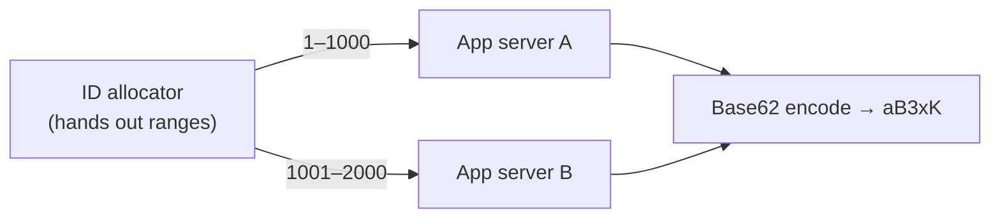
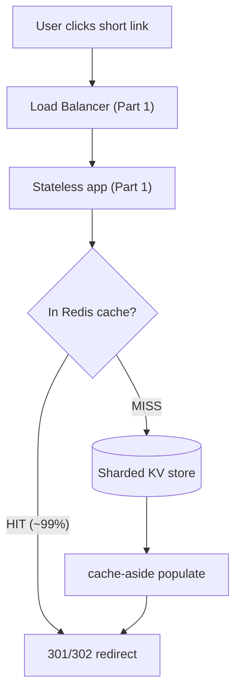
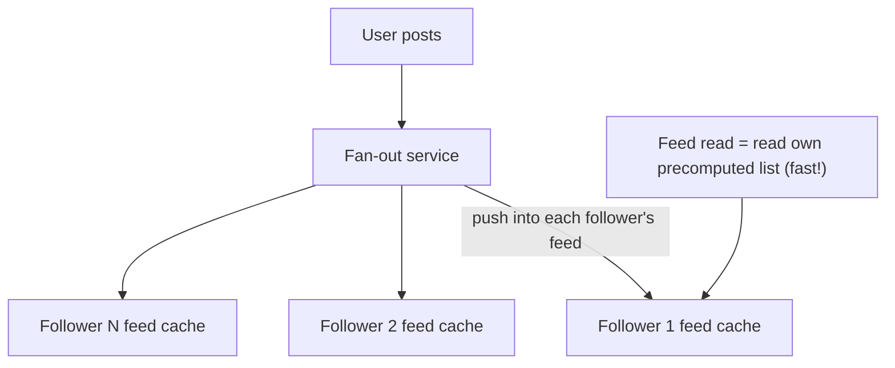
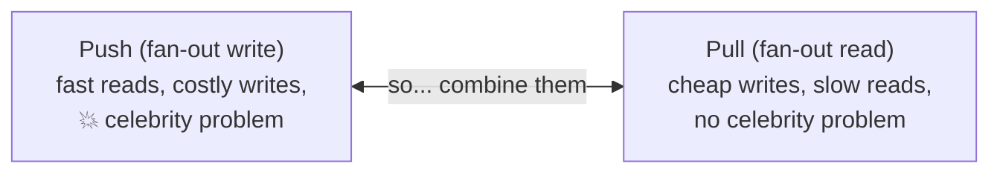
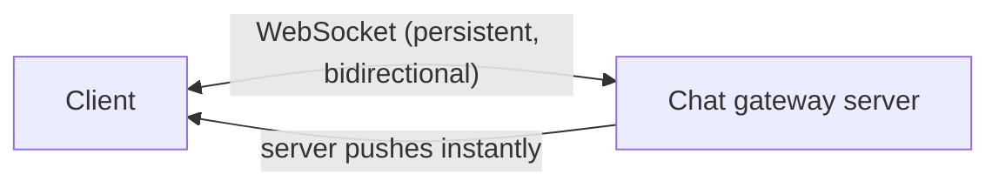
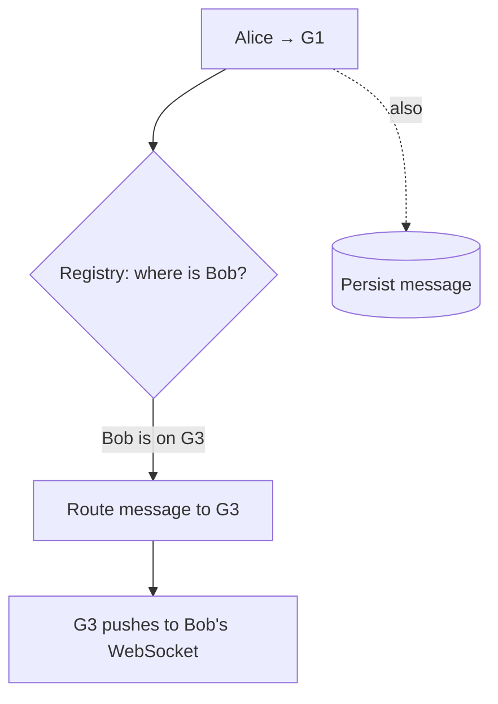
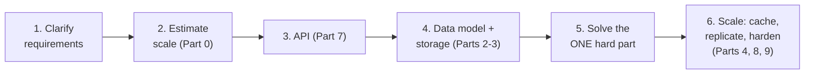

# System Design Deep Dive Series — Part 11: Case Studies — URL Shortener, News Feed, Chat System

---

**Series:** System Design Deep Dive — From First Principles to Production Distributed Systems
**Part:** 11 of 11
**Prerequisite:** [Part 10 — Monolith vs Microservices](system-design-deep-dive-part-10.md)
**Reading time:** ~55 minutes

---

## Why This Part Exists

Every pillar is now in your toolkit — estimation (Part 0), scaling and load balancing (Part 1), databases (Part 2), replication and sharding (Part 3), caching (Part 4), consistency (Part 5), messaging (Part 6), APIs (Part 7), reliability (Part 8), observability (Part 9), and service decomposition (Part 10). This finale assembles them, end to end, on the three problems that appear in nearly every system-design interview.

The goal isn't to memorize three designs — it's to watch the **method** in action. Each case study follows the same repeatable flow, which is exactly how to run a real interview:

1. **Clarify requirements** (functional + non-functional).
2. **Estimate** scale (Part 0) — this drives every later decision.
3. **Design the API** (Part 7).
4. **Design the data model and storage** (Parts 2–3).
5. **Address the hard part** unique to the problem.
6. **Scale it** — caching, replication, reliability (Parts 4, 8).

The three problems are chosen to stress different pillars: the URL shortener is **read-heavy and caching-driven**; the news feed is about the **fan-out** decision and the celebrity problem; chat is **real-time, stateful connections** and delivery. Let's design.

---

## Case Study 1: URL Shortener (TinyURL / bit.ly)

### 1.1 Requirements

**Functional:** given a long URL, return a short one (`short.ly/aB3xK`); visiting the short URL redirects to the original. Optionally: custom aliases, expiration, click analytics.

**Non-functional:** highly available (a dead shortener breaks every link ever created — links live for years), very **low-latency** redirects, and **massively read-heavy**. This last property shapes everything.

### 1.2 Estimation (Part 0)

Assume 100M new URLs/month and a **100:1 read:write ratio** (people click links far more than they create them):

- Writes: 100M / (30 × 86400) ≈ **~40 writes/sec**.
- Reads: ~40 × 100 = **~4,000 reads/sec** (peaks higher).
- Storage: 100M/month × 12 × 5 years ≈ 6B URLs; at ~500 bytes each ≈ **~3 TB** over 5 years.

The takeaways that drive the design: writes are trivial, **reads dominate** (→ cache hard, Part 4), and the data set is large but not enormous. This is a caching problem wearing a URL costume.

### 1.3 API (Part 7)

```
POST /urls          { "long_url": "..." }  → { "short_url": "short.ly/aB3xK" }
GET  /{short_code}                          → 301/302 redirect to long_url
```

### 1.4 The Core Problem: Generating the Short Code

The short code is a unique key rendered in **Base62** (`[a-zA-Z0-9]`, 62 chars). Length matters: 62⁷ ≈ 3.5 trillion combinations — 7 characters comfortably covers our 6B URLs. How do we generate unique codes?

- **Option A — Hash the URL** (e.g., MD5/SHA, take first 7 chars, Base62). Simple, but **collisions** are possible (two URLs → same prefix) and the same URL maps to the same code (may or may not be desired). Handle collisions by re-hashing with a salt — adds read-before-write complexity.
- **Option B — Counter + Base62 encode (preferred).** Keep a global incrementing counter; each new URL gets the next integer, encoded to Base62. **Guaranteed unique, no collisions, no lookup.** The challenge is a *distributed* counter (one counter is a SPOF and bottleneck, Part 1). Solve it exactly like a distributed ID: give each app server a **pre-allocated block** of IDs from a central allocator (e.g., server A owns 1–1000, B owns 1001–2000), so servers mint IDs locally and only rarely coordinate. (Snowflake-style IDs or ZooKeeper ranges are variants.)



### 1.5 Data Model and Storage (Parts 2–3)

The access pattern is a pure **key-value lookup**: given `short_code`, return `long_url`. No JOINs, no complex queries — a textbook **key-value / simple store** (Part 2). A single table `{ short_code (PK), long_url, created_at, expires_at }` in almost any store works; at 3 TB / 6B rows you'll eventually **shard by `short_code`** (Part 3) — and since lookups are always by that key, hash/consistent-hash sharding is perfect (no range queries needed). Reads never cross shards.

### 1.6 Scaling: This Is a Caching Problem (Part 4)

With 4,000+ reads/sec and heavy skew (a small fraction of links — the viral ones — get most clicks, classic locality from Part 4), **caching is the whole game**:



- **Cache-aside** (Part 4) on the `short_code → long_url` mapping in **Redis**. Since mappings are effectively **immutable** (a short code always points to the same URL), invalidation — caching's hard problem — largely *vanishes*. Cache with a long TTL and hit ratios approach 99%+, so the database barely sees read traffic.
- **CDN / edge** (Part 4): redirects can be served near the user for even lower latency.
- **Replication** (Part 3): read replicas and multi-AZ for availability (Part 8) — remember, downtime breaks *every* link.

### 1.7 The Interview-Favorite Detail: 301 vs 302

Which redirect status code (Part 7)?

- **301 Permanent:** browsers **cache** it, so subsequent clicks skip your server entirely — best performance and least load. **But** you lose click analytics (the browser won't call you again) and can never change the target.
- **302 Found (Temporary):** the browser calls your server **every time** — you keep full analytics and control, at the cost of more traffic.

**The trade-off is analytics/control vs load/latency.** Most shorteners choose **302** precisely because click tracking is the business. Naming this trade-off is a classic strong signal — it shows you understand HTTP caching interacts with product requirements.

---

## Case Study 2: News Feed (Twitter / Instagram / Facebook Feed)

### 2.1 Requirements

**Functional:** users follow others; a user's **feed** shows recent posts from everyone they follow, newest first; users can post. **Non-functional:** feed loads must be **fast** (it's the home screen — low latency is the product), highly available, and **read-heavy** (people scroll far more than they post). Slight staleness is acceptable (**eventual consistency** is fine, Part 5 — a post appearing a few seconds late harms no one).

### 2.2 Estimation (Part 0)

300M daily users, each opening the feed ~10×/day → ~3B feed reads/day ≈ **~35,000 reads/sec** (peaks much higher). Posts: perhaps 100M/day ≈ ~1,200 writes/sec. Again **read-heavy**, but the twist is the **fan-out**: one post by someone with millions of followers must reach millions of feeds. That asymmetry is the entire problem.

### 2.3 The Core Problem: Fan-Out (Push vs Pull)

Building a feed means combining posts from everyone a user follows. Two fundamental strategies — this is *the* news-feed design decision:

**Fan-out on write (push).** When a user posts, immediately **push** that post into the precomputed feed of *every* follower (stored in a cache, e.g., a Redis list per user).



- **Reads are extremely fast** — the feed is already assembled; just read one precomputed list. Since reads vastly outnumber writes, optimizing the read path is usually right.
- **Writes are expensive and amplified** — a post by someone with 1M followers = 1M cache writes. And it **breaks catastrophically for celebrities**: a user with 100M followers triggers 100M writes per post — the **celebrity/hot-key problem** from Parts 3–4, now the dominant failure mode.

**Fan-out on read (pull).** Store each user's posts in their own timeline. When a user opens their feed, **pull** recent posts from everyone they follow and merge on the fly.

- **Writes are cheap** — a post is one write, no amplification. **No celebrity problem** on write.
- **Reads are expensive** — every feed load queries N followees and merges/sorts, repeated for the huge read volume. Slow and costly at the read rates above.



### 2.4 The Real Answer: A Hybrid

Production systems (this is essentially how Twitter solved it) use a **hybrid**:

- Use **fan-out on write (push)** for normal users — the common case — so the overwhelming majority of feed reads are fast precomputed lookups.
- Use **fan-out on read (pull)** for **celebrities** — do *not* push their posts to millions of feeds. Instead, when any user opens their feed, take their precomputed push-based feed **and merge in** the latest posts from the (few) celebrities they follow, pulled at read time.

This confines the expensive path to the handful of accounts that actually break push, while keeping fast reads for everyone else. It's the direct, concrete payoff of understanding the celebrity/hot-key problem (Parts 3–4) — the hybrid *is* that understanding applied.

### 2.5 Data, Storage, and Scaling (Parts 2–4, 8)

- **Posts:** a write-heavy, time-ordered store — a natural fit for a **wide-column store** like Cassandra (Part 2), sharded by `user_id` (Part 3).
- **Social graph** (who follows whom): a **graph** problem (Part 2); at scale, often a dedicated graph service or a sharded adjacency store.
- **Precomputed feeds:** kept in a **cache** like Redis (Part 4) — lists of post IDs per user, capped to a few hundred entries (nobody scrolls 10,000 posts).
- **Pagination:** the feed uses **cursor-based pagination** (Part 7) — infinite scroll on live, large data demands keyset cursors, not offsets.
- **Media** (images/video): served via **CDN** (Part 4); the feed carries IDs/URLs, not blobs.
- **Delivery of the fan-out** itself runs through a **message queue** (Part 6) — a post drops a "fan out this post" job; workers do the amplified writes asynchronously so posting feels instant (and back-pressures gracefully under load).
- **Consistency:** eventual (Part 5) — the async fan-out means a new post reaches feeds within seconds, which is exactly the acceptable trade-off we identified up front.

---

## Case Study 3: Chat System (WhatsApp / Messenger / Slack)

### 3.1 Requirements

**Functional:** one-to-one messaging, **real-time** delivery, **online/last-seen presence**, delivery/read receipts, message history, and group chat. **Non-functional:** **low latency** (real-time is the whole point), reliable delivery (messages must not be lost), and correct **ordering** within a conversation. This case study stresses a pillar the others didn't: **stateful, persistent connections.**

### 3.2 The Core Problem: Real-Time Delivery Needs Persistent Connections

Standard request/response HTTP is **client-initiated** — the server can't push to the client, so the client would have to **poll** ("any new messages?") constantly: wasteful, and either laggy (poll rarely) or crushing (poll often). Chat needs the **server to push** to the client the instant a message arrives. The mechanism is a **persistent, bidirectional connection** — a **WebSocket** (or long-poll/SSE as fallbacks).



This breaks an assumption we've held since Part 1: our app tier was **stateless**, so any server could handle any request. Now each user holds an **open connection pinned to a specific gateway server** — that connection *is* state on the server. This changes the architecture, and handling it is the heart of the design.

### 3.3 Routing Messages Between Connected Users

If Alice (connected to gateway **G1**) sends a message to Bob (connected to gateway **G3**), G1 must get the message to G3 so it can push to Bob. G1 doesn't hold Bob's connection. So we need:

1. A **connection registry** (Part 10's service discovery idea, applied to users): a fast store — typically **Redis** (Part 4) — mapping `user_id → which gateway server holds their connection`. Alice's server looks up "Bob is on G3."
2. A way to route the message from G1 to G3: publish it (via the registry lookup, or a **pub/sub / message broker**, Part 6) to G3, which pushes it down Bob's socket.



### 3.4 The "Bob Is Offline" Problem — Reliable Delivery

If Bob isn't connected, we can't push. So **every message is persisted first** (write to the database), *then* delivered. When Bob reconnects, he **pulls** any messages he missed since his last-seen position. This is the reliability principle from Part 8: **persist, then deliver** — never rely on the network being cooperative, and never lose a message. Delivery/read receipts are themselves just small messages flowing back (Alice's client learns "delivered" when the message is stored, "read" when Bob's client acks).

### 3.5 Data Model and Storage (Parts 2–3)

- **Messages:** enormous write volume, time-ordered, queried by conversation — a **wide-column store** (Cassandra) sharded by `conversation_id` (Parts 2–3), so all of a conversation's messages co-locate and stay ordered on one shard. This mirrors the wide-column "messaging history" use case from Part 2.
- **Ordering** (Part 6): messages need a consistent order within a conversation. Use a per-conversation sequence number or timestamps (with care around clock skew — Part 5); keeping a conversation on one shard makes ordering tractable, exactly like Kafka's per-partition ordering (Part 6).
- **Presence:** who's online — fast-changing, ephemeral state, ideal for **Redis** (Part 4) with a TTL/heartbeat: clients send periodic heartbeats; a missed heartbeat expires the key and marks them offline. Presence is broadcast to a user's contacts via **pub/sub** (Part 6).

### 3.6 Scaling and Reliability (Parts 1, 8, 9)

- **Connection load balancing:** you still need an **L4 load balancer** (Part 1) to spread WebSocket connections across many gateway servers (millions of concurrent connections → many servers). Because connections are long-lived and stateful, this is where **sticky/stateful routing** legitimately appears (one of the rare right uses of stickiness from Part 1) — plus the registry (3.3) so any server can *find* any user regardless of which gateway holds them.
- **Horizontal scale:** add gateway servers for more connections; the registry + broker mean servers stay loosely coupled despite holding state.
- **Reliability (Part 8):** if a gateway dies, its users' clients **reconnect** (to another gateway via the LB), re-register, and pull missed messages — the persist-then-deliver design makes a server death a recoverable reconnect, not data loss. Multi-AZ, replicated message store, and graceful reconnect-with-backoff (Part 8) throughout.
- **Observability (Part 9):** connection counts, message-delivery latency (p99!), and undelivered-message backlogs are the key SLIs.

---

## Cross-Cutting: The Method Behind All Three

Step back and notice the **same method** produced all three designs — this is what to internalize:



And notice how the **read/write ratio and the one hard part** dictated each design:

| | Dominant property | The one hard part | Key pillars |
|---|---|---|---|
| **URL shortener** | extreme read-heavy | unique code gen + caching immutable data | KV store, cache (immutable → no invalidation), 301/302 |
| **News feed** | read-heavy + fan-out asymmetry | push vs pull + celebrity problem → hybrid | fan-out, cache, queue, hot-key |
| **Chat** | real-time + stateful connections | server push + reliable delivery + routing | WebSockets, registry, persist-then-deliver, ordering |

The lesson of the whole series in one line: **there is no "best" architecture — there are trade-offs, and good design is choosing the ones that fit *your* requirements.** Estimate first so you know what you're optimizing for; identify the single hardest constraint; reach for the pillar that addresses it; and be able to *defend the trade-off* you made against the one you rejected. That ability — not memorized diagrams — is what separates someone who can *build* a system from someone who can only *name* its parts.

---

## Series Conclusion

You started (Part 0) with one machine and a mantra — *scale out, not up* — and a way to reason with numbers instead of vibes. Across ten pillars you turned that into machinery: you scaled the stateless tier behind load balancers (1), chose and modeled data (2), split and copied it (3), served it fast from caches and the edge (4), reasoned rigorously about consistency and consensus (5), decoupled with messaging (6), presented clean API contracts (7), made it survive its own failures (8), made it observable and operable (9), and decided how to divide it into services (10). This finale (11) fused all of it on real problems.

The pillars are levers. Every one of them trades **cost, latency, consistency, and complexity** against each other, and every real system is a specific set of those trades chosen to fit specific requirements. Master the trade-offs — not the diagrams — and you can design a system for *any* requirement someone throws at you, in an interview or in production.

That's the whole game. Now go build something that scales.
