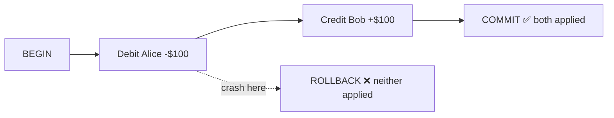
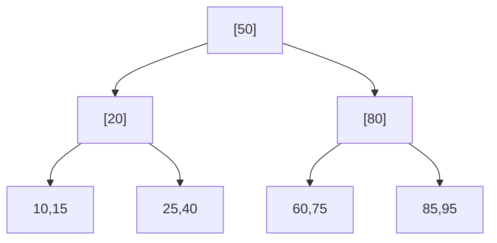
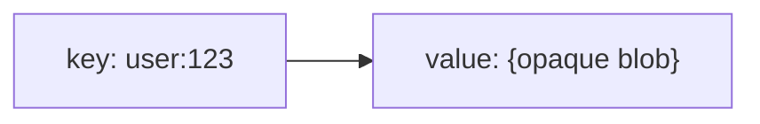
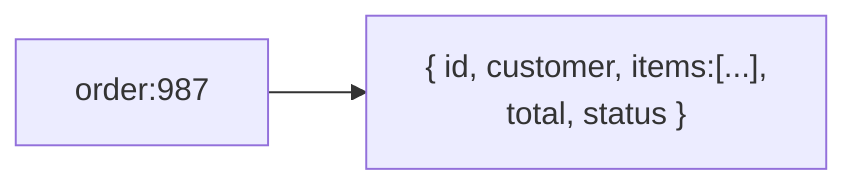
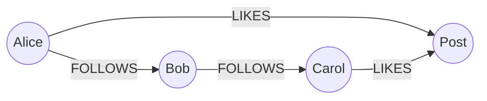
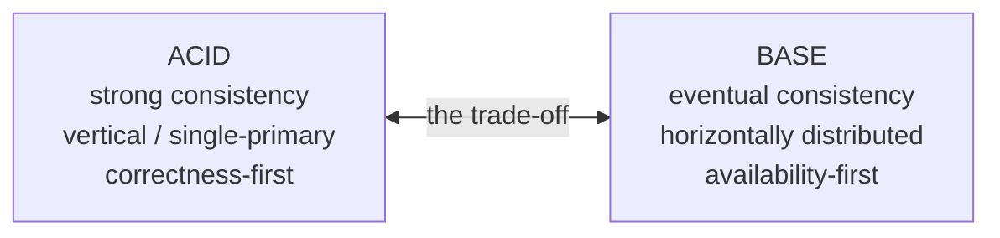
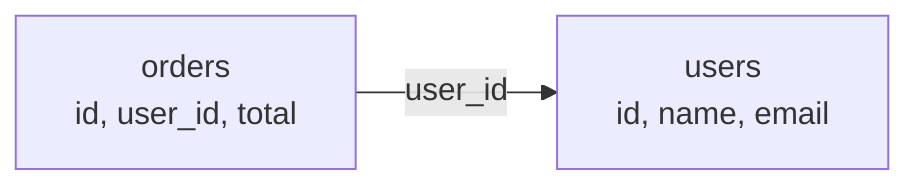
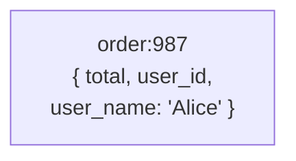
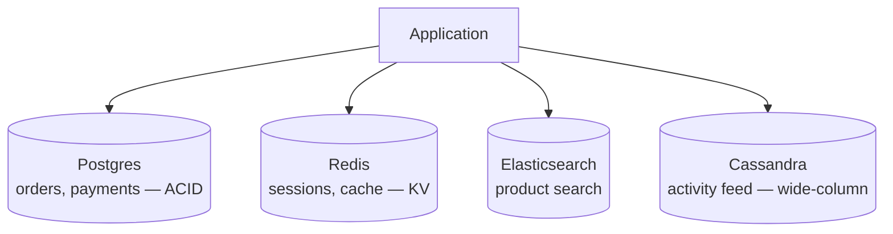

# System Design Deep Dive Series — Part 2: Databases and Data Modeling — SQL vs NoSQL

---

**Series:** System Design Deep Dive — From First Principles to Production Distributed Systems
**Part:** 2 of 11
**Prerequisite:** [Part 1 — Scaling and Load Balancing](system-design-deep-dive-part-1.md)
**Reading time:** ~45 minutes

---

## Why This Part Exists

At the end of Part 1 we scaled the stateless app tier to thousands of servers — and then pointed at a single box labeled "DB" and admitted that's where all the hard problems now live. This part is about that box.

The database is the most consequential choice in most systems. Get it right and everything above it gets easier. Get it wrong and you'll fight it for the life of the product. We'll cover:

- What a relational database actually guarantees: **ACID**, transactions, and why they matter
- How **indexes** work (B-trees) and why they decide your performance
- The **NoSQL** family — key-value, document, wide-column, graph — and what each is *for*
- **BASE** vs ACID, and the honest trade-off
- **Normalization vs denormalization**, and why "model for your queries" beats "model for purity" at scale
- How to actually choose, and why "SQL vs NoSQL" is the wrong framing

This part is about the data itself. *Scaling* the data across many machines (replication and sharding) is Part 3 — but you can't scale a data model you chose badly, so we start here.

---

## 1. What a Database Is Really For

A database does three things a plain file cannot do well:

1. **Persist** data durably (survives crashes and restarts).
2. **Query** data efficiently (find the 3 rows you need out of 300 million).
3. **Coordinate** concurrent access safely (a thousand users reading and writing at once without corrupting each other's data).

Everything about database design is a trade-off among those three, plus the two we care about in this series: **how fast** (latency/throughput) and **how far it scales** (one box vs a thousand). The relational model was the default answer for 40 years. NoSQL emerged when web-scale broke some of its assumptions. Let's understand the default first.

---

## 2. The Relational Model and ACID

A **relational database** (SQL) stores data as **tables** of rows and columns, with a rigid **schema** (every row in a table has the same columns and types), and relationships expressed by **foreign keys**. You query it with SQL. Examples: PostgreSQL, MySQL, SQL Server, Oracle.

Its superpower is **ACID transactions** — a set of guarantees that let you treat a group of operations as one indivisible unit. ACID is the single most important acronym for understanding what SQL gives you.

### A — Atomicity

A transaction is **all-or-nothing.** If you transfer $100 from Alice to Bob, both the debit and the credit happen, or *neither* does. There's no state where the money left Alice but never reached Bob, even if the server crashes mid-transaction.

### C — Consistency

A transaction moves the database from one **valid state to another**, never violating its rules (constraints, foreign keys, uniqueness). If a rule says account balances can't go negative, no committed transaction can leave one negative. (Note: this "C" is about database integrity rules — it is *not* the same "consistency" as in CAP theorem, which we untangle in Part 5. Same word, different meaning — a classic source of confusion.)

### I — Isolation

Concurrent transactions don't step on each other. The database makes it *look as if* transactions ran one at a time, even though they run in parallel. Without isolation you get anomalies:

- **Dirty read:** reading another transaction's uncommitted changes.
- **Non-repeatable read:** reading a row twice in one transaction and getting different values.
- **Phantom read:** a query returns different *rows* when re-run because another transaction inserted/deleted.

Databases offer **isolation levels** that trade correctness for concurrency:

| Isolation level | Prevents | Cost |
|---|---|---|
| Read Uncommitted | (almost nothing) | fastest, dangerous |
| Read Committed | dirty reads | common default (Postgres) |
| Repeatable Read | + non-repeatable reads | more locking/versioning |
| Serializable | + phantoms; fully isolated | strongest, slowest |

Knowing that isolation is a *dial*, not a binary, is a strong signal in interviews. The default is usually Read Committed, and you raise it only where correctness demands.

### D — Durability

Once a transaction **commits**, it survives crashes — it's written to non-volatile storage (typically via a write-ahead log, WAL, flushed to disk). A committed order doesn't vanish because the power blinked.

**Why ACID matters:** for anything involving money, inventory, bookings, or any invariant that must never be violated, ACID is the difference between a correct system and a subtly broken one. When someone says "just use Postgres," they mean: you get these four guarantees for free, and they're incredibly hard to rebuild yourself.

---

## 3. Indexes: Why Queries Are Fast (or Not)

A table with 300 million rows and no index means the database must scan *every row* to answer a query — a **full table scan**, O(n). Indexes turn that into roughly O(log n). Understanding indexes is understanding database performance.

### The B-Tree

Most relational indexes are **B-trees** (specifically B+ trees). Think of a sorted, balanced tree that lets the database binary-search to a value instead of scanning. A lookup on 300M rows touches maybe 4-5 nodes instead of 300M rows.

An index is a separate sorted structure that maps a column's value → the row's location. Create an index on `email` and `WHERE email = ?` becomes a fast tree lookup instead of a scan.

### What Indexes Cost

Indexes aren't free:

- **Write cost:** every insert/update/delete must also update every affected index. More indexes = slower writes.
- **Storage cost:** indexes take disk space, sometimes a lot.
- **They only help matching queries.** An index on `email` does nothing for `WHERE last_name = ?`.

### Practical Index Knowledge

- **Primary key** is automatically indexed (it's the main B-tree the row lives in for clustered indexes).
- **Composite index** on `(a, b)` can serve queries on `a` and on `a, b` — but *not* on `b` alone (leftmost-prefix rule). Column order matters.
- **Covering index:** if an index contains *all* columns a query needs, the DB answers from the index alone without touching the table — very fast.
- **Cardinality matters:** indexing a low-cardinality column (like a boolean) is often useless; the DB may prefer a scan.

The takeaway: **you model your indexes to match your query patterns.** A query that isn't backed by an index is a scan waiting to become a production incident once the table grows. Look at the **query plan** (`EXPLAIN`) — it tells you whether you're getting an index seek or a scan.

---

## 4. Where SQL Struggles at Scale

Relational databases are excellent, but two things get hard at web scale:

1. **Horizontal write scaling.** A single primary handles all writes. You can add read replicas (Part 3), but scaling *writes* means sharding — splitting data across machines — which breaks the easy JOINs and cross-row transactions that made SQL pleasant. Relational databases weren't originally designed to be split across a thousand machines.
2. **Rigid schema + JOIN cost.** A fixed schema is a feature for integrity but a friction for fast-evolving data. And JOINs across huge tables, especially once sharded, get expensive.

NoSQL databases emerged to trade *away* some relational guarantees in exchange for **horizontal scalability, flexible schemas, and specific access-pattern performance.** They aren't "SQL but newer" — they're a family of specialized tools.

---

## 5. The NoSQL Family

"NoSQL" is an umbrella over four quite different data models. Knowing which is which — and what each is *for* — is essential.

### 5.1 Key-Value Stores

The simplest model: a giant distributed hash map. You `PUT(key, value)` and `GET(key)`. The value is opaque to the database — it doesn't look inside. Examples: **Redis**, **DynamoDB** (in KV mode), **Memcached**, Riak.

- **Superpower:** extremely fast, simple, and easy to partition (hash the key → pick a node). O(1) lookups.
- **Limitation:** you can only fetch by key. No rich queries, no "find all values where X."
- **Use for:** caching (Part 4), session stores, user preferences, feature flags, rate-limit counters — anything you look up by a known key.

### 5.2 Document Stores

Store semi-structured **documents** (usually JSON/BSON), each identified by a key, and — unlike pure KV — the database *can* index and query *inside* the document. Examples: **MongoDB**, **Couchbase**, DynamoDB (document mode), Firestore.

- **Superpower:** flexible schema (documents in a collection can differ), and you can store a whole aggregate (an order *with* its line items) as one document — no JOIN needed to load it.
- **Limitation:** cross-document JOINs and multi-document transactions are limited or costly (though modern engines have added some). You denormalize instead.
- **Use for:** content management, catalogs, user profiles, anything naturally shaped like nested objects and read as a unit.

### 5.3 Wide-Column Stores

Data is organized by **row key** into **column families**; each row can have billions of columns, and the physical layout is optimized for writing and reading huge volumes by key and column range. Examples: **Cassandra**, **HBase**, **ScyllaDB**, Bigtable.

- **Superpower:** massive write throughput and linear horizontal scale across many nodes; designed from day one to be distributed with no single primary (Cassandra is masterless — Part 5).
- **Limitation:** you must design tables around your queries *up front* (query-first modeling); ad-hoc queries and JOINs aren't the model.
- **Use for:** time-series, event logging, IoT/sensor data, messaging history, feeds — write-heavy workloads at enormous scale.

### 5.4 Graph Databases

Store **nodes** and **edges** (relationships) as first-class citizens, optimized for traversing connections. Examples: **Neo4j**, Amazon Neptune, JanusGraph.

- **Superpower:** queries like "friends of friends who like X" or "shortest path" that would be a nightmare of recursive JOINs in SQL are natural and fast here.
- **Limitation:** specialized; not a general-purpose primary store for most apps.
- **Use for:** social networks, recommendation engines, fraud detection, knowledge graphs — anything where the *relationships* are the point.

### The Family at a Glance

| Model | Query by | Best for | Examples |
|---|---|---|---|
| Key-Value | key only | caching, sessions, counters | Redis, DynamoDB, Memcached |
| Document | key + fields inside doc | profiles, catalogs, CMS | MongoDB, Couchbase |
| Wide-Column | row key + column range | time-series, logs, feeds, huge writes | Cassandra, HBase |
| Graph | traversals | social, recommendations, fraud | Neo4j, Neptune |

---

## 6. ACID vs BASE

If ACID is the promise of relational systems, **BASE** is the honest description of many distributed NoSQL systems that chose scale and availability over strict consistency.

- **B**asically **A**vailable — the system stays available even during failures.
- **S**oft state — the state may be in flux (replicas not yet agreed).
- **E**ventual consistency — given enough time without new writes, all replicas converge to the same value. You may read slightly stale data in the meantime.

This isn't NoSQL = BASE and SQL = ACID, cleanly. It's a **spectrum**, and modern systems blur it (DynamoDB offers strongly-consistent reads; Postgres can be run across regions with eventual replicas; "NewSQL" systems like Spanner and CockroachDB give ACID *and* horizontal scale via clever consensus — Part 5). But the mental model holds: **you are trading how strongly consistent your reads are against how available and scalable the system is.** Part 5 (CAP/PACELC) makes this trade-off rigorous. For now, the key insight:

> Choose ACID when correctness of every read matters (money, inventory). Accept eventual consistency (BASE) when availability and scale matter more and slightly stale reads are tolerable (a like count, a feed, a cached profile).

---

## 7. Data Modeling: Normalization vs Denormalization

The database *engine* matters less than how you *model* the data in it. This is where systems are won or lost, and it's the same core tension in SQL and NoSQL.

### Normalization (store each fact once)

**Normalization** means organizing data so each fact lives in exactly one place, with relationships expressed by foreign keys. A user's name is stored once in the `users` table; orders reference the user by `user_id`.

- **Pros:** no duplication, so no update anomalies (change the name in one place). Data integrity is easy. Storage-efficient.
- **Cons:** reading a full picture requires **JOINs** across tables, which get expensive at scale — and JOINs across shards are especially painful (Part 3).

Normalization is the relational default and it's excellent for **write-heavy, integrity-critical** data.

### Denormalization (store data the way you read it)

**Denormalization** means deliberately duplicating data so a read needs no JOIN. Store the user's name *inside* each order document, so loading an order gives you everything in one fetch.

- **Pros:** reads are fast — one fetch, no JOIN. This is how you serve reads at massive scale.
- **Cons:** duplication. If Alice changes her name, you must update it in many places (or accept staleness). Writes become more complex; storage grows.

### The Real Principle: Model for Your Queries

In relational systems you often normalize first, then denormalize the hot paths for performance. In NoSQL — especially document and wide-column — you **model query-first from the start**: you look at exactly which queries you must serve fast, and you shape the data (often heavily denormalized) so each query is a single efficient lookup by key.

> **The design question is not "what does my data look like?" — it's "what queries must I serve, and how do I make each one cheap?"** Read-heavy systems denormalize toward the read path. Write-heavy, integrity-critical systems normalize. Most real systems do both, in different places.

This is why "SQL vs NoSQL" is the wrong question. The right questions are: *What are my access patterns? What's my read/write ratio? What consistency do I actually need? Where do I need to scale?* The data model follows from those answers.

---

## 8. How to Actually Choose

A pragmatic decision guide:

**Reach for relational (SQL) when:**

- You need ACID transactions and strong consistency (payments, orders, bookings, ledgers).
- Your data is well-structured with clear relationships.
- You need flexible ad-hoc queries and JOINs (analytics, admin, reporting).
- You're not yet at a scale that forces sharding — which is *most* systems. **Postgres/MySQL on a single well-provisioned primary handles enormous load.** Default here; earn your way to NoSQL.

**Reach for NoSQL when:**

- **Key-value:** you need blazing-fast lookups by a known key (cache, session, counters).
- **Document:** your data is naturally nested aggregates read as a unit, and schema flexibility helps (profiles, catalogs, CMS).
- **Wide-column:** you have write-heavy, massive-scale, time-ordered data with known query patterns (logs, time-series, feeds).
- **Graph:** relationships and traversals are the core of the problem (social, recommendations, fraud).
- Broadly: you need **horizontal write scale** or **flexible schema** more than you need JOINs and multi-row transactions.

**And the mature answer: polyglot persistence.** Real systems use *multiple* databases, each for what it's best at. An e-commerce platform might run Postgres for orders and payments (ACID), Redis for sessions and cart caching (KV), Elasticsearch for product search, and Cassandra for the activity feed. The database is not one decision — it's one decision *per data domain and access pattern*.

---

## 9. A Note on NewSQL

A quick flag so the picture is complete: **NewSQL** systems (Google Spanner, CockroachDB, YugabyteDB, TiDB) aim to give you *both* — ACID transactions and SQL *and* horizontal scale across many nodes — by using consensus protocols under the hood. They break the old assumption that "ACID means single-box." They aren't magic (they add latency for cross-node coordination, and geo-distributed transactions are costly), but they're increasingly the answer when you genuinely need relational guarantees at a scale that used to force NoSQL. We'll see *how* they pull this off in Part 5 (consensus).

---

## 10. Summary and What's Next

- A database's job is to **persist, query, and coordinate** — every design choice trades among those plus latency and scalability.
- **ACID** (Atomicity, Consistency, Isolation, Durability) is what relational databases give you: correctness for money, inventory, and invariants. **Isolation levels** are a dial, not a binary.
- **Indexes** (B-trees) turn scans into fast lookups; they cost write speed and storage, and they only help queries they match. Model indexes to your queries; read the query plan.
- **NoSQL** is a family: **key-value** (lookups by key), **document** (nested aggregates), **wide-column** (write-heavy scale), **graph** (relationships). Each is a specialized tool, not a general SQL replacement.
- **ACID vs BASE** is a spectrum trading read-consistency against availability/scale. Choose per data domain.
- **Data modeling** is the real lever: **normalize** for integrity and writes, **denormalize** for read speed at scale. Model for your *queries*, not for purity.
- The right question is never "SQL or NoSQL?" — it's "what are my access patterns, read/write ratio, consistency needs, and scale?" Real systems are **polyglot**.

**Next up — Part 3: Replication and Sharding — Scaling the Data Layer.** We've chosen a data model, but it still lives on one box — the bottleneck and SPOF we've been dodging since Part 1. Now we split and copy it: **replication** (copies for availability and read scale — leader/follower, sync vs async, replication lag) and **sharding** (partitioning writes across machines — hash vs range, the resharding problem, and consistent hashing done properly). This is how the data tier finally scales out.
