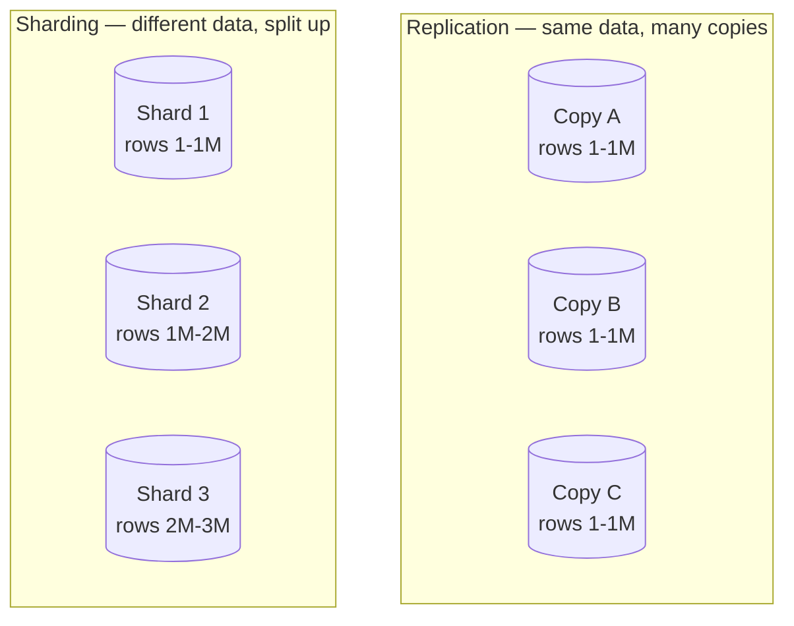
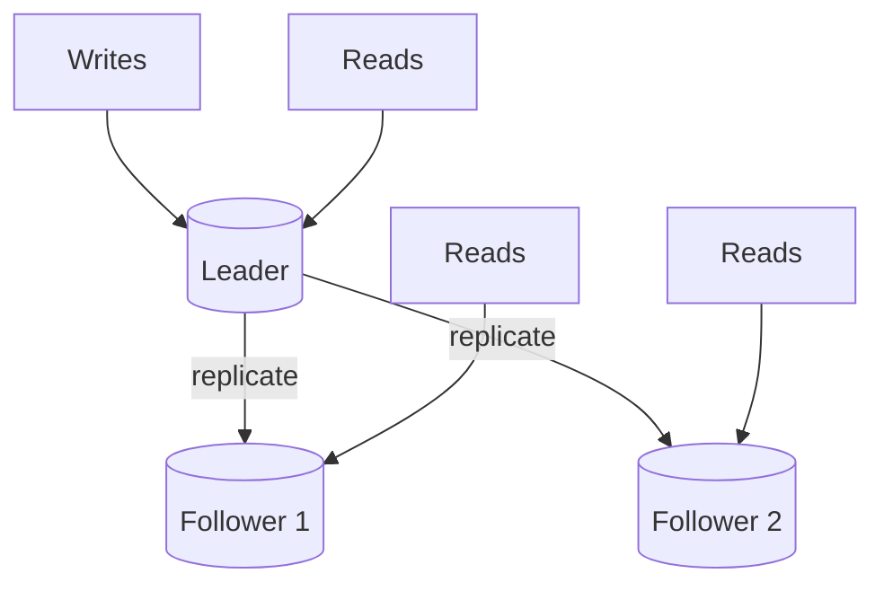
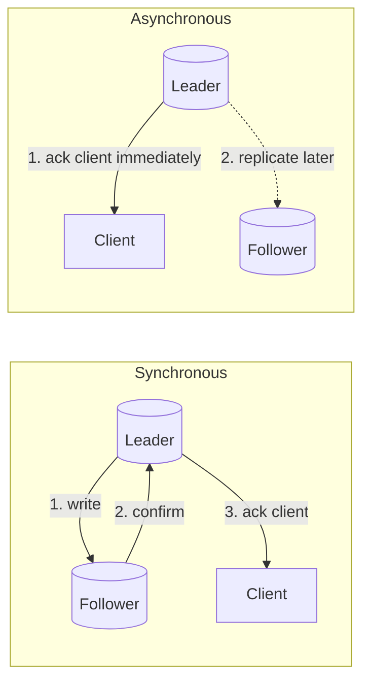
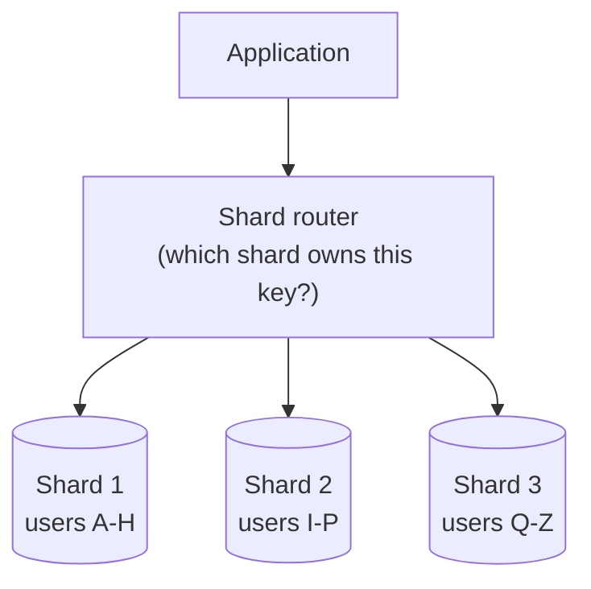
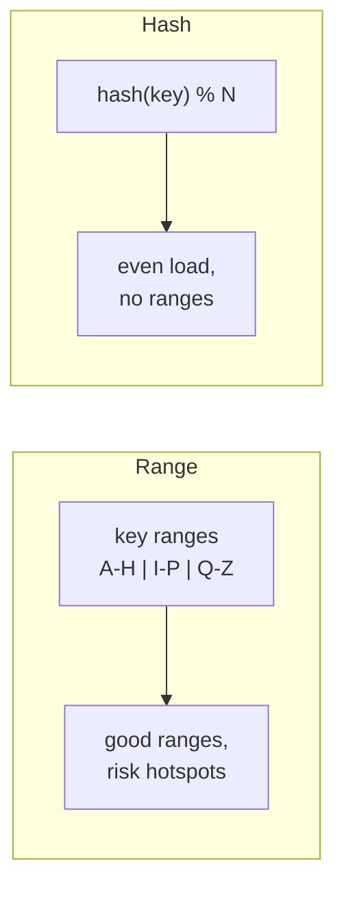
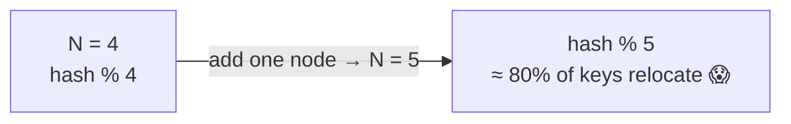
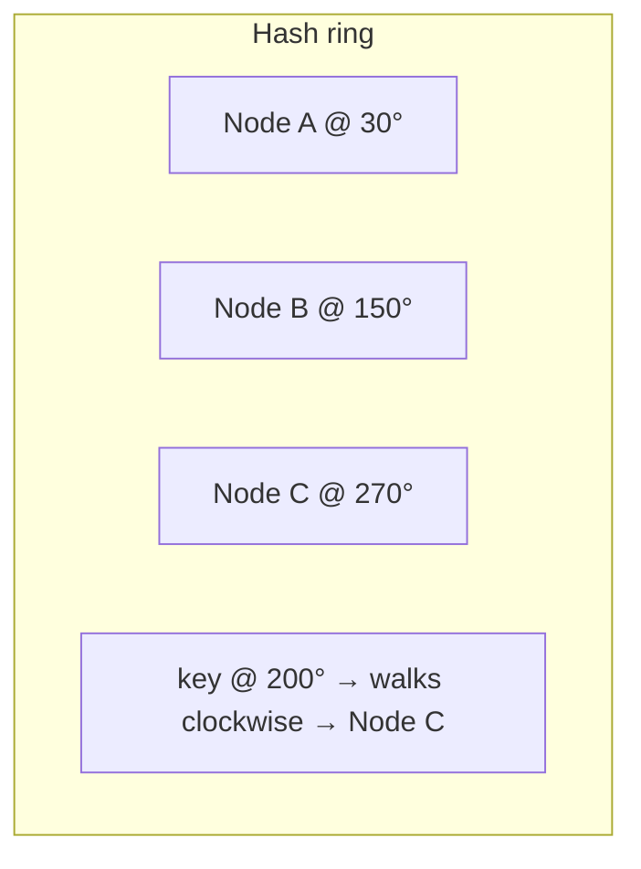
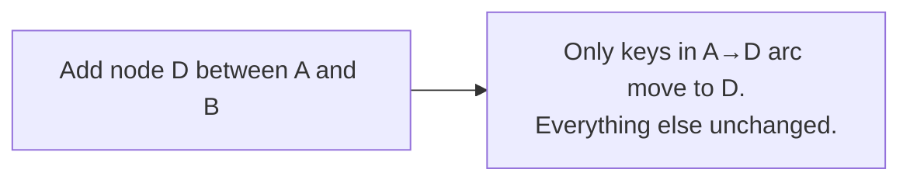
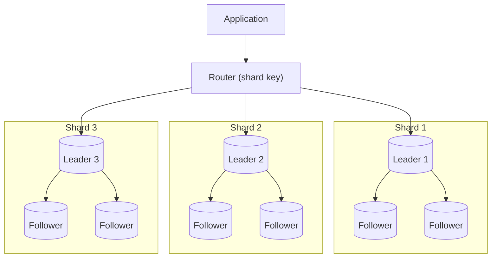

# System Design Deep Dive Series — Part 3: Replication and Sharding — Scaling the Data Layer

---

**Series:** System Design Deep Dive — From First Principles to Production Distributed Systems
**Part:** 3 of 11
**Prerequisite:** [Part 2 — Databases and Data Modeling](system-design-deep-dive-part-2.md)
**Reading time:** ~45 minutes

---

## Why This Part Exists

We've scaled the app tier (Part 1) and chosen a data model (Part 2), but the data still lives on **one machine** — the bottleneck and single point of failure we've been circling since the start. This part splits and copies that machine.

There are exactly two moves, and they solve different problems:

- **Replication** — keep *copies* of the data on multiple machines. Solves **availability** (survive a node death) and **read scaling** (spread reads across copies). Does *not* scale writes.
- **Sharding (partitioning)** — split the data into *pieces*, each on a different machine. Solves **write scaling** and **dataset size**. This is the harder, more consequential move.

We'll cover leader/follower replication, sync vs async and replication lag, failover, then partitioning strategies (range vs hash), the resharding nightmare, **consistent hashing** done properly, and how real systems combine both. This is the beating heart of distributed data.

---

## 1. Two Different Problems, Two Different Tools

Before any mechanism, get the distinction crystal clear, because conflating them is the most common mistake:

- **Replication** duplicates the *whole* dataset. Every node has everything. More copies → more read capacity + fault tolerance. But every node still holds all the data, and every write must eventually reach every copy — so replication **does not scale writes or dataset size.**
- **Sharding** divides the dataset. Each node holds a *slice*. More shards → more write capacity + more total data. But now a query might need to hit multiple shards, and cross-shard transactions and JOINs get hard.

Real large systems use **both**: shard the data into pieces, then replicate each piece. First let's master each alone.

---

## 2. Replication

**Replication** means maintaining copies (**replicas**) of your data on multiple nodes. The dominant model is **leader–follower** (also called primary–replica, or master–slave in older terminology).

### 2.1 Leader–Follower

- One node is the **leader** (primary). All **writes** go to the leader.
- The leader streams its changes to one or more **followers** (replicas).
- **Reads** can be served by the leader *or* any follower.

This is the workhorse pattern (Postgres, MySQL, MongoDB replica sets, Redis). It buys you two things:

1. **Read scaling.** For read-heavy workloads (the common case), add followers and spread reads across them. Ten followers ≈ ~10× read capacity.
2. **High availability.** If the leader dies, promote a follower to be the new leader (**failover**).

But note the ceiling: **all writes still go through the single leader.** Replication scales reads, not writes. To scale writes you need sharding (Section 3).

### 2.2 Synchronous vs Asynchronous Replication

The critical design knob: when the leader accepts a write, does it wait for followers to confirm?

**Synchronous:** the leader waits until (at least one) follower confirms it has the write *before* acknowledging the client.

- **Pro:** the follower is guaranteed up to date — if the leader dies right after, no committed data is lost, and a read from that follower is current.
- **Con:** every write is as slow as the slowest synced follower, and if that follower is down, writes *block*. Availability of writes drops.

**Asynchronous:** the leader acknowledges the client immediately and streams to followers in the background.

- **Pro:** fast writes, and follower slowness/failure doesn't block writes.
- **Con:** followers lag behind. If the leader dies before a write reached the followers, that write is **lost**. And reads from followers can be **stale**.

Most systems run **asynchronous** replication for performance, sometimes **semi-synchronous** (wait for *one* follower, stream to the rest async) as a middle ground. This choice is a direct instance of the consistency-vs-availability trade-off we formalize in Part 5.

### 2.3 Replication Lag and Read-Your-Writes

With async replication, followers trail the leader by some **replication lag** (milliseconds normally, seconds or more under load). This causes a notorious bug:

> A user updates their profile (write → leader), then immediately reloads (read → a follower that hasn't received the change yet). They see their *old* profile and think the save failed.

This is a violation of **read-your-own-writes** consistency. Common fixes:

- **Read from the leader for data the user just wrote** (e.g., for a short window after a user's write, route their reads to the leader).
- **Track the write position** (a timestamp/LSN) and only read from a follower that's caught up past it.
- **Sticky routing** to the leader for that user briefly.

Recognizing replication lag and naming a fix is a strong interview signal — it shows you understand that "eventually consistent" has real user-facing consequences.

### 2.4 Failover: Promoting a New Leader

When the leader dies, the system must **fail over**: detect the failure, choose a follower, promote it to leader, and redirect writes. This is deceptively hard:

- **Detection:** was the leader really dead, or just a slow network? Declare death too eagerly and you get flapping; too slowly and you're down longer.
- **Data loss:** with async replication, the promoted follower may be missing the leader's last writes — they're gone.
- **Split-brain:** the scariest failure — the old leader wasn't dead (just partitioned), comes back, and now you have *two* leaders accepting conflicting writes. Systems prevent this with fencing (STONITH — "shoot the other node in the head") or consensus-based leader election (Part 5). This is exactly why consensus protocols (Raft/Paxos) exist.

Managed databases automate failover; the concepts still matter because you must reason about the data-loss and split-brain windows.

### 2.5 Multi-Leader and Leaderless (brief)

- **Multi-leader:** multiple nodes accept writes (e.g., one leader per region for low-latency local writes). Powerful for geo-distribution, but you now get **write conflicts** — two regions edit the same record — that must be resolved (last-write-wins, CRDTs, app-level merge). Complex; use only when you need it.
- **Leaderless (Dynamo-style):** *any* replica accepts reads and writes; consistency is achieved with **quorums** — write to `W` nodes, read from `R` nodes, and if `W + R > N` (total replicas) you're guaranteed to read at least one node with the latest write. Cassandra and DynamoDB work this way. We cover quorums properly in Part 5; just know the pattern exists and trades a fixed leader for tunable consistency.

---

## 3. Sharding (Partitioning)

Replication hit a wall: all writes funnel through one leader, and one machine must hold the entire dataset. **Sharding** breaks both limits by splitting the data across multiple nodes, each called a **shard** (or partition). Each shard is an independent database holding a *subset* of the data and taking a *subset* of the writes.

Now writes and storage scale horizontally: add shards to add write capacity and total capacity. The whole game is choosing the **partition key** (shard key) and the **partitioning strategy** — because that decides how evenly load spreads and how painful your queries become.

### 3.1 Range-Based Partitioning

Split by ranges of the key: users A–H on shard 1, I–P on shard 2, Q–Z on shard 3. Or by time: January on shard 1, February on shard 2.

- **Pro:** **range queries are efficient** ("all users M–N", "all events in this hour") — they hit contiguous shards. Simple to reason about.
- **Con:** **hotspots.** If the key is unevenly distributed — many surnames start with "S", or all *recent* writes go to the newest time-shard — one shard gets hammered while others idle. Time-ranged data is especially prone to this: today's shard takes 100% of writes.

### 3.2 Hash-Based Partitioning

Apply a hash to the key and assign by the hash: `shard = hash(key) % N`. The hash scatters keys uniformly.

- **Pro:** **even distribution** — no hotspots from skewed keys; load spreads smoothly across shards.
- **Con:** **range queries are destroyed** — adjacent keys land on random shards, so "all users M–N" must scatter-gather across every shard. You trade range-query efficiency for even load.

### 3.3 The Hard Parts of Sharding

Sharding is powerful but it breaks conveniences you took for granted:

- **Cross-shard queries.** A query that spans shards becomes a **scatter-gather**: query all shards, merge results. Slow and complex. You design your shard key so your *most important* queries stay within one shard.
- **Cross-shard transactions.** ACID across shards needs distributed transactions (two-phase commit — Part 6), which are slow and fragile. Most sharded systems avoid them, keeping each transaction inside one shard.
- **Cross-shard JOINs.** Effectively gone. You denormalize (Part 2) so related data co-locates on the same shard, or you join in the application.
- **Choosing the shard key is a near-permanent decision.** A bad key (low cardinality, or one that concentrates load) creates hotspots you can't easily undo. Pick a key that is high-cardinality *and* aligns with your dominant access pattern.

### 3.4 Celebrity Problem / Hotspots

Even with hashing, a single *value* can be too hot. If you shard a social platform by `user_id`, the shard holding a celebrity with 100M followers gets crushed while others idle. Mitigations: further split hot keys (add a synthetic sub-key), cache the hot entity aggressively (Part 4), or handle celebrities on a separate path. Naming the celebrity problem is a classic senior-level signal.

---

## 4. The Resharding Problem and Consistent Hashing

Here's the flaw that consistent hashing exists to fix. Suppose you use `shard = hash(key) % N` with `N = 4` shards. Now you add a 5th shard, so `N` becomes 5. For almost *every* key, `hash(key) % 4` ≠ `hash(key) % 5`. Nearly the entire dataset must move to a different shard.

For a cache this means a near-total cache miss storm; for a database it means moving terabytes and likely downtime. Scaling should be incremental, not catastrophic. **Consistent hashing** makes it incremental.

### 4.1 The Hash Ring

Map the output of the hash function onto a **ring** (0 → 2³²−1, wrapping around). Place both **nodes** and **keys** on the ring by hashing them. A key belongs to the **first node clockwise** from its position.

Now the magic: when you **add** a node, only the keys between the new node and its predecessor move to it — roughly `1/N` of the keys. Every other key stays put. When you **remove** a node, only *its* keys move to the next node clockwise. Adding/removing a node disturbs ~`1/N` of the data instead of ~all of it.

### 4.2 Virtual Nodes

Plain consistent hashing has a flaw: with few nodes, the ring is uneven — one node may own a huge arc and another a tiny one, recreating hotspots. And when a node dies, *all* its load dumps onto its single clockwise neighbor.

The fix is **virtual nodes (vnodes):** each physical node is placed on the ring at *many* points (say 100–200 tokens). This averages out the arcs (even distribution) and, crucially, when a node fails its load spreads across *many* neighbors instead of one. Vnodes also let you weight heterogeneous hardware (a bigger machine gets more vnodes).

Consistent hashing with virtual nodes is the backbone of **Cassandra, DynamoDB, and distributed caches** — and it's the payoff of the "consistent hashing" teaser from Parts 1 and 2. If you remember one algorithm from distributed systems, make it this one.

---

## 5. Putting Replication and Sharding Together

Real systems do both, in a specific order: **shard for scale, replicate each shard for safety.** Each shard is a small replication group with its own leader and followers.

Now you have both properties:

- **Sharding** gives write scale and lets the total dataset exceed one machine.
- **Replication** within each shard gives fault tolerance (a follower is promoted if a shard's leader dies) and read scale for that shard.

This is roughly how MongoDB sharded clusters, Cassandra (masterless, but each partition replicated to N nodes), and large MySQL/Postgres deployments are structured. The cost is real operational complexity — more nodes, failover per shard, resharding operations, and the loss of easy cross-shard queries and transactions. **Don't shard until you must.** A single replicated leader handles far more than most engineers expect; sharding is the tool you reach for when write volume or dataset size genuinely exceeds one machine — not before.

---

## 6. When to Shard (and When Not To)

A sane progression, echoing Part 1's "don't distribute what you don't have to":

1. **Single database.** Fine for most apps for a long time.
2. **Vertical scale** the primary (bigger box) — simple, buys lots of headroom (Part 1).
3. **Add read replicas** — solves read scaling and gives HA. Solves the *majority* of scaling problems, because most workloads are read-heavy.
4. **Caching** (Part 4) — often removes the need to scale the DB further at all.
5. **Shard** — only when writes or dataset size exceed a single primary, *and* the steps above are exhausted.

Sharding is a one-way door that permanently complicates your data layer. Reach for it last, choose the shard key with great care (high cardinality + aligned with your dominant query), and prefer a managed system that handles resharding for you.

---

## 7. Summary and What's Next

- **Replication** (copies) and **sharding** (splits) solve *different* problems. Replication → availability + read scale. Sharding → write scale + dataset size. Don't conflate them.
- **Leader–follower** replication: writes to the leader, reads from followers. **Async** is fast but lagging and can lose the leader's last writes; **sync** is safe but slow and can block writes.
- **Replication lag** breaks read-your-own-writes; fix by reading from the leader for just-written data or tracking write position.
- **Failover** is hard: detection, potential data loss, and **split-brain** — which is why consensus (Part 5) exists.
- **Sharding** splits data by a **partition key**. **Range** partitioning enables range queries but risks hotspots; **hash** partitioning spreads load evenly but kills range queries. Cross-shard queries/transactions/JOINs are the price.
- Naive `hash % N` causes **catastrophic resharding**. **Consistent hashing** (a ring) moves only ~`1/N` of keys when nodes change; **virtual nodes** make load even and failures graceful. It powers Cassandra, DynamoDB, and distributed caches.
- Real systems **shard then replicate each shard.** But shard *last* — vertical scale, read replicas, and caching solve most problems first.

**Next up — Part 4: Caching and CDNs — Serving Data Fast.** We keep hinting that caching removes most database pressure — now we prove it. Where to cache (client, CDN, application, database), the eviction policies (LRU/LFU/TTL), the hard problems (invalidation, stampedes, hot keys), the read/write patterns (cache-aside, write-through, write-behind), and how CDNs push data to the edge near users. Caching is the highest-leverage performance tool in the entire series.
