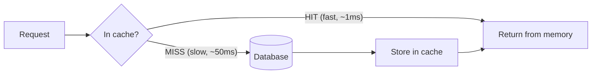
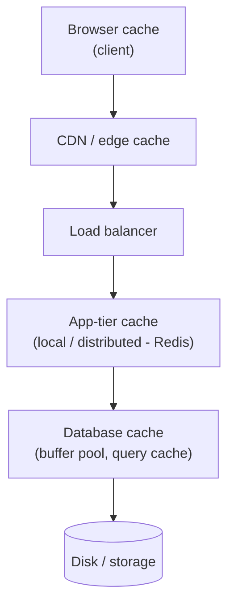
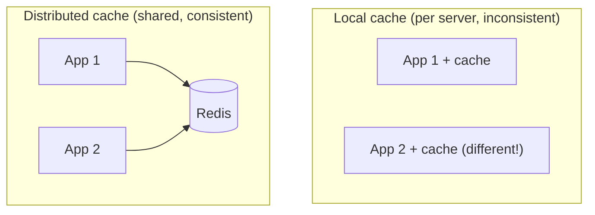
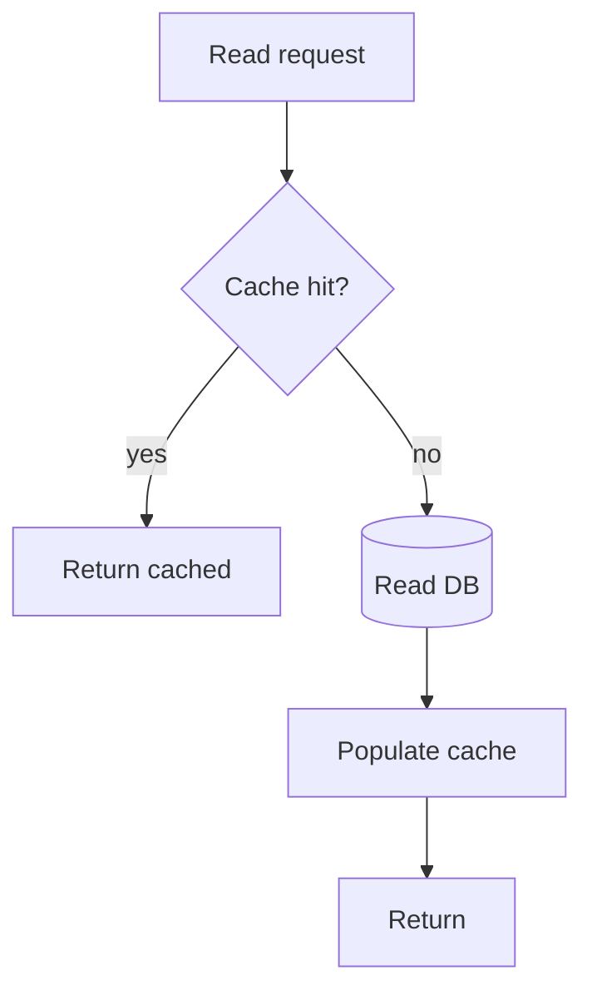
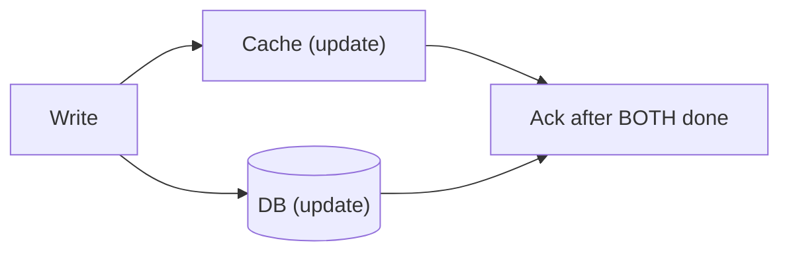
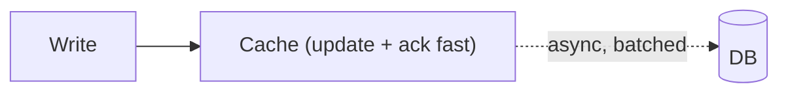
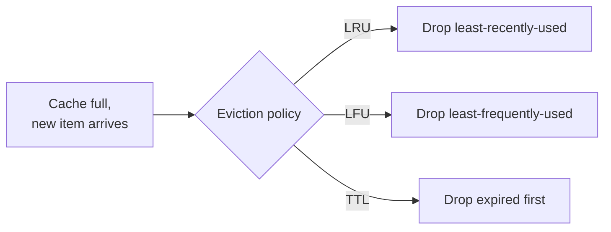
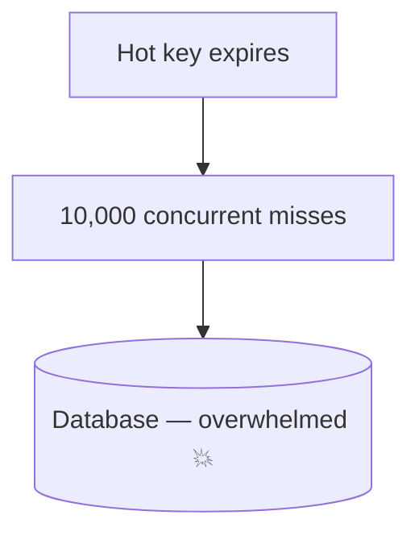
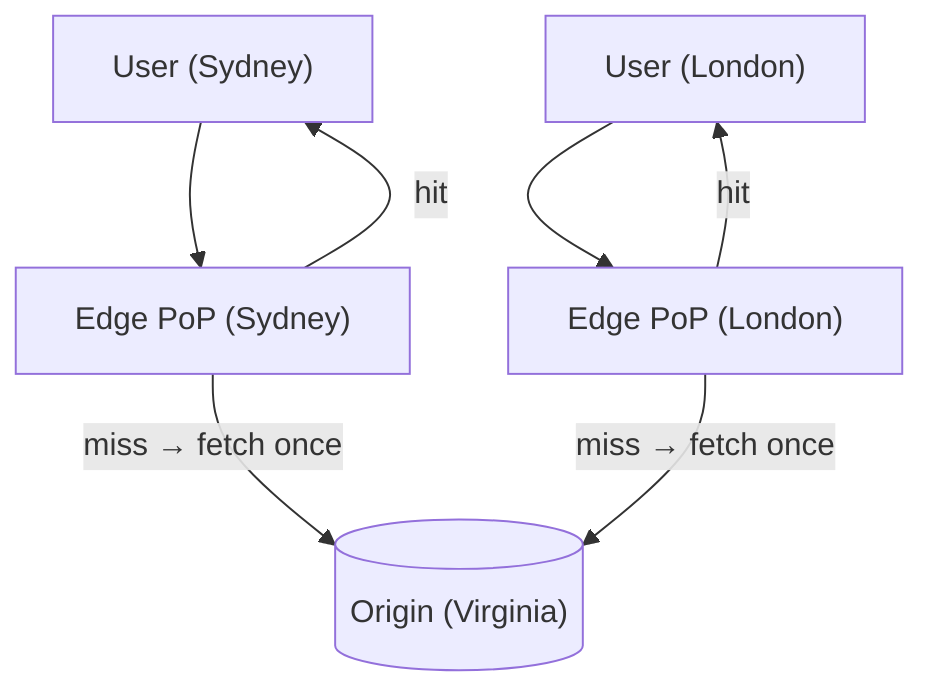

# System Design Deep Dive Series — Part 4: Caching and CDNs — Serving Data Fast

---

**Series:** System Design Deep Dive — From First Principles to Production Distributed Systems
**Part:** 4 of 11
**Prerequisite:** [Part 3 — Replication and Sharding](system-design-deep-dive-part-3.md)
**Reading time:** ~45 minutes

---

## Why This Part Exists

Twice now — in Parts 1 and 3 — we've said "caching removes most of the pressure on your database." This part proves it and shows you how to do it without shooting yourself in the foot.

Caching is the **highest-leverage performance tool** in system design. A cache hit that returns in 1 ms instead of a 50 ms database query is a 50× speedup for that request *and* one fewer query hammering the shard you worked so hard to build in Part 3. Done well, caching lets a modest database serve a massive read load. Done badly, it serves stale data, falls over in a thundering herd, or quietly corrupts your users' view of reality.

We'll cover: why caching works, the layers where you can cache (client → CDN → app → database), cache reading patterns (cache-aside, read-through), writing patterns (write-through, write-behind, write-around), eviction (LRU/LFU/TTL), the three hard problems (invalidation, stampede, hot keys), and CDNs. This part leans on the Redis Deep Dive where relevant, but stays at the system-design altitude.

---

## 1. Why Caching Works: Locality and the Latency Gap

Caching rests on two facts:

1. **The latency gap is enormous.** Recall the numbers from Part 0: memory access is ~100 ns, an SSD read ~100 µs, a network+DB round trip often 1–50 ms. Serving from an in-memory cache instead of a database is routinely **100–1000× faster.**
2. **Access is skewed (locality).** Real workloads aren't uniform — a small fraction of the data gets the majority of the requests (the "hot set"). The Pareto-ish rule: ~80% of reads hit ~20% of the data (often far more skewed — think the current top news story, a viral tweet, a trending product). If you keep just that hot 20% in fast memory, you serve most traffic from cache.

The metric that matters is **hit ratio** — the fraction of requests served from cache. A 95% hit ratio means the database sees only 5% of read traffic. Small improvements in hit ratio produce large reductions in database load. Everything in this part is ultimately about **raising the hit ratio while keeping the data acceptably fresh.**

---

## 2. The Layers of Caching

You can cache at many points between the user and the database. Each layer catches requests earlier — the earlier you catch a request, the cheaper it is. Think of it as a series of nets.

### 2.1 Client-Side (Browser) Cache

The browser stores responses locally per HTTP caching headers (`Cache-Control`, `ETag`, `Expires`). A cached asset costs **zero** network round trips. This is the cheapest possible cache — use it for static assets (JS, CSS, images) and cacheable API responses. Governed by HTTP semantics we revisit in Part 7.

### 2.2 CDN / Edge Cache

A **Content Delivery Network** caches content at hundreds of edge locations physically near users (Section 8). It catches requests before they ever reach your origin. Traditionally for static assets; increasingly for dynamic/personalized content at the edge too.

### 2.3 Application-Tier Cache

The cache your code talks to directly. Two sub-flavors:

- **Local (in-process) cache:** data cached in the app server's own memory (e.g., an in-process LRU map). Fastest possible (no network hop), but **each server has its own copy** — inconsistent across the fleet, and lost on restart. Good for tiny, rarely-changing data (config, feature flags).
- **Distributed cache:** a separate shared cache tier — **Redis** or **Memcached** — that all app servers query over the network. One consistent copy, survives app restarts, scales independently. This is the workhorse "cache layer" in most architectures, and it's stateless-app-tier-friendly (recall Part 1: externalize state — the distributed cache *is* where a lot of that state lives).

### 2.4 Database Cache

Databases cache internally — the **buffer pool** keeps hot pages in memory so reads don't hit disk. You don't manage this directly, but it's why a "warm" database is far faster than a cold one, and why the first query after a restart is slow.

**Design principle:** cache as close to the user as the data's freshness requirements allow. Static asset? Cache it in the browser and CDN. Per-user dynamic data? Distributed cache. The further out you cache, the faster and cheaper — but the harder invalidation gets.

---

## 3. Cache Reading Patterns

*How* your application interacts with the cache defines correctness and complexity. Start with reads.

### 3.1 Cache-Aside (Lazy Loading) — the default

The application manages the cache explicitly:

1. On read, check the cache.
2. **Hit** → return it.
3. **Miss** → read from the DB, **write it into the cache**, return it.

- **Pros:** simple, and the cache only ever holds data that's actually been requested (lazy — no wasted memory). Resilient: if the cache is down, you still read from the DB. This is by far the most common pattern.
- **Cons:** the *first* request for any item is always a miss (cold cache). And it's prone to staleness — the DB can change without the cache knowing, so you pair it with a TTL and/or explicit invalidation (Section 5–6).

### 3.2 Read-Through

The cache itself sits inline and knows how to fetch from the DB on a miss. The app only ever talks to the cache; the cache loads from the DB transparently.

- **Pros:** the app code is simpler (no explicit DB-load-and-populate logic) — the caching logic lives in the cache layer/library.
- **Cons:** requires a cache that supports it (or a library); first read still misses. Functionally similar to cache-aside but with the load logic moved into the cache.

The difference is *who* owns the miss logic: cache-aside → the app; read-through → the cache. Cache-aside is more common because it's explicit and flexible.

---

## 4. Cache Writing Patterns

The harder half: when data changes, how do the cache and database stay in sync? Three strategies, trading consistency, latency, and durability.

### 4.1 Write-Through

Every write goes to the **cache and the database synchronously** — the write isn't acknowledged until both are updated.

- **Pros:** cache is always consistent with the DB — no stale reads for written data. Reads after writes are fast and correct.
- **Cons:** every write pays the latency of writing *both* stores. And you cache data that may never be read again (wasted memory), unless combined with cache-aside reads.

### 4.2 Write-Behind (Write-Back)

Write to the **cache immediately**, acknowledge the client, and **asynchronously flush to the DB** later (often batched).

- **Pros:** very fast writes; absorbs write spikes; can coalesce many writes into fewer DB writes (great for high-write counters, metrics).
- **Cons:** **durability risk** — if the cache dies before flushing, those writes are lost. Also adds complexity (retry, ordering). Use only where some write loss is tolerable or the cache is itself durable/replicated.

### 4.3 Write-Around

Writes go **straight to the DB, bypassing the cache.** The cache is populated only later, on a read miss (cache-aside style).

- **Pros:** avoids flooding the cache with write-heavy data that won't be read soon (no cache pollution).
- **Cons:** a read immediately after a write is a miss (the just-written data isn't cached yet). Good for write-heavy, read-rarely data.

### Choosing a write pattern

| Pattern | Write speed | Consistency | Durability | Use when |
|---|---|---|---|---|
| Write-through | slow (2 writes) | strong (cache fresh) | safe | read-after-write matters |
| Write-behind | fast | fast, eventual to DB | **risky** | write-heavy, some loss OK |
| Write-around | fast (DB only) | reads may miss | safe | write-heavy, read-rarely |

Most real systems use **cache-aside for reads + write-around or explicit invalidation for writes**, reaching for write-through only on hot read-after-write paths and write-behind only for high-volume tolerant data (counters, metrics).

---

## 5. Eviction: The Cache Is Finite

A cache is a small, fast store in front of a big, slow one — so it fills up, and you must decide what to evict. The **eviction policy** is what keeps the *hot* set resident.

- **LRU (Least Recently Used):** evict the item unused for the longest. Assumes recently-used → likely-used-again (temporal locality). The most common default; matches real access patterns well.
- **LFU (Least Frequently Used):** evict the item with the fewest accesses. Better when popularity is stable over time, but needs counters and can keep stale-but-once-popular items. Modern caches use windowed/decaying LFU variants.
- **FIFO:** evict oldest-inserted regardless of use. Simple, usually worse than LRU.
- **TTL (Time To Live):** every entry expires after a set time. Not strictly an eviction *victim-selection* policy but the primary **freshness** mechanism — it bounds how stale data can get. Almost always used alongside LRU/LFU.

TTL is your safety net for cache-aside staleness: even if you forget to invalidate, the entry self-heals within the TTL window. Short TTL = fresher but more misses; long TTL = higher hit ratio but staler. Tuning TTL is tuning the freshness/hit-ratio trade-off.

---

## 6. The Three Hard Problems of Caching

Adding a cache adds a second copy of your data, and second copies drift, disappear, and get contended. Three classic failure modes — and interviewers love all three.

### 6.1 Cache Invalidation ("one of the two hard things")

When the underlying data changes, the cached copy is now **stale**. Keeping the cache in sync with the source of truth is famously hard. Approaches:

- **TTL expiry (passive):** accept staleness up to the TTL; the entry refreshes on the next miss after expiry. Simple, eventually consistent, no coordination. The default.
- **Explicit invalidation (active):** on a write, delete or update the cache key. Fresher, but you must find *every* place that data is cached (multiple keys, denormalized copies — the same duplication problem from Part 2). Miss one and it stays stale.
- **Write-through:** keeps the specific key fresh by construction (Section 4.1).

The pragmatic answer: **TTL + explicit invalidation on the hot paths.** Accept that caching means *choosing* a staleness budget — decide, per data type, how stale is acceptable (a like count can be seconds stale; an account balance cannot be).

### 6.2 Cache Stampede (Thundering Herd)

A very popular key expires (or the cache restarts cold). Suddenly thousands of concurrent requests all miss, and all hammer the database *simultaneously* for the same item — potentially knocking the DB over exactly when it's busiest.

Mitigations:

- **Locking / request coalescing (single-flight):** only the *first* miss recomputes the value; everyone else waits for that result. One DB query instead of 10,000.
- **Early / probabilistic refresh:** refresh the value slightly *before* it expires (in the background), so it's never simultaneously hot and expired.
- **Stale-while-revalidate:** serve the stale value while asynchronously refreshing it, so no request blocks on the DB.
- **Jittered TTLs:** don't let many keys expire at the same instant — add randomness so expirations spread out.

### 6.3 Hot Key / Celebrity Problem

A single key is so popular that the *one cache node* holding it becomes a bottleneck — the caching version of Part 3's celebrity problem. A distributed cache shards keys across nodes, but one white-hot key still lives on one node. Mitigations: **replicate the hot key** across multiple cache nodes, add a **local (in-process) cache** in front of the distributed cache for the hottest items (a small second tier), or split the key.

There's also **cache penetration** (requests for keys that don't exist, so they always miss and hit the DB — mitigate by caching negative results or using a Bloom filter) and **cache avalanche** (many keys expiring at once or the whole cache going down — mitigate with jittered TTLs and cache HA/replication).

---

## 7. What to Cache — and What Not To

Caching is not free, so be deliberate:

**Good to cache:** read-heavy data that changes rarely relative to how often it's read; expensive-to-compute results (aggregations, rendered pages, ML features); data where slight staleness is acceptable; the hot set (popular items).

**Bad / careful to cache:** data that must always be perfectly current (some financial/inventory reads); data written far more than read (cache pollution — use write-around); per-user data with no reuse (low hit ratio, wasted memory); anything where a stale read causes real harm.

The question for every cache is the same: **what's my read/write ratio, and what's my staleness budget?** High reads + tolerant of staleness = cache aggressively. Low reads or zero staleness tolerance = don't.

---

## 8. CDNs: Caching at the Edge

A **CDN** is a globally distributed cache that sits between users and your origin servers, with **points of presence (PoPs)** in hundreds of cities. It attacks a problem caching alone can't: the **speed of light**. A user in Sydney fetching from a server in Virginia pays ~200 ms round-trip *per request* no matter how fast your servers are. A CDN serves them from a Sydney edge node instead — single-digit milliseconds.

How it works: the user requests an asset; **Anycast/GeoDNS** (Part 1) routes them to the nearest PoP; if the edge has it cached (**edge hit**), it's served locally; if not (**edge miss**), the CDN fetches from your **origin** once, caches it, and serves it — so subsequent users in that region hit the edge.

**What CDNs cache:**

- **Static assets** — the classic use: images, video, JS, CSS, fonts, downloads. Huge win with almost no downside.
- **Dynamic content at the edge** — modern CDNs cache API responses and even run compute at the edge (edge functions), caching personalized/dynamic content with short TTLs and smart keys.

**Benefits:** dramatically lower latency (proximity), massive **origin offload** (your servers see a fraction of traffic — the ultimate expression of "caching protects the backend"), absorption of traffic spikes and some DDoS, and reduced bandwidth cost. **Invalidation** is via TTLs and explicit **purge** APIs, and cache-busting (versioned URLs like `app.a1b2c3.js`) so a new deploy is a new URL that can't serve a stale cached copy.

The CDN is the outermost net in Section 2's diagram — and for read-heavy content-serving systems it's the single biggest lever on both latency and origin load.

---

## 9. Summary and What's Next

- Caching wins because of the **latency gap** (memory is 100–1000× faster than a DB round trip) and **locality** (a small hot set serves most traffic). The metric is **hit ratio**.
- Cache in **layers**: browser → CDN → app tier (local vs distributed/Redis) → DB buffer pool. The earlier you catch a request, the cheaper — but the harder invalidation gets.
- **Read patterns:** **cache-aside** (app manages it, lazy, resilient — the default) and **read-through** (cache owns the miss).
- **Write patterns:** **write-through** (consistent, slower), **write-behind** (fast, durability risk), **write-around** (avoids pollution, reads may miss). Most systems: cache-aside reads + invalidation on writes.
- **Eviction** keeps the hot set resident: **LRU** (default), **LFU** (stable popularity), plus **TTL** as the freshness safety net and staleness knob.
- The three hard problems: **invalidation** (choose a staleness budget: TTL + explicit purge), **stampede** (single-flight, early/stale-while-revalidate refresh, jittered TTLs), **hot keys** (replicate/local-tier the celebrity key). Plus penetration and avalanche.
- Cache read-heavy, staleness-tolerant, expensive-to-compute data. Don't cache write-heavy, must-be-current, or no-reuse data.
- **CDNs** cache at the edge to beat the speed of light — lower latency, huge origin offload, spike absorption. Static assets always; dynamic content increasingly.

**Next up — Part 5: Consistency, CAP/PACELC, and Consensus.** We've now made several choices that trade freshness for speed and availability — async replication (Part 3), eventual consistency (Part 2), stale caches (Part 4). It's time to make that trade-off rigorous. What does "consistency" really mean? Why does the **CAP theorem** say you can't have everything during a network partition — and why is **PACELC** the more honest version? How do distributed systems *agree* on anything (consensus, Raft/Paxos, quorums)? This is the theoretical spine of the entire series.
