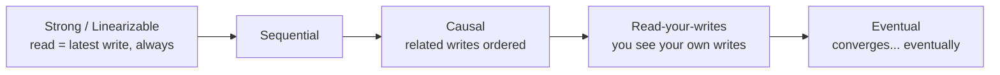
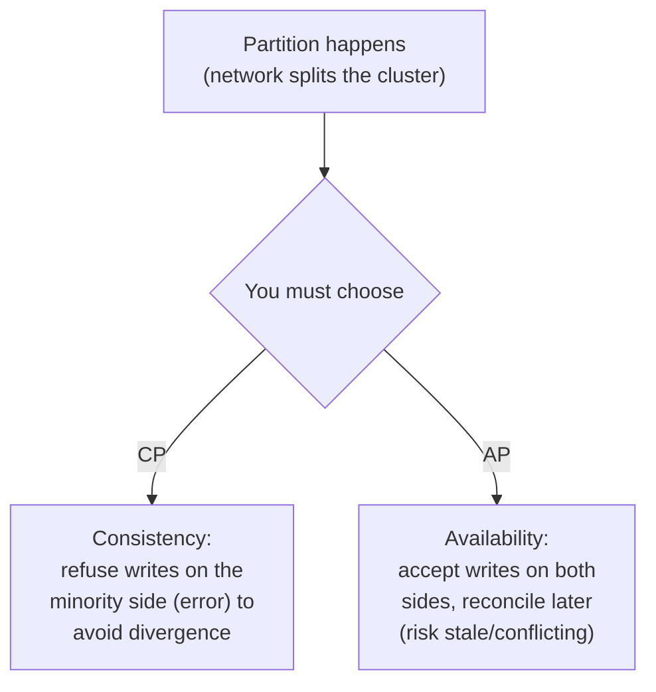
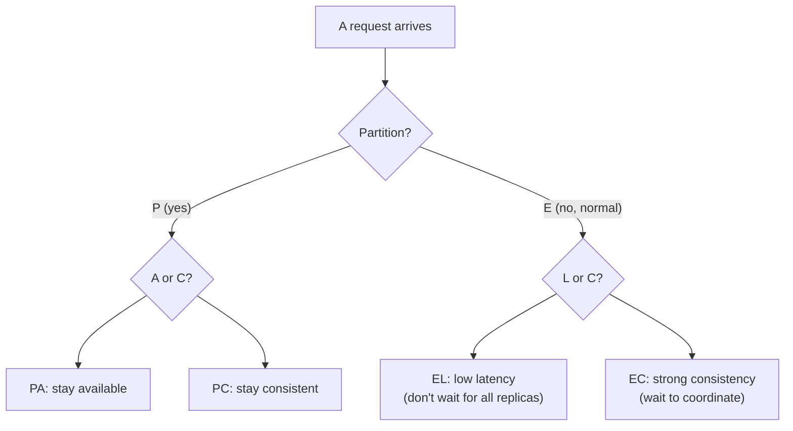
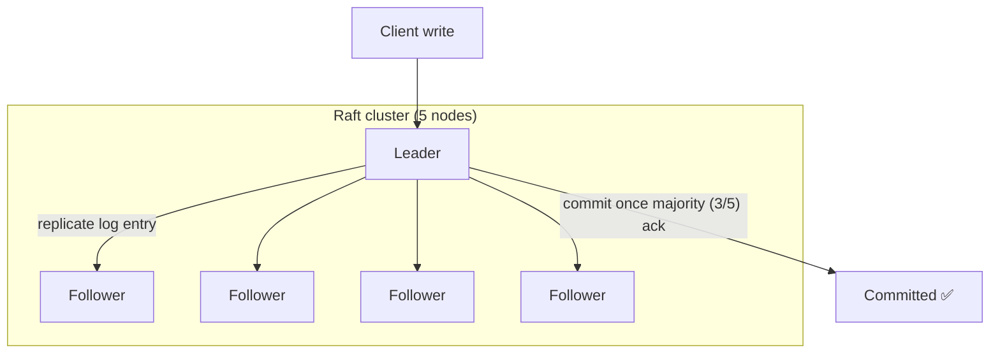
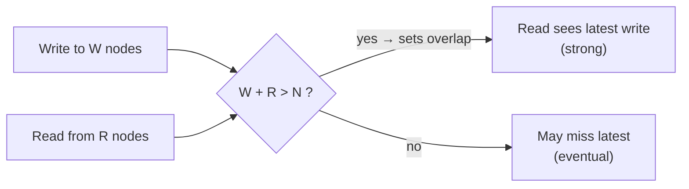
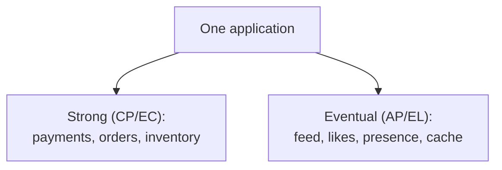

# System Design Deep Dive Series — Part 5: Consistency, CAP/PACELC, and Consensus

---

**Series:** System Design Deep Dive — From First Principles to Production Distributed Systems
**Part:** 5 of 11
**Prerequisite:** [Part 4 — Caching and CDNs](system-design-deep-dive-part-4.md)
**Reading time:** ~50 minutes

---

## Why This Part Exists

Every part so far has quietly made the same trade-off: async replication that lags (Part 3), eventual consistency in NoSQL (Part 2), stale caches with a "staleness budget" (Part 4). Each time we waved at a deeper truth: **in a distributed system, you cannot have perfect consistency, perfect availability, and tolerance to network failures all at once.** This part makes that rigorous.

This is the theoretical spine of the series. It's abstract, but it's the difference between an engineer who *memorizes* "Cassandra is AP, Postgres is CP" and one who can *reason* about what their system does when the network breaks — because networks always eventually break.

We'll cover: what "consistency" actually means (the models, not the hand-waving), the **CAP theorem** and why it's real but oversimplified, **PACELC** (the honest upgrade), how systems reach agreement (**consensus** — Raft/Paxos), **quorums** as the practical middle path, and how to choose. Let's untangle the most confused topic in system design.

---

## 1. First: "Consistency" Means Three Different Things

Half the confusion in this topic is one word doing three jobs. Pin them down before anything else:

1. **ACID's "C" (Part 2):** a *single-node* guarantee that a transaction respects integrity rules (constraints, foreign keys). Not what CAP is about.
2. **CAP's "C":** **linearizability** — every read sees the most recent write, as if there were one single copy of the data. A *distributed* guarantee about what replicas show.
3. **Consistency models (this section):** a whole spectrum describing *what a reader is allowed to observe* across replicas.

When someone says "consistency," ask *which one*. In this part, "consistency" means #2/#3 — the distributed kind. Here's the spectrum, strongest to weakest:

- **Strong / Linearizable:** every read returns the most recent write. The system behaves as if there's a single copy. Simplest to reason about; most expensive (needs coordination on every operation).
- **Sequential / Causal:** weaker but useful — e.g., **causal** guarantees that causally-related operations are seen in order (you never see a reply before the message it answers), while unrelated ops may reorder.
- **Read-your-own-writes:** you always see your *own* recent writes (fixes the Part 3 profile-update bug), though you may not see others' latest.
- **Eventual:** if writes stop, all replicas *eventually* converge to the same value. In the meantime, reads may be stale or even go "backward." Weakest, cheapest, most available.

**The core insight:** stronger consistency requires more coordination between nodes, which costs latency and availability. Weaker consistency is faster and more available but pushes complexity onto the application (which must tolerate stale/out-of-order reads). This tension *is* the rest of the part.

---

## 2. The CAP Theorem

The **CAP theorem** (Brewer) states that a distributed data store can provide at most **two** of these three guarantees:

- **C — Consistency:** every read sees the latest write (linearizability — CAP's specific meaning).
- **A — Availability:** every request gets a (non-error) response, even if some nodes are down.
- **P — Partition tolerance:** the system keeps working despite the network dropping/delaying messages between nodes.

### Why It's Really a Two-Way Choice

The popular "pick 2 of 3" framing is misleading. In any real distributed system, **network partitions will happen** — cables cut, switches fail, packets drop. Partition tolerance (P) is therefore **not optional**; you don't get to "choose" a network that never fails. So CAP reduces to a forced choice *when a partition occurs*:

- **CP (Consistency + Partition tolerance):** during a partition, sacrifice **availability** — the side that can't confirm it has the latest data returns an error rather than risk serving stale/conflicting data. *Example:* a bank ledger, or systems built on consensus (below). Postgres with synchronous replication, HBase, ZooKeeper, etcd lean CP.
- **AP (Availability + Partition tolerance):** during a partition, sacrifice **consistency** — every node keeps answering, accepting reads/writes on both sides, and you reconcile the divergence afterward (eventual consistency). *Example:* a shopping cart, a like counter, DNS. Cassandra, DynamoDB (default), Riak lean AP.

> CAP is really: **when the network partitions, do you prefer to be *correct* or to be *up*?** There's no universally right answer — it depends on what the data is. Money → CP. A like count → AP.

### The Nuance CAP Gets Wrong

CAP is a useful starting frame but too coarse. Two problems:

1. It only describes behavior **during a partition** — which is the rare case. What about the 99.9% of the time the network is fine?
2. "CP" and "AP" aren't absolute labels for a whole database — modern systems tune consistency **per operation** (DynamoDB can do a strongly-consistent read *or* an eventually-consistent one on the same table).

Both problems are fixed by PACELC.

---

## 3. PACELC: The Honest Upgrade

**PACELC** extends CAP to describe the *normal* case too. Read it as:

> **If** there is a **P**artition, choose between **A**vailability and **C**onsistency (that's CAP); **E**lse (normal operation, no partition), choose between **L**atency and **C**onsistency.

The **"Else Latency-or-Consistency"** half is the crucial addition, because it names the trade-off you pay *every single request*, not just during rare partitions: to guarantee a read sees the latest write, replicas must **coordinate**, and coordination costs latency. If you skip coordination (read from the nearest replica), you're fast but might read stale data.

This is exactly the sync-vs-async replication choice from Part 3, and the cache-staleness choice from Part 4, now named precisely. Classifying real systems:

| System | Partition (PA/PC) | Normal (EL/EC) | Meaning |
|---|---|---|---|
| Cassandra, Dynamo (default) | **PA** | **EL** | Availability + low latency, eventual consistency |
| Postgres/MySQL (single primary) | **PC** | **EC** | Consistency first, always coordinate |
| Spanner, CockroachDB | **PC** | **EC** | Strong consistency even at latency cost |
| MongoDB (default) | **PC** | **EL** | Consistent on partition, but fast reads normally |

**PACELC is the more sophisticated answer in an interview.** Saying "it's PA/EL — available and low-latency, trading consistency both during partitions and normally" shows you understand the trade-off happens *all the time*, not just during failures.

---

## 4. Consensus: How Nodes Agree

If you want the **CP / EC** side — strong consistency — you need the nodes to *agree* on things: who is the leader, what order writes happened in, whether a value is committed. That's the **consensus** problem: getting a group of nodes to agree on a single value even when some nodes fail or messages are lost/delayed.

Consensus is hard because of everything working against you: nodes crash, messages are delayed or reordered, and — worst — a node can't tell the difference between a *dead* peer and a merely *slow* one (Part 3's failover dilemma). Yet consensus is what makes reliable distributed coordination possible.

### 4.1 What Consensus Buys You

A consensus protocol lets a cluster agree on an ordered log of operations such that:

- All non-faulty nodes agree on the **same values in the same order** (agreement + order).
- Once a value is decided, it **stays** decided (a committed write is never lost or reversed).
- It makes progress as long as a **majority (quorum)** of nodes are alive and can communicate.

That last point is key: consensus protocols survive a **minority** of failures. With 5 nodes, you tolerate 2 failures (3 still form a majority). If a partition leaves you with only a minority, that side **stops accepting writes** — this is precisely the "CP" choice, and precisely how **split-brain is prevented** (only the majority side can make progress, so two leaders can't both commit).

### 4.2 Raft (the one to understand)

**Paxos** (Lamport) was first and is famously hard to understand. **Raft** was designed to be understandable and is now everywhere (etcd, Consul, CockroachDB, TiKV, Kafka's KRaft mode). Raft in three ideas:

1. **Leader election.** One node is elected leader for a "term." Followers expect regular heartbeats; if they stop, a follower times out and starts an election, requesting votes. A candidate that wins a **majority** becomes leader. Randomized timeouts prevent endless split votes.
2. **Log replication.** All writes go to the leader, which appends to its log and replicates to followers. Once a **majority** has stored an entry, it's **committed** and applied. Because commitment needs a majority, a partitioned minority (including a stale old leader) can never commit — no split-brain.
3. **Safety.** Elections are constrained so a node missing committed entries can't win, guaranteeing committed data is never lost.

You don't implement Raft by hand — but understanding "a leader plus majority-quorum replication with elections" demystifies etcd, ZooKeeper (ZAB, similar), Kafka's controller, and how **NewSQL** databases (Part 2) give ACID *and* horizontal scale: each shard is a Raft group replicating via consensus. That's the trick — Spanner/CockroachDB shard the data, and each shard is its own strongly-consistent consensus group.

---

## 5. Quorums: The Practical Middle Path

Full consensus (Raft) is used for coordination and leadered strong consistency. **Leaderless** systems (Dynamo, Cassandra — Part 3) take a lighter approach: **quorum reads and writes**, which let you *tune* consistency per operation.

With `N` replicas of each piece of data:

- **W** = number of replicas that must acknowledge a **write** before it's considered successful.
- **R** = number of replicas queried on a **read** (you take the newest value returned).

The key relationship:

> **If `W + R > N`, the read and write sets are guaranteed to overlap** on at least one replica — so a read always sees the latest committed write. This gives strong consistency *without* a leader.

Common configurations with `N = 3`:

| W | R | W+R>N? | Behavior |
|---|---|---|---|
| 3 | 1 | 4>3 ✅ | fast reads, slow/fragile writes (all must ack) |
| 1 | 3 | 4>3 ✅ | fast writes, slower reads |
| 2 | 2 | 4>3 ✅ | **balanced quorum** — common strong-ish default |
| 1 | 1 | 2>3 ❌ | fastest, **eventual** (may read stale) |

This is the **EL-vs-EC dial from PACELC made concrete and per-request.** Want strong reads? Set `W + R > N` and pay the latency. Want maximum availability and speed and can tolerate staleness? Set `W = R = 1`. The same database, tuned per operation. Cassandra exposes this directly as consistency levels (ONE, QUORUM, ALL).

When replicas *do* diverge (they will, in AP systems), reconciliation mechanisms clean up: **read repair** (fix stale replicas noticed during a read), **anti-entropy** (background sync via Merkle trees), and conflict resolution like **last-write-wins** (needs synchronized clocks — fragile) or **vector clocks / CRDTs** (track causality to merge correctly).

---

## 6. How to Choose Consistency

Bringing it back to design decisions. Ask, per piece of data: **what breaks if a reader sees a stale or out-of-order value?**

**Choose strong consistency (CP / EC, consensus or quorum with `W+R>N`) when:**

- Correctness is non-negotiable: money, balances, inventory decrements, unique-username claims, "did I already charge this card?"
- The cost of a wrong read is worse than the cost of some added latency or a refused request during a partition.

**Choose eventual/weaker consistency (AP / EL) when:**

- Availability and low latency matter more than instant correctness: like counts, view counts, feeds, recommendations, presence, most caches.
- The data self-heals or slight staleness is invisible to users. A like count that's briefly off by 3 harms no one; a "server error" instead harms everyone.

**And mix within one system.** The same product uses both: strong consistency for the payment and order tables, eventual for the activity feed and counters. This is the practical resolution of the whole debate — consistency is a **per-data-domain choice**, exactly like the database choice (Part 2) and the caching choice (Part 4).

---

## 7. Summary and What's Next

- **"Consistency" means three different things:** ACID's single-node integrity (Part 2), CAP's linearizability, and the spectrum of distributed consistency models. Always disambiguate.
- Consistency is a **spectrum** — strong/linearizable → causal → read-your-writes → eventual. Stronger = more coordination = more latency, less availability.
- **CAP:** since partitions are inevitable (P is mandatory), the real choice during a partition is **CP** (stay correct, refuse service) vs **AP** (stay up, reconcile later). Money → CP; like counts → AP.
- **PACELC** is the honest version: during a **P**artition choose **A**/**C**; **E**lse choose **L**atency/**C**onsistency. The "else" half names the coordination-vs-latency cost you pay on *every* request, not just during failures.
- **Consensus** (Raft/Paxos) lets nodes agree on an ordered log via **majority quorum + leader election**, surviving a minority of failures and preventing **split-brain**. It underpins etcd, ZooKeeper, Kafka's controller, and per-shard strong consistency in NewSQL.
- **Quorums** (`W + R > N`) give tunable, leaderless strong consistency — the PACELC dial made per-request. Divergence is cleaned up by read repair, anti-entropy, and CRDTs/vector clocks.
- Choose consistency **per data domain**: strong where wrong reads cause real harm; eventual where availability and latency win. Real systems do both at once.

**Next up — Part 6: Messaging and Event-Driven Architecture.** So far components talk to each other directly and synchronously — a fragile, tightly-coupled arrangement where one slow service stalls the caller (and consensus/coordination made that worse). Now we decouple them with **message queues** and **event streams**: async processing, load leveling, pub/sub, delivery guarantees (at-least-once vs exactly-once), idempotency, ordering, and the log-based model (Kafka). This is how large systems stay responsive and resilient under load — and how services stop bringing each other down.
