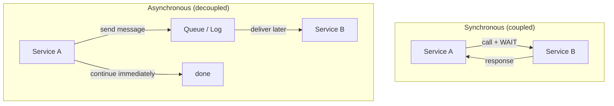
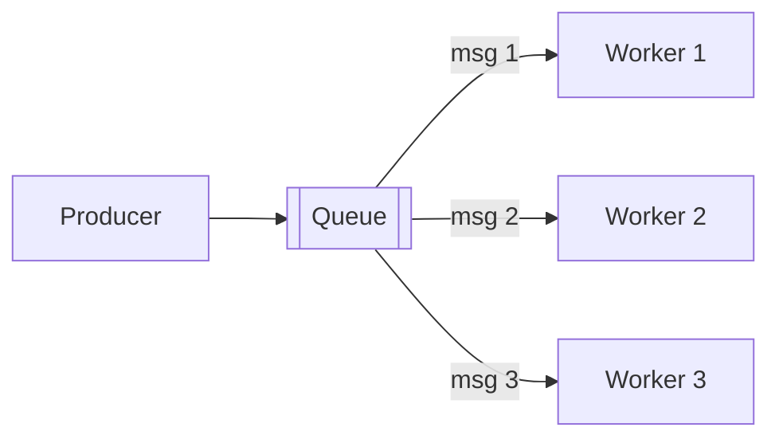
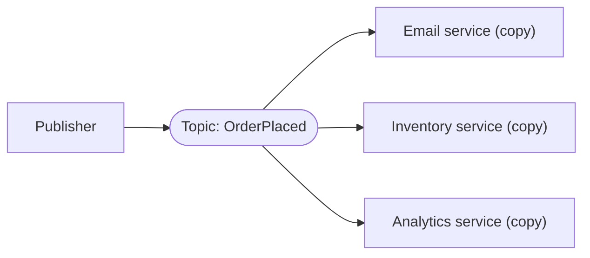
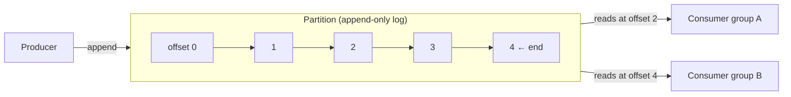
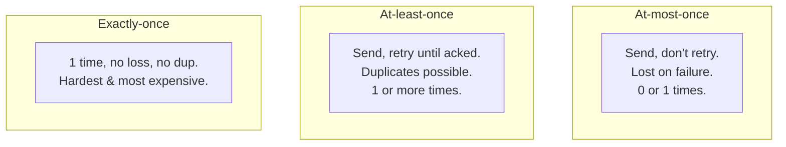
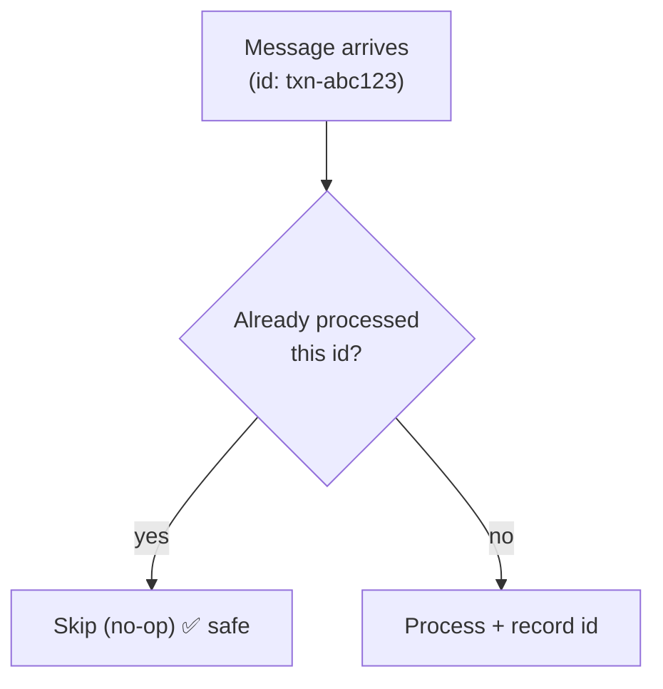
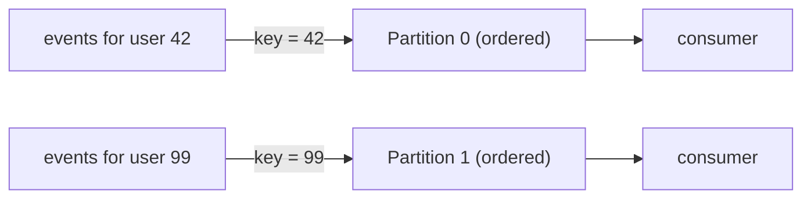
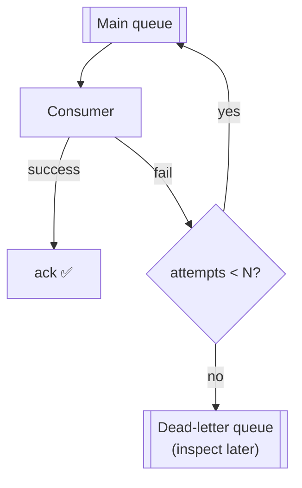
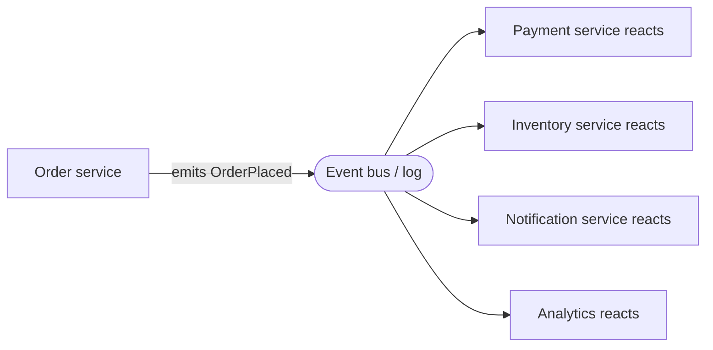

# System Design Deep Dive Series — Part 6: Messaging and Event-Driven Architecture

---

**Series:** System Design Deep Dive — From First Principles to Production Distributed Systems
**Part:** 6 of 11
**Prerequisite:** [Part 5 — Consistency, CAP/PACELC, and Consensus](system-design-deep-dive-part-5.md)
**Reading time:** ~45 minutes

---

## Why This Part Exists

Every component we've built so far talks to the next one **synchronously**: the app calls the database and waits, calls the cache and waits, calls another service and waits. This is simple, but it has a brutal property — **tight coupling**. If the thing you call is slow, *you* are slow. If it's down, *you* fail. When you send a confirmation email inside the checkout request, a slow email provider makes checkout slow; a down email provider makes checkout fail. That's absurd — the sale succeeded.

The fix is **asynchronous messaging**: instead of calling a service and waiting, you drop a **message** into a queue or log and move on. Something else processes it later. This one shift — from synchronous request/response to asynchronous messaging — is what lets large systems stay responsive and resilient under load, absorb spikes, and let services fail independently instead of in a cascade.

We'll cover: why async, the two models (**queues** vs **pub/sub**), the **log-based** model (Kafka) and why it's different, delivery guarantees (**at-least-once**, **at-most-once**, **exactly-once**), **idempotency** (the concept that makes async safe), ordering, backpressure and dead-letter queues, and event-driven architecture patterns. This part leans on the Kafka Deep Dive but stays at system-design altitude.

---

## 1. Synchronous vs Asynchronous

The core distinction:

**Synchronous** (Part 7's REST/gRPC calls): A calls B and blocks until B answers. Simple, immediate, easy to reason about — but A's fate is bound to B's latency and availability, and load on A directly loads B.

**Asynchronous:** A hands a message to a **broker** (a message queue or event log) and immediately continues. B consumes the message when it's ready. A and B are now **temporally decoupled** — they don't have to be up, fast, or even scaled at the same time.

The benefits of the async model:

- **Decoupling:** producers and consumers don't know about each other, only the broker. Add/change/remove consumers without touching producers.
- **Load leveling (buffering):** the queue absorbs spikes. If 10,000 requests arrive in a burst but consumers process 1,000/sec, the queue holds the backlog and consumers work through it steadily. The database never sees the spike. (This is the async cousin of caching's origin-offload from Part 4.)
- **Resilience:** if a consumer is down, messages wait safely in the queue instead of being lost. The consumer catches up when it recovers.
- **Responsiveness:** the user-facing path returns instantly ("order placed!") while slow work (email, invoicing, analytics) happens in the background.

The costs (there are always costs):

- **Complexity:** another system to run, monitor, and reason about.
- **Eventual consistency:** the work happens *later*, so the system's state is briefly inconsistent (the order exists, but the email hasn't sent yet). You accept this — it's the Part 5 trade-off again.
- **Harder debugging:** flow is no longer a linear stack trace; it's a chain of messages across systems (which is why Part 9's tracing matters).

**When to go async:** work that doesn't need to block the user response (notifications, emails, analytics, thumbnails, search indexing), spiky workloads, cross-service communication, and anything long-running. **When to stay sync:** the user genuinely needs the result *now* to proceed (you can't return a page that depends on data you haven't computed).

---

## 2. Two Messaging Models

### 2.1 Message Queue (point-to-point / work queue)

A queue holds messages; **one** consumer processes each message. With multiple consumers on a queue, they **share** the work — each message goes to exactly one of them (competing consumers). This is the pattern for **distributing tasks** across workers.

- Each message consumed **once**, by one worker.
- Add workers to increase throughput (they split the load) — horizontal scaling of processing.
- Classic uses: background jobs, task processing, order fulfillment. Examples: **RabbitMQ**, AWS SQS, ActiveMQ.

### 2.2 Publish/Subscribe (pub/sub / fan-out)

A publisher sends messages to a **topic**; **every** subscriber gets its **own copy** of each message. This is for **broadcasting an event** to many interested parties.

- Each subscriber sees **every** message (fan-out).
- Publisher doesn't know or care who's listening — total decoupling.
- Classic uses: event notifications, "when X happens, several unrelated things should react." Examples: Google Pub/Sub, AWS SNS, Redis Pub/Sub, and Kafka (which blends both — below).

**Queue = divide work among consumers. Pub/Sub = broadcast events to all consumers.** Many systems need both, and the log-based model unifies them.

---

## 3. The Log-Based Model (Kafka) — and Why It's Different

Traditional queues (RabbitMQ, SQS) **delete** a message once it's consumed and acknowledged. The log-based model — **Apache Kafka**, AWS Kinesis, Redpanda — works fundamentally differently, and the difference matters enough that it's its own category.

A Kafka **topic** is an append-only **log**, split into **partitions**. Producers append to the end; each message gets a monotonic **offset** (its position). Consumers read *forward* and **track their own offset** — they say "I've read up to position 12,345." Crucially, **consuming does not delete** the message; it stays in the log for a **retention period** (days, weeks, or forever).

This retained-log design gives Kafka properties queues don't have:

- **Replay:** because messages aren't deleted, a consumer can rewind its offset and **reprocess history** — reprocess after a bug fix, backfill a new service, retrain a model. Impossible when messages are deleted on consume.
- **Multiple independent consumers:** each **consumer group** tracks its own offset, so the *same* log serves many readers at their own pace — pub/sub (many groups each see all messages) and work-queue (members *within* a group split partitions) **at once**. One model does both.
- **Ordering within a partition:** messages in a partition are strictly ordered by offset. (Across partitions there's no global order — Section 6.)
- **Massive throughput:** appending to a log and letting consumers pull sequentially is mechanically sympathetic (sequential disk I/O, zero-copy), so Kafka scales to millions of messages/sec.

**Mental model:** a traditional queue is a to-do list you erase as you go; Kafka is a durable, replayable **event log** that many readers scan independently. Use a queue for transient task distribution; use a log when you want durability, replay, multiple consumers, or an event-sourced backbone (Section 8).

---

## 4. Delivery Guarantees

The most important correctness question in async systems: **how many times will a message be delivered?** Networks fail and acks get lost, so there are three possible guarantees, and the difference is a favorite interview probe.

### At-most-once

Fire and forget — deliver, don't retry. If it's lost, it's lost. **0 or 1** deliveries.

- Simplest and fastest, but you can **lose** messages.
- Fine only when loss is acceptable: some metrics, non-critical telemetry, sampled logs.

### At-least-once (the practical default)

Keep retrying until the consumer acknowledges. If an ack is lost, you retry and the consumer sees the message **again**. **1 or more** deliveries — never lost, but **duplicates possible.**

- No data loss, so it's the sane default for most systems.
- **You must handle duplicates** — which is what idempotency (Section 5) is for. This is the crux: at-least-once + idempotent consumers = correct, resilient processing. Nearly all robust systems are built this way.

### Exactly-once

Every message processed once — no loss, no duplication. The holy grail, and the hardest/most expensive.

- True end-to-end exactly-once across arbitrary systems is effectively impossible; what real systems (Kafka transactions, Flink) provide is **effectively-once** *within their boundary* via transactional writes + offset commits, or — more commonly — **at-least-once delivery + idempotent processing**, which achieves the same *observable* result more cheaply.
- Don't reach for exactly-once machinery when at-least-once + idempotency gives you the same outcome. That's the pragmatic wisdom.

> **The rule to remember:** aim for **at-least-once delivery**, and make your consumers **idempotent** so duplicates are harmless. This combination is simpler and more robust than chasing true exactly-once.

---

## 5. Idempotency: The Concept That Makes Async Safe

An operation is **idempotent** if doing it **multiple times has the same effect as doing it once.** Since at-least-once delivery *will* hand you duplicates, idempotency is what keeps duplicates from corrupting state. This is arguably the single most important practical concept in this part.

- `SET balance = 100` is idempotent — run it 5 times, balance is 100.
- `balance = balance + 100` is **not** — run it 5 times and you've added $500. A retried "credit $100" message would corrupt the account.

How to make consumers idempotent:

- **Idempotency keys / dedup:** attach a unique ID to each message/operation. The consumer records processed IDs and **skips** any it's already seen. ("Have I processed payment `txn-abc123`? Yes → ignore.") This is how payment APIs (Stripe's `Idempotency-Key`) prevent double charges on retry.
- **Natural idempotency:** design operations as "set to this state" rather than "apply this delta" where possible.
- **Conditional writes / versioning:** "insert this order *if it doesn't already exist*" (unique constraint), or compare-and-set on a version number, so a replay is a no-op.
- **Upserts:** "create or update" keyed on a stable ID — a duplicate just overwrites with the same value.

Design idempotency in from the start. It's the property that lets you retry freely, tolerate duplicates, replay a Kafka log, and recover from failures without fear — the foundation that makes the whole async model *safe*.

---

## 6. Ordering

Async systems can deliver messages **out of order**, especially with multiple partitions/consumers working in parallel. If order matters ("account created" must precede "account updated"), you must design for it.

- **Kafka:** order is guaranteed **within a partition**, not across partitions. So you route all messages that must be ordered to the **same partition** by choosing a **partition key** — e.g., key by `user_id` so all of one user's events land in one partition and stay ordered relative to each other. (This is the Part 3 partition-key idea again, applied to a log.)
- **Trade-off:** strict global ordering means a single partition/consumer — no parallelism, a throughput bottleneck. Per-key ordering (partition by key) is the usual compromise: order *where it matters*, parallelism everywhere else.
- **Or design order-independence:** if consumers are idempotent and operations commute, ordering may not matter at all — often the simplest answer.

---

## 7. Backpressure, Retries, and Dead-Letter Queues

Production messaging needs failure handling, or a single bad message can wedge the whole pipeline.

- **Backpressure:** when producers outpace consumers, the queue grows. You need a plan: scale up consumers (add workers — the queue makes this easy), shed or throttle producers, or bound the queue. A silently growing unbounded queue is latency and memory debt accumulating — **monitor queue depth / consumer lag** (Part 9). Rising Kafka consumer lag is the canonical "we're falling behind" signal.
- **Retries with backoff:** a failed message is retried, ideally with **exponential backoff + jitter** so a struggling downstream isn't hammered by synchronized retries (Part 8 revisits this).
- **Dead-Letter Queue (DLQ):** a message that fails repeatedly (a "poison message" — malformed, or triggering a bug) must not block the queue or retry forever. After N attempts, move it to a **DLQ** — a side queue for failed messages — so the main flow proceeds and humans can inspect the failures later. Every serious pipeline has a DLQ and an alarm on it.

---

## 8. Event-Driven Architecture

Async messaging isn't just an optimization for slow tasks — taken to its conclusion it becomes an **architectural style**: **event-driven architecture (EDA)**, where services communicate primarily by **emitting and reacting to events** ("OrderPlaced", "PaymentReceived", "InventoryReserved") rather than calling each other directly.

- **Extreme decoupling:** the order service just announces "an order was placed." It has no idea who reacts. Adding a new reaction (say, a loyalty-points service) means adding a new subscriber — **zero changes** to the order service. This is the strongest form of the decoupling we started the part with.
- **Related patterns:** **Event Sourcing** (store the system's state as an immutable *log of events* — the durable Kafka log becomes the source of truth, and current state is derived by replaying events); **CQRS** (Command Query Responsibility Segregation — separate the write model from optimized read models, often kept in sync via events); and the **Saga** pattern for managing a multi-service transaction as a sequence of local steps with compensating actions on failure (the practical answer to "we can't do a distributed ACID transaction across microservices" — Part 10).
- **The cost:** EDA maximizes flexibility and resilience but makes the system's behavior **emergent and harder to trace** — no single place describes the whole flow. This is precisely why observability (Part 9) becomes non-negotiable in event-driven systems.

EDA is powerful and increasingly common, but it's not free complexity — use it where decoupling and extensibility genuinely pay off, not everywhere.

---

## 9. Summary and What's Next

- **Async messaging** decouples services: a producer drops a message with a **broker** and moves on. Benefits — decoupling, **load leveling** (spike absorption), resilience, responsiveness. Costs — complexity, eventual consistency, harder debugging.
- **Queue** = one consumer per message (distribute work among competing workers). **Pub/Sub** = every subscriber gets a copy (broadcast events).
- **Log-based (Kafka)** retains messages after consumption, enabling **replay**, multiple independent **consumer groups**, per-partition ordering, and huge throughput. A queue is an erasable to-do list; a log is a durable, replayable event history.
- **Delivery guarantees:** at-most-once (may lose), **at-least-once** (may duplicate — the practical default), exactly-once (hardest; usually "effectively once"). Aim for at-least-once + idempotency.
- **Idempotency** — same effect no matter how many times applied — is what makes duplicates harmless and async *safe*. Use idempotency keys, conditional writes, upserts, "set" over "delta."
- **Ordering** is per-partition in Kafka; route must-be-ordered messages to one partition via a **key**. Global order kills parallelism — order only where it matters.
- Handle failure with **backpressure** management (monitor consumer lag), **retries with backoff + jitter**, and **dead-letter queues** for poison messages.
- **Event-driven architecture** makes events the primary integration mechanism — maximal decoupling and extensibility (Event Sourcing, CQRS, Sagas), at the cost of emergent behavior that demands strong observability.

**Next up — Part 7: API Design — REST, gRPC, GraphQL, and Gateways.** We've covered how services talk *asynchronously*; now the synchronous side — the contracts services and clients use to talk directly. **REST vs gRPC vs GraphQL** (and when each fits), API versioning, pagination, rate limiting, idempotency on the request path, and the **API gateway** that fronts it all — auth, routing, rate limiting, and aggregation. This is the surface your system presents to the world.
