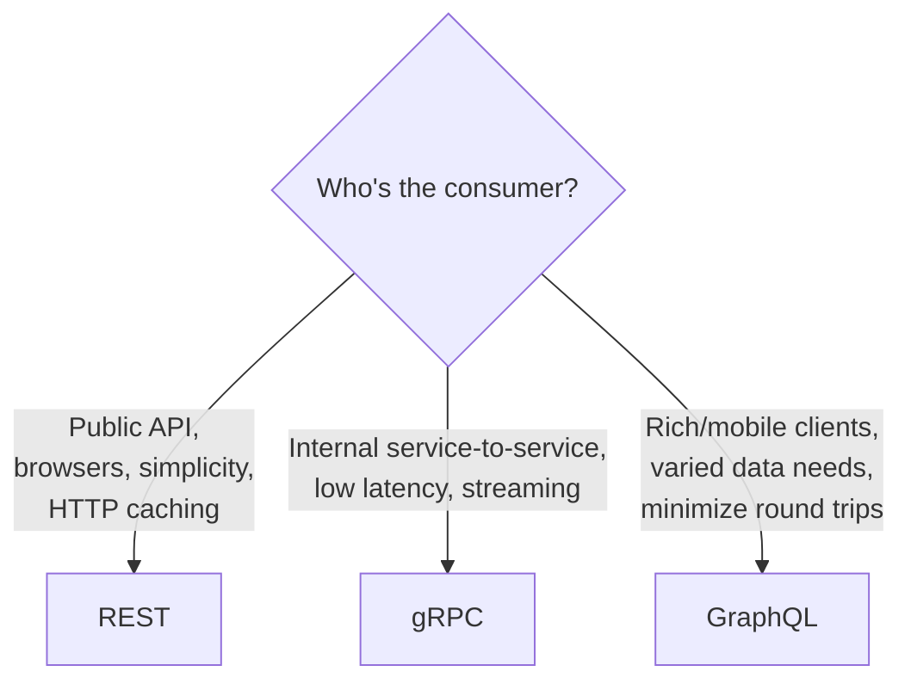
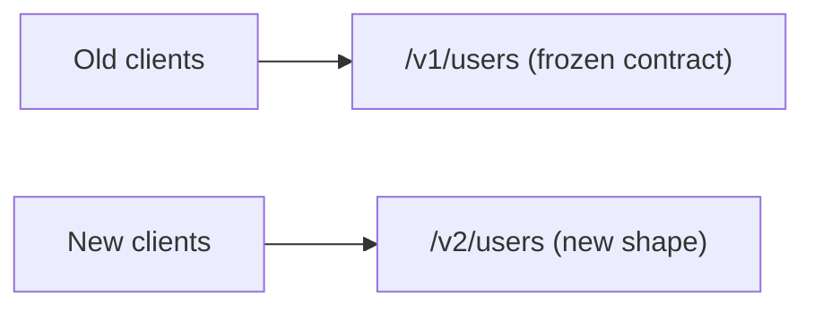
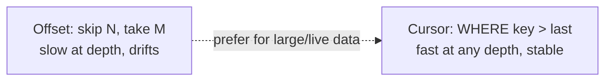
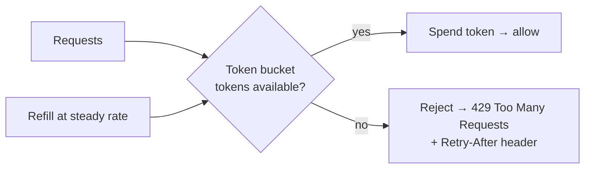
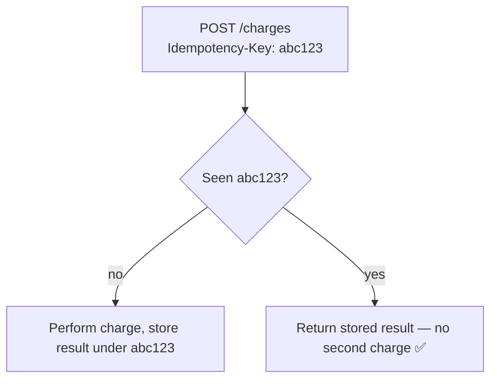
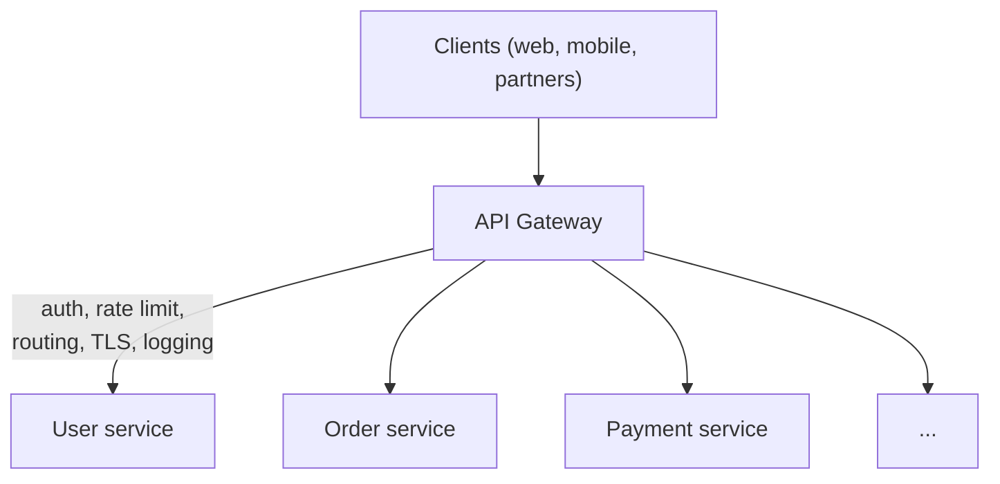

# System Design Deep Dive Series — Part 7: API Design — REST, gRPC, GraphQL, and Gateways

---

**Series:** System Design Deep Dive — From First Principles to Production Distributed Systems
**Part:** 7 of 11
**Prerequisite:** [Part 6 — Messaging and Event-Driven Architecture](system-design-deep-dive-part-6.md)
**Reading time:** ~45 minutes

---

## Why This Part Exists

Part 6 covered how services talk **asynchronously**. This part covers the **synchronous** side — the request/response contracts that clients use to talk to your system and that services use to talk to each other directly. This is the **surface** your system presents to the world, and it's the part users, mobile apps, partners, and other teams actually touch.

An API is a contract, and contracts are expensive to change once people depend on them. A well-designed API makes a system pleasant to build on and easy to evolve; a poorly designed one leaks internal details, breaks clients on every change, and becomes a permanent tax. We'll cover the three dominant paradigms — **REST, gRPC, GraphQL** — and exactly when each fits, then the cross-cutting concerns every real API needs: **versioning, pagination, rate limiting, idempotency, auth**, and the **API gateway** that fronts them all.

This part is where the abstract scaling machinery meets a concrete, human-facing (or service-facing) interface.

---

## 1. What an API Contract Must Do

Before paradigms, the job. A good API:

1. **Hides internals.** Clients depend on the contract, not your database schema or service topology. You can re-shard (Part 3) or split a service (Part 10) without breaking clients.
2. **Is predictable and consistent.** Same conventions everywhere — naming, errors, pagination — so learning one endpoint teaches you the rest.
3. **Evolves without breaking clients.** You can add capabilities without forcing every consumer to change on your schedule.
4. **Handles failure explicitly.** Clear status codes and error shapes so clients know what went wrong and whether to retry.

Keep these in mind — every choice below serves one of them.

---

## 2. The Three Paradigms

### 2.1 REST (Representational State Transfer)

**REST** models your system as **resources** (nouns) identified by URLs, manipulated with standard **HTTP methods** (verbs). It's the default for public web APIs and most web apps.

```
GET    /users/123          → fetch user 123
POST   /users              → create a user
PUT    /users/123          → replace user 123
PATCH  /users/123          → partially update user 123
DELETE /users/123          → delete user 123
GET    /users/123/orders   → fetch that user's orders
```

Key REST principles:

- **Resource-oriented:** URLs name *things* (`/orders/987`), not actions (`/getOrder`). Verbs live in the HTTP method.
- **HTTP semantics carry meaning:** methods, **status codes** (200 OK, 201 Created, 400 Bad Request, 401/403 auth, 404 Not Found, 429 Too Many Requests, 500/503 server), and headers are the vocabulary. Use them correctly and clients get a lot for free.
- **Stateless** (Part 1): each request carries everything needed; the server keeps no per-client session in memory.
- **Method semantics matter:** GET is **safe** (no side effects) and **cacheable** (Part 4's browser/CDN caching depends on this); PUT and DELETE are **idempotent** (repeating them has the same effect — Part 6's concept on the request path); POST is neither. Honor these and retries and caching just work.

**Pros:** universal, simple, human-readable, leverages all of HTTP (caching, status codes, tooling), great for public APIs. **Cons:** can be chatty (multiple round trips to assemble a screen's data), and **over-fetching / under-fetching** — an endpoint returns a fixed shape, so you get fields you don't need or must make more calls for fields you do.

### 2.2 gRPC

**gRPC** is a high-performance **RPC** (Remote Procedure Call) framework: instead of resources, you call **functions** on a remote service as if they were local (`GetUser(id)`, `CreateOrder(req)`). It uses **Protocol Buffers** (protobuf) — a compact **binary** format with a strict schema — over **HTTP/2**.

```protobuf
service UserService {
  rpc GetUser(GetUserRequest) returns (User);
  rpc ListOrders(ListOrdersRequest) returns (stream Order);
}
```

- **Binary + HTTP/2:** far smaller payloads than JSON and multiplexed connections → low latency, high throughput.
- **Schema-first (contract in `.proto`):** generates strongly-typed client and server code in many languages — no hand-writing serialization, and the compiler catches mismatches.
- **Streaming:** native support for client-, server-, and bidirectional **streaming** over one connection.

**Pros:** fastest of the three, strongly typed, excellent for **internal service-to-service** communication in a microservices mesh (Part 10), great with polyglot backends. **Cons:** not human-readable (binary), limited native browser support (needs a proxy like gRPC-Web), steeper tooling. **Rule of thumb:** gRPC **inside** the system (service-to-service), REST/GraphQL **at the edge** (public/browser-facing).

### 2.3 GraphQL

**GraphQL** is a **query language for APIs**: instead of many fixed endpoints, there's typically **one endpoint**, and the *client* specifies **exactly** what data it wants — including nested relationships — in a single request.

```graphql
query {
  user(id: "123") {
    name
    orders(last: 5) {
      total
      items { name price }
    }
  }
}
```

- **Client-specified queries:** the client asks for precisely the fields it needs — no more, no less. This directly kills REST's **over-fetching and under-fetching.**
- **One request for nested/related data:** fetch a user, their last 5 orders, and each order's items in **one** round trip — instead of REST's chain of calls.
- **Strong type system (schema):** the graph of types is introspectable and self-documenting.

**Pros:** eliminates over/under-fetching, ideal for **rich clients** (mobile, complex frontends) that need varied data shapes and want to minimize round trips, evolves without versioning (add fields freely). **Cons:** **caching is harder** (it's mostly POST to one URL, so HTTP/CDN caching from Part 4 doesn't apply out of the box); a naive query can be expensive or trigger the **N+1 problem** on the backend (needs batching/`DataLoader`); server complexity is higher; you must guard against malicious deeply-nested queries (query cost limits).

### 2.4 Choosing



| | REST | gRPC | GraphQL |
|---|---|---|---|
| Model | Resources + HTTP verbs | Remote function calls | Query language, one endpoint |
| Format | JSON (text) | Protobuf (binary) | JSON, client-specified |
| Transport | HTTP/1.1+ | HTTP/2 | HTTP (usually POST) |
| Best for | Public APIs, web | Internal microservices | Rich/mobile clients |
| Fetching | fixed shape (over/under) | fixed shape | exactly what's asked |
| HTTP caching | excellent | n/a | hard |
| Human-readable | yes | no | yes |

These aren't exclusive — a real system commonly uses **REST or GraphQL at the edge** (public and browser) and **gRPC between services** internally. Match the paradigm to the consumer.

---

## 3. API Versioning

APIs change; clients don't upgrade on your schedule. **Versioning** lets the contract evolve without breaking existing consumers — the "evolve without breaking" goal from Section 1.

- **Backward-compatible (non-breaking) changes** don't need a new version: adding a new optional field, a new endpoint, a new enum value clients can ignore. Prefer these — **additive change is free.**
- **Breaking changes** (removing/renaming a field, changing a type, changing behavior) require a version so old clients keep working.

Common strategies:

- **URL versioning:** `/v1/users`, `/v2/users`. Explicit, simple, visible, cache-friendly — the most common for public APIs.
- **Header versioning:** `Accept: application/vnd.api.v2+json`. Keeps URLs clean; less discoverable.
- **Query param:** `/users?version=2`. Simple but muddles caching.



**Principles:** prefer additive, backward-compatible changes so you rarely need a new version; when you must break, version explicitly and **run old and new in parallel** with a clear deprecation window; **never silently break** a contract clients depend on. (GraphQL often avoids versioned URLs by adding fields and deprecating old ones with `@deprecated` instead.)

---

## 4. Pagination

Never return an unbounded list. `GET /events` on a table with 50 million rows would try to serialize all of them — killing your server, the network, and the client. **Pagination** returns results in bounded pages. Two main approaches:

### Offset-based

`GET /items?limit=20&offset=40` → "skip 40, return the next 20." Simple and allows jumping to any page.

- **Problem 1 — slow at depth:** `OFFSET 1000000` still makes the database *scan and discard* a million rows. Deep pages get progressively slower.
- **Problem 2 — drift:** if items are inserted/deleted while paging, rows shift and you get **duplicates or skips** across pages.

### Cursor-based (keyset)

`GET /items?limit=20&after=<cursor>` → the cursor is an opaque pointer to the last item seen (typically an indexed, ordered key like an ID or timestamp). The next query is `WHERE id > cursor LIMIT 20`.

- **Fast at any depth:** it's an index seek, not a scan-and-discard — O(log n) regardless of how deep. This is why every large feed (Part 11) uses cursors.
- **Stable under inserts/deletes:** no drift, no duplicates.
- **Trade-off:** you can't jump to an arbitrary page number (only next/previous). For infinite-scroll feeds and large datasets, that's exactly the right shape.



**Rule:** offset for small, static, human-paged data (an admin table); **cursor for large, live, or infinite-scroll data** (feeds, event logs, anything at scale).

---

## 5. Rate Limiting

To protect your system from abuse, runaway clients, and accidental overload (and to enforce fair use and tiers), APIs enforce **rate limits** — a cap on requests per client per time window. This is also a first line of defense for the reliability we'll formalize in Part 8. The classic algorithms:

- **Fixed window:** count requests per calendar window (e.g., 1000/minute). Simple, but allows a **burst at the boundary** — 1000 at 11:59:59 and 1000 at 12:00:00 = 2000 in two seconds.
- **Sliding window:** smooths the boundary by considering a rolling time window. More accurate, slightly more state.
- **Token bucket:** a bucket refills tokens at a steady rate up to a capacity; each request spends a token; empty bucket → reject (429). **Allows controlled bursts** (up to bucket size) while bounding the long-run average. The most popular general-purpose choice.
- **Leaky bucket:** requests queue and drain at a fixed rate — smooths bursts into a steady outflow.



When rejecting, return **`429 Too Many Requests`** with a **`Retry-After`** header so well-behaved clients back off (Part 8's backoff). In a distributed fleet, rate-limit state is typically kept in a shared store like **Redis** (Part 4) so the limit is enforced across all servers, not per-server. Rate limiting usually lives at the **API gateway** (Section 7).

---

## 6. Idempotency on the Request Path

Part 6 introduced idempotency for async consumers; it matters just as much for **synchronous** APIs, because clients retry (on timeout, on network blip) and you must not double-charge or double-create.

- **GET, PUT, DELETE are idempotent by HTTP semantics** — a client can safely retry them.
- **POST is not** — "create an order" retried after a timeout could create **two** orders. The classic double-submit.

The fix is the **idempotency key**: the client sends a unique key (e.g., `Idempotency-Key: <uuid>`) with the POST. The server records the key with the result; if the *same* key arrives again (a retry), it returns the **original** result instead of performing the action twice. This is exactly how payment APIs make "charge this card" safe to retry — the same pattern as Part 6, applied to the request path.



Offer idempotency keys on any non-idempotent, high-stakes endpoint (payments, orders, transfers). It's the difference between a retry being safe and being a customer-support incident.

---

## 7. The API Gateway

As the system grows into many services (Part 10), you don't want every client talking to every service directly, and you don't want to reimplement auth, rate limiting, and logging in each service. The **API gateway** is a single entry point that fronts your services and handles cross-cutting concerns in one place.



What a gateway typically does:

- **Routing:** send each request to the right backend service (an L7 decision — Part 1).
- **Authentication & authorization:** verify identity (validate the JWT / API key / OAuth token) **once**, at the edge, so individual services can trust the request. Centralizing auth is a major reason gateways exist.
- **Rate limiting & quotas:** enforce the limits from Section 5 centrally (Part 8's protection).
- **TLS termination:** decrypt HTTPS at the edge (Part 1's L7 LB job).
- **Request/response transformation & aggregation:** adapt protocols (REST outside, gRPC inside) and sometimes combine several service calls into one client response (the **Backend-for-Frontend / BFF** pattern — a gateway tailored per client type).
- **Observability:** a single place to log, trace, and meter every request entering the system (Part 9).

The gateway is closely related to the **load balancer** (Part 1) — an LB spreads traffic across identical instances; a gateway makes **content-aware, application-level** decisions (auth, routing by path, aggregation). In practice they're layered: LB in front for raw distribution and HA, gateway behind it for the smart, per-request cross-cutting logic. The caution: a gateway is on the **critical path**, so it must be highly available and fast, or it becomes a bottleneck and a SPOF (Part 1's lesson, Part 8's remedy). Keep it thin — routing and cross-cutting concerns, not business logic.

---

## 8. Summary and What's Next

- An API is a **contract**: it hides internals, stays consistent, evolves without breaking clients, and handles failure explicitly.
- **REST** — resources + HTTP verbs/status codes, stateless, cache-friendly; great for public/web APIs but can over/under-fetch. **gRPC** — binary protobuf over HTTP/2, fast and strongly typed, ideal for internal service-to-service and streaming. **GraphQL** — client-specified queries from one endpoint, kills over/under-fetching for rich/mobile clients, but caching and backend cost are harder. Common combo: REST/GraphQL at the edge, gRPC inside.
- **Version** to evolve safely: prefer additive backward-compatible changes; version explicitly (usually URL) only for breaking changes and run old+new in parallel.
- **Paginate** everything: **offset** for small/static data, **cursor/keyset** for large, live, infinite-scroll data (fast at any depth, stable).
- **Rate limit** to protect the system: **token bucket** is the versatile default; reject with **429 + Retry-After**; keep shared state in Redis for a distributed fleet.
- Make non-idempotent endpoints safe to retry with **idempotency keys** (POST charges, orders, transfers) — the request-path twin of Part 6.
- The **API gateway** centralizes routing, auth, rate limiting, TLS, and observability at one entry point; it's L7 and content-aware, layered behind the load balancer. Keep it thin and highly available.

**Next up — Part 8: Reliability and Fault Tolerance.** We've built a fast, scalable, well-fronted system — but everything fails eventually: servers crash, networks partition, dependencies time out, gateways get overwhelmed. Part 8 is about designing for that reality: **redundancy and failover, timeouts and retries with backoff, circuit breakers and bulkheads, graceful degradation, idempotency for recovery, and measuring availability** (the "nines"). How do you build a system that *stays up* when its parts don't?
