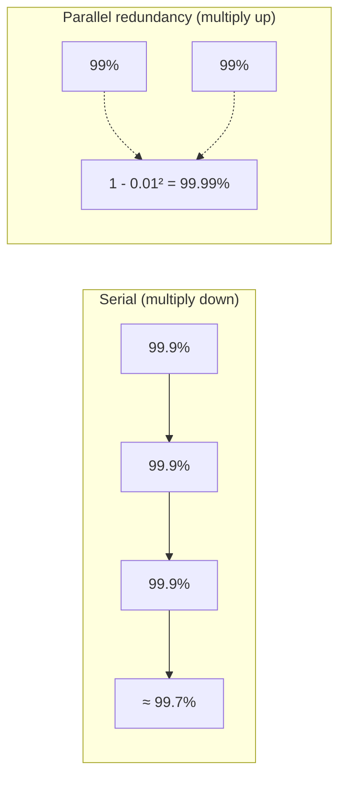
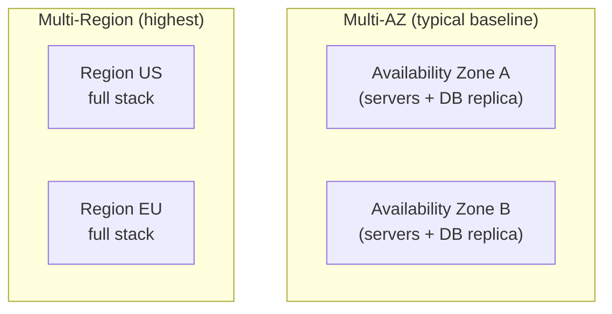
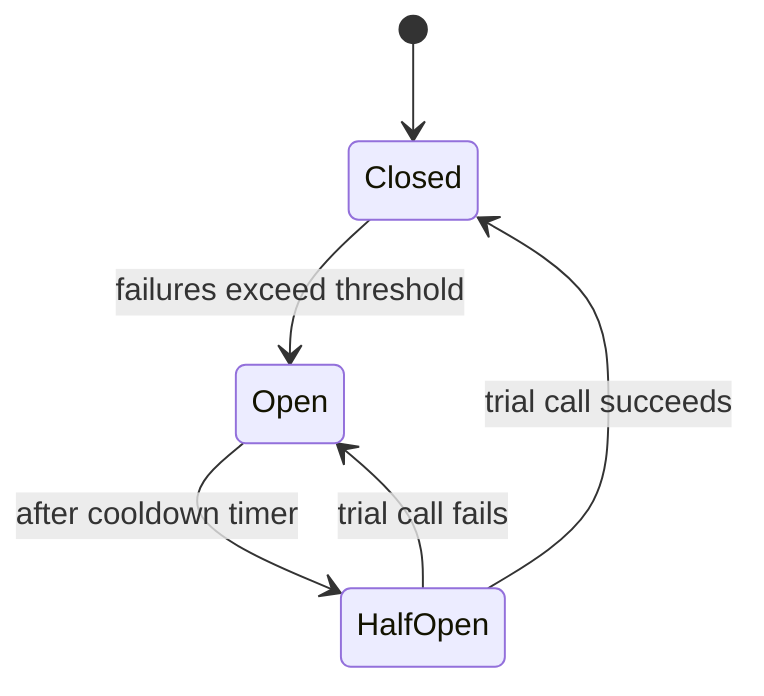
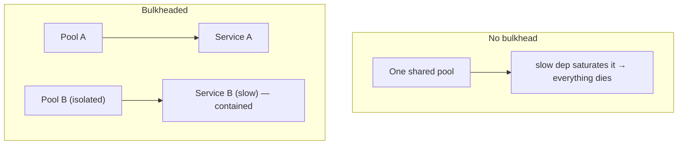
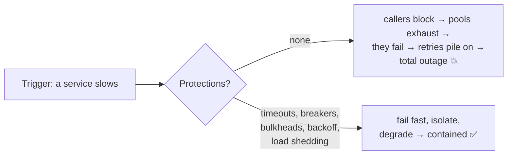

# System Design Deep Dive Series — Part 8: Reliability and Fault Tolerance

---

**Series:** System Design Deep Dive — From First Principles to Production Distributed Systems
**Part:** 8 of 11
**Prerequisite:** [Part 7 — API Design](system-design-deep-dive-part-7.md)
**Reading time:** ~45 minutes

---

## Why This Part Exists

We've built something fast, scalable, and well-fronted. Now the uncomfortable truth that every part has hinted at: **everything fails.** Servers crash, disks die, networks partition (Part 5), dependencies slow to a crawl, a deploy ships a bug, a whole data center loses power. At scale, failure isn't an exceptional event you can hope to avoid — with thousands of components, *something* is always broken. The only question is whether *your system* stays up when its parts don't.

This part is about designing for that reality. The mindset shift: stop trying to build components that never fail (impossible), and start building a **system that tolerates its components failing.** We'll cover redundancy and failover, the failure-handling toolkit (timeouts, retries with backoff, circuit breakers, bulkheads), graceful degradation, how to prevent cascading failures, and how to *measure* reliability (the "nines", SLAs). This is where a design becomes production-worthy.

---

## 1. Reliability, Availability, and the Language of Failure

Some precise vocabulary, because these words get used loosely:

- **Reliability:** the system performs correctly (does the right thing) even when things go wrong.
- **Availability:** the system is **up and responding** when needed. Usually the headline metric.
- **Fault:** one component deviating from spec (a disk fails). **Failure:** the *system* as a whole stops providing service. **The goal of fault tolerance is to prevent faults from becoming failures.**
- **Redundancy:** having spare/duplicate components so a fault in one doesn't cause a failure.
- **Resilience:** the system's ability to absorb faults and recover.

The central design principle of the whole part:

> **Assume every component will fail. Design so that no single failure — and ideally no small number of failures — takes down the system.**

This is why we insisted on statelessness (Part 1), redundant load balancers (Part 1), replication (Part 3), and idempotency (Part 6). They were all reliability investments. Now we assemble them into a discipline.

---

## 2. Measuring Availability: The Nines

You can't manage what you don't measure. Availability is expressed as a percentage of uptime — the **"nines"** — and the intuition people miss is how brutally each extra nine tightens the downtime budget:

| Availability | "Nines" | Downtime per year | Downtime per month |
|---|---|---|---|
| 99% | two nines | ~3.65 days | ~7.2 hours |
| 99.9% | three nines | ~8.76 hours | ~43 minutes |
| 99.99% | four nines | ~52.6 minutes | ~4.3 minutes |
| 99.999% | five nines | ~5.26 minutes | ~26 seconds |

Two lessons here:

1. **Each nine is ~10× harder** (and more expensive) than the last. Five nines means *any* human-in-the-loop response is too slow — recovery must be fully automatic.
2. **Serial dependencies multiply.** If your service calls three dependencies each at 99.9%, and you're down whenever *any* of them is down, your ceiling is 0.999³ ≈ **99.7%** — worse than any single component. Every synchronous dependency in the critical path drags availability *down*. This is a core argument for redundancy (parallel paths *raise* availability: two 99% components in true parallel give 99.99%) and for **removing dependencies from the critical path** (async — Part 6, degradation — Section 5).

Pick a target deliberately — five nines for a payment ledger, maybe three for an internal dashboard — because the target dictates how much redundancy and automation you must buy. More nines than you need is wasted money.

---

## 3. Redundancy and Failover

The foundation of fault tolerance is **redundancy** — no single instance of anything critical. We've applied it piecemeal; here's the discipline.

**Eliminate every single point of failure (SPOF).** Walk the request path and ask at each hop: "if this one thing dies, are we down?" If yes, it's a SPOF and needs a redundant twin. Part 1 taught the recurring lesson: *removing one SPOF reveals the next.* Keep walking until there's no single box whose death is fatal.

**Redundancy configurations:**

- **Active-active:** all replicas serve traffic simultaneously (e.g., stateless app servers behind an LB, Part 1). A failure just means the survivors carry more load. Best utilization, and failover is "do nothing" — traffic already flows to the healthy ones.
- **Active-passive (standby):** a primary serves; a standby waits and takes over on failure (e.g., a database leader with a promotable follower, Part 3). Simpler for stateful components; the standby's capacity sits idle.

**Failover** is the act of shifting to the redundant component when one fails: detect the failure (health checks — Part 1), redirect traffic/promote a replica, and do it fast. Recall the hard parts from Part 3 — detection ambiguity (dead vs slow), potential data loss with async replication, and **split-brain**, prevented by consensus/quorums (Part 5).

**Redundancy tiers — how far up do you go?**

- **Multiple servers** → survive a server death.
- **Multiple Availability Zones (AZs)** → survive a data-center/power/network failure. This is the standard production baseline in the cloud: spread every tier across ≥2 AZs.
- **Multiple regions** → survive an entire region outage, and serve users closer (Part 1's GeoDNS/Anycast). The strongest and most complex/expensive — you now face cross-region data replication and consistency (Part 5). Reserve for the highest availability targets.

---

## 4. The Fault-Handling Toolkit

Redundancy handles a component *dying*. The subtler danger is a component that's *sick* — slow, timing out, intermittently erroring — because sickness **spreads**. These patterns contain it.

### 4.1 Timeouts

**Never wait forever.** A call with no timeout, to a hung dependency, blocks a thread/connection indefinitely. Enough blocked requests and *your* service exhausts its resources and dies too — the sickness spread. **Every** network call (DB, cache, service, external API) must have a sensible timeout, so a slow dependency fails *fast* instead of hanging you. Timeouts are the most basic and most-forgotten reliability control.

### 4.2 Retries with Exponential Backoff and Jitter

Many failures are **transient** — a blip, a brief overload, a dropped packet. **Retrying** often succeeds. But naive retries are dangerous:

- Retry **immediately and forever** → you hammer an already-struggling dependency, making it *worse* (a **retry storm**).
- Everyone retries at the **same interval** → synchronized thundering herds slam the recovering service in waves.

The correct recipe:

- **Exponential backoff:** wait progressively longer between attempts (100ms, 200ms, 400ms, 800ms…), giving the dependency room to recover.
- **Jitter:** add randomness to each delay so retries **spread out** instead of synchronizing (the same jitter idea as cache-TTL in Part 4).
- **A retry budget / max attempts:** cap total retries so you fail cleanly instead of retrying into oblivion.
- **Only retry idempotent operations** (Parts 6–7) — retrying a non-idempotent POST can double-charge. Idempotency and retries are partners.

### 4.3 Circuit Breakers

If a dependency is *persistently* down, continuing to call it (even with backoff) wastes resources, piles up latency, and delays the inevitable failure. A **circuit breaker** — modeled on an electrical fuse — stops calling a failing dependency and **fails fast** instead.

- **Closed** (normal): calls flow through; the breaker counts failures.
- **Open** (tripped): too many recent failures, so **all calls fail immediately** (or fall back — Section 5) without even trying the sick dependency. This gives it room to recover and keeps *your* threads from piling up on a doomed call.
- **Half-open** (testing): after a cooldown, let a **trial** call through. Success → close (recovered). Failure → re-open and wait again.

The circuit breaker is what turns "my dependency is down" from a cascading outage into a fast, contained, recoverable degradation. It's essential in any microservices system (Part 10).

### 4.4 Bulkheads

Named after a ship's watertight compartments: a hull breach floods one compartment, not the whole ship. **Bulkheading** isolates resources so a failure in one area can't consume *all* resources and sink everything.

For example, don't share one connection/thread pool across all downstream calls — if a slow dependency saturates the shared pool, *every* feature stalls. Give each dependency (or tenant, or request class) its **own** pool, so one sick dependency exhausts only its own compartment while the rest keep serving.

---

## 5. Graceful Degradation and Fallbacks

When something fails, the choice isn't only "work perfectly" vs "total outage." A resilient system **degrades gracefully** — it sheds non-essential functionality to keep the core working. This is the reliability payoff of decoupling (Part 6) and circuit breakers (4.3).

- **Fallbacks:** when a dependency is down (breaker open), return a sensible substitute — cached/stale data (Part 4), a default value, or a partial response — instead of an error. A product page whose recommendation service is down should still show the product, just without the "you might also like" strip.
- **Feature toggles / load shedding:** under extreme load, *deliberately* turn off expensive non-critical features to protect the core. Better to disable rich previews than to let the whole site collapse. Reject the lowest-priority traffic first (**load shedding**) so the system does *some* useful work rather than failing at everything.
- **Fail static / fail open vs closed:** decide, per feature, the safe default when a dependency is unavailable — e.g., a personalization service failing should fall back to a generic experience (fail open to *some* content), while an auth check failing should **deny** (fail closed). The right default depends on whether availability or safety matters more for that specific thing.

> **Principle:** a partial, degraded experience beats a blank error page. Design the "what do we show when X is down?" answer *before* X goes down.

---

## 6. Preventing Cascading Failures

The scariest production outages are **cascades**: one component fails, its load or retries overwhelm the next, which fails and overwhelms the next, until the whole system is down — often from a small initial trigger. Everything above is really in service of stopping cascades. The main mechanisms and their remedies:

- **Retry storms** → exponential backoff + jitter + retry budgets (4.2).
- **Resource exhaustion from hung calls** → timeouts (4.1) + bulkheads (4.4).
- **Hammering a sick dependency** → circuit breakers (4.3).
- **Overload** → **load shedding** and rate limiting (Part 7) — protect the system by rejecting excess work *early* (with 429/503) rather than accepting everything and collapsing. A system that serves 80% of traffic well is far better than one that accepts 100% and dies.
- **The thundering herd on recovery** → jittered backoff and gradual ramp-up, so a recovering service isn't instantly re-flooded.

A related discipline: **chaos engineering** — deliberately injecting failures in production (Netflix's Chaos Monkey randomly kills instances) to *prove* the system tolerates them, rather than discovering it doesn't during a real outage. If you claim fault tolerance, test it on purpose.

---

## 7. A Reliability Checklist

Pulling the toolkit together — what a production-grade design should have:

- [ ] **No SPOFs** — every critical component redundant (servers, LB, DB, gateway), spread across **≥2 AZs**.
- [ ] **Stateless app tier** (Part 1) so any instance can fail and be replaced freely.
- [ ] **Replication + automated failover** for stateful stores (Part 3), with split-brain protection (Part 5).
- [ ] **Timeouts** on every network call.
- [ ] **Retries** with exponential backoff + jitter + budgets, on **idempotent** ops only.
- [ ] **Circuit breakers** around every external dependency.
- [ ] **Bulkheads** isolating resource pools.
- [ ] **Graceful degradation / fallbacks** defined for each dependency being down.
- [ ] **Load shedding + rate limiting** (Part 7) to survive overload.
- [ ] **Health checks + auto-replacement** of unhealthy instances (Part 1).
- [ ] **Idempotency** so retries and replays are safe (Parts 6–7).
- [ ] A chosen **availability target** and the redundancy/automation to match it.
- [ ] Failure modes **tested** (chaos, game days), not assumed.

---

## 8. Summary and What's Next

- At scale, **failure is constant**. The goal is a system that tolerates component **faults** without becoming a system **failure**. Assume everything fails; design so no single failure is fatal.
- **Availability** is measured in **nines**; each nine is ~10× harder, and **serial dependencies multiply availability down** while **parallel redundancy multiplies it up**. Pick a target and buy the redundancy it requires.
- **Redundancy** eliminates SPOFs; **active-active** (stateless) and **active-passive** (stateful) configurations, spread across **AZs** (baseline) or **regions** (highest). **Failover** must be fast and split-brain-safe.
- The fault-handling toolkit contains *sick* dependencies: **timeouts** (never hang), **retries with backoff + jitter** (on idempotent ops), **circuit breakers** (fail fast on persistent failure), **bulkheads** (isolate resource pools).
- **Graceful degradation** — fallbacks, feature toggles, load shedding, sensible fail-open/closed defaults — keeps the core working when parts don't. A degraded experience beats an error page.
- Most catastrophic outages are **cascades**; every pattern here exists to stop one. **Load-shed** excess traffic rather than collapse, and **test failure on purpose** (chaos engineering).

**Next up — Part 9: Observability and Operations — SLOs, Metrics, Tracing.** You've built a system designed to survive failure — but you can't operate what you can't see. When something breaks at 3 a.m. (and it will), how do you *know*, and how do you find the cause fast? Part 9 covers the three pillars — **metrics, logs, and traces** — plus **SLIs/SLOs and error budgets** (turning Part 8's "nines" into an operating discipline), alerting that doesn't cry wolf, and distributed tracing across the async, event-driven, microservice mess we've built.
