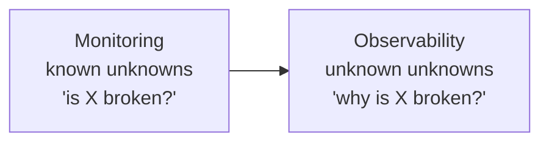
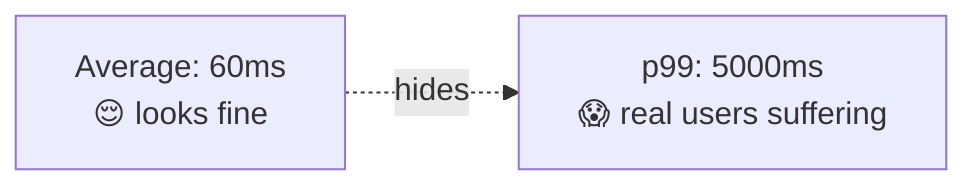
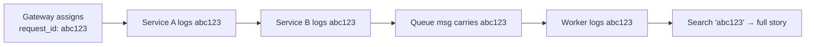
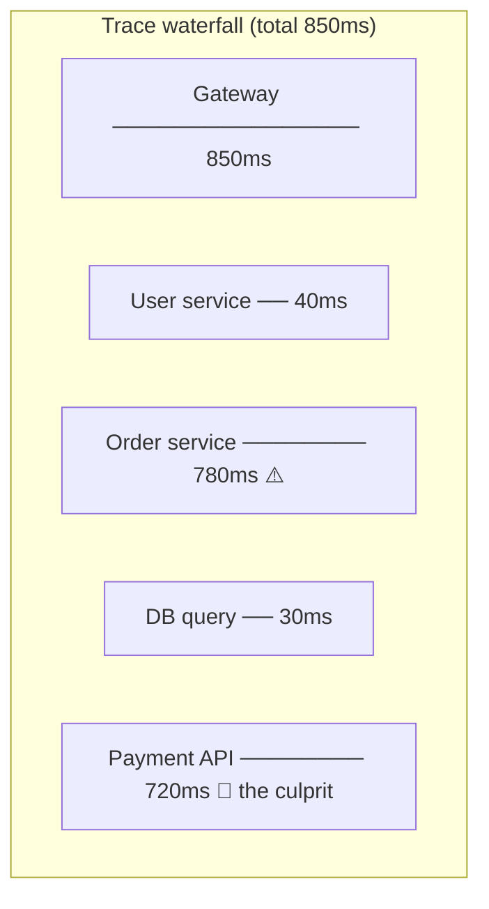
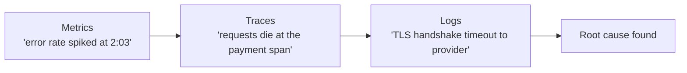
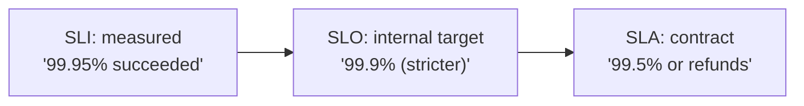
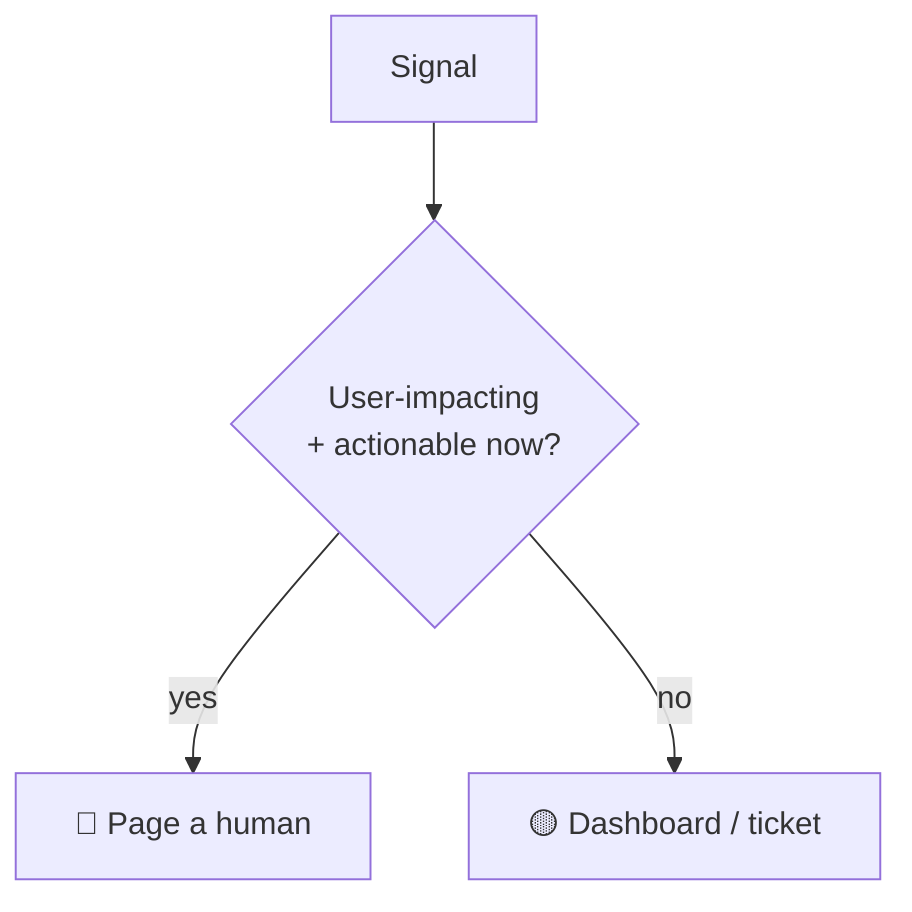

# System Design Deep Dive Series — Part 9: Observability and Operations — SLOs, Metrics, and Tracing

---

**Series:** System Design Deep Dive — From First Principles to Production Distributed Systems
**Part:** 9 of 11
**Prerequisite:** [Part 8 — Reliability and Fault Tolerance](system-design-deep-dive-part-8.md)
**Reading time:** ~40 minutes

---

## Why This Part Exists

Part 8 built a system designed to survive failure. But there's a catch nobody escapes: **you cannot operate what you cannot see.** When latency spikes at 3 a.m., when a deploy quietly breaks 2% of requests, when a consumer starts lagging (Part 6) or a circuit breaker trips (Part 8) — how do you *know*, and how do you find the cause before users do?

The system we've built is a distributed, asynchronous, event-driven, multi-service organism (Parts 6–8). A single user request now fans out across a gateway, several services, caches, queues, and databases. When it fails, the old approach — SSH into the box and read the log — is hopeless. You don't even know *which* box. **Observability** is the discipline that makes such a system understandable from the outside.

We'll cover the difference between monitoring and observability, the **three pillars** (metrics, logs, traces), **distributed tracing** (essential for the microservice mess), **SLIs/SLOs/error budgets** (turning Part 8's "nines" into an operating discipline), alerting that doesn't cry wolf, and the operational practices that keep it all running.

---

## 1. Monitoring vs Observability

A useful distinction:

- **Monitoring** answers **known** questions: "Is CPU high? Is the error rate above 1%? Is the service up?" You define dashboards and alerts for failure modes you *anticipated*.
- **Observability** is the property that lets you answer **unknown** questions after the fact: "Why are *these specific* users in *this region* seeing slow checkouts *only* when they use a saved card?" — a failure mode you never predicted.

Monitoring tells you **that** something is wrong. Observability lets you explore **why** — without shipping new code to add the instrumentation you wish you had. In a simple monolith, monitoring is often enough. In the distributed system we've built, novel failure modes are the norm, so you need genuine observability: rich, high-cardinality, correlated telemetry you can slice arbitrarily.

The foundation of observability is the **three pillars**: metrics, logs, and traces. Each answers a different question; you need all three.

---

## 2. Pillar 1 — Metrics

**Metrics** are numeric measurements aggregated over time — cheap to store, fast to query, ideal for dashboards and alerts. They tell you the *health and shape* of the system at a glance. Examples: requests/sec, error rate, latency percentiles, CPU/memory, queue depth, cache hit ratio (Part 4), consumer lag (Part 6).

The canonical starting sets:

- **The Four Golden Signals** (Google SRE): **Latency**, **Traffic**, **Errors**, **Saturation**. If you track only four things per service, track these.
- **RED** (for request-driven services): **Rate**, **Errors**, **Duration**.
- **USE** (for resources): **Utilization**, **Saturation**, **Errors**.

### Measure latency with percentiles, not averages

The single most important metrics lesson. **Averages lie about latency.** If 99 requests take 10ms and one takes 5 seconds, the average is ~60ms — which describes *no actual request* and hides the user who waited 5 seconds. Use **percentiles**:

- **p50 (median):** the typical experience.
- **p95 / p99:** the tail — the slowest 5% / 1%. This is where real users feel pain.
- **p99.9:** the extreme tail, which matters enormously at scale (at 1M requests, that's 1,000 requests) and for **fan-out** requests — if a page makes 100 backend calls, it's slow if *any one* hits the p99, so tail latency dominates the actual user experience.

**Track p50, p95, and p99 for latency, always.** "What's your p99?" is a standard senior question because it reveals whether you understand tail latency.

---

## 3. Pillar 2 — Logs

**Logs** are timestamped records of discrete events — the granular detail metrics lack. When a metric tells you the error rate jumped, logs tell you *what the errors actually were*. Two practices make logs useful at scale:

- **Structured logging:** emit logs as structured data (JSON with fields: `timestamp`, `level`, `service`, `user_id`, `request_id`, `error`) rather than free-text strings. Structured logs are *queryable* — "show me all `ERROR` logs for `service=payment` and `user_id=123` in the last hour" — which unstructured text isn't.
- **Centralized aggregation:** in a fleet of hundreds of instances, logs must ship to a **central** system (ELK/OpenSearch, Loki, Datadog, Splunk) where you search across *all* instances at once. You never SSH to a box — you don't know which box, and the box may be gone (ephemeral, autoscaled — Part 1).

The killer feature that ties logs to everything else: the **correlation ID** (request/trace ID). Generate a unique ID at the edge (the gateway — Part 7) for each incoming request and **propagate it** through every service, queue message, and log line that request touches. Now you can retrieve *every* log entry for one request across the entire distributed system by filtering on one ID. Without it, correlating logs across services is guesswork. With it, you reconstruct the whole story. This same ID is the bridge to the third pillar.

**Caution:** logs are expensive at volume. Log at appropriate levels, sample high-volume debug logs, set retention, and **never log secrets or PII**.

---

## 4. Pillar 3 — Traces

Metrics say *the system* is slow. Logs give per-service detail. But in a request that touches 15 services, *which* hop caused the slowness? That's what **distributed tracing** answers — and it's the pillar that makes microservices (Part 10) operable at all.

A **trace** follows a single request across *all* services it touches. Each unit of work is a **span** (with a start, duration, service name, and metadata); spans are linked into a tree via a shared **trace ID** (the correlation ID from Section 3) and parent/child span IDs. Visualized as a waterfall, a trace shows exactly where time went:

At a glance: the slowness is the Payment API call, not the database, not the gateway. Without tracing you'd guess; with it you *see* it. Tracing turns "the system is slow somewhere" into "this specific downstream call is the problem."

Because tracing every request is expensive at high volume, systems **sample** (keep a fraction, or use tail-based sampling to keep the *interesting* traces — the slow and errored ones). **OpenTelemetry (OTel)** is the vendor-neutral standard for instrumenting and exporting traces, metrics, and logs — the current default for wiring all three pillars together, propagating trace context across service and queue boundaries automatically.

### The three pillars together

A real investigation flows across all three: a **metric** alert fires (something's wrong) → **traces** localize *which* service/hop → **logs** for that trace's ID reveal the exact error. Metrics detect, traces localize, logs explain.

---

## 5. SLIs, SLOs, and Error Budgets

Part 8 introduced availability targets ("nines"). Observability is how you *operationalize* them, and the vocabulary — from Google's SRE practice — is essential.

- **SLI (Service Level Indicator):** a *measured* number about service quality. E.g., "the proportion of requests served in under 200ms," or "the proportion of requests that succeed (non-5xx)." An SLI is literally a metric (Section 2) chosen to represent user happiness.
- **SLO (Service Level Objective):** your *internal target* for an SLI. E.g., "99.9% of requests succeed over a rolling 28 days," or "p99 latency < 300ms." The SLO is the promise you hold *yourselves* to.
- **SLA (Service Level Agreement):** a *contractual* promise to customers, with financial penalties if breached. SLAs are looser than SLOs — you set the internal SLO *stricter* than the external SLA so you get warned (and act) before you breach the contract.

### The Error Budget — the key idea

If your SLO is 99.9% success, then **0.1% failure is acceptable** — that 0.1% is your **error budget**. This reframes reliability from "never fail" (impossible, and infinitely expensive — Part 8) to "stay within budget," which is a powerful operational tool:

- **Budget remaining → ship features.** If you're comfortably within budget, you can take risks: deploy faster, run experiments. Reliability is "good enough," so optimize for velocity.
- **Budget exhausted → freeze and stabilize.** If you've burned the budget (too many recent failures), stop shipping risky changes and focus on reliability until you're back under SLO.

The error budget turns the eternal dev-vs-ops tension ("move fast" vs "keep it stable") into a **shared, data-driven decision**. It also stops you gold-plating: chasing 99.999% when the SLO is 99.9% is wasted money — you have budget to spend, so spend it on features. This is the mature answer to "how reliable should we make it?": exactly as reliable as the SLO, no more.

---

## 6. Alerting That Doesn't Cry Wolf

Telemetry is only useful if it *summons a human* when it should — and stays quiet when it shouldn't. Bad alerting is worse than none: an avalanche of noisy alerts causes **alert fatigue**, and the one alert that mattered gets ignored at 3 a.m.

Principles for humane, effective alerting:

- **Alert on symptoms, not causes.** Page on what users feel — "checkout success rate dropped below SLO," "p99 latency > 1s" — not on every internal metric ("CPU is 80%"). High CPU that isn't hurting users is not an emergency. **Alert on SLO burn.**
- **Every page must be actionable.** If a human is woken up, there must be something to *do*. Alerts that require no action should be a dashboard or a ticket, not a page.
- **Use error-budget burn rate.** Alert when you're consuming the error budget *fast* (a burn-rate alert), which catches real, ongoing problems and ignores tiny transient blips — the modern SRE approach that dramatically cuts noise.
- **Severity tiers:** page (wake someone) only for user-impacting, act-now problems; route everything else to tickets/Slack. Protect the page.

And when something *does* break: a **blameless postmortem** afterward — document what happened, why, and what will prevent recurrence, focusing on **systems and process, not blaming individuals**. People are honest about failures only when they won't be punished for them, and honesty is how the system actually improves.

---

## 7. Operational Practices

Observability lives inside a broader operational discipline that keeps the system healthy and evolving safely:

- **Safe deployments.** Ship changes without big-bang risk: **rolling** deploys (replace instances gradually — Part 1's connection draining makes this seamless), **blue-green** (run a parallel new version, switch traffic over, instant rollback), and **canary** (route a small % of traffic to the new version, watch the metrics/SLOs, then ramp up or roll back). Canaries turn a deploy into a monitored experiment.
- **Feature flags.** Decouple *deploy* from *release* — ship code dark, then turn features on gradually via a flag, and kill them instantly without a redeploy if metrics degrade (the load-shedding/toggle idea from Part 8).
- **Autoscaling.** Use metrics (CPU, request rate, queue depth) to add/remove instances automatically (Part 1's elasticity), scaling out for spikes and in to save cost — only safe *because* the app tier is stateless.
- **Runbooks and on-call.** Document how to diagnose and respond to known issues so on-call engineers aren't reverse-engineering the system at 3 a.m.; rotate on-call humanely.
- **Capacity planning.** Use historical metrics to provision ahead of growth and known spikes (Part 0's estimation applied continuously) so you scale *before* saturation, not during an outage.

These practices close the loop: you build for reliability (Part 8), *observe* to know your true state (this part), and *operate* — deploy, scale, respond — using that visibility.

---

## 8. Summary and What's Next

- **Monitoring** answers known questions ("is X broken?"); **observability** lets you answer unknown ones ("*why* is X broken?") after the fact — essential for the distributed system we've built.
- The **three pillars**: **metrics** (aggregated numbers — health, dashboards, alerts; track latency as **p50/p95/p99**, never averages), **logs** (structured, centralized, tied together by a **correlation ID**), **traces** (follow one request across all services to localize the slow/failing hop).
- Metrics **detect**, traces **localize**, logs **explain** — a real investigation flows across all three, stitched by a shared trace/request ID (OpenTelemetry is the standard).
- **SLI** (measured) → **SLO** (internal target, set stricter than) → **SLA** (contract). The **error budget** (1 − SLO) reframes reliability as "stay within budget," balancing feature velocity against stability with data instead of opinion.
- **Alert on symptoms and SLO burn**, make every page actionable, and protect against alert fatigue. Run **blameless postmortems**.
- **Operate** safely with canary/blue-green/rolling deploys, feature flags, autoscaling, runbooks, and capacity planning — all powered by the visibility observability provides.

**Next up — Part 10: Monolith vs Microservices and the Service Mesh.** We've been assuming "services" (plural) for several parts now — but *should* your system be many services at all? Part 10 confronts the biggest architectural decision: **monolith vs microservices** — the real trade-offs (not the hype), when each is right, Conway's Law, the operational tax microservices impose (much of which is Parts 6–9), how services find and secure each other (service discovery, service mesh), and the distributed-data problems (sagas, the dual-write problem) that splitting up creates.
