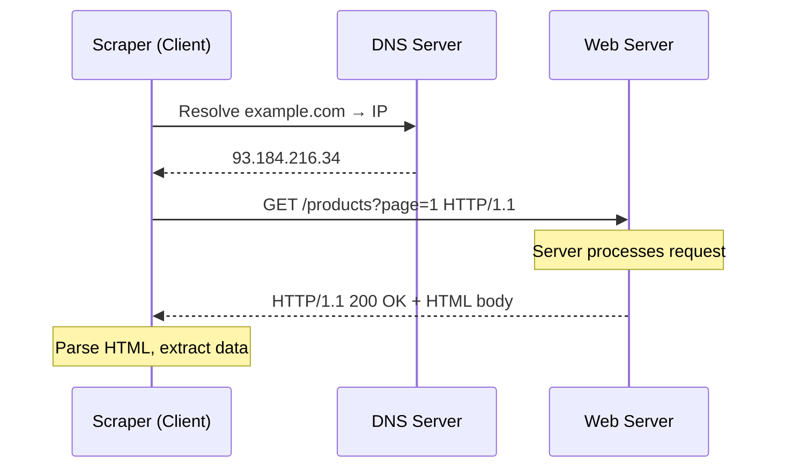
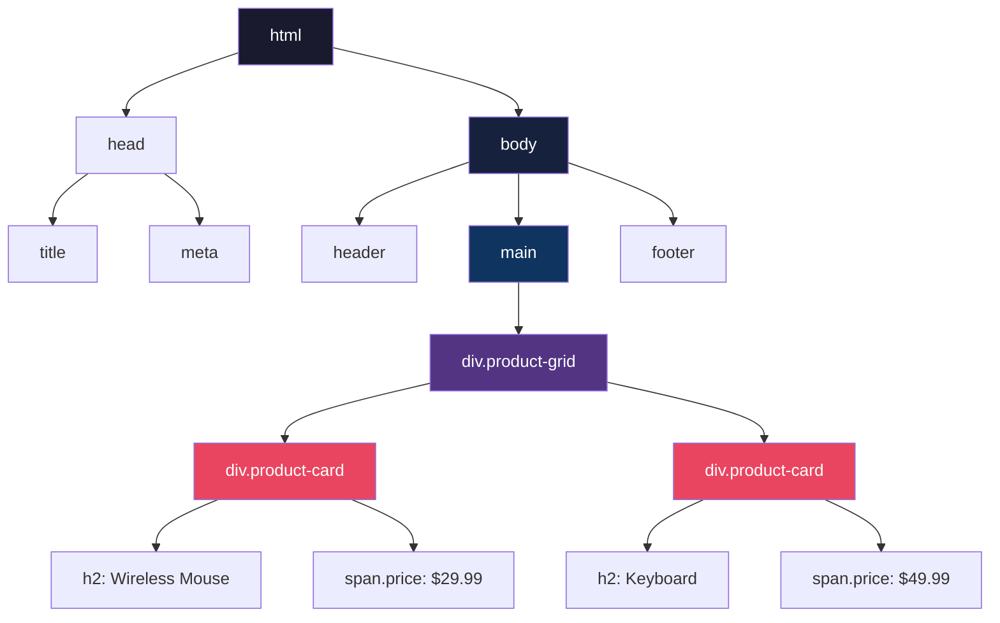
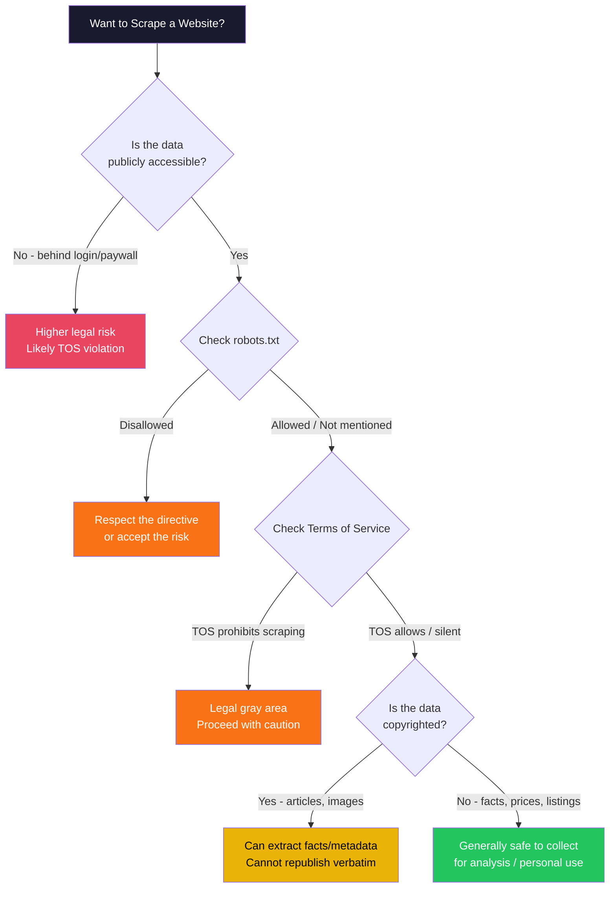
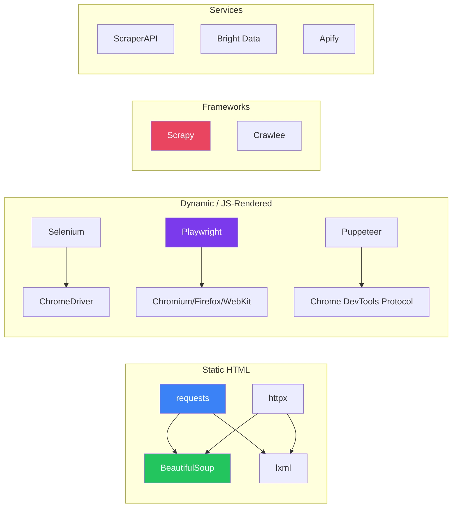
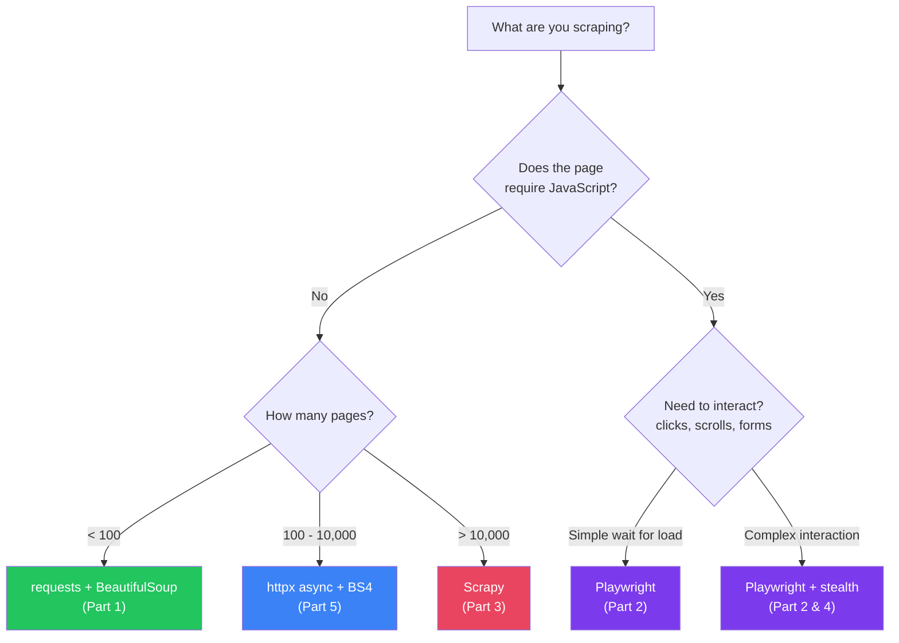

# Web Scraping Deep Dive — Part 0: Foundations — HTTP, Ethics, and the Scraping Landscape

---

**Series:** Web Scraping — A Developer's Deep Dive
**Part:** 0 of 5 (Foundation)
**Audience:** Developers with Python experience who want to learn web scraping from the ground up
**Reading time:** ~40 minutes

---

## Table of Contents

1. [Why Web Scraping Matters](#1-why-web-scraping-matters)
2. [The HTTP Protocol — Your Scraper's Language](#2-the-http-protocol--your-scrapers-language)
3. [Anatomy of an HTTP Request](#3-anatomy-of-an-http-request)
4. [Anatomy of an HTTP Response](#4-anatomy-of-an-http-response)
5. [HTML — The Document You Are Parsing](#5-html--the-document-you-are-parsing)
6. [Ethics, Legality, and robots.txt](#6-ethics-legality-and-robotstxt)
7. [The Web Scraping Tools Landscape](#7-the-web-scraping-tools-landscape)
8. [Your First Scraper — Putting It All Together](#8-your-first-scraper--putting-it-all-together)
9. [Common Pitfalls and How to Avoid Them](#9-common-pitfalls-and-how-to-avoid-them)
10. [Vocabulary](#10-vocabulary)
11. [What's Next](#11-whats-next)

---

## 1. Why Web Scraping Matters

You need data. Maybe it is competitor pricing, job listings, research papers, public government records, or product reviews. Sometimes an API exists. Often, it does not. Even when it does, the API may be rate-limited, expensive, or incomplete compared to what the website shows.

Web scraping is the practice of programmatically extracting data from websites. It sits at the intersection of HTTP networking, HTML parsing, data engineering, and (increasingly) browser automation.

**Real-world use cases:**

| Domain | Use Case | Data Source |
|--------|----------|-------------|
| **E-commerce** | Price monitoring, product catalog aggregation | Amazon, Shopify stores |
| **Finance** | Sentiment analysis from news, SEC filings | News sites, financial portals |
| **Research** | Academic paper metadata, citation graphs | Google Scholar, PubMed |
| **Real Estate** | Listing aggregation, price trend analysis | Zillow, Realtor.com |
| **Recruiting** | Job posting aggregation, salary analysis | LinkedIn, Indeed |
| **Machine Learning** | Training data collection for NLP models | Wikipedia, Common Crawl |

> **Key insight:** Web scraping is not "hacking." It is reading publicly available web pages programmatically — the same thing a browser does, minus the rendering. The legality and ethics depend on *what* you scrape, *how* you scrape it, and *what you do with the data*.

---

## 2. The HTTP Protocol — Your Scraper's Language

Every web page you visit in a browser is delivered via HTTP (HyperText Transfer Protocol). Your scraper must speak this language fluently.

### 2.1 The Request-Response Cycle



**Step by step:**

1. **DNS Resolution** — Your scraper resolves the domain name to an IP address.
2. **TCP Connection** — A TCP connection (often TLS-encrypted for HTTPS) is established.
3. **HTTP Request** — Your scraper sends a request with a method, path, headers, and optionally a body.
4. **HTTP Response** — The server returns a status code, headers, and a body (usually HTML, JSON, or binary data).
5. **Parsing** — Your scraper extracts the data it needs from the response body.

### 2.2 HTTP Methods Relevant to Scraping

| Method | Purpose | When You Use It |
|--------|---------|-----------------|
| **GET** | Retrieve a resource | 95% of scraping — fetching pages, images, files |
| **POST** | Submit data to the server | Login forms, search forms, paginated APIs |
| **HEAD** | Retrieve headers only (no body) | Checking if a page exists, getting content-type before full download |
| **OPTIONS** | Check allowed methods | Rarely needed — useful for debugging CORS issues |

Most scraping is just GET requests. POST becomes important when you need to log in, submit forms, or interact with APIs that require a request body.

---

## 3. Anatomy of an HTTP Request

```
GET /products?category=electronics&page=2 HTTP/1.1
Host: example.com
User-Agent: Mozilla/5.0 (Windows NT 10.0; Win64; x64) AppleWebKit/537.36
Accept: text/html,application/xhtml+xml,application/xml;q=0.9
Accept-Language: en-US,en;q=0.5
Accept-Encoding: gzip, deflate, br
Connection: keep-alive
Cookie: session_id=abc123; preferences=dark_mode
```

### 3.1 Request Line

```
GET /products?category=electronics&page=2 HTTP/1.1
 |        |                                   |
 Method   Path + Query String                 Protocol Version
```

- **Method:** What action to perform (GET, POST, etc.)
- **Path:** The resource being requested, with query parameters after `?`
- **Protocol:** Almost always HTTP/1.1 or HTTP/2

### 3.2 Headers That Matter for Scraping

| Header | Why It Matters | Example |
|--------|---------------|---------|
| `User-Agent` | Identifies your client. Servers often block non-browser UAs | `Mozilla/5.0 (Windows NT 10.0; Win64; x64)...` |
| `Accept` | What content types you accept | `text/html,application/json` |
| `Cookie` | Session tokens, authentication | `session_id=abc123` |
| `Referer` | The page that linked to this request | `https://example.com/search` |
| `Accept-Encoding` | Compression support | `gzip, deflate, br` |
| `Authorization` | API keys, Bearer tokens | `Bearer eyJhbGci...` |

> **Key insight:** The `User-Agent` header is the first thing most anti-scraping systems check. A request with `User-Agent: python-requests/2.28.0` screams "I am a bot." Always set a realistic browser User-Agent.

### 3.3 Query Parameters vs. Request Body

```python
import requests

# GET with query parameters (visible in URL)
response = requests.get(
    "https://example.com/api/products",
    params={"category": "electronics", "page": 2, "sort": "price_asc"}
)
# URL becomes: https://example.com/api/products?category=electronics&page=2&sort=price_asc

# POST with request body (hidden from URL)
response = requests.post(
    "https://example.com/api/login",
    json={"username": "user@example.com", "password": "secret"}
)
```

---

## 4. Anatomy of an HTTP Response

```
HTTP/1.1 200 OK
Content-Type: text/html; charset=utf-8
Content-Length: 45832
Set-Cookie: session_id=xyz789; Path=/; HttpOnly
Cache-Control: max-age=3600
X-RateLimit-Remaining: 98
X-RateLimit-Reset: 1640000000

<!DOCTYPE html>
<html>
<head><title>Products — Electronics</title></head>
<body>
  <div class="product-grid">
    <div class="product-card" data-id="12345">
      <h2>Wireless Mouse</h2>
      <span class="price">$29.99</span>
    </div>
    <!-- ... more products ... -->
  </div>
</body>
</html>
```

### 4.1 Status Codes Every Scraper Must Handle

| Code | Meaning | Scraper Action |
|------|---------|----------------|
| **200** | OK — success | Parse the body |
| **301/302** | Redirect | Follow the `Location` header (requests does this automatically) |
| **403** | Forbidden | You are blocked. Rotate User-Agent, use proxy, check robots.txt |
| **404** | Not Found | Skip this URL, log it |
| **429** | Too Many Requests | Back off. Respect `Retry-After` header |
| **500** | Server Error | Retry with exponential backoff |
| **503** | Service Unavailable | Server overloaded or maintenance. Retry later |

### 4.2 Response Headers That Matter

```python
import requests

response = requests.get("https://example.com/products")

# Check content type before parsing
content_type = response.headers.get("Content-Type", "")
if "text/html" in content_type:
    # Parse as HTML
    pass
elif "application/json" in content_type:
    data = response.json()

# Respect rate limits
remaining = int(response.headers.get("X-RateLimit-Remaining", 100))
if remaining < 5:
    reset_time = int(response.headers.get("X-RateLimit-Reset", 0))
    sleep_seconds = max(0, reset_time - time.time())
    time.sleep(sleep_seconds)

# Check encoding
print(response.encoding)  # 'utf-8'
```

---

## 5. HTML — The Document You Are Parsing

HTML is a tree structure. Understanding this tree is essential for extracting data accurately.

### 5.1 The DOM Tree



### 5.2 Element Anatomy

```html
<div class="product-card" data-id="12345" id="product-12345">
     |          |                |              |
     Tag     Class attr       Custom attr     ID attr

  <h2>Wireless Mouse</h2>        ← Text content
  <span class="price">$29.99</span>
    ← Self-closing, attributes
  <a href="/products/12345">View Details</a>             ← Link with href
</div>
```

### 5.3 CSS Selectors — The Query Language for HTML

CSS selectors are how you tell your parser *which* elements to extract. Master these and you can extract anything.

| Selector | Matches | Example |
|----------|---------|---------|
| `tag` | All elements of that tag | `div`, `h2`, `span` |
| `.class` | Elements with that class | `.product-card`, `.price` |
| `#id` | Element with that ID | `#product-12345` |
| `tag.class` | Tag with class | `div.product-card` |
| `parent child` | Descendant (any depth) | `div.product-grid h2` |
| `parent > child` | Direct child only | `.product-card > h2` |
| `[attr]` | Elements with attribute | `[data-id]` |
| `[attr=val]` | Attribute equals value | `[data-id="12345"]` |
| `tag:nth-child(n)` | Nth child of parent | `tr:nth-child(2)` |
| `tag:first-child` | First child | `li:first-child` |
| `a, b` | Either selector | `.price, .sale-price` |

```python
from bs4 import BeautifulSoup

html = """
<div class="product-grid">
  <div class="product-card" data-id="1"><h2>Mouse</h2><span class="price">$29.99</span></div>
  <div class="product-card" data-id="2"><h2>Keyboard</h2><span class="price">$49.99</span></div>
</div>
"""

soup = BeautifulSoup(html, "html.parser")

# By class
cards = soup.select(".product-card")            # All product cards
prices = soup.select(".product-card .price")     # All prices inside cards

# By attribute
card = soup.select_one('[data-id="1"]')          # Single card by data attribute

# By hierarchy
titles = soup.select(".product-grid > div > h2") # Direct descendant chain

for card in cards:
    name = card.select_one("h2").text
    price = card.select_one(".price").text
    data_id = card["data-id"]
    print(f"ID={data_id}: {name} — {price}")

# Output:
# ID=1: Mouse — $29.99
# ID=2: Keyboard — $49.99
```

---

## 6. Ethics, Legality, and robots.txt

Before you scrape a single page, you must understand the rules — both legal and ethical.

### 6.1 The Legal Landscape



**Key legal precedents:**

| Case | Ruling | Takeaway |
|------|--------|----------|
| **hiQ vs. LinkedIn (2022)** | Scraping public data is not a CFAA violation | Public data is fair game |
| **Meta vs. Bright Data (2024)** | Scraping logged-in content can violate TOS | Authenticated scraping is risky |
| **Ryanair vs. PR Aviation** | Database rights can restrict systematic extraction (EU) | EU has stronger data protections |

### 6.2 robots.txt — The Gentleman's Agreement

Every well-behaved scraper checks `robots.txt` first. It is a file at the root of every website that tells crawlers which paths they may or may not access.

```
# https://example.com/robots.txt

User-agent: *
Disallow: /admin/
Disallow: /private/
Disallow: /api/internal/
Crawl-delay: 2

User-agent: Googlebot
Allow: /
Crawl-delay: 0

Sitemap: https://example.com/sitemap.xml
```

**Parsing robots.txt in Python:**

```python
from urllib.robotparser import RobotFileParser
from urllib.parse import urljoin

def can_scrape(url: str, user_agent: str = "*") -> bool:
    """Check if a URL is allowed by robots.txt."""
    rp = RobotFileParser()
    # Construct robots.txt URL from the target URL
    from urllib.parse import urlparse
    parsed = urlparse(url)
    robots_url = f"{parsed.scheme}://{parsed.netloc}/robots.txt"

    rp.set_url(robots_url)
    rp.read()

    return rp.can_fetch(user_agent, url)

# Usage
url = "https://example.com/products/electronics"
if can_scrape(url):
    print("Safe to scrape")
else:
    print("Blocked by robots.txt — do not scrape")
```

### 6.3 Ethical Scraping Checklist

1. **Check robots.txt** before scraping any domain
2. **Respect rate limits** — never hammer a server with rapid-fire requests
3. **Identify yourself** — use a descriptive User-Agent with contact info for large crawls
4. **Cache aggressively** — do not re-download pages you already have
5. **Scrape during off-peak hours** — minimize impact on the server
6. **Do not scrape personal data** — emails, phone numbers, private profiles (GDPR, CCPA)
7. **Do not bypass authentication** — scraping behind a login wall is legally riskier
8. **Store only what you need** — do not hoard entire websites

> **Key insight:** robots.txt is not legally binding in most jurisdictions, but ignoring it signals bad faith. If a company sues you for scraping, the first thing their lawyers will check is whether you respected their robots.txt.

---

## 7. The Web Scraping Tools Landscape



### 7.1 Tool Comparison

| Tool | Best For | JS Support | Speed | Learning Curve |
|------|----------|-----------|-------|----------------|
| **requests + BeautifulSoup** | Simple static pages | No | Fast | Low |
| **httpx + BeautifulSoup** | Async static pages | No | Very Fast | Low |
| **lxml** | High-performance parsing | No | Fastest parser | Medium |
| **Selenium** | Legacy browser automation | Yes | Slow | Medium |
| **Playwright** | Modern browser automation | Yes | Medium | Medium |
| **Scrapy** | Large-scale crawling | With plugins | Fast | High |
| **Crawlee** | Full-stack scraping (Node.js) | Yes | Fast | Medium |

### 7.2 Decision Matrix



---

## 8. Your First Scraper — Putting It All Together

Let's build a complete scraper that respects robots.txt, handles errors gracefully, and extracts structured data.

```python
# filename: first_scraper.py
# A well-behaved scraper with proper error handling and rate limiting

import time
import json
import logging
from dataclasses import dataclass, asdict
from urllib.parse import urljoin, urlparse
from urllib.robotparser import RobotFileParser

import requests
from bs4 import BeautifulSoup

logging.basicConfig(level=logging.INFO, format="%(asctime)s [%(levelname)s] %(message)s")
logger = logging.getLogger(__name__)

# --- Configuration ---
BASE_URL = "https://books.toscrape.com"
USER_AGENT = "MyLearningBot/1.0 (contact: you@example.com)"
REQUEST_DELAY = 1.5  # seconds between requests
MAX_RETRIES = 3

# --- Data Model ---
@dataclass
class Book:
    title: str
    price: float
    rating: int
    availability: str
    url: str

# --- Robots.txt Check ---
def check_robots(base_url: str, path: str) -> bool:
    """Verify we are allowed to scrape this path."""
    rp = RobotFileParser()
    rp.set_url(urljoin(base_url, "/robots.txt"))
    try:
        rp.read()
        return rp.can_fetch(USER_AGENT, urljoin(base_url, path))
    except Exception as e:
        logger.warning(f"Could not read robots.txt: {e}. Proceeding with caution.")
        return True  # If robots.txt is unreachable, proceed carefully

# --- HTTP Fetching with Retries ---
def fetch_page(url: str) -> requests.Response | None:
    """Fetch a page with retries and proper headers."""
    headers = {
        "User-Agent": USER_AGENT,
        "Accept": "text/html,application/xhtml+xml,application/xml;q=0.9,*/*;q=0.8",
        "Accept-Language": "en-US,en;q=0.5",
        "Accept-Encoding": "gzip, deflate, br",
    }

    for attempt in range(1, MAX_RETRIES + 1):
        try:
            response = requests.get(url, headers=headers, timeout=15)

            if response.status_code == 200:
                return response
            elif response.status_code == 429:
                retry_after = int(response.headers.get("Retry-After", 30))
                logger.warning(f"Rate limited. Sleeping {retry_after}s...")
                time.sleep(retry_after)
            elif response.status_code == 404:
                logger.warning(f"Page not found: {url}")
                return None
            else:
                logger.warning(f"HTTP {response.status_code} for {url} (attempt {attempt})")

        except requests.exceptions.Timeout:
            logger.warning(f"Timeout for {url} (attempt {attempt})")
        except requests.exceptions.ConnectionError:
            logger.error(f"Connection failed for {url} (attempt {attempt})")

        if attempt < MAX_RETRIES:
            wait = 2 ** attempt  # Exponential backoff: 2s, 4s, 8s
            logger.info(f"Retrying in {wait}s...")
            time.sleep(wait)

    logger.error(f"Failed to fetch {url} after {MAX_RETRIES} attempts")
    return None

# --- Parsing ---
RATING_MAP = {"One": 1, "Two": 2, "Three": 3, "Four": 4, "Five": 5}

def parse_book_list(html: str, base_url: str) -> tuple[list[Book], str | None]:
    """Parse a listing page and return books + next page URL."""
    soup = BeautifulSoup(html, "html.parser")
    books = []

    for article in soup.select("article.product_pod"):
        title_tag = article.select_one("h3 a")
        price_tag = article.select_one(".price_color")
        rating_tag = article.select_one("p.star-rating")
        avail_tag = article.select_one(".availability")

        if not all([title_tag, price_tag]):
            continue

        # Extract rating from class name: "star-rating Three" → 3
        rating_classes = rating_tag.get("class", []) if rating_tag else []
        rating_word = [c for c in rating_classes if c != "star-rating"]
        rating = RATING_MAP.get(rating_word[0], 0) if rating_word else 0

        book = Book(
            title=title_tag["title"],
            price=float(price_tag.text.strip().replace("£", "")),
            rating=rating,
            availability=avail_tag.text.strip() if avail_tag else "Unknown",
            url=urljoin(base_url, title_tag["href"]),
        )
        books.append(book)

    # Find next page link
    next_btn = soup.select_one("li.next a")
    next_url = urljoin(base_url, next_btn["href"]) if next_btn else None

    return books, next_url

# --- Main Scraper ---
def scrape_books(max_pages: int = 3) -> list[Book]:
    """Scrape book listings with pagination."""
    # Step 1: Check robots.txt
    if not check_robots(BASE_URL, "/catalogue/"):
        logger.error("Scraping disallowed by robots.txt")
        return []

    all_books = []
    current_url = f"{BASE_URL}/catalogue/page-1.html"
    page = 1

    while current_url and page <= max_pages:
        logger.info(f"Scraping page {page}: {current_url}")

        # Step 2: Fetch the page
        response = fetch_page(current_url)
        if not response:
            break

        # Step 3: Parse the HTML
        books, next_url = parse_book_list(response.text, current_url)
        all_books.extend(books)
        logger.info(f"  Found {len(books)} books (total: {len(all_books)})")

        # Step 4: Rate limiting — be polite
        current_url = next_url
        page += 1
        if current_url:
            time.sleep(REQUEST_DELAY)

    return all_books

# --- Entry Point ---
if __name__ == "__main__":
    books = scrape_books(max_pages=3)

    # Save as JSON
    with open("books.json", "w", encoding="utf-8") as f:
        json.dump([asdict(b) for b in books], f, indent=2, ensure_ascii=False)

    logger.info(f"Scraped {len(books)} books. Saved to books.json")

    # Preview
    for book in books[:5]:
        print(f"  {'★' * book.rating}{'☆' * (5 - book.rating)} {book.title[:40]:40s} £{book.price:.2f}")
```

**Expected Output:**

```
2024-01-15 10:00:01 [INFO] Scraping page 1: https://books.toscrape.com/catalogue/page-1.html
2024-01-15 10:00:02 [INFO]   Found 20 books (total: 20)
2024-01-15 10:00:03 [INFO] Scraping page 2: https://books.toscrape.com/catalogue/page-2.html
2024-01-15 10:00:04 [INFO]   Found 20 books (total: 40)
2024-01-15 10:00:06 [INFO] Scraping page 3: https://books.toscrape.com/catalogue/page-3.html
2024-01-15 10:00:07 [INFO]   Found 20 books (total: 60)
2024-01-15 10:00:07 [INFO] Scraped 60 books. Saved to books.json
  ★★★☆☆ A Light in the Attic                   £51.77
  ★★★★★ Tipping the Velvet                      £53.74
  ★★★★☆ Soumission                               £50.10
  ...
```

**What this scraper does right:**

1. Checks robots.txt before sending any request
2. Uses a descriptive User-Agent with contact info
3. Implements exponential backoff on failures
4. Handles rate limiting (429 responses)
5. Adds a delay between requests (polite crawling)
6. Uses structured data models (`@dataclass`)
7. Limits pagination to avoid runaway crawls

---

## 9. Common Pitfalls and How to Avoid Them

### Pitfall 1: Not Handling Encoding

```python
# BAD — assumes UTF-8
text = response.content.decode("utf-8")

# GOOD — let requests detect encoding, with fallback
response.encoding = response.apparent_encoding  # Uses chardet
text = response.text
```

### Pitfall 2: Brittle Selectors

```python
# BAD — breaks if the HTML structure changes even slightly
price = soup.find_all("div")[3].find_all("span")[1].text

# GOOD — semantic selector that survives minor layout changes
price = soup.select_one(".product-card .price").text
```

### Pitfall 3: Ignoring Relative URLs

```python
# BAD — breaks for relative links
link = a_tag["href"]  # "/products/123" — not a full URL!

# GOOD — always resolve relative URLs
from urllib.parse import urljoin
link = urljoin(base_url, a_tag["href"])  # "https://example.com/products/123"
```

### Pitfall 4: No Timeouts

```python
# BAD — hangs forever if server doesn't respond
response = requests.get(url)

# GOOD — always set a timeout
response = requests.get(url, timeout=(5, 15))  # (connect_timeout, read_timeout)
```

### Pitfall 5: Fetching the Same Page Twice

```python
# GOOD — track visited URLs
visited = set()

def fetch_if_new(url: str) -> requests.Response | None:
    normalized = url.split("?")[0].rstrip("/")  # Normalize URL
    if normalized in visited:
        return None
    visited.add(normalized)
    return fetch_page(url)
```

---

## 10. Vocabulary

| Term | Definition |
|------|-----------|
| **DOM** | Document Object Model — the tree structure of an HTML document |
| **CSS Selector** | A pattern that matches HTML elements (e.g., `.class`, `#id`, `tag`) |
| **User-Agent** | A header identifying the client software making the request |
| **robots.txt** | A file at the root of a website specifying crawling rules |
| **Rate Limiting** | Server-side restriction on how many requests a client can make per time window |
| **Exponential Backoff** | Progressively increasing wait times between retries (1s, 2s, 4s, 8s...) |
| **Crawl Delay** | A directive in robots.txt specifying minimum seconds between requests |
| **Pagination** | Splitting content across multiple pages, each accessed via a URL parameter or "next" link |
| **Query String** | The part of a URL after `?` containing key-value parameters |
| **Idempotent** | A request that produces the same result regardless of how many times it is made (GET is idempotent) |

---

## 11. What's Next

In **Part 1**, we go deep into BeautifulSoup and the `requests` library. You will learn:

- Every BeautifulSoup method you will actually use
- Navigating the DOM tree — parent, sibling, and descendant traversal
- Extracting data from tables, lists, nested structures
- Session handling — cookies, login flows, CSRF tokens
- Building a structured data extraction pipeline

---

**Series:** [Web Scraping Deep Dive — Index](index.md)
**Next:** [Part 1 — BeautifulSoup & Requests](web-scraping-deep-dive-part-1.md)
