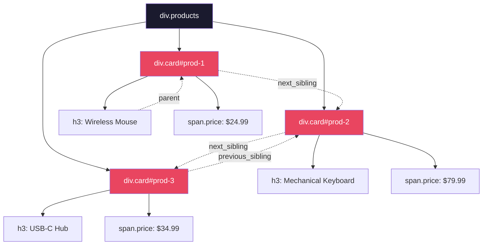
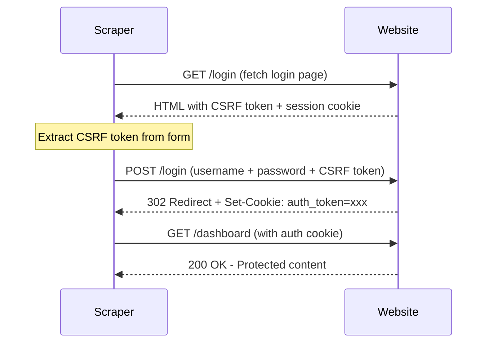
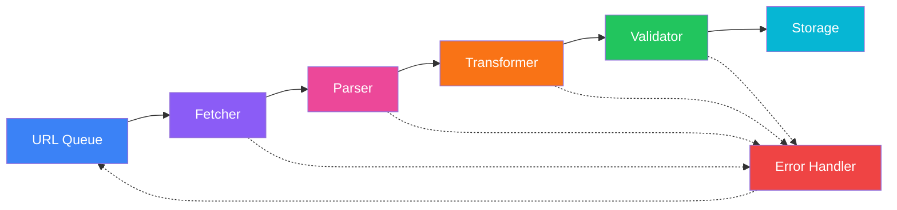

# Web Scraping Deep Dive - Part 1: BeautifulSoup & Requests - Parsing and Extraction

---

**Series:** Web Scraping - A Developer's Deep Dive
**Part:** 1 of 5 (Core Skills)
**Audience:** Developers who have completed Part 0 and want to master static page scraping
**Reading time:** ~45 minutes

---

## Table of Contents

1. [The requests Library - Beyond GET](#1-the-requests-library--beyond-get)
2. [BeautifulSoup - The Parser's Swiss Army Knife](#2-beautifulsoup--the-parsers-swiss-army-knife)
3. [DOM Traversal - Navigating the Tree](#3-dom-traversal--navigating-the-tree)
4. [Data Extraction Patterns](#4-data-extraction-patterns)
5. [Session Handling - Cookies, Logins, CSRF](#5-session-handling--cookies-logins-csrf)
6. [XPath - The Alternative Selector Language](#6-xpath--the-alternative-selector-language)
7. [Building a Structured Extraction Pipeline](#7-building-a-structured-extraction-pipeline)
8. [Performance: requests vs httpx](#8-performance-requests-vs-httpx)
9. [Real-World Project: Job Listing Scraper](#9-real-world-project-job-listing-scraper)
10. [What's Next](#10-whats-next)

---

## 1. The requests Library - Beyond GET

In Part 0, we used `requests.get()`. Now let's explore the full API.

### 1.1 Sessions - Persistent Connections

A `requests.Session` persists cookies, headers, and TCP connections across multiple requests. This is essential for scraping sites that require login or track state via cookies.

```python
import requests

# WITHOUT session - each request is independent
response1 = requests.get("https://example.com/page1")
response2 = requests.get("https://example.com/page2")  # No cookies from page1

# WITH session - cookies and connections persist
session = requests.Session()
session.headers.update({
    "User-Agent": "Mozilla/5.0 (Windows NT 10.0; Win64; x64) AppleWebKit/537.36",
    "Accept-Language": "en-US,en;q=0.9",
})

response1 = session.get("https://example.com/page1")   # Server sets cookies
response2 = session.get("https://example.com/page2")   # Cookies sent automatically
```

> **Key insight:** Always use `requests.Session()` for scraping. Even if you don't need cookies, it reuses TCP connections (HTTP keep-alive), which is significantly faster than creating a new connection per request.

### 1.2 POST Requests - Forms and APIs

```python
session = requests.Session()

# Form-encoded POST (default HTML form submission)
response = session.post(
    "https://example.com/search",
    data={
        "query": "web scraping python",
        "category": "books",
        "page": 1,
    }
)

# JSON POST (API endpoints)
response = session.post(
    "https://example.com/api/search",
    json={
        "query": "web scraping python",
        "filters": {"category": "books", "year": 2024},
    }
)

# Multipart file upload
with open("document.pdf", "rb") as f:
    response = session.post(
        "https://example.com/upload",
        files={"file": ("document.pdf", f, "application/pdf")},
        data={"description": "My document"},
    )
```

### 1.3 Handling Redirects and Cookies

```python
session = requests.Session()

# Inspect redirect chain
response = session.get("https://example.com/old-page", allow_redirects=True)
print(f"Final URL: {response.url}")                   # Where we ended up
print(f"Redirect chain: {[r.url for r in response.history]}")  # All intermediate URLs
print(f"Status codes: {[r.status_code for r in response.history]}")

# Inspect cookies
print(dict(session.cookies))
# {'session_id': 'abc123', 'csrf_token': 'xyz789', 'preferences': 'dark_mode'}

# Manually set a cookie
session.cookies.set("custom_cookie", "value", domain="example.com")
```

### 1.4 Timeouts, Proxies, and SSL

```python
# Timeouts - ALWAYS set these
response = session.get(
    "https://example.com",
    timeout=(5, 30),  # (connect_timeout, read_timeout) in seconds
)

# Proxy support - route traffic through a proxy
proxies = {
    "http": "http://proxy.example.com:8080",
    "https": "http://proxy.example.com:8080",
}
response = session.get("https://example.com", proxies=proxies)

# Disable SSL verification (use cautiously - for self-signed certs only)
response = session.get("https://internal.corp.com", verify=False)
```

---

## 2. BeautifulSoup - The Parser's Swiss Army Knife

BeautifulSoup transforms raw HTML into a navigable Python object tree.

### 2.1 Parser Comparison

```python
from bs4 import BeautifulSoup

html = "<html><body><p>Hello World</p></body></html>"

# html.parser - built-in, no dependencies, good enough for most cases
soup = BeautifulSoup(html, "html.parser")

# lxml - fastest, handles broken HTML better, requires C library
soup = BeautifulSoup(html, "lxml")

# html5lib - slowest, but parses exactly like a browser
soup = BeautifulSoup(html, "html5lib")
```

| Parser | Speed | Broken HTML Handling | External Dependency |
|--------|-------|---------------------|---------------------|
| `html.parser` | Medium | Good | None (stdlib) |
| `lxml` | Fastest | Best | Yes (`pip install lxml`) |
| `html5lib` | Slowest | Perfect (browser-identical) | Yes (`pip install html5lib`) |

> **Key insight:** Use `lxml` for production scraping (fastest + best error recovery). Use `html.parser` for quick scripts where you want zero dependencies. Use `html5lib` only when you need browser-identical parsing of severely broken HTML.

### 2.2 Finding Elements - The Core Methods

```python
from bs4 import BeautifulSoup

html = """
<div class="products">
  <div class="card" data-category="electronics" id="prod-1">
    <h3 class="title">Wireless Mouse</h3>
    <span class="price sale">$24.99</span>
    <p class="description">Ergonomic <strong>wireless</strong> mouse with USB receiver</p>
    <ul class="features">
      <li>2.4 GHz wireless</li>
      <li>1600 DPI</li>
      <li>Battery life: 12 months</li>
    </ul>
  </div>
  <div class="card" data-category="electronics" id="prod-2">
    <h3 class="title">Mechanical Keyboard</h3>
    <span class="price">$79.99</span>
    <p class="description">Cherry MX Blue switches, RGB backlight</p>
  </div>
  <div class="card" data-category="accessories" id="prod-3">
    <h3 class="title">USB-C Hub</h3>
    <span class="price sale">$34.99</span>
    <p class="description">7-in-1 USB-C dock with HDMI</p>
  </div>
</div>
"""

soup = BeautifulSoup(html, "html.parser")

# --- find() vs find_all() ---
# find() returns the FIRST match (or None)
first_card = soup.find("div", class_="card")
print(first_card.select_one(".title").text)  # "Wireless Mouse"

# find_all() returns ALL matches (list, possibly empty)
all_cards = soup.find_all("div", class_="card")
print(len(all_cards))  # 3

# --- select() vs select_one() - CSS selectors ---
# select_one() = find() but with CSS selectors
sale_item = soup.select_one(".price.sale")
print(sale_item.text)  # "$24.99"

# select() = find_all() but with CSS selectors
all_prices = soup.select(".card .price")
print([p.text for p in all_prices])  # ['$24.99', '$79.99', '$34.99']

# --- Advanced find_all() with filters ---
# By attribute
electronics = soup.find_all("div", attrs={"data-category": "electronics"})
print(len(electronics))  # 2

# By multiple classes (element must have ALL listed classes)
sale_prices = soup.find_all("span", class_="price sale")
print(len(sale_prices))  # 2 (the two items with both "price" and "sale" classes)

# By regex
import re
mouse_items = soup.find_all("h3", string=re.compile(r"Mouse|Keyboard"))
print([item.text for item in mouse_items])  # ['Wireless Mouse', 'Mechanical Keyboard']

# By custom function
def has_data_attr(tag):
    return tag.has_attr("data-category") and tag.name == "div"

custom_results = soup.find_all(has_data_attr)
print(len(custom_results))  # 3
```

### 2.3 Extracting Text and Attributes

```python
card = soup.select_one("#prod-1")

# --- Text Extraction ---
# .text / .get_text() - all text content, including nested elements
print(card.select_one(".description").text)
# "Ergonomic wireless mouse with USB receiver"

# .get_text(separator) - join text nodes with a separator
print(card.select_one(".features").get_text(separator=" | ", strip=True))
# "2.4 GHz wireless | 1600 DPI | Battery life: 12 months"

# .string - ONLY if the element has a single text child (None otherwise)
print(card.select_one(".title").string)    # "Wireless Mouse"
print(card.select_one(".description").string)  # None (has nested <strong>)

# .strings - generator of all text nodes
print(list(card.select_one(".description").strings))
# ['Ergonomic ', 'wireless', ' mouse with USB receiver']

# .stripped_strings - like .strings but strips whitespace
print(list(card.select_one(".features").stripped_strings))
# ['2.4 GHz wireless', '1600 DPI', 'Battery life: 12 months']

# --- Attribute Extraction ---
print(card["id"])                    # "prod-1"
print(card["data-category"])         # "electronics"
print(card.get("data-missing", ""))  # "" (safe access with default)
print(card.attrs)                    # {'class': ['card'], 'data-category': 'electronics', 'id': 'prod-1'}
```

---

## 3. DOM Traversal - Navigating the Tree

Sometimes CSS selectors are not enough. You need to move up, down, or sideways in the tree.



### 3.1 Parent, Sibling, and Child Navigation

```python
card = soup.select_one("#prod-1")

# --- Children ---
# .children - direct children (iterator)
for child in card.children:
    if child.name:  # Skip NavigableString (whitespace/text nodes)
        print(f"  {child.name}.{child.get('class', [''])[0]}")
# h3.title, span.price, p.description, ul.features

# .contents - direct children (list)
print(len(card.contents))  # Includes text nodes (whitespace)

# .descendants - ALL nested elements (recursive)
tags = [d.name for d in card.descendants if d.name]
print(tags)  # ['h3', 'span', 'p', 'strong', 'ul', 'li', 'li', 'li']

# --- Parent ---
price = soup.select_one("#prod-1 .price")
print(price.parent.name)    # "div"
print(price.parent["id"])   # "prod-1"

# .parents - all ancestors up to the root
for parent in price.parents:
    if parent.name:
        print(f"  {parent.name}", end="")
# div div [document]

# --- Siblings ---
title = soup.select_one("#prod-1 .title")
print(title.find_next_sibling().text)              # "$24.99" (the price span)
print(title.find_next_sibling("p").text)           # "Ergonomic wireless..." (skip to <p>)
print(title.find_next_siblings("li"))              # [] (no <li> siblings - li is nested deeper)

# Navigate between cards
card1 = soup.select_one("#prod-1")
card2 = card1.find_next_sibling("div", class_="card")
print(card2["id"])  # "prod-2"
```

### 3.2 When to Use Traversal vs Selectors

| Scenario | Best Approach |
|----------|---------------|
| Find all elements matching a pattern | `select()` / `find_all()` |
| Get the price inside a specific card | `card.select_one(".price")` |
| Get the next table row after a header | `.find_next_sibling("tr")` |
| Get the container of a deeply nested element | `.parent` / `.find_parent()` |
| Extract text from a label-value pair | `.find_next_sibling()` |

---

## 4. Data Extraction Patterns

Real websites don't have clean, predictable HTML. Here are battle-tested patterns for common scenarios.

### 4.1 Tables

```python
def extract_table(table_element) -> list[dict]:
    """Extract an HTML table into a list of dictionaries."""
    # Get headers
    headers = []
    header_row = table_element.select_one("thead tr") or table_element.select_one("tr")
    for th in header_row.select("th"):
        headers.append(th.get_text(strip=True))

    # If no <th> tags, first row might be headers in <td>
    if not headers:
        for td in header_row.select("td"):
            headers.append(td.get_text(strip=True))

    # Get data rows
    rows = []
    data_rows = table_element.select("tbody tr") or table_element.select("tr")[1:]
    for tr in data_rows:
        cells = [td.get_text(strip=True) for td in tr.select("td")]
        if cells and len(cells) == len(headers):
            rows.append(dict(zip(headers, cells)))

    return rows

# Usage
html = """
<table>
  <thead><tr><th>Name</th><th>Price</th><th>Stock</th></tr></thead>
  <tbody>
    <tr><td>Widget A</td><td>$10.99</td><td>In Stock</td></tr>
    <tr><td>Widget B</td><td>$24.99</td><td>Out of Stock</td></tr>
  </tbody>
</table>
"""
soup = BeautifulSoup(html, "html.parser")
data = extract_table(soup.select_one("table"))
print(data)
# [{'Name': 'Widget A', 'Price': '$10.99', 'Stock': 'In Stock'},
#  {'Name': 'Widget B', 'Price': '$24.99', 'Stock': 'Out of Stock'}]
```

### 4.2 Pagination

```python
def get_all_pages(session: requests.Session, start_url: str, max_pages: int = 50) -> list[str]:
    """Fetch all pages of paginated content. Returns list of HTML strings."""
    pages = []
    url = start_url

    for page_num in range(1, max_pages + 1):
        if not url:
            break

        response = session.get(url, timeout=15)
        if response.status_code != 200:
            break

        pages.append(response.text)
        soup = BeautifulSoup(response.text, "html.parser")

        # Pattern 1: "Next" button with href
        next_btn = soup.select_one("a.next, a[rel='next'], li.next a")
        if next_btn and next_btn.get("href"):
            url = urljoin(url, next_btn["href"])
        # Pattern 2: Page number in URL query parameter
        elif "page=" in url:
            from urllib.parse import urlparse, parse_qs, urlencode
            parsed = urlparse(url)
            params = parse_qs(parsed.query)
            current_page = int(params.get("page", [1])[0])
            params["page"] = [str(current_page + 1)]
            url = parsed._replace(query=urlencode(params, doseq=True)).geturl()

            # Check if we got the same content (means we went past the last page)
            if len(pages) >= 2 and pages[-1] == pages[-2]:
                pages.pop()
                break
        else:
            break

        time.sleep(1.5)  # Rate limit

    return pages
```

### 4.3 Nested / Hierarchical Data

```python
def extract_category_tree(ul_element) -> list[dict]:
    """Extract a nested category tree from a <ul> with nested <ul> children."""
    categories = []
    for li in ul_element.find_all("li", recursive=False):  # Direct children only
        category = {
            "name": li.find(string=True, recursive=False).strip() if li.find(string=True, recursive=False) else li.get_text(strip=True).split("\n")[0],
            "url": li.select_one("a")["href"] if li.select_one("a") else None,
        }
        # Recurse into nested <ul>
        nested_ul = li.select_one(":scope > ul")  # Direct child <ul>
        if nested_ul:
            category["children"] = extract_category_tree(nested_ul)
        categories.append(category)
    return categories

# Usage with HTML like:
# <ul>
#   <li><a href="/electronics">Electronics</a>
#     <ul>
#       <li><a href="/phones">Phones</a></li>
#       <li><a href="/laptops">Laptops</a></li>
#     </ul>
#   </li>
# </ul>
```

### 4.4 Extracting Structured Data from Unstructured HTML

Many websites use label-value patterns without clean containers:

```python
# Pattern: <dt>/<dd> definition lists
def extract_dl(dl_element) -> dict:
    """Extract key-value pairs from a definition list."""
    result = {}
    dts = dl_element.select("dt")
    for dt in dts:
        dd = dt.find_next_sibling("dd")
        if dd:
            result[dt.get_text(strip=True)] = dd.get_text(strip=True)
    return result

# Pattern: Label spans followed by value spans
def extract_label_value_pairs(container) -> dict:
    """Extract 'Label: Value' patterns."""
    result = {}
    for label in container.select(".label, .key, strong"):
        value_el = label.find_next_sibling()
        if value_el:
            key = label.get_text(strip=True).rstrip(":")
            value = value_el.get_text(strip=True)
            result[key] = value
    return result

# Pattern: Inline text with regex
import re

def extract_from_text(text: str) -> dict:
    """Extract structured data from unstructured text blocks."""
    data = {}
    patterns = {
        "price": r"\$[\d,]+\.?\d*",
        "email": r"[\w.+-]+@[\w-]+\.[\w.-]+",
        "phone": r"\(?\d{3}\)?[-.\s]?\d{3}[-.\s]?\d{4}",
        "date": r"\d{1,2}[/-]\d{1,2}[/-]\d{2,4}",
    }
    for key, pattern in patterns.items():
        match = re.search(pattern, text)
        if match:
            data[key] = match.group()
    return data
```

### 4.5 Handling Missing Data Gracefully

```python
def safe_extract(element, selector: str, attribute: str = None, default: str = "") -> str:
    """Safely extract text or attribute from an element."""
    found = element.select_one(selector) if element else None
    if not found:
        return default
    if attribute:
        return found.get(attribute, default)
    return found.get_text(strip=True)

# Usage - never crashes on missing elements
for card in soup.select(".product-card"):
    product = {
        "title": safe_extract(card, "h3.title"),
        "price": safe_extract(card, ".price"),
        "image": safe_extract(card, "img", attribute="src"),
        "rating": safe_extract(card, ".rating", default="0"),
        "sku": safe_extract(card, "[data-sku]", attribute="data-sku"),
    }
```

---

## 5. Session Handling - Cookies, Logins, CSRF

### 5.1 Login Flow



```python
import requests
from bs4 import BeautifulSoup

def login_and_scrape(base_url: str, username: str, password: str) -> requests.Session:
    """Log into a website and return an authenticated session."""
    session = requests.Session()
    session.headers.update({
        "User-Agent": "Mozilla/5.0 (Windows NT 10.0; Win64; x64) AppleWebKit/537.36",
    })

    # Step 1: GET the login page to obtain CSRF token and cookies
    login_page = session.get(f"{base_url}/login", timeout=15)
    soup = BeautifulSoup(login_page.text, "html.parser")

    # Step 2: Extract the CSRF token
    csrf_token = None

    # Pattern A: Hidden input field
    csrf_input = soup.select_one('input[name="csrf_token"], input[name="_token"], input[name="authenticity_token"]')
    if csrf_input:
        csrf_token = csrf_input["value"]

    # Pattern B: Meta tag
    if not csrf_token:
        csrf_meta = soup.select_one('meta[name="csrf-token"]')
        if csrf_meta:
            csrf_token = csrf_meta["content"]

    # Step 3: Submit the login form
    login_data = {
        "username": username,
        "password": password,
    }
    if csrf_token:
        login_data["csrf_token"] = csrf_token

    response = session.post(
        f"{base_url}/login",
        data=login_data,
        timeout=15,
        allow_redirects=True,
    )

    # Step 4: Verify login success
    if response.url.endswith("/login") or response.status_code == 401:
        raise Exception("Login failed - check credentials")

    return session

# Usage
session = login_and_scrape("https://example.com", "user@email.com", "password123")
# Now use session.get() to scrape protected pages
protected_page = session.get("https://example.com/dashboard")
```

### 5.2 Maintaining Session State

```python
# Some sites use custom headers after login
session.headers.update({
    "X-Requested-With": "XMLHttpRequest",   # Pretend to be AJAX
    "X-CSRF-Token": csrf_token,              # Some sites require this on every request
})

# Export/import cookies for later use (avoid re-login)
import json

# Save cookies
cookies_dict = dict(session.cookies)
with open("cookies.json", "w") as f:
    json.dump(cookies_dict, f)

# Load cookies in a new session
new_session = requests.Session()
with open("cookies.json") as f:
    saved_cookies = json.load(f)
for name, value in saved_cookies.items():
    new_session.cookies.set(name, value)
```

---

## 6. XPath - The Alternative Selector Language

While CSS selectors are sufficient for most scraping, XPath offers more power for complex queries. You need the `lxml` library for XPath support.

### 6.1 XPath vs CSS Selectors

| Task | CSS Selector | XPath |
|------|-------------|-------|
| By class | `.product-card` | `//div[@class='product-card']` |
| By ID | `#main` | `//*[@id='main']` |
| Direct child | `.card > h3` | `//div[@class='card']/h3` |
| Any descendant | `.card h3` | `//div[@class='card']//h3` |
| By text content | Not supported | `//h3[contains(text(), 'Mouse')]` |
| By partial attribute | `[href*="product"]` | `//*[contains(@href, 'product')]` |
| Parent of element | Not supported | `//span[@class='price']/..` |
| Sibling after | `h3 + span` | `//h3/following-sibling::span[1]` |
| Nth element | `:nth-child(2)` | `(//div[@class='card'])[2]` |
| By position + condition | Complex | `//tr[position()>1 and td[3]>100]` |

### 6.2 Using XPath with lxml

```python
from lxml import html
import requests

response = requests.get("https://books.toscrape.com")
tree = html.fromstring(response.content)

# Select by XPath
titles = tree.xpath('//article[@class="product_pod"]//h3/a/@title')
prices = tree.xpath('//article[@class="product_pod"]//p[@class="price_color"]/text()')

for title, price in zip(titles, prices):
    print(f"{title}: {price}")

# XPath with text matching (not possible with CSS)
cheap_books = tree.xpath(
    '//article[.//p[@class="price_color" and number(translate(text(), "£", "")) < 20]]//h3/a/@title'
)

# Get parent element
price_element = tree.xpath('//p[@class="price_color"]')[0]
parent_article = price_element.xpath('..')[0]  # Go up to parent

# Conditional selection - only rows where stock > 0
in_stock = tree.xpath('//article[contains(.//p[@class="instock availability"], "In stock")]')
```

> **Key insight:** Use CSS selectors for 90% of scraping tasks - they are simpler and more readable. Switch to XPath when you need text-based matching, parent navigation, or complex conditional selections that CSS cannot express.

---

## 7. Building a Structured Extraction Pipeline

For serious scraping projects, organize your code into a pipeline with clear stages.



```python
# filename: extraction_pipeline.py
# A clean, modular scraping pipeline

import csv
import json
import logging
import time
from abc import ABC, abstractmethod
from dataclasses import dataclass, field, asdict
from typing import Generator
from urllib.parse import urljoin

import requests
from bs4 import BeautifulSoup

logger = logging.getLogger(__name__)


# --- Data Models ---
@dataclass
class Product:
    name: str
    price: float
    currency: str = "GBP"
    rating: int = 0
    availability: str = "Unknown"
    url: str = ""
    category: str = ""
    description: str = ""

    def validate(self) -> list[str]:
        """Return a list of validation errors (empty = valid)."""
        errors = []
        if not self.name or len(self.name) < 2:
            errors.append("Name is missing or too short")
        if self.price < 0:
            errors.append(f"Negative price: {self.price}")
        if self.rating not in range(0, 6):
            errors.append(f"Invalid rating: {self.rating}")
        return errors


# --- Pipeline Stages ---
class Fetcher:
    """Handles HTTP requests with retries, rate limiting, and session management."""

    def __init__(self, delay: float = 1.5, max_retries: int = 3):
        self.session = requests.Session()
        self.session.headers.update({
            "User-Agent": "Mozilla/5.0 (Windows NT 10.0; Win64; x64) AppleWebKit/537.36",
            "Accept": "text/html,application/xhtml+xml",
        })
        self.delay = delay
        self.max_retries = max_retries
        self._last_request_time = 0.0

    def _rate_limit(self):
        elapsed = time.time() - self._last_request_time
        if elapsed < self.delay:
            time.sleep(self.delay - elapsed)
        self._last_request_time = time.time()

    def fetch(self, url: str) -> str | None:
        self._rate_limit()

        for attempt in range(1, self.max_retries + 1):
            try:
                response = self.session.get(url, timeout=(5, 30))
                if response.status_code == 200:
                    return response.text
                elif response.status_code == 429:
                    wait = int(response.headers.get("Retry-After", 30))
                    logger.warning(f"Rate limited. Waiting {wait}s")
                    time.sleep(wait)
                else:
                    logger.warning(f"HTTP {response.status_code}: {url}")
                    return None
            except requests.RequestException as e:
                logger.warning(f"Request failed (attempt {attempt}): {e}")
                if attempt < self.max_retries:
                    time.sleep(2 ** attempt)

        return None


class Parser(ABC):
    """Abstract base class for page parsers."""

    @abstractmethod
    def parse(self, html: str, base_url: str) -> list[dict]:
        """Parse HTML and return extracted data as dicts."""
        ...

    @abstractmethod
    def get_next_url(self, html: str, base_url: str) -> str | None:
        """Extract the next page URL, or None if no more pages."""
        ...


class BookParser(Parser):
    """Parser specifically for books.toscrape.com."""

    RATING_MAP = {"One": 1, "Two": 2, "Three": 3, "Four": 4, "Five": 5}

    def parse(self, html: str, base_url: str) -> list[dict]:
        soup = BeautifulSoup(html, "html.parser")
        items = []

        for article in soup.select("article.product_pod"):
            title_tag = article.select_one("h3 a")
            price_tag = article.select_one(".price_color")
            rating_tag = article.select_one("p.star-rating")
            avail_tag = article.select_one(".availability")

            if not title_tag or not price_tag:
                continue

            rating_classes = rating_tag.get("class", []) if rating_tag else []
            rating_word = [c for c in rating_classes if c != "star-rating"]

            items.append({
                "name": title_tag.get("title", title_tag.text.strip()),
                "price": float(price_tag.text.strip().replace("£", "")),
                "currency": "GBP",
                "rating": self.RATING_MAP.get(rating_word[0], 0) if rating_word else 0,
                "availability": avail_tag.get_text(strip=True) if avail_tag else "Unknown",
                "url": urljoin(base_url, title_tag["href"]),
            })

        return items

    def get_next_url(self, html: str, base_url: str) -> str | None:
        soup = BeautifulSoup(html, "html.parser")
        next_btn = soup.select_one("li.next a")
        return urljoin(base_url, next_btn["href"]) if next_btn else None


class Transformer:
    """Clean and normalize extracted data."""

    @staticmethod
    def transform(raw: dict) -> Product:
        return Product(
            name=raw.get("name", "").strip(),
            price=round(raw.get("price", 0.0), 2),
            currency=raw.get("currency", "GBP"),
            rating=raw.get("rating", 0),
            availability=raw.get("availability", "Unknown"),
            url=raw.get("url", ""),
            category=raw.get("category", ""),
            description=raw.get("description", ""),
        )


class Storage:
    """Save extracted data to files."""

    @staticmethod
    def to_json(items: list[Product], path: str):
        with open(path, "w", encoding="utf-8") as f:
            json.dump([asdict(p) for p in items], f, indent=2, ensure_ascii=False)
        logger.info(f"Saved {len(items)} items to {path}")

    @staticmethod
    def to_csv(items: list[Product], path: str):
        if not items:
            return
        fieldnames = list(asdict(items[0]).keys())
        with open(path, "w", newline="", encoding="utf-8") as f:
            writer = csv.DictWriter(f, fieldnames=fieldnames)
            writer.writeheader()
            writer.writerows([asdict(p) for p in items])
        logger.info(f"Saved {len(items)} items to {path}")


# --- Pipeline Orchestrator ---
def run_pipeline(start_url: str, parser: Parser, max_pages: int = 5):
    """Run the full scraping pipeline."""
    fetcher = Fetcher(delay=1.5)
    transformer = Transformer()

    all_products = []
    url = start_url
    page = 0
    errors = 0

    while url and page < max_pages:
        page += 1
        logger.info(f"[Page {page}] Fetching: {url}")

        html = fetcher.fetch(url)
        if not html:
            errors += 1
            break

        # Parse
        raw_items = parser.parse(html, url)
        logger.info(f"[Page {page}] Parsed {len(raw_items)} items")

        # Transform and validate
        for raw in raw_items:
            product = transformer.transform(raw)
            validation_errors = product.validate()
            if validation_errors:
                logger.warning(f"Invalid product '{product.name}': {validation_errors}")
                errors += 1
            else:
                all_products.append(product)

        # Next page
        url = parser.get_next_url(html, url)

    # Store
    Storage.to_json(all_products, "products.json")
    Storage.to_csv(all_products, "products.csv")

    logger.info(f"Pipeline complete: {len(all_products)} products, {errors} errors")
    return all_products


if __name__ == "__main__":
    logging.basicConfig(level=logging.INFO, format="%(asctime)s [%(levelname)s] %(message)s")
    products = run_pipeline(
        start_url="https://books.toscrape.com/catalogue/page-1.html",
        parser=BookParser(),
        max_pages=3,
    )
```

---

## 8. Performance: requests vs httpx

For sequential scraping, `requests` and `httpx` perform similarly. The difference emerges with async support (covered in Part 5), but synchronous `httpx` offers some immediate benefits.

```python
import httpx

# Synchronous httpx - drop-in replacement for requests
with httpx.Client(
    headers={"User-Agent": "Mozilla/5.0 ..."},
    timeout=httpx.Timeout(5.0, read=30.0),
    follow_redirects=True,
    http2=True,  # HTTP/2 support - not available in requests
) as client:
    response = client.get("https://example.com")
    print(response.http_version)  # "HTTP/2" if supported
```

| Feature | requests | httpx |
|---------|----------|-------|
| Sync API | Yes | Yes |
| Async API | No | Yes (`httpx.AsyncClient`) |
| HTTP/2 | No | Yes |
| Timeouts | Per-request only | Default + per-request |
| Connection pooling | Yes (via Session) | Yes (via Client) |
| Streaming | Yes | Yes |
| Maturity | Very mature | Mature |

> **Key insight:** Start with `requests` for simple projects. Switch to `httpx` when you need async scraping (Part 5) or HTTP/2. The APIs are nearly identical, so migration is painless.

---

## 9. Real-World Project: Job Listing Scraper

Let's build a complete scraper for a realistic use case - extracting job listings with proper error handling and data cleaning.

```python
# filename: job_scraper.py
# Scrapes job listings from a hypothetical job board (pattern applicable to real sites)

import re
import json
import time
import logging
from dataclasses import dataclass, asdict
from urllib.parse import urljoin, urlencode

import requests
from bs4 import BeautifulSoup

logger = logging.getLogger(__name__)


@dataclass
class JobListing:
    title: str
    company: str
    location: str
    salary_min: float | None
    salary_max: float | None
    salary_currency: str
    job_type: str          # full-time, part-time, contract
    posted_date: str
    description_snippet: str
    url: str
    tags: list[str]


def parse_salary(salary_text: str) -> tuple[float | None, float | None, str]:
    """Parse salary strings like '$80,000 - $120,000/yr' into structured data."""
    if not salary_text:
        return None, None, "USD"

    # Detect currency
    currency = "USD"
    if "£" in salary_text:
        currency = "GBP"
    elif "€" in salary_text:
        currency = "EUR"

    # Extract numbers
    numbers = re.findall(r"[\d,]+\.?\d*", salary_text.replace(",", ""))
    numbers = [float(n) for n in numbers]

    if len(numbers) >= 2:
        return min(numbers), max(numbers), currency
    elif len(numbers) == 1:
        return numbers[0], numbers[0], currency
    return None, None, currency


def clean_text(text: str) -> str:
    """Normalize whitespace and remove extra formatting."""
    text = re.sub(r"\s+", " ", text)  # Collapse whitespace
    text = text.strip()
    return text


def parse_job_card(card, base_url: str) -> JobListing | None:
    """Parse a single job card element into a JobListing."""
    try:
        title_el = card.select_one("h2.job-title a, .job-title a, h3 a")
        company_el = card.select_one(".company-name, .employer, [data-company]")
        location_el = card.select_one(".location, .job-location, [data-location]")
        salary_el = card.select_one(".salary, .compensation, [data-salary]")
        type_el = card.select_one(".job-type, .employment-type, [data-type]")
        date_el = card.select_one(".posted-date, time, .date")
        desc_el = card.select_one(".description, .snippet, .summary")
        tags_els = card.select(".tag, .skill-tag, .badge")

        if not title_el:
            return None

        salary_min, salary_max, currency = parse_salary(
            salary_el.get_text(strip=True) if salary_el else ""
        )

        return JobListing(
            title=clean_text(title_el.get_text()),
            company=clean_text(company_el.get_text()) if company_el else "Unknown",
            location=clean_text(location_el.get_text()) if location_el else "Remote",
            salary_min=salary_min,
            salary_max=salary_max,
            salary_currency=currency,
            job_type=clean_text(type_el.get_text()) if type_el else "Full-time",
            posted_date=date_el.get("datetime", date_el.get_text(strip=True)) if date_el else "",
            description_snippet=clean_text(desc_el.get_text())[:300] if desc_el else "",
            url=urljoin(base_url, title_el.get("href", "")),
            tags=[t.get_text(strip=True) for t in tags_els],
        )
    except Exception as e:
        logger.warning(f"Failed to parse job card: {e}")
        return None


def scrape_jobs(
    base_url: str,
    search_query: str,
    location: str = "",
    max_pages: int = 5,
) -> list[JobListing]:
    """Scrape job listings with search and pagination."""
    session = requests.Session()
    session.headers.update({
        "User-Agent": "Mozilla/5.0 (Windows NT 10.0; Win64; x64) AppleWebKit/537.36",
        "Accept": "text/html,application/xhtml+xml",
        "Accept-Language": "en-US,en;q=0.9",
    })

    all_jobs = []
    seen_urls = set()  # Deduplication

    for page in range(1, max_pages + 1):
        params = {"q": search_query, "l": location, "page": page}
        url = f"{base_url}/jobs?{urlencode(params)}"
        logger.info(f"[Page {page}] {url}")

        try:
            response = session.get(url, timeout=15)
            if response.status_code != 200:
                logger.warning(f"HTTP {response.status_code}")
                break
        except requests.RequestException as e:
            logger.error(f"Request failed: {e}")
            break

        soup = BeautifulSoup(response.text, "html.parser")
        cards = soup.select(".job-card, .job-listing, article.job")

        if not cards:
            logger.info("No more job cards found - stopping")
            break

        for card in cards:
            job = parse_job_card(card, url)
            if job and job.url not in seen_urls:
                seen_urls.add(job.url)
                all_jobs.append(job)

        logger.info(f"[Page {page}] Found {len(cards)} cards (total unique: {len(all_jobs)})")
        time.sleep(2)  # Polite delay

    return all_jobs


if __name__ == "__main__":
    logging.basicConfig(level=logging.INFO)
    jobs = scrape_jobs(
        base_url="https://example-jobboard.com",
        search_query="python developer",
        location="remote",
        max_pages=3,
    )
    with open("jobs.json", "w") as f:
        json.dump([asdict(j) for j in jobs], f, indent=2, default=str)
    logger.info(f"Saved {len(jobs)} jobs")
```

---

## 10. What's Next

In **Part 2**, we tackle the biggest challenge in modern web scraping - **JavaScript-rendered pages**. You will learn:

- Why `requests + BeautifulSoup` fails on modern SPAs
- Selenium - the legacy standard for browser automation
- Playwright - the modern alternative (faster, more reliable)
- Waiting strategies - explicit waits, network idle, custom conditions
- Intercepting network requests to find hidden APIs
- Headless vs headed mode and when to use each

---

**Series:** [Web Scraping Deep Dive - Index](index.md)
**Previous:** [Part 0 - Foundations](web-scraping-deep-dive-part-0.md)
**Next:** [Part 2 - Dynamic Content & Browser Automation](web-scraping-deep-dive-part-2.md)
