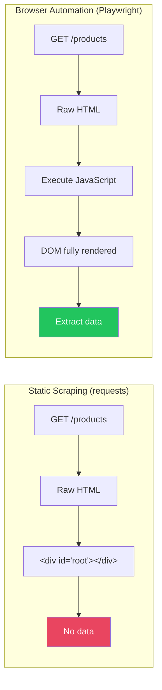
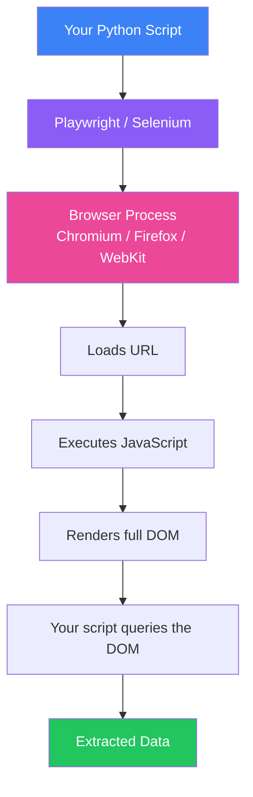
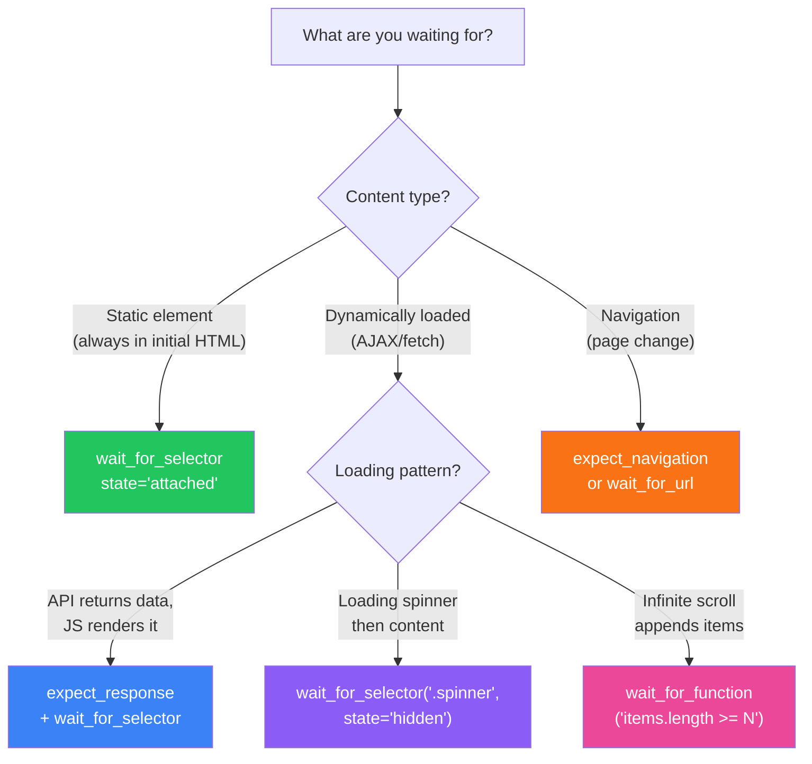

# Web Scraping Deep Dive — Part 2: Dynamic Content & Browser Automation

---

**Series:** Web Scraping — A Developer's Deep Dive
**Part:** 2 of 5 (Core Skills)
**Audience:** Developers who need to scrape JavaScript-rendered pages and SPAs
**Reading time:** ~45 minutes

---

## Table of Contents

1. [Why Static Scraping Fails on Modern Websites](#1-why-static-scraping-fails-on-modern-websites)
2. [Browser Automation Fundamentals](#2-browser-automation-fundamentals)
3. [Selenium — The Legacy Standard](#3-selenium--the-legacy-standard)
4. [Playwright — The Modern Standard](#4-playwright--the-modern-standard)
5. [Waiting Strategies — The Key to Reliable Scraping](#5-waiting-strategies--the-key-to-reliable-scraping)
6. [Intercepting Network Requests — Finding Hidden APIs](#6-intercepting-network-requests--finding-hidden-apis)
7. [Handling Infinite Scroll and Lazy Loading](#7-handling-infinite-scroll-and-lazy-loading)
8. [Screenshots, PDFs, and Visual Debugging](#8-screenshots-pdfs-and-visual-debugging)
9. [Headless vs Headed — When to Use Each](#9-headless-vs-headed--when-to-use-each)
10. [Real-World Project: SPA Product Catalog Scraper](#10-real-world-project-spa-product-catalog-scraper)
11. [What's Next](#11-whats-next)

---

## 1. Why Static Scraping Fails on Modern Websites

Try scraping a React, Vue, or Angular site with `requests + BeautifulSoup`:

```python
import requests
from bs4 import BeautifulSoup

response = requests.get("https://modern-spa-site.com/products")
soup = BeautifulSoup(response.text, "html.parser")

products = soup.select(".product-card")
print(f"Found: {len(products)} products")
# Found: 0 products
```

Zero results. Why? Because `requests` downloads the raw HTML — which for a SPA looks like this:

```html
<!DOCTYPE html>
<html>
<head><title>Products</title></head>
<body>
  <div id="root"></div>
  <script src="/static/js/bundle.js"></script>  <!-- All content lives here -->
</body>
</html>
```

The actual product cards are rendered by JavaScript **after** the page loads. `requests` cannot execute JavaScript — it only sees the empty `<div id="root">`.



**When you need browser automation:**

| Signal | Example |
|--------|---------|
| Empty `<div id="root">` or `<div id="app">` | React/Vue/Angular SPA |
| Data loaded via AJAX/fetch after page load | Infinite scroll, lazy loading |
| Content behind "Load More" buttons | Paginated feeds |
| Interactive elements required | Dropdowns, date pickers, filters |
| Anti-bot measures require full browser | Cloudflare, PerimeterX |

---

## 2. Browser Automation Fundamentals

Browser automation tools launch a real browser (Chrome, Firefox, WebKit) and control it programmatically. The browser executes JavaScript, renders the DOM, and your scraper extracts data from the fully-rendered page.



### Tool Comparison

| Feature | Selenium | Playwright |
|---------|----------|------------|
| **Language support** | Python, Java, C#, JS, Ruby | Python, JS, .NET, Java |
| **Browser support** | Chrome, Firefox, Edge, Safari | Chromium, Firefox, WebKit |
| **Speed** | Slower (WebDriver protocol) | Faster (CDP / native protocol) |
| **Auto-wait** | Manual (WebDriverWait) | Built-in (auto-waits for elements) |
| **Network interception** | Limited | First-class support |
| **Parallel contexts** | Separate driver per browser | Multiple contexts per browser |
| **Headless mode** | Yes | Yes (default) |
| **Community** | Larger (older) | Growing fast |
| **Maintenance** | Browser driver management needed | Auto-downloads browsers |

> **Key insight:** Use **Playwright** for new projects. It is faster, has better APIs, handles waiting automatically, and manages browser binaries for you. Use Selenium only if you are maintaining legacy code or need Safari support.

---

## 3. Selenium — The Legacy Standard

### 3.1 Setup

```bash
pip install selenium webdriver-manager
```

### 3.2 Basic Usage

```python
# filename: selenium_basics.py
from selenium import webdriver
from selenium.webdriver.common.by import By
from selenium.webdriver.support.ui import WebDriverWait
from selenium.webdriver.support import expected_conditions as EC
from selenium.webdriver.chrome.service import Service
from selenium.webdriver.chrome.options import Options
from webdriver_manager.chrome import ChromeDriverManager

# Setup
options = Options()
options.add_argument("--headless=new")  # Run without visible browser
options.add_argument("--no-sandbox")
options.add_argument("--disable-dev-shm-usage")
options.add_argument("--window-size=1920,1080")
options.add_argument("user-agent=Mozilla/5.0 (Windows NT 10.0; Win64; x64) AppleWebKit/537.36")

# Auto-download matching ChromeDriver
service = Service(ChromeDriverManager().install())
driver = webdriver.Chrome(service=service, options=options)

try:
    # Navigate
    driver.get("https://quotes.toscrape.com/js/")  # JS-rendered version

    # Wait for content to load
    WebDriverWait(driver, 10).until(
        EC.presence_of_element_located((By.CSS_SELECTOR, ".quote"))
    )

    # Extract data
    quotes = driver.find_elements(By.CSS_SELECTOR, ".quote")
    for quote in quotes:
        text = quote.find_element(By.CSS_SELECTOR, ".text").text
        author = quote.find_element(By.CSS_SELECTOR, ".author").text
        print(f'"{text}" — {author}')

finally:
    driver.quit()  # ALWAYS close the browser
```

### 3.3 Interacting with Elements

```python
from selenium.webdriver.common.keys import Keys

# Click a button
button = driver.find_element(By.CSS_SELECTOR, "button.load-more")
button.click()

# Type into a search field
search_box = driver.find_element(By.CSS_SELECTOR, "input[name='q']")
search_box.clear()
search_box.send_keys("web scraping python")
search_box.send_keys(Keys.RETURN)  # Press Enter

# Select from dropdown
from selenium.webdriver.support.ui import Select
dropdown = Select(driver.find_element(By.ID, "category"))
dropdown.select_by_visible_text("Electronics")

# Scroll down
driver.execute_script("window.scrollTo(0, document.body.scrollHeight);")

# Execute JavaScript and get result
total = driver.execute_script("return document.querySelectorAll('.product').length;")
print(f"Total products on page: {total}")
```

---

## 4. Playwright — The Modern Standard

### 4.1 Setup

```bash
pip install playwright
playwright install  # Downloads Chromium, Firefox, and WebKit
```

### 4.2 Basic Usage — Sync API

```python
# filename: playwright_basics.py
from playwright.sync_api import sync_playwright

with sync_playwright() as p:
    # Launch browser (headless by default)
    browser = p.chromium.launch(headless=True)
    page = browser.new_page(
        user_agent="Mozilla/5.0 (Windows NT 10.0; Win64; x64) AppleWebKit/537.36",
        viewport={"width": 1920, "height": 1080},
    )

    # Navigate and wait for content
    page.goto("https://quotes.toscrape.com/js/")
    page.wait_for_selector(".quote")  # Wait until quotes appear

    # Extract data using CSS selectors
    quotes = page.query_selector_all(".quote")
    for quote in quotes:
        text = quote.query_selector(".text").inner_text()
        author = quote.query_selector(".author").inner_text()
        print(f'"{text}" — {author}')

    browser.close()
```

### 4.3 Async API — Better for Scraping at Scale

```python
# filename: playwright_async.py
import asyncio
from playwright.async_api import async_playwright

async def scrape_quotes():
    async with async_playwright() as p:
        browser = await p.chromium.launch(headless=True)
        context = await browser.new_context(
            user_agent="Mozilla/5.0 (Windows NT 10.0; Win64; x64) AppleWebKit/537.36",
        )
        page = await context.new_page()

        await page.goto("https://quotes.toscrape.com/js/")
        await page.wait_for_selector(".quote")

        # Use page.evaluate() to extract data in a single call (faster)
        data = await page.evaluate("""
            () => {
                return Array.from(document.querySelectorAll('.quote')).map(q => ({
                    text: q.querySelector('.text').innerText,
                    author: q.querySelector('.author').innerText,
                    tags: Array.from(q.querySelectorAll('.tag')).map(t => t.innerText),
                }));
            }
        """)

        for item in data:
            print(f'"{item["text"]}" — {item["author"]} [{", ".join(item["tags"])}]')

        await browser.close()

asyncio.run(scrape_quotes())
```

> **Key insight:** Use `page.evaluate()` to run JavaScript extraction logic inside the browser. This is significantly faster than making multiple Python-to-browser round trips with `query_selector()` calls, because all DOM traversal happens in a single call.

### 4.4 Interacting with Pages

```python
from playwright.sync_api import sync_playwright

with sync_playwright() as p:
    browser = p.chromium.launch(headless=False)  # Visible for debugging
    page = browser.new_page()
    page.goto("https://example.com")

    # Click — Playwright auto-waits for the element to be visible and clickable
    page.click("button.load-more")

    # Fill form fields
    page.fill("input[name='username']", "user@example.com")
    page.fill("input[name='password']", "password123")
    page.click("button[type='submit']")

    # Wait for navigation after form submit
    page.wait_for_url("**/dashboard**")

    # Select dropdown
    page.select_option("select#country", value="US")

    # Checkbox
    page.check("input#agree-terms")

    # Hover (triggers dropdown menus)
    page.hover(".nav-dropdown-trigger")
    page.click(".dropdown-menu .option-3")

    # Type with delay (simulates human typing)
    page.type("input.search", "web scraping", delay=100)  # 100ms between keystrokes

    # Press keyboard keys
    page.keyboard.press("Enter")
    page.keyboard.press("Control+A")  # Select all

    # Get current URL and page title
    print(f"URL: {page.url}")
    print(f"Title: {page.title()}")

    browser.close()
```

### 4.5 Browser Contexts — Isolated Sessions

```python
# A browser context is like an incognito window — separate cookies, storage, cache
with sync_playwright() as p:
    browser = p.chromium.launch()

    # Context 1: Logged in as User A
    context_a = browser.new_context()
    page_a = context_a.new_page()
    # ... login as User A ...

    # Context 2: Logged in as User B (completely isolated)
    context_b = browser.new_context()
    page_b = context_b.new_page()
    # ... login as User B ...

    # Context 3: With specific locale and timezone
    context_c = browser.new_context(
        locale="de-DE",
        timezone_id="Europe/Berlin",
        geolocation={"latitude": 52.52, "longitude": 13.405},
        permissions=["geolocation"],
    )

    browser.close()
```

---

## 5. Waiting Strategies — The Key to Reliable Scraping

The #1 cause of flaky scrapers is not waiting correctly. Content loads asynchronously — your scraper must know when the data it needs is ready.

### 5.1 Playwright's Built-in Auto-Wait

Playwright automatically waits for elements to be visible and actionable before interacting. But you still need explicit waits for content that loads after the initial render.

```python
# --- Waiting for elements ---
# Wait for selector to appear in DOM
page.wait_for_selector(".product-card")

# Wait for selector with options
page.wait_for_selector(".product-card", state="visible", timeout=15000)
# state options: "attached", "detached", "visible", "hidden"

# --- Waiting for navigation ---
# Wait for URL to change
with page.expect_navigation():
    page.click("a.next-page")

# Wait for specific URL pattern
page.wait_for_url("**/products?page=2**")

# --- Waiting for network ---
# Wait until no more network requests are in-flight
page.goto("https://example.com/products", wait_until="networkidle")
# Options: "load", "domcontentloaded", "networkidle", "commit"

# Wait for a specific API response
with page.expect_response("**/api/products**") as response_info:
    page.click("button.load-more")
response = response_info.value
data = response.json()  # Grab the API data directly

# --- Custom wait conditions ---
# Wait until a JavaScript expression evaluates to true
page.wait_for_function("document.querySelectorAll('.product-card').length >= 20")

# Wait for loading spinner to disappear
page.wait_for_selector(".loading-spinner", state="hidden")

# Combine: wait for spinner to go away AND products to appear
page.wait_for_selector(".loading-spinner", state="hidden")
page.wait_for_selector(".product-card", state="visible")
```

### 5.2 Selenium Wait Strategies

```python
from selenium.webdriver.support.ui import WebDriverWait
from selenium.webdriver.support import expected_conditions as EC
from selenium.webdriver.common.by import By

wait = WebDriverWait(driver, timeout=15)

# Wait for element to be present in DOM
wait.until(EC.presence_of_element_located((By.CSS_SELECTOR, ".product-card")))

# Wait for element to be visible
wait.until(EC.visibility_of_element_located((By.CSS_SELECTOR, ".product-card")))

# Wait for element to be clickable
button = wait.until(EC.element_to_be_clickable((By.CSS_SELECTOR, "button.submit")))

# Wait for text to appear
wait.until(EC.text_to_be_present_in_element((By.CSS_SELECTOR, ".status"), "Complete"))

# Wait for URL to contain a string
wait.until(EC.url_contains("/dashboard"))

# Custom wait condition
wait.until(lambda d: len(d.find_elements(By.CSS_SELECTOR, ".product-card")) >= 20)
```

### 5.3 Wait Strategy Decision Matrix



---

## 6. Intercepting Network Requests — Finding Hidden APIs

The most powerful scraping technique: **do not scrape the HTML at all.** Instead, intercept the API calls that the frontend makes and extract structured JSON directly.

### 6.1 Why This Is Superior

| Approach | Data Format | Reliability | Speed |
|----------|-------------|-------------|-------|
| Parse rendered HTML | Unstructured | Breaks on layout changes | Slow |
| Intercept API responses | Structured JSON | Stable (API contract) | Fast |

### 6.2 Playwright Network Interception

```python
# filename: intercept_api.py
from playwright.sync_api import sync_playwright
import json

collected_data = []

def handle_response(response):
    """Callback for every network response."""
    url = response.url

    # Look for API calls that return product data
    if "/api/products" in url and response.status == 200:
        try:
            data = response.json()
            collected_data.append(data)
            print(f"Intercepted API response: {len(data.get('items', []))} products")
        except Exception:
            pass

with sync_playwright() as p:
    browser = p.chromium.launch()
    page = browser.new_page()

    # Register the response handler BEFORE navigating
    page.on("response", handle_response)

    # Navigate — the page's JavaScript will make API calls
    page.goto("https://modern-spa-site.com/products")
    page.wait_for_selector(".product-card")  # Wait for rendering

    # Scroll to trigger lazy-loaded API calls
    for _ in range(5):
        page.evaluate("window.scrollTo(0, document.body.scrollHeight)")
        page.wait_for_timeout(2000)

    print(f"Total API responses captured: {len(collected_data)}")

    # Save the structured data
    all_products = []
    for response_data in collected_data:
        all_products.extend(response_data.get("items", []))

    with open("products_from_api.json", "w") as f:
        json.dump(all_products, f, indent=2)

    browser.close()
```

### 6.3 Discovering Hidden APIs — DevTools Technique

Before writing code, use your browser's DevTools to find API endpoints:

1. Open DevTools → **Network** tab
2. Filter by **Fetch/XHR**
3. Navigate to the page and interact with it
4. Watch for API calls — they often return JSON with all the data you need

```python
# Step 1: Record ALL network requests to discover API patterns
from playwright.sync_api import sync_playwright

api_calls = []

def log_request(request):
    if request.resource_type in ("xhr", "fetch"):
        api_calls.append({
            "method": request.method,
            "url": request.url,
            "headers": dict(request.headers),
        })

with sync_playwright() as p:
    browser = p.chromium.launch(headless=False)
    page = browser.new_page()
    page.on("request", log_request)

    page.goto("https://target-site.com")
    page.wait_for_timeout(5000)  # Wait for all initial API calls

    print(f"\nDiscovered {len(api_calls)} API calls:")
    for call in api_calls:
        print(f"  {call['method']} {call['url'][:100]}")

    browser.close()
```

> **Key insight:** Once you discover the hidden API, you often do not need browser automation at all. You can call the API directly with `requests` or `httpx` — which is 10x faster than launching a browser. The browser is just a tool to discover the API contract.

### 6.4 Modifying Requests (Block Ads, Images, Tracking)

```python
from playwright.sync_api import sync_playwright

def block_unnecessary(route):
    """Block images, fonts, and tracking scripts to speed up scraping."""
    if route.request.resource_type in ("image", "font", "media"):
        route.abort()
    elif any(domain in route.request.url for domain in [
        "google-analytics.com", "facebook.net", "doubleclick.net",
        "hotjar.com", "segment.com",
    ]):
        route.abort()
    else:
        route.continue_()

with sync_playwright() as p:
    browser = p.chromium.launch()
    page = browser.new_page()

    # Register route handler BEFORE navigating
    page.route("**/*", block_unnecessary)

    page.goto("https://example.com")  # Much faster — no images/tracking loaded
```

---

## 7. Handling Infinite Scroll and Lazy Loading

### 7.1 Infinite Scroll Pattern

```python
# filename: infinite_scroll.py
from playwright.sync_api import sync_playwright

def scrape_infinite_scroll(url: str, max_items: int = 200) -> list[dict]:
    """Scrape a page with infinite scroll."""
    with sync_playwright() as p:
        browser = p.chromium.launch()
        page = browser.new_page()
        page.goto(url, wait_until="networkidle")

        items = []
        last_count = 0
        stale_rounds = 0

        while len(items) < max_items:
            # Extract current items
            items = page.evaluate("""
                () => Array.from(document.querySelectorAll('.item-card')).map(el => ({
                    title: el.querySelector('.title')?.innerText || '',
                    price: el.querySelector('.price')?.innerText || '',
                    url: el.querySelector('a')?.href || '',
                }))
            """)

            print(f"Items loaded: {len(items)}")

            # Check if new items appeared
            if len(items) == last_count:
                stale_rounds += 1
                if stale_rounds >= 3:
                    print("No new items after 3 scrolls — reached the end")
                    break
            else:
                stale_rounds = 0
                last_count = len(items)

            # Scroll to bottom
            page.evaluate("window.scrollTo(0, document.body.scrollHeight)")

            # Wait for new content or loading spinner
            try:
                page.wait_for_function(
                    f"document.querySelectorAll('.item-card').length > {len(items)}",
                    timeout=5000,
                )
            except Exception:
                pass  # Timeout — might be at the end

        browser.close()
        return items[:max_items]
```

### 7.2 "Load More" Button Pattern

```python
def scrape_load_more(url: str, max_clicks: int = 20) -> list[dict]:
    """Click 'Load More' button until all content is loaded."""
    with sync_playwright() as p:
        browser = p.chromium.launch()
        page = browser.new_page()
        page.goto(url, wait_until="networkidle")

        for click in range(max_clicks):
            load_more = page.query_selector("button.load-more, a.show-more")
            if not load_more or not load_more.is_visible():
                print(f"No more 'Load More' button after {click} clicks")
                break

            current_count = page.evaluate(
                "document.querySelectorAll('.item-card').length"
            )

            load_more.click()

            # Wait for new items to appear
            try:
                page.wait_for_function(
                    f"document.querySelectorAll('.item-card').length > {current_count}",
                    timeout=10000,
                )
            except Exception:
                break

        # Extract all items
        data = page.evaluate("""
            () => Array.from(document.querySelectorAll('.item-card')).map(el => ({
                title: el.querySelector('.title')?.innerText,
                url: el.querySelector('a')?.href,
            }))
        """)

        browser.close()
        return data
```

---

## 8. Screenshots, PDFs, and Visual Debugging

### 8.1 Screenshots

```python
# Full page screenshot
page.screenshot(path="full_page.png", full_page=True)

# Element screenshot
element = page.query_selector(".product-card")
element.screenshot(path="product_card.png")

# Screenshot with custom viewport
page.set_viewport_size({"width": 375, "height": 812})  # iPhone X
page.screenshot(path="mobile_view.png")
```

### 8.2 PDF Generation

```python
# Generate PDF (Chromium only)
page.pdf(
    path="page.pdf",
    format="A4",
    print_background=True,
    margin={"top": "1cm", "bottom": "1cm", "left": "1cm", "right": "1cm"},
)
```

### 8.3 Visual Debugging with Traces

```python
# Record a trace for debugging (like a DevTools recording)
context = browser.new_context()
context.tracing.start(screenshots=True, snapshots=True, sources=True)

page = context.new_page()
page.goto("https://example.com")
# ... scraping actions ...

context.tracing.stop(path="trace.zip")
# Open with: playwright show-trace trace.zip
```

---

## 9. Headless vs Headed — When to Use Each

| Mode | Command | Use Case |
|------|---------|----------|
| **Headless** | `launch(headless=True)` | Production scraping, CI/CD, servers without display |
| **Headed** | `launch(headless=False)` | Debugging, development, visual verification |
| **Slow motion** | `launch(headless=False, slow_mo=500)` | Debugging — slows down every action by 500ms |

```python
# Development — see what's happening
browser = p.chromium.launch(
    headless=False,
    slow_mo=200,  # 200ms pause between each action
)

# Production — maximum speed
browser = p.chromium.launch(
    headless=True,
    args=[
        "--disable-gpu",
        "--disable-extensions",
        "--disable-dev-shm-usage",
        "--no-sandbox",
    ],
)
```

### Headless Detection

Some sites detect headless browsers. Common detection signals:

```python
# Basic headless detection check
is_headless = page.evaluate("""
    () => {
        return {
            webdriver: navigator.webdriver,          // true in automation
            languages: navigator.languages,           // often empty in headless
            plugins: navigator.plugins.length,        // 0 in headless
            chrome: !!window.chrome,                  // false in some headless
            permissions: navigator.permissions !== undefined,
        };
    }
""")
```

We cover stealth techniques to bypass detection in **Part 4**.

---

## 10. Real-World Project: SPA Product Catalog Scraper

A complete scraper for a React/Vue-style SPA with category filtering, pagination, and detail pages.

```python
# filename: spa_scraper.py
# Scrapes a modern SPA product catalog using Playwright

import json
import logging
from dataclasses import dataclass, asdict
from playwright.sync_api import sync_playwright, TimeoutError as PlaywrightTimeout

logger = logging.getLogger(__name__)


@dataclass
class Product:
    name: str
    price: float
    description: str
    category: str
    image_url: str
    rating: float
    reviews_count: int
    url: str


def scrape_product_detail(page, url: str) -> dict:
    """Navigate to a product detail page and extract all info."""
    page.goto(url, wait_until="networkidle")

    try:
        page.wait_for_selector(".product-detail", timeout=10000)
    except PlaywrightTimeout:
        logger.warning(f"Detail page timed out: {url}")
        return {}

    return page.evaluate("""
        () => {
            const el = document.querySelector('.product-detail');
            if (!el) return {};
            return {
                description: el.querySelector('.description')?.innerText || '',
                specs: Array.from(el.querySelectorAll('.spec-row')).map(row => ({
                    label: row.querySelector('.spec-label')?.innerText || '',
                    value: row.querySelector('.spec-value')?.innerText || '',
                })),
                images: Array.from(el.querySelectorAll('.gallery img')).map(img => img.src),
                reviews_count: parseInt(el.querySelector('.reviews-count')?.innerText || '0'),
            };
        }
    """)


def scrape_catalog(base_url: str, categories: list[str], max_pages: int = 5) -> list[Product]:
    """Scrape products across multiple categories."""
    all_products = []

    with sync_playwright() as p:
        browser = p.chromium.launch(headless=True)
        context = browser.new_context(
            user_agent="Mozilla/5.0 (Windows NT 10.0; Win64; x64) AppleWebKit/537.36",
            viewport={"width": 1920, "height": 1080},
        )

        # Block unnecessary resources
        def route_handler(route):
            if route.request.resource_type in ("image", "font", "media"):
                route.abort()
            else:
                route.continue_()

        context.route("**/*", route_handler)
        page = context.new_page()

        for category in categories:
            logger.info(f"Scraping category: {category}")

            for page_num in range(1, max_pages + 1):
                url = f"{base_url}/products?category={category}&page={page_num}"
                logger.info(f"  Page {page_num}: {url}")

                page.goto(url, wait_until="networkidle")

                try:
                    page.wait_for_selector(".product-card", timeout=10000)
                except PlaywrightTimeout:
                    logger.info(f"  No products on page {page_num} — moving to next category")
                    break

                # Extract product cards
                cards = page.evaluate("""
                    () => Array.from(document.querySelectorAll('.product-card')).map(card => ({
                        name: card.querySelector('.name')?.innerText || '',
                        price: parseFloat(card.querySelector('.price')?.innerText?.replace(/[^0-9.]/g, '') || '0'),
                        image_url: card.querySelector('img')?.src || '',
                        rating: parseFloat(card.querySelector('.rating')?.getAttribute('data-value') || '0'),
                        url: card.querySelector('a')?.href || '',
                        category: card.querySelector('.category-badge')?.innerText || '',
                    }))
                """)

                if not cards:
                    break

                for card_data in cards:
                    product = Product(
                        name=card_data["name"],
                        price=card_data["price"],
                        description="",  # Will be filled from detail page if needed
                        category=category,
                        image_url=card_data["image_url"],
                        rating=card_data["rating"],
                        reviews_count=0,
                        url=card_data["url"],
                    )
                    all_products.append(product)

                logger.info(f"  Found {len(cards)} products (total: {len(all_products)})")

                # Check for next page button
                has_next = page.query_selector("button.next-page:not([disabled])")
                if not has_next:
                    break

        browser.close()

    return all_products


if __name__ == "__main__":
    logging.basicConfig(level=logging.INFO)
    products = scrape_catalog(
        base_url="https://example-spa.com",
        categories=["electronics", "books", "clothing"],
        max_pages=3,
    )

    with open("spa_products.json", "w") as f:
        json.dump([asdict(p) for p in products], f, indent=2)

    logger.info(f"Total products scraped: {len(products)}")
```

---

## 11. What's Next

In **Part 3**, we move to large-scale crawling with the **Scrapy** framework. You will learn:

- Scrapy architecture — spiders, items, pipelines, middleware
- Writing spiders that follow links and crawl entire sites
- Item pipelines for cleaning, deduplication, and storage
- Middleware for custom headers, proxies, and retry logic
- Breadth-first vs depth-first crawling strategies
- Exporting data to JSON, CSV, databases

---

**Series:** [Web Scraping Deep Dive — Index](index.md)
**Previous:** [Part 1 — BeautifulSoup & Requests](web-scraping-deep-dive-part-1.md)
**Next:** [Part 3 — Scrapy Framework](web-scraping-deep-dive-part-3.md)
