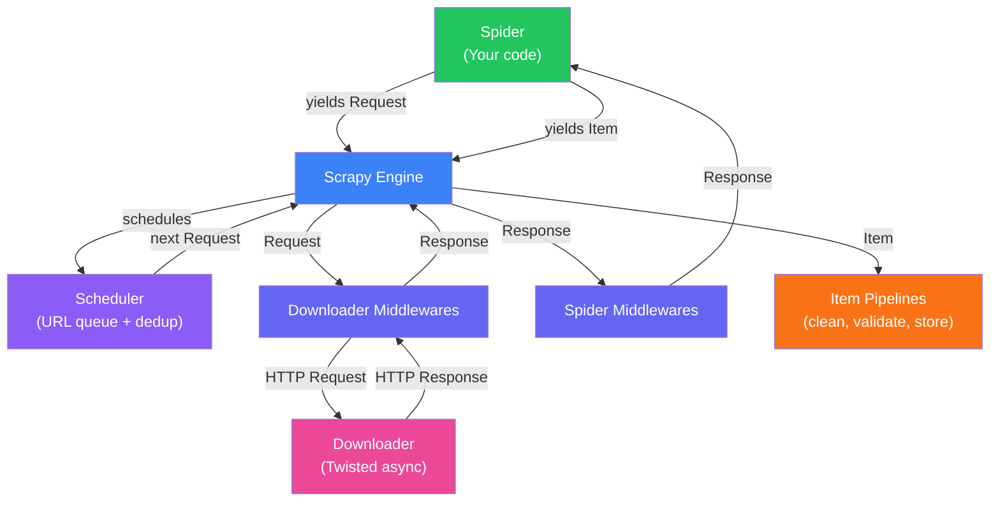

# Web Scraping Deep Dive - Part 3: Scrapy Framework - Crawling at Scale

---

**Series:** Web Scraping - A Developer's Deep Dive
**Part:** 3 of 5 (Framework)
**Audience:** Developers ready to move beyond scripts to professional-grade web crawling
**Reading time:** ~45 minutes

---

## Table of Contents

1. [Why Scrapy?](#1-why-scrapy)
2. [Scrapy Architecture](#2-scrapy-architecture)
3. [Your First Spider](#3-your-first-spider)
4. [Items and Item Loaders - Structured Data Extraction](#4-items-and-item-loaders--structured-data-extraction)
5. [Following Links - Recursive Crawling](#5-following-links--recursive-crawling)
6. [Item Pipelines - Processing and Storage](#6-item-pipelines--processing-and-storage)
7. [Middleware - Customizing Request/Response Flow](#7-middleware--customizing-requestresponse-flow)
8. [Crawling Strategies - Breadth-First vs Depth-First](#8-crawling-strategies--breadth-first-vs-depth-first)
9. [Settings and Configuration](#9-settings-and-configuration)
10. [Real-World Project: E-Commerce Crawler](#10-real-world-project-e-commerce-crawler)
11. [What's Next](#11-whats-next)

---

## 1. Why Scrapy?

You have built scrapers with `requests + BeautifulSoup`. They work. But when you need to crawl 10,000+ pages with error handling, rate limiting, retry logic, data pipelines, and export - your script becomes unmaintainable.

Scrapy is a complete crawling framework that handles all of this out of the box.

| Feature | DIY Script | Scrapy |
|---------|-----------|--------|
| **Request scheduling** | Manual loop + sleep | Built-in scheduler with priority queue |
| **Concurrency** | Manual threading / asyncio | Built-in async (Twisted reactor) |
| **Retry logic** | Write your own | Built-in retry middleware |
| **Rate limiting** | Manual sleep/delay | `DOWNLOAD_DELAY`, `AUTOTHROTTLE` |
| **Duplicate filtering** | Manual `set()` of URLs | Built-in fingerprint-based dedup |
| **Data export** | Manual JSON/CSV writing | Feed exports (JSON, CSV, XML, S3) |
| **Proxy rotation** | Manual implementation | Middleware hooks |
| **Robots.txt** | Manual parsing | Built-in `ROBOTSTXT_OBEY` |
| **Logging & stats** | Manual | Built-in stats collector |

> **Key insight:** Use Scrapy when your scraping task involves crawling multiple pages (especially following links), needs structured pipelines, or must run reliably over hours/days. For single-page or few-page scraping, `requests + BeautifulSoup` is simpler and sufficient.

---

## 2. Scrapy Architecture



**Flow:**

1. **Spider** generates initial `Request` objects (start URLs)
2. **Engine** passes them to the **Scheduler** (deduplicates, queues by priority)
3. **Scheduler** feeds Requests to the **Downloader** through **Downloader Middlewares** (add headers, proxies, retries)
4. **Downloader** fetches the page and returns a **Response**
5. Response passes back through middlewares to the **Spider**
6. **Spider** parses the Response and yields **Items** (data) and/or new **Requests** (follow links)
7. **Items** flow through **Item Pipelines** (clean, validate, deduplicate, store)

---

## 3. Your First Spider

### 3.1 Project Setup

```bash
pip install scrapy
scrapy startproject bookstore
cd bookstore
scrapy genspider books books.toscrape.com
```

This creates:

```
bookstore/
├── scrapy.cfg
└── bookstore/
    ├── __init__.py
    ├── items.py
    ├── middlewares.py
    ├── pipelines.py
    ├── settings.py
    └── spiders/
        ├── __init__.py
        └── books.py
```

### 3.2 A Basic Spider

```python
# bookstore/spiders/books.py
import scrapy


class BooksSpider(scrapy.Spider):
    name = "books"
    allowed_domains = ["books.toscrape.com"]
    start_urls = ["https://books.toscrape.com/"]

    RATING_MAP = {"One": 1, "Two": 2, "Three": 3, "Four": 4, "Five": 5}

    def parse(self, response):
        """Parse the listing page - extract books and follow pagination."""

        # Extract each book on this page
        for article in response.css("article.product_pod"):
            rating_class = article.css("p.star-rating::attr(class)").get("")
            rating_word = rating_class.replace("star-rating ", "")

            yield {
                "title": article.css("h3 a::attr(title)").get(),
                "price": article.css(".price_color::text").get("").replace("£", ""),
                "rating": self.RATING_MAP.get(rating_word, 0),
                "availability": article.css(".availability::text").getall()[-1].strip()
                    if article.css(".availability::text").getall() else "Unknown",
                "detail_url": response.urljoin(article.css("h3 a::attr(href)").get()),
            }

        # Follow pagination - "next" button
        next_page = response.css("li.next a::attr(href)").get()
        if next_page:
            yield response.follow(next_page, callback=self.parse)
```

**Run it:**

```bash
# Output to terminal
scrapy crawl books

# Export to JSON
scrapy crawl books -o books.json

# Export to CSV
scrapy crawl books -o books.csv

# Export with custom format
scrapy crawl books -o books.jsonl -t jsonlines
```

### 3.3 Scrapy Selectors - CSS and XPath

Scrapy has its own `Selector` objects that support both CSS and XPath:

```python
def parse(self, response):
    # CSS selectors (same as BeautifulSoup .select())
    titles = response.css("h3 a::text").getall()
    first_title = response.css("h3 a::text").get()  # First match or None

    # ::text pseudo-element extracts text content
    # ::attr(href) extracts an attribute
    links = response.css("a.product::attr(href)").getall()

    # XPath selectors
    titles = response.xpath("//h3/a/text()").getall()
    links = response.xpath("//a[@class='product']/@href").getall()

    # Chaining selectors (narrow down context)
    for card in response.css(".product-card"):
        title = card.css("h3::text").get()          # Search within the card only
        price = card.css(".price::text").get()

    # Regex extraction
    isbn = response.css("span.isbn::text").re_first(r"ISBN:\s*(\d+)")
    numbers = response.css(".stats::text").re(r"\d+")  # All numbers
```

---

## 4. Items and Item Loaders - Structured Data Extraction

### 4.1 Defining Items

```python
# bookstore/items.py
import scrapy
from scrapy.loader import ItemLoader
from itemloaders.processors import TakeFirst, MapCompose, Join
from w3lib.html import remove_tags


def clean_price(value):
    """Remove currency symbols and convert to float."""
    return float(value.replace("£", "").replace("$", "").replace(",", "").strip())


def clean_whitespace(value):
    """Normalize whitespace."""
    return " ".join(value.split()).strip()


class BookItem(scrapy.Item):
    title = scrapy.Field()
    price = scrapy.Field()
    rating = scrapy.Field()
    availability = scrapy.Field()
    description = scrapy.Field()
    category = scrapy.Field()
    upc = scrapy.Field()
    url = scrapy.Field()


class BookLoader(ItemLoader):
    default_item_class = BookItem
    default_output_processor = TakeFirst()  # Return first value, not a list

    # Per-field processors
    title_in = MapCompose(clean_whitespace)
    price_in = MapCompose(clean_price)
    description_in = MapCompose(remove_tags, clean_whitespace)
    availability_in = MapCompose(clean_whitespace)
```

### 4.2 Using Item Loaders in Spiders

```python
# bookstore/spiders/books.py
from bookstore.items import BookLoader

class BooksSpider(scrapy.Spider):
    name = "books"
    allowed_domains = ["books.toscrape.com"]
    start_urls = ["https://books.toscrape.com/"]

    def parse(self, response):
        for article in response.css("article.product_pod"):
            loader = BookLoader(selector=article)
            loader.add_css("title", "h3 a::attr(title)")
            loader.add_css("price", ".price_color::text")
            loader.add_css("availability", ".availability::text")
            loader.add_value("url", response.urljoin(
                article.css("h3 a::attr(href)").get()
            ))

            # Follow link to detail page for more data
            detail_url = response.urljoin(article.css("h3 a::attr(href)").get())
            yield scrapy.Request(
                detail_url,
                callback=self.parse_detail,
                cb_kwargs={"loader": loader},
            )

        # Pagination
        next_page = response.css("li.next a::attr(href)").get()
        if next_page:
            yield response.follow(next_page, callback=self.parse)

    def parse_detail(self, response, loader):
        """Parse the book detail page and yield the completed item."""
        loader.selector = response  # Update context to detail page

        loader.add_css("description", "#product_description ~ p::text")
        loader.add_css("upc", "th:contains('UPC') + td::text")
        loader.add_css("category", "ul.breadcrumb li:nth-child(3) a::text")

        # Rating from detail page
        rating_class = response.css("p.star-rating::attr(class)").get("")
        rating_map = {"One": 1, "Two": 2, "Three": 3, "Four": 4, "Five": 5}
        rating_word = rating_class.replace("star-rating ", "")
        loader.add_value("rating", rating_map.get(rating_word, 0))

        yield loader.load_item()
```

---

## 5. Following Links - Recursive Crawling

### 5.1 The CrawlSpider

For sites with predictable link structures, `CrawlSpider` automates link following with rules.

```python
from scrapy.spiders import CrawlSpider, Rule
from scrapy.linkextractors import LinkExtractor

class BookCrawler(CrawlSpider):
    name = "book_crawler"
    allowed_domains = ["books.toscrape.com"]
    start_urls = ["https://books.toscrape.com/"]

    rules = (
        # Follow category links - but don't parse them as items
        Rule(LinkExtractor(restrict_css=".nav-list a"), follow=True),

        # Follow pagination links
        Rule(LinkExtractor(restrict_css=".next a"), follow=True),

        # Follow product detail links - parse them
        Rule(
            LinkExtractor(restrict_css="article.product_pod h3 a"),
            callback="parse_book",
            follow=False,
        ),
    )

    def parse_book(self, response):
        """Parse a book detail page."""
        yield {
            "title": response.css("h1::text").get(),
            "price": response.css(".price_color::text").get(),
            "description": response.css("#product_description ~ p::text").get(),
            "category": response.css("ul.breadcrumb li:nth-child(3) a::text").get(),
            "url": response.url,
        }
```

### 5.2 Manual Link Following with Depth Control

```python
class DeepCrawlSpider(scrapy.Spider):
    name = "deep_crawl"
    start_urls = ["https://example.com"]
    custom_settings = {
        "DEPTH_LIMIT": 3,  # Don't crawl deeper than 3 levels
    }

    def parse(self, response):
        # Extract data from current page
        yield {"url": response.url, "title": response.css("title::text").get()}

        # Follow all internal links
        for link in response.css("a[href]::attr(href)").getall():
            absolute_url = response.urljoin(link)
            if "example.com" in absolute_url:  # Stay on the same domain
                yield scrapy.Request(absolute_url, callback=self.parse)
```

---

## 6. Item Pipelines - Processing and Storage

Pipelines process every yielded item in sequence. Each pipeline can modify, validate, drop, or store items.

### 6.1 Defining Pipelines

```python
# bookstore/pipelines.py
import json
import logging
import sqlite3
from datetime import datetime

logger = logging.getLogger(__name__)


class ValidationPipeline:
    """Drop invalid items before they reach storage."""

    def process_item(self, item, spider):
        if not item.get("title"):
            raise scrapy.exceptions.DropItem(f"Missing title: {item}")

        if item.get("price") is not None and item["price"] < 0:
            raise scrapy.exceptions.DropItem(f"Negative price: {item}")

        return item


class DeduplicationPipeline:
    """Drop duplicate items based on URL."""

    def __init__(self):
        self.seen_urls = set()

    def process_item(self, item, spider):
        url = item.get("url", "")
        if url in self.seen_urls:
            raise scrapy.exceptions.DropItem(f"Duplicate: {url}")
        self.seen_urls.add(url)
        return item


class CleaningPipeline:
    """Normalize and clean item fields."""

    def process_item(self, item, spider):
        # Ensure price is float
        if isinstance(item.get("price"), str):
            item["price"] = float(item["price"].replace("£", "").strip())

        # Add metadata
        item["scraped_at"] = datetime.utcnow().isoformat()
        item["spider_name"] = spider.name

        return item


class SQLitePipeline:
    """Store items in a SQLite database."""

    def open_spider(self, spider):
        self.conn = sqlite3.connect("books.db")
        self.cursor = self.conn.cursor()
        self.cursor.execute("""
            CREATE TABLE IF NOT EXISTS books (
                url TEXT PRIMARY KEY,
                title TEXT,
                price REAL,
                rating INTEGER,
                category TEXT,
                description TEXT,
                scraped_at TEXT
            )
        """)
        self.conn.commit()

    def close_spider(self, spider):
        self.conn.close()

    def process_item(self, item, spider):
        self.cursor.execute("""
            INSERT OR REPLACE INTO books (url, title, price, rating, category, description, scraped_at)
            VALUES (?, ?, ?, ?, ?, ?, ?)
        """, (
            item.get("url"),
            item.get("title"),
            item.get("price"),
            item.get("rating"),
            item.get("category"),
            item.get("description"),
            item.get("scraped_at"),
        ))
        self.conn.commit()
        return item
```

### 6.2 Activating Pipelines

```python
# bookstore/settings.py
ITEM_PIPELINES = {
    "bookstore.pipelines.ValidationPipeline": 100,      # First (lowest number)
    "bookstore.pipelines.DeduplicationPipeline": 200,
    "bookstore.pipelines.CleaningPipeline": 300,
    "bookstore.pipelines.SQLitePipeline": 400,           # Last
}
```

The number is the priority - lower numbers run first.

---

## 7. Middleware - Customizing Request/Response Flow

### 7.1 Downloader Middleware (Request/Response)

```python
# bookstore/middlewares.py
import random
import logging

logger = logging.getLogger(__name__)

# User-Agent rotation
USER_AGENTS = [
    "Mozilla/5.0 (Windows NT 10.0; Win64; x64) AppleWebKit/537.36 (KHTML, like Gecko) Chrome/120.0.0.0 Safari/537.36",
    "Mozilla/5.0 (Macintosh; Intel Mac OS X 10_15_7) AppleWebKit/537.36 (KHTML, like Gecko) Chrome/120.0.0.0 Safari/537.36",
    "Mozilla/5.0 (Windows NT 10.0; Win64; x64; rv:121.0) Gecko/20100101 Firefox/121.0",
    "Mozilla/5.0 (Macintosh; Intel Mac OS X 10_15_7) AppleWebKit/605.1.15 (KHTML, like Gecko) Version/17.2 Safari/605.1.15",
    "Mozilla/5.0 (X11; Linux x86_64) AppleWebKit/537.36 (KHTML, like Gecko) Chrome/120.0.0.0 Safari/537.36",
]


class RotateUserAgentMiddleware:
    """Assign a random User-Agent to each request."""

    def process_request(self, request, spider):
        request.headers["User-Agent"] = random.choice(USER_AGENTS)


class ProxyMiddleware:
    """Rotate through a list of proxies."""

    def __init__(self):
        self.proxies = [
            "http://proxy1.example.com:8080",
            "http://proxy2.example.com:8080",
            "http://proxy3.example.com:8080",
        ]

    def process_request(self, request, spider):
        request.meta["proxy"] = random.choice(self.proxies)


class RetryOn403Middleware:
    """Retry requests that return 403 with a different User-Agent."""

    def process_response(self, request, response, spider):
        if response.status == 403:
            logger.warning(f"403 Forbidden: {request.url} - retrying with new UA")
            request.headers["User-Agent"] = random.choice(USER_AGENTS)
            request.dont_filter = True  # Allow re-requesting the same URL
            return request  # Return the request to retry it
        return response
```

### 7.2 Activating Middleware

```python
# bookstore/settings.py
DOWNLOADER_MIDDLEWARES = {
    "bookstore.middlewares.RotateUserAgentMiddleware": 400,
    "bookstore.middlewares.ProxyMiddleware": 410,
    "bookstore.middlewares.RetryOn403Middleware": 420,
}
```

---

## 8. Crawling Strategies - Breadth-First vs Depth-First

### 8.1 Breadth-First (Default)

Scrapy crawls breadth-first by default - it processes all URLs at depth 0, then depth 1, then depth 2. This is usually what you want for scraping product listings.

```python
# settings.py - BFS (default)
DEPTH_PRIORITY = 0
SCHEDULER_DISK_QUEUE = "scrapy.squeues.PickleFifoDiskQueue"
SCHEDULER_MEMORY_QUEUE = "scrapy.squeues.FifoMemoryQueue"
```

### 8.2 Depth-First

Depth-first is useful when you want to fully explore one branch before moving to the next (e.g., scraping all pages of one category before starting the next).

```python
# settings.py - DFS
DEPTH_PRIORITY = 1
SCHEDULER_DISK_QUEUE = "scrapy.squeues.PickleLifoDiskQueue"
SCHEDULER_MEMORY_QUEUE = "scrapy.squeues.LifoMemoryQueue"
```

### 8.3 Priority-Based Crawling

```python
class PrioritizedSpider(scrapy.Spider):
    name = "prioritized"

    def parse(self, response):
        # High priority - product detail pages
        for link in response.css(".product a::attr(href)").getall():
            yield scrapy.Request(
                response.urljoin(link),
                callback=self.parse_product,
                priority=10,  # Higher priority = processed first
            )

        # Low priority - category pages
        for link in response.css(".category a::attr(href)").getall():
            yield scrapy.Request(
                response.urljoin(link),
                callback=self.parse,
                priority=1,
            )
```

---

## 9. Settings and Configuration

### 9.1 Essential Settings

```python
# bookstore/settings.py

# --- Politeness ---
ROBOTSTXT_OBEY = True                    # Respect robots.txt
DOWNLOAD_DELAY = 1.5                      # Seconds between requests to same domain
CONCURRENT_REQUESTS = 16                  # Total concurrent requests
CONCURRENT_REQUESTS_PER_DOMAIN = 4        # Max concurrent requests per domain
AUTOTHROTTLE_ENABLED = True               # Auto-adjust delay based on server response time
AUTOTHROTTLE_START_DELAY = 1
AUTOTHROTTLE_MAX_DELAY = 30
AUTOTHROTTLE_TARGET_CONCURRENCY = 2.0

# --- Retries ---
RETRY_ENABLED = True
RETRY_TIMES = 3
RETRY_HTTP_CODES = [500, 502, 503, 504, 408, 429]

# --- Caching (avoid re-downloading during development) ---
HTTPCACHE_ENABLED = True
HTTPCACHE_EXPIRATION_SECS = 86400         # Cache for 24 hours
HTTPCACHE_DIR = "httpcache"
HTTPCACHE_STORAGE = "scrapy.extensions.httpcache.FilesystemCacheStorage"

# --- Output ---
FEEDS = {
    "output/books.json": {
        "format": "json",
        "encoding": "utf-8",
        "overwrite": True,
    },
    "output/books.csv": {
        "format": "csv",
    },
}

# --- Logging ---
LOG_LEVEL = "INFO"
LOG_FILE = "scrapy.log"

# --- Other ---
USER_AGENT = "MyScrapyBot/1.0 (+https://example.com/bot)"
DEPTH_LIMIT = 5
CLOSESPIDER_ITEMCOUNT = 1000              # Stop after 1000 items
CLOSESPIDER_TIMEOUT = 3600                # Stop after 1 hour
```

### 9.2 Per-Spider Settings Override

```python
class CustomSpider(scrapy.Spider):
    name = "custom"

    custom_settings = {
        "DOWNLOAD_DELAY": 3,           # This spider is slower
        "CONCURRENT_REQUESTS": 4,
        "CLOSESPIDER_ITEMCOUNT": 500,
        "FEEDS": {
            "custom_output.json": {"format": "json"},
        },
    }
```

---

## 10. Real-World Project: E-Commerce Crawler

A complete Scrapy project that crawls an e-commerce site across categories, follows pagination, and stores results.

```python
# filename: ecommerce/spiders/shop_spider.py
import scrapy
from scrapy.loader import ItemLoader
from itemloaders.processors import TakeFirst, MapCompose

def clean_price(text):
    return float(text.replace("£", "").replace("$", "").replace(",", "").strip())


class ProductItem(scrapy.Item):
    title = scrapy.Field()
    price = scrapy.Field()
    original_price = scrapy.Field()
    discount = scrapy.Field()
    rating = scrapy.Field()
    reviews = scrapy.Field()
    category = scrapy.Field()
    breadcrumbs = scrapy.Field()
    description = scrapy.Field()
    specifications = scrapy.Field()
    image_urls = scrapy.Field()
    url = scrapy.Field()
    in_stock = scrapy.Field()


class ShopSpider(scrapy.Spider):
    name = "shop"
    allowed_domains = ["books.toscrape.com"]
    start_urls = ["https://books.toscrape.com/"]

    custom_settings = {
        "ROBOTSTXT_OBEY": True,
        "DOWNLOAD_DELAY": 1,
        "CONCURRENT_REQUESTS_PER_DOMAIN": 4,
        "AUTOTHROTTLE_ENABLED": True,
        "HTTPCACHE_ENABLED": True,
        "FEEDS": {
            "products_%(time)s.json": {
                "format": "json",
                "encoding": "utf-8",
            },
        },
    }

    def parse(self, response):
        """Parse the homepage - follow category links."""
        categories = response.css(".side_categories ul li ul li a")
        for cat in categories:
            yield response.follow(cat, callback=self.parse_category)

    def parse_category(self, response):
        """Parse a category listing page."""
        category_name = response.css("h1::text").get("").strip()

        # Extract each product
        for product in response.css("article.product_pod"):
            detail_link = product.css("h3 a::attr(href)").get()
            if detail_link:
                yield response.follow(
                    detail_link,
                    callback=self.parse_product,
                    cb_kwargs={"category": category_name},
                )

        # Follow pagination
        next_page = response.css("li.next a::attr(href)").get()
        if next_page:
            yield response.follow(next_page, callback=self.parse_category)

    def parse_product(self, response, category=""):
        """Parse a product detail page."""
        # Extract specification table
        specs = {}
        for row in response.css("table.table-striped tr"):
            key = row.css("th::text").get("").strip()
            value = row.css("td::text").get("").strip()
            if key and value:
                specs[key] = value

        # Extract breadcrumbs
        breadcrumbs = response.css("ul.breadcrumb li a::text").getall()
        breadcrumbs = [b.strip() for b in breadcrumbs if b.strip()]

        # Rating
        rating_map = {"One": 1, "Two": 2, "Three": 3, "Four": 4, "Five": 5}
        rating_class = response.css("p.star-rating::attr(class)").get("")
        rating_word = rating_class.replace("star-rating ", "")

        # Availability
        avail_text = response.css(".availability::text").getall()
        avail_text = " ".join(t.strip() for t in avail_text).strip()
        in_stock = "in stock" in avail_text.lower()

        # Stock count from "In stock (22 available)"
        stock_match = response.css(".availability::text").re_first(r"(\d+)")

        yield ProductItem(
            title=response.css("h1::text").get("").strip(),
            price=clean_price(response.css(".price_color::text").get("0")),
            rating=rating_map.get(rating_word, 0),
            reviews=int(specs.get("Number of reviews", 0)),
            category=category or (breadcrumbs[-1] if breadcrumbs else ""),
            breadcrumbs=breadcrumbs,
            description=response.css("#product_description ~ p::text").get(""),
            specifications=specs,
            image_urls=[response.urljoin(img) for img in response.css("#product_gallery img::attr(src)").getall()],
            url=response.url,
            in_stock=in_stock,
        )
```

### Running with Stats

```bash
scrapy crawl shop -s LOG_LEVEL=INFO

# Output:
# 2024-01-15 10:00:00 [scrapy.core.engine] INFO: Spider opened
# 2024-01-15 10:05:30 [scrapy.core.engine] INFO: Closing spider (finished)
# 2024-01-15 10:05:30 [scrapy.statscollectors] INFO: Dumping Scrapy stats:
# {
#   'downloader/request_count': 1234,
#   'downloader/response_count': 1234,
#   'downloader/response_status_count/200': 1230,
#   'downloader/response_status_count/301': 4,
#   'item_scraped_count': 1000,
#   'item_dropped_count': 12,
#   'elapsed_time_seconds': 330.5,
#   'memusage/max': 78643200,
# }
```

---

## 11. What's Next

In **Part 4**, we tackle the hardest challenges in web scraping - **anti-scraping defenses and protected websites**. You will learn:

- Scraping authenticated / protected websites (login flows, session cookies, OAuth)
- Injecting browser cookies from your real sessions (LinkedIn, Twitter, etc.)
- CAPTCHAs - types, solving services, and avoidance strategies
- Browser fingerprinting and stealth techniques
- Proxy rotation and residential proxies
- Cloudflare, PerimeterX, and DataDome bypass strategies
- Rate limiting patterns and how to stay under the radar

---

**Series:** [Web Scraping Deep Dive - Index](index.md)
**Previous:** [Part 2 - Dynamic Content & Browser Automation](web-scraping-deep-dive-part-2.md)
**Next:** [Part 4 - Anti-Scraping & Advanced Techniques](web-scraping-deep-dive-part-4.md)
