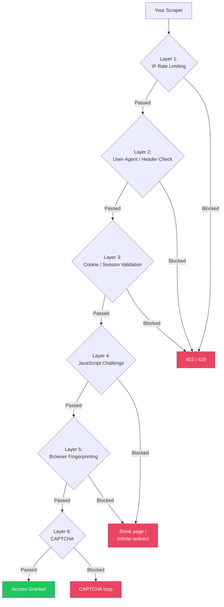
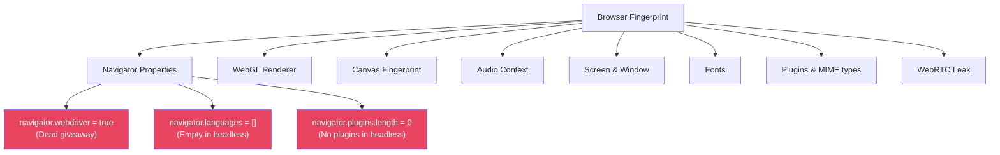
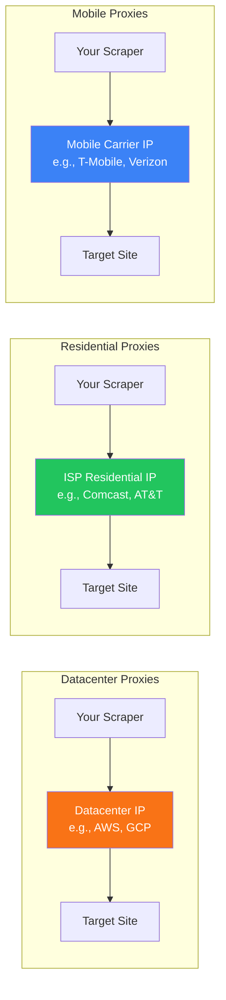

# Web Scraping Deep Dive — Part 4: Anti-Scraping & Advanced Techniques

---

**Series:** Web Scraping — A Developer's Deep Dive
**Part:** 4 of 5 (Advanced)
**Audience:** Developers who need to scrape protected, authenticated, or heavily defended websites
**Reading time:** ~50 minutes

---

## Table of Contents

1. [The Anti-Scraping Arms Race](#1-the-anti-scraping-arms-race)
2. [Scraping Authenticated Websites — Login Flows](#2-scraping-authenticated-websites--login-flows)
3. [Cookie Injection — Using Real Browser Sessions](#3-cookie-injection--using-real-browser-sessions)
4. [Browser Fingerprinting and Stealth](#4-browser-fingerprinting-and-stealth)
5. [CAPTCHAs — Types, Avoidance, and Solving](#5-captchas--types-avoidance-and-solving)
6. [Proxy Strategies — Rotation, Residential, and SOCKS](#6-proxy-strategies--rotation-residential-and-socks)
7. [Cloudflare, PerimeterX, and WAF Bypass](#7-cloudflare-perimeterx-and-waf-bypass)
8. [Rate Limiting — Staying Under the Radar](#8-rate-limiting--staying-under-the-radar)
9. [Advanced Data Extraction Techniques](#9-advanced-data-extraction-techniques)
10. [Real-World Project: Protected Site Scraper](#10-real-world-project-protected-site-scraper)
11. [What's Next](#11-whats-next)

---

## 1. The Anti-Scraping Arms Race

Modern websites deploy multiple layers of defense against automated access. Understanding these layers is essential for building scrapers that work reliably.



| Defense Layer | What It Checks | Difficulty to Bypass |
|---------------|---------------|---------------------|
| **IP rate limiting** | Too many requests from one IP | Easy — use proxies |
| **Header validation** | Missing/wrong User-Agent, Referer | Easy — set proper headers |
| **Cookie/session** | No session cookie, expired token | Medium — login or inject cookies |
| **JavaScript challenge** | Browser must execute JS | Medium — use Playwright |
| **Browser fingerprinting** | WebGL, canvas, plugins, fonts | Hard — use stealth plugins |
| **CAPTCHA** | Human verification required | Hard — solving services or avoidance |
| **Behavioral analysis** | Mouse movements, scroll patterns, timing | Very Hard — human-like automation |

---

## 2. Scraping Authenticated Websites — Login Flows

Many valuable data sources require authentication — job boards, social networks, marketplaces, internal tools. Here are the main patterns for scraping behind a login.

### 2.1 Form-Based Login (Most Common)

```python
# filename: auth_scraper.py
# Login via HTML form submission — works for most traditional websites

import requests
from bs4 import BeautifulSoup

def login_form_based(base_url: str, username: str, password: str) -> requests.Session:
    """Authenticate via standard HTML form submission."""
    session = requests.Session()
    session.headers.update({
        "User-Agent": "Mozilla/5.0 (Windows NT 10.0; Win64; x64) AppleWebKit/537.36",
        "Accept": "text/html,application/xhtml+xml",
        "Accept-Language": "en-US,en;q=0.9",
    })

    # Step 1: GET the login page
    login_page = session.get(f"{base_url}/login", timeout=15)
    soup = BeautifulSoup(login_page.text, "html.parser")

    # Step 2: Extract ALL hidden form fields (CSRF tokens, honeypots, etc.)
    form = soup.select_one("form[action*='login'], form#login-form, form.login")
    if not form:
        raise ValueError("Login form not found")

    form_data = {}
    for hidden_input in form.select("input[type='hidden']"):
        name = hidden_input.get("name")
        value = hidden_input.get("value", "")
        if name:
            form_data[name] = value

    # Step 3: Add credentials
    # Detect field names (different sites use different names)
    username_field = form.select_one(
        "input[name='username'], input[name='email'], "
        "input[name='login'], input[name='user'], input[type='email']"
    )
    password_field = form.select_one(
        "input[name='password'], input[name='pass'], input[type='password']"
    )

    form_data[username_field["name"]] = username
    form_data[password_field["name"]] = password

    # Step 4: Determine form action URL
    action = form.get("action", "/login")
    if not action.startswith("http"):
        from urllib.parse import urljoin
        action = urljoin(base_url, action)

    # Step 5: Submit
    response = session.post(action, data=form_data, timeout=15, allow_redirects=True)

    # Step 6: Verify success
    if response.status_code == 200 and "/login" not in response.url:
        print(f"Login successful. Session cookies: {list(session.cookies.keys())}")
        return session

    # Check for error messages
    error_soup = BeautifulSoup(response.text, "html.parser")
    error = error_soup.select_one(".error, .alert-danger, .flash-error")
    error_msg = error.get_text(strip=True) if error else "Unknown error"
    raise Exception(f"Login failed: {error_msg}")
```

### 2.2 API-Based Login (Modern SPAs)

```python
def login_api_based(base_url: str, username: str, password: str) -> requests.Session:
    """Authenticate via REST API — common for React/Vue/Angular apps."""
    session = requests.Session()
    session.headers.update({
        "User-Agent": "Mozilla/5.0 (Windows NT 10.0; Win64; x64) AppleWebKit/537.36",
        "Content-Type": "application/json",
        "Accept": "application/json",
    })

    # Many SPAs use a /api/auth or /api/login endpoint
    response = session.post(
        f"{base_url}/api/auth/login",
        json={"email": username, "password": password},
        timeout=15,
    )

    if response.status_code != 200:
        raise Exception(f"Login failed: {response.status_code} {response.text[:200]}")

    data = response.json()

    # Pattern A: Token in response body (Bearer token)
    if "token" in data or "access_token" in data:
        token = data.get("token") or data.get("access_token")
        session.headers["Authorization"] = f"Bearer {token}"
        print(f"Authenticated with Bearer token")

    # Pattern B: Token in Set-Cookie header (session cookie)
    # Already handled by requests.Session automatically

    # Pattern C: Custom header token
    if "x-auth-token" in response.headers:
        session.headers["X-Auth-Token"] = response.headers["x-auth-token"]

    return session
```

### 2.3 OAuth2 Login Flow

```python
def login_oauth2(
    auth_url: str,
    token_url: str,
    client_id: str,
    client_secret: str,
    username: str,
    password: str,
) -> requests.Session:
    """Authenticate via OAuth2 Resource Owner Password Grant."""
    session = requests.Session()

    response = session.post(
        token_url,
        data={
            "grant_type": "password",
            "client_id": client_id,
            "client_secret": client_secret,
            "username": username,
            "password": password,
            "scope": "read",
        },
        timeout=15,
    )

    if response.status_code != 200:
        raise Exception(f"OAuth2 login failed: {response.text[:200]}")

    tokens = response.json()
    session.headers["Authorization"] = f"Bearer {tokens['access_token']}"

    # Store refresh token for long-running scrapers
    session._refresh_token = tokens.get("refresh_token")
    session._token_url = token_url
    session._client_id = client_id
    session._client_secret = client_secret

    return session


def refresh_oauth2_token(session: requests.Session):
    """Refresh an expired OAuth2 token."""
    response = session.post(
        session._token_url,
        data={
            "grant_type": "refresh_token",
            "client_id": session._client_id,
            "client_secret": session._client_secret,
            "refresh_token": session._refresh_token,
        },
    )
    tokens = response.json()
    session.headers["Authorization"] = f"Bearer {tokens['access_token']}"
    if "refresh_token" in tokens:
        session._refresh_token = tokens["refresh_token"]
```

### 2.4 Browser-Based Login with Playwright

When form-based login is too complex (2FA, JavaScript validation, CAPTCHA on login):

```python
# filename: browser_login.py
from playwright.sync_api import sync_playwright
import json

def login_with_browser(url: str, username: str, password: str) -> dict:
    """Login using a real browser and export the session cookies."""
    with sync_playwright() as p:
        browser = p.chromium.launch(headless=False)  # Visible for debugging
        context = browser.new_context()
        page = context.new_page()

        page.goto(url)
        page.wait_for_selector("input[type='email'], input[name='username']")

        # Fill login form
        page.fill("input[type='email'], input[name='username']", username)
        page.fill("input[type='password']", password)
        page.click("button[type='submit'], input[type='submit']")

        # Wait for successful redirect (adjust URL pattern for your target)
        page.wait_for_url("**/dashboard**", timeout=30000)

        # Export cookies
        cookies = context.cookies()
        browser.close()

        # Convert to requests-compatible format
        return {c["name"]: c["value"] for c in cookies}


def use_exported_cookies(cookies: dict, target_url: str):
    """Use browser-exported cookies with requests for faster scraping."""
    session = requests.Session()
    session.headers.update({
        "User-Agent": "Mozilla/5.0 (Windows NT 10.0; Win64; x64) AppleWebKit/537.36",
    })
    for name, value in cookies.items():
        session.cookies.set(name, value)

    response = session.get(target_url)
    return response
```

---

## 3. Cookie Injection — Using Real Browser Sessions

This is the most practical technique for scraping platforms like LinkedIn, Twitter, Instagram, and other sites with complex authentication. Instead of automating the login flow, you use cookies from your real, already-authenticated browser session.

### 3.1 Why Cookie Injection?

| Approach | Pros | Cons |
|----------|------|------|
| **Automate login** | Fully automated | Breaks on 2FA, CAPTCHA, rate limits |
| **Cookie injection** | Works with 2FA, no CAPTCHA | Cookies expire (must refresh periodically) |
| **Official API** | Most reliable, legal | Limited data, rate limits, requires approval |

### 3.2 Extracting Cookies from Your Browser

**Method 1: Browser DevTools (Manual)**

1. Log into the target site in your browser
2. Open DevTools → **Application** → **Cookies**
3. Copy the session cookies (usually named `li_at`, `JSESSIONID`, `session_id`, etc.)

**Method 2: Export cookies programmatically**

```python
# filename: cookie_extractor.py
# Extract cookies from your browser's cookie database

import json
import sqlite3
import shutil
import tempfile
from pathlib import Path


def extract_chrome_cookies(domain: str) -> dict:
    """
    Extract cookies for a domain from Chrome's cookie database.

    NOTE: Chrome encrypts cookies on Windows/macOS. This works on Linux
    or when Chrome is not running. For production use, consider the
    'browser_cookie3' package which handles decryption.
    """
    # Chrome cookie database location (varies by OS)
    import platform
    system = platform.system()

    if system == "Windows":
        cookie_path = Path.home() / "AppData/Local/Google/Chrome/User Data/Default/Network/Cookies"
    elif system == "Darwin":  # macOS
        cookie_path = Path.home() / "Library/Application Support/Google/Chrome/Default/Cookies"
    else:  # Linux
        cookie_path = Path.home() / ".config/google-chrome/Default/Cookies"

    if not cookie_path.exists():
        raise FileNotFoundError(f"Chrome cookie database not found at {cookie_path}")

    # Copy the database (Chrome may have it locked)
    tmp = tempfile.mktemp(suffix=".db")
    shutil.copy2(cookie_path, tmp)

    conn = sqlite3.connect(tmp)
    cursor = conn.cursor()

    # Query cookies for the target domain
    cursor.execute(
        "SELECT name, value, encrypted_value FROM cookies WHERE host_key LIKE ?",
        (f"%{domain}%",)
    )

    cookies = {}
    for name, value, encrypted_value in cursor.fetchall():
        if value:
            cookies[name] = value
        # Note: encrypted_value requires OS-specific decryption

    conn.close()
    Path(tmp).unlink()
    return cookies


def extract_cookies_with_browser_cookie3(domain: str) -> dict:
    """
    Extract cookies using the browser_cookie3 package.
    Handles encryption automatically on all platforms.

    pip install browser_cookie3
    """
    import browser_cookie3

    # Chrome
    cj = browser_cookie3.chrome(domain_name=domain)

    # Or Firefox
    # cj = browser_cookie3.firefox(domain_name=domain)

    return {cookie.name: cookie.value for cookie in cj}
```

### 3.3 LinkedIn Cookie Injection — Complete Example

LinkedIn is one of the most commonly scraped authenticated platforms. Here is a practical, authorized approach using your own account cookies for personal data collection.

```python
# filename: linkedin_scraper.py
# Scrape your own LinkedIn data using cookie injection
# IMPORTANT: Use only with your own account. Respect LinkedIn's TOS.

import json
import time
import logging
from dataclasses import dataclass, asdict

import requests
from bs4 import BeautifulSoup

logger = logging.getLogger(__name__)


@dataclass
class LinkedInProfile:
    name: str
    headline: str
    location: str
    connections: str
    profile_url: str
    experience: list
    education: list


class LinkedInScraper:
    """
    Scrape LinkedIn using your authenticated session cookies.

    How to get your cookies:
    1. Log into LinkedIn in your browser
    2. Open DevTools (F12) → Application → Cookies → linkedin.com
    3. Copy the value of 'li_at' cookie (this is your session token)
    4. Optionally copy 'JSESSIONID' as well
    """

    BASE_URL = "https://www.linkedin.com"

    def __init__(self, li_at: str, jsessionid: str = ""):
        self.session = requests.Session()
        self.session.headers.update({
            "User-Agent": "Mozilla/5.0 (Windows NT 10.0; Win64; x64) AppleWebKit/537.36 (KHTML, like Gecko) Chrome/120.0.0.0 Safari/537.36",
            "Accept": "text/html,application/xhtml+xml,application/xml;q=0.9,*/*;q=0.8",
            "Accept-Language": "en-US,en;q=0.9",
            "Accept-Encoding": "gzip, deflate, br",
        })

        # Inject the authentication cookies
        self.session.cookies.set("li_at", li_at, domain=".linkedin.com")
        if jsessionid:
            self.session.cookies.set("JSESSIONID", jsessionid, domain=".linkedin.com")
            # LinkedIn requires csrf-token header matching JSESSIONID
            self.session.headers["csrf-token"] = jsessionid.strip('"')

    def verify_session(self) -> bool:
        """Check if our cookies are still valid."""
        response = self.session.get(
            f"{self.BASE_URL}/feed/",
            timeout=15,
            allow_redirects=False,
        )
        # If cookies are valid, we get 200. If expired, we get 302 to /login
        if response.status_code == 200:
            logger.info("Session is valid")
            return True
        elif response.status_code in (302, 303):
            logger.error("Session expired — cookies are no longer valid")
            return False
        else:
            logger.warning(f"Unexpected status: {response.status_code}")
            return False

    def get_profile(self, profile_slug: str) -> dict:
        """
        Fetch a public LinkedIn profile.

        Args:
            profile_slug: The URL slug (e.g., 'johndoe' from linkedin.com/in/johndoe)
        """
        url = f"{self.BASE_URL}/in/{profile_slug}/"
        logger.info(f"Fetching profile: {url}")

        response = self.session.get(url, timeout=15)
        if response.status_code != 200:
            logger.error(f"Failed to fetch profile: HTTP {response.status_code}")
            return {}

        soup = BeautifulSoup(response.text, "html.parser")

        # LinkedIn puts structured data in JSON-LD
        json_ld = soup.select_one('script[type="application/ld+json"]')
        if json_ld:
            try:
                return json.loads(json_ld.string)
            except json.JSONDecodeError:
                pass

        # Fallback: parse HTML
        return {
            "name": soup.select_one("h1")
                .get_text(strip=True) if soup.select_one("h1") else "",
            "headline": soup.select_one(".text-body-medium")
                .get_text(strip=True) if soup.select_one(".text-body-medium") else "",
            "url": url,
        }

    def search_people(self, keywords: str, max_pages: int = 3) -> list[dict]:
        """
        Search LinkedIn for people matching keywords.
        Uses LinkedIn's Voyager API (internal API).
        """
        results = []

        for page in range(max_pages):
            start = page * 10
            url = (
                f"{self.BASE_URL}/voyager/api/search/dash/clusters"
                f"?decorationId=com.linkedin.voyager.dash.deco.search.SearchClusterCollection-175"
                f"&origin=GLOBAL_SEARCH_HEADER"
                f"&q=all"
                f"&query=(keywords:{keywords},filterType:people)"
                f"&start={start}"
                f"&count=10"
            )

            response = self.session.get(url, timeout=15)
            if response.status_code != 200:
                logger.warning(f"Search API returned {response.status_code}")
                break

            try:
                data = response.json()
                elements = data.get("elements", [])
                if not elements:
                    break

                for cluster in elements:
                    items = cluster.get("items", [])
                    for item in items:
                        entity = item.get("item", {}).get("entityResult", {})
                        if entity:
                            results.append({
                                "name": entity.get("title", {}).get("text", ""),
                                "headline": entity.get("primarySubtitle", {}).get("text", ""),
                                "location": entity.get("secondarySubtitle", {}).get("text", ""),
                                "profile_url": entity.get("navigationUrl", ""),
                            })
            except json.JSONDecodeError:
                break

            time.sleep(3)  # Respect rate limits

        return results


# Usage
if __name__ == "__main__":
    logging.basicConfig(level=logging.INFO)

    # Get these from your browser's DevTools
    LI_AT = "your_li_at_cookie_value_here"
    JSESSIONID = "your_jsessionid_value_here"

    scraper = LinkedInScraper(li_at=LI_AT, jsessionid=JSESSIONID)

    if scraper.verify_session():
        # Search for people
        results = scraper.search_people("python developer", max_pages=2)
        print(f"Found {len(results)} profiles")
        for r in results[:5]:
            print(f"  {r['name']} — {r['headline']}")
    else:
        print("Please refresh your LinkedIn cookies")
```

### 3.4 Playwright Cookie Injection

When you need a full browser but want to skip the login flow:

```python
# filename: playwright_cookie_inject.py
from playwright.sync_api import sync_playwright
import json

def scrape_with_injected_cookies(url: str, cookies_file: str):
    """Load saved cookies into Playwright and scrape authenticated content."""
    with sync_playwright() as p:
        browser = p.chromium.launch(headless=True)
        context = browser.new_context(
            user_agent="Mozilla/5.0 (Windows NT 10.0; Win64; x64) AppleWebKit/537.36",
        )

        # Load cookies from file
        with open(cookies_file) as f:
            cookies = json.load(f)

        # Playwright expects cookies in a specific format
        playwright_cookies = []
        for cookie in cookies:
            playwright_cookies.append({
                "name": cookie["name"],
                "value": cookie["value"],
                "domain": cookie.get("domain", ""),
                "path": cookie.get("path", "/"),
                "httpOnly": cookie.get("httpOnly", False),
                "secure": cookie.get("secure", True),
                "sameSite": cookie.get("sameSite", "Lax"),
            })

        context.add_cookies(playwright_cookies)

        page = context.new_page()
        page.goto(url)
        page.wait_for_load_state("networkidle")

        # Now you are authenticated — scrape away
        content = page.content()
        browser.close()
        return content


def save_browser_cookies(login_url: str, output_file: str):
    """Manually log in and save cookies for later reuse."""
    with sync_playwright() as p:
        browser = p.chromium.launch(headless=False)  # Visible — you log in manually
        context = browser.new_context()
        page = context.new_page()

        page.goto(login_url)

        # Pause execution — log in manually in the browser
        print("Please log in manually in the browser window...")
        print("Press Enter in the terminal when you're logged in.")
        input()

        # Export cookies
        cookies = context.cookies()
        with open(output_file, "w") as f:
            json.dump(cookies, f, indent=2)

        print(f"Saved {len(cookies)} cookies to {output_file}")
        browser.close()
```

### 3.5 Cookie Freshness and Rotation

```python
# filename: cookie_manager.py
import json
import time
import logging
from pathlib import Path

logger = logging.getLogger(__name__)


class CookieManager:
    """Manage multiple cookie sets with expiration tracking."""

    def __init__(self, storage_dir: str = "./cookies"):
        self.storage_dir = Path(storage_dir)
        self.storage_dir.mkdir(exist_ok=True)

    def save_cookies(self, name: str, cookies: dict, ttl_hours: int = 24):
        """Save cookies with expiration metadata."""
        data = {
            "cookies": cookies,
            "saved_at": time.time(),
            "expires_at": time.time() + (ttl_hours * 3600),
        }
        path = self.storage_dir / f"{name}.json"
        with open(path, "w") as f:
            json.dump(data, f, indent=2)
        logger.info(f"Saved cookies for '{name}' (TTL: {ttl_hours}h)")

    def load_cookies(self, name: str) -> dict | None:
        """Load cookies if they haven't expired."""
        path = self.storage_dir / f"{name}.json"
        if not path.exists():
            logger.warning(f"No cookies found for '{name}'")
            return None

        with open(path) as f:
            data = json.load(f)

        if time.time() > data["expires_at"]:
            logger.warning(f"Cookies for '{name}' have expired")
            path.unlink()
            return None

        remaining = (data["expires_at"] - time.time()) / 3600
        logger.info(f"Loaded cookies for '{name}' ({remaining:.1f}h remaining)")
        return data["cookies"]

    def rotate_cookies(self, name_prefix: str) -> dict | None:
        """Load cookies from multiple accounts, rotating between them."""
        cookie_files = sorted(self.storage_dir.glob(f"{name_prefix}_*.json"))
        for path in cookie_files:
            name = path.stem
            cookies = self.load_cookies(name)
            if cookies:
                return cookies
        logger.error(f"No valid cookies available for '{name_prefix}'")
        return None
```

---

## 4. Browser Fingerprinting and Stealth

Anti-bot systems identify automated browsers through "fingerprinting" — collecting dozens of browser properties that differ between real browsers and automated ones.

### 4.1 What Gets Fingerprinted



### 4.2 Playwright Stealth Plugin

```bash
pip install playwright-stealth
```

```python
# filename: stealth_scraper.py
from playwright.sync_api import sync_playwright
from playwright_stealth import stealth_sync

with sync_playwright() as p:
    browser = p.chromium.launch(headless=True)
    page = browser.new_page()

    # Apply stealth patches — hides automation signals
    stealth_sync(page)

    page.goto("https://bot.sannysoft.com/")  # Bot detection test site
    page.screenshot(path="stealth_test.png")

    # Check if we pass the tests
    results = page.evaluate("""
        () => ({
            webdriver: navigator.webdriver,
            chrome: !!window.chrome,
            languages: navigator.languages.length,
            plugins: navigator.plugins.length,
        })
    """)
    print(results)
    # Without stealth: {'webdriver': True, 'chrome': False, 'languages': 0, 'plugins': 0}
    # With stealth:    {'webdriver': False, 'chrome': True, 'languages': 3, 'plugins': 5}

    browser.close()
```

### 4.3 Manual Stealth Techniques

```python
from playwright.sync_api import sync_playwright

with sync_playwright() as p:
    browser = p.chromium.launch(
        headless=True,
        args=[
            "--disable-blink-features=AutomationControlled",
            "--disable-features=IsolateOrigins,site-per-process",
            "--disable-infobars",
        ],
    )

    context = browser.new_context(
        user_agent="Mozilla/5.0 (Windows NT 10.0; Win64; x64) AppleWebKit/537.36 (KHTML, like Gecko) Chrome/120.0.0.0 Safari/537.36",
        viewport={"width": 1920, "height": 1080},
        locale="en-US",
        timezone_id="America/New_York",
        color_scheme="light",
        java_script_enabled=True,
    )

    page = context.new_page()

    # Override navigator.webdriver
    page.add_init_script("""
        Object.defineProperty(navigator, 'webdriver', {
            get: () => undefined,
        });

        // Override plugins
        Object.defineProperty(navigator, 'plugins', {
            get: () => [
                { name: 'Chrome PDF Plugin', filename: 'internal-pdf-viewer' },
                { name: 'Chrome PDF Viewer', filename: 'mhjfbmdgcfjbbpaeojofohoefgiehjai' },
                { name: 'Native Client', filename: 'internal-nacl-plugin' },
            ],
        });

        // Override languages
        Object.defineProperty(navigator, 'languages', {
            get: () => ['en-US', 'en', 'es'],
        });

        // Override platform
        Object.defineProperty(navigator, 'platform', {
            get: () => 'Win32',
        });

        // Override hardware concurrency
        Object.defineProperty(navigator, 'hardwareConcurrency', {
            get: () => 8,
        });

        // Override device memory
        Object.defineProperty(navigator, 'deviceMemory', {
            get: () => 8,
        });

        // Chrome-specific: add chrome runtime
        window.chrome = {
            runtime: {
                connect: () => {},
                sendMessage: () => {},
            },
        };
    """)

    page.goto("https://target-site.com")
```

### 4.4 Human-Like Behavior Simulation

```python
import random
import time

def human_like_scroll(page, scrolls: int = 5):
    """Scroll like a human — variable speed, pauses, small movements."""
    for _ in range(scrolls):
        # Random scroll distance (200-800 pixels)
        distance = random.randint(200, 800)
        # Random scroll duration
        steps = random.randint(3, 8)

        for step in range(steps):
            page.evaluate(f"window.scrollBy(0, {distance // steps})")
            time.sleep(random.uniform(0.05, 0.15))  # Micro-pause between steps

        # Pause between scrolls (like reading)
        time.sleep(random.uniform(1.0, 3.0))

def human_like_mouse_move(page, target_selector: str):
    """Move mouse to element with natural curve."""
    box = page.locator(target_selector).bounding_box()
    if not box:
        return

    # Start from a random position
    start_x = random.randint(100, 500)
    start_y = random.randint(100, 500)
    end_x = box["x"] + box["width"] / 2 + random.randint(-5, 5)
    end_y = box["y"] + box["height"] / 2 + random.randint(-5, 5)

    # Move in steps with slight randomness
    steps = random.randint(10, 25)
    for i in range(steps):
        progress = i / steps
        x = start_x + (end_x - start_x) * progress + random.uniform(-2, 2)
        y = start_y + (end_y - start_y) * progress + random.uniform(-2, 2)
        page.mouse.move(x, y)
        time.sleep(random.uniform(0.01, 0.05))

def human_like_type(page, selector: str, text: str):
    """Type text with variable delays between keystrokes."""
    page.click(selector)
    for char in text:
        page.keyboard.type(char)
        # Variable delay — faster for common characters, slower for unusual ones
        delay = random.uniform(0.05, 0.15)
        if char in " .,!?":
            delay += random.uniform(0.1, 0.3)  # Longer pause after punctuation
        time.sleep(delay)
```

---

## 5. CAPTCHAs — Types, Avoidance, and Solving

### 5.1 CAPTCHA Types

| Type | Example | Difficulty |
|------|---------|------------|
| **reCAPTCHA v2** | "I'm not a robot" checkbox + image selection | Medium |
| **reCAPTCHA v3** | Invisible — scores user behavior 0.0-1.0 | Hard (behavioral) |
| **hCaptcha** | Image selection (like reCAPTCHA v2) | Medium |
| **Cloudflare Turnstile** | Usually invisible challenge | Hard |
| **Text CAPTCHA** | Distorted text to type | Easy (OCR) |
| **Math CAPTCHA** | "What is 3 + 7?" | Easy |
| **FunCAPTCHA** | Rotate images, puzzles | Hard |

### 5.2 Avoidance Strategies (Before Solving)

The best CAPTCHA strategy is to avoid triggering them in the first place.

```python
# filename: captcha_avoidance.py
"""Techniques to reduce CAPTCHA frequency."""

import random
import time

class CaptchaAvoidance:
    """Configuration and techniques to minimize CAPTCHA encounters."""

    def __init__(self):
        self.request_count = 0
        self.session_start = time.time()

    def get_delay(self) -> float:
        """Dynamic delay that increases with request count."""
        base_delay = 2.0
        # Increase delay as we make more requests
        fatigue_factor = min(self.request_count / 100, 3.0)
        jitter = random.uniform(0.5, 1.5)
        return (base_delay + fatigue_factor) * jitter

    def should_take_break(self) -> bool:
        """Take periodic breaks to reset rate limit counters."""
        if self.request_count > 0 and self.request_count % 50 == 0:
            return True
        # Take a break every 30 minutes
        if time.time() - self.session_start > 1800:
            self.session_start = time.time()
            return True
        return False

    def get_break_duration(self) -> float:
        """Return a natural break duration."""
        return random.uniform(30, 120)  # 30 seconds to 2 minutes


# Best practices to avoid CAPTCHAs:
# 1. Use residential proxies (datacenter IPs trigger CAPTCHAs more)
# 2. Rotate User-Agents
# 3. Maintain consistent sessions (don't create new sessions constantly)
# 4. Access pages in a natural order (homepage → category → product)
# 5. Keep request rate low and variable
# 6. Use cookies from previous sessions
# 7. Do not make requests at perfectly regular intervals
```

### 5.3 CAPTCHA Solving Services

When CAPTCHAs are unavoidable, third-party solving services can handle them. These services use either human workers or AI to solve CAPTCHAs.

```python
# filename: captcha_solver.py
"""Integration with CAPTCHA solving services."""

import time
import requests


class CaptchaSolver:
    """
    Solve CAPTCHAs using a solving service API.
    Works with services like 2captcha, anti-captcha, capsolver.

    These services charge per CAPTCHA solve (~$1-3 per 1000 solves).
    """

    def __init__(self, api_key: str, service: str = "2captcha"):
        self.api_key = api_key
        self.service = service

        if service == "2captcha":
            self.base_url = "https://2captcha.com"
        elif service == "anticaptcha":
            self.base_url = "https://api.anti-captcha.com"

    def solve_recaptcha_v2(self, site_key: str, page_url: str) -> str:
        """
        Solve reCAPTCHA v2 and return the response token.

        Args:
            site_key: The 'data-sitekey' attribute from the CAPTCHA div
            page_url: The full URL of the page with the CAPTCHA
        """
        # Step 1: Submit the CAPTCHA task
        submit_response = requests.post(
            f"{self.base_url}/in.php",
            data={
                "key": self.api_key,
                "method": "userrecaptcha",
                "googlekey": site_key,
                "pageurl": page_url,
                "json": 1,
            },
        ).json()

        if submit_response.get("status") != 1:
            raise Exception(f"Submit failed: {submit_response}")

        task_id = submit_response["request"]

        # Step 2: Poll for the result
        for attempt in range(60):  # Wait up to ~5 minutes
            time.sleep(5)
            result = requests.get(
                f"{self.base_url}/res.php",
                params={
                    "key": self.api_key,
                    "action": "get",
                    "id": task_id,
                    "json": 1,
                },
            ).json()

            if result.get("status") == 1:
                return result["request"]  # The CAPTCHA response token
            elif result.get("request") == "CAPCHA_NOT_READY":
                continue
            else:
                raise Exception(f"Solve failed: {result}")

        raise TimeoutError("CAPTCHA solve timed out")

    def inject_recaptcha_response(self, page, token: str):
        """Inject the solved CAPTCHA token into the page (Playwright)."""
        page.evaluate(f"""
            document.getElementById('g-recaptcha-response').innerHTML = '{token}';
            // Some sites use a callback function
            if (typeof ___grecaptcha_cfg !== 'undefined') {{
                Object.entries(___grecaptcha_cfg.clients).forEach(([key, client]) => {{
                    Object.entries(client).forEach(([k, v]) => {{
                        if (v && v.callback) v.callback('{token}');
                    }});
                }});
            }}
        """)
```

---

## 6. Proxy Strategies — Rotation, Residential, and SOCKS

### 6.1 Proxy Types



| Proxy Type | Cost | Detection Risk | Speed | Best For |
|-----------|------|---------------|-------|----------|
| **Datacenter** | $0.50-2/GB | High — easily detected | Fast | APIs, non-protected sites |
| **Residential** | $3-15/GB | Low — looks like real users | Medium | Protected sites, LinkedIn, Amazon |
| **Mobile** | $20-50/GB | Very Low — hardest to detect | Slow | Strictest anti-bot sites |
| **ISP/Static** | $2-5/IP/month | Low | Fast | Long-running scraping sessions |

### 6.2 Proxy Rotation Implementation

```python
# filename: proxy_rotator.py
import random
import time
import logging
from dataclasses import dataclass, field

import requests

logger = logging.getLogger(__name__)


@dataclass
class Proxy:
    url: str
    protocol: str = "http"
    failures: int = 0
    last_used: float = 0.0
    total_requests: int = 0


class ProxyRotator:
    """Rotate through proxies with health tracking and automatic removal."""

    def __init__(self, proxy_urls: list[str], max_failures: int = 3):
        self.proxies = [Proxy(url=url) for url in proxy_urls]
        self.max_failures = max_failures
        self.blacklisted = set()

    def get_proxy(self) -> dict | None:
        """Get the next available proxy, preferring least-recently-used."""
        available = [p for p in self.proxies if p.url not in self.blacklisted]
        if not available:
            logger.error("No proxies available!")
            return None

        # Sort by last_used time (prefer least recently used)
        available.sort(key=lambda p: p.last_used)
        proxy = available[0]
        proxy.last_used = time.time()
        proxy.total_requests += 1

        return {
            "http": proxy.url,
            "https": proxy.url,
        }

    def report_success(self, proxy_url: str):
        """Report successful request through a proxy."""
        for p in self.proxies:
            if p.url == proxy_url:
                p.failures = max(0, p.failures - 1)  # Reduce failure count
                break

    def report_failure(self, proxy_url: str):
        """Report failed request through a proxy."""
        for p in self.proxies:
            if p.url == proxy_url:
                p.failures += 1
                if p.failures >= self.max_failures:
                    self.blacklisted.add(p.url)
                    logger.warning(f"Blacklisted proxy: {p.url}")
                break

    def fetch_with_proxy(self, url: str, session: requests.Session, timeout: int = 15) -> requests.Response | None:
        """Fetch a URL using the next available proxy."""
        proxy_dict = self.get_proxy()
        if not proxy_dict:
            return None

        proxy_url = proxy_dict["http"]
        try:
            response = session.get(url, proxies=proxy_dict, timeout=timeout)
            if response.status_code in (200, 301, 302):
                self.report_success(proxy_url)
                return response
            elif response.status_code in (403, 429):
                self.report_failure(proxy_url)
                return None
            else:
                return response
        except requests.RequestException as e:
            self.report_failure(proxy_url)
            logger.warning(f"Proxy {proxy_url} failed: {e}")
            return None


# Playwright proxy usage
def playwright_with_proxy(url: str, proxy_url: str):
    """Use Playwright with a proxy."""
    from playwright.sync_api import sync_playwright

    with sync_playwright() as p:
        browser = p.chromium.launch(
            headless=True,
            proxy={"server": proxy_url},
            # For authenticated proxies:
            # proxy={
            #     "server": "http://proxy.example.com:8080",
            #     "username": "user",
            #     "password": "pass",
            # },
        )
        page = browser.new_page()
        page.goto(url)
        content = page.content()
        browser.close()
        return content
```

---

## 7. Cloudflare, PerimeterX, and WAF Bypass

### 7.1 Cloudflare Challenge Types

| Challenge | What You See | How to Handle |
|-----------|-------------|---------------|
| **JS Challenge (5s delay)** | "Checking your browser" spinner | Use Playwright + wait for redirect |
| **Managed Challenge** | Interactive puzzle / turnstile | CAPTCHA solver or cookies from real browser |
| **WAF Block** | 403 Forbidden | Change IP (proxy), headers, behavior |

### 7.2 Passing Cloudflare JS Challenge

```python
# filename: cloudflare_bypass.py
from playwright.sync_api import sync_playwright
from playwright_stealth import stealth_sync
import time

def bypass_cloudflare(url: str) -> str:
    """Navigate through Cloudflare's JS challenge and return the page content."""
    with sync_playwright() as p:
        browser = p.chromium.launch(
            headless=True,
            args=["--disable-blink-features=AutomationControlled"],
        )
        context = browser.new_context(
            user_agent="Mozilla/5.0 (Windows NT 10.0; Win64; x64) AppleWebKit/537.36 (KHTML, like Gecko) Chrome/120.0.0.0 Safari/537.36",
            viewport={"width": 1920, "height": 1080},
        )
        page = context.new_page()
        stealth_sync(page)

        # Navigate to the page
        page.goto(url, wait_until="domcontentloaded")

        # Wait for Cloudflare challenge to resolve
        # Cloudflare redirects after the JS challenge completes
        max_wait = 30  # seconds
        start = time.time()
        while time.time() - start < max_wait:
            title = page.title().lower()
            # Cloudflare challenge pages have specific titles
            if "just a moment" in title or "attention required" in title:
                time.sleep(2)
                continue
            else:
                break

        # Extract cf_clearance cookie for future requests
        cookies = context.cookies()
        cf_cookies = {c["name"]: c["value"] for c in cookies if "cf_" in c["name"]}
        print(f"Cloudflare cookies: {list(cf_cookies.keys())}")

        content = page.content()
        browser.close()
        return content


def reuse_cloudflare_cookies(url: str, cf_cookies: dict) -> str:
    """Use Cloudflare cookies with requests (no browser needed)."""
    session = requests.Session()
    session.headers.update({
        "User-Agent": "Mozilla/5.0 (Windows NT 10.0; Win64; x64) AppleWebKit/537.36 (KHTML, like Gecko) Chrome/120.0.0.0 Safari/537.36",
    })
    for name, value in cf_cookies.items():
        session.cookies.set(name, value)

    response = session.get(url)
    return response.text
```

### 7.3 Using cloudscraper (requests-based Cloudflare bypass)

```python
# pip install cloudscraper
import cloudscraper

scraper = cloudscraper.create_scraper(
    browser={
        "browser": "chrome",
        "platform": "windows",
        "desktop": True,
    }
)

response = scraper.get("https://cloudflare-protected-site.com")
print(response.status_code)  # 200 (if the JS challenge is solved)
```

> **Key insight:** Cloudflare continuously updates its detection. No single technique works forever. The most reliable approach is: (1) try `cloudscraper` first, (2) if that fails, use Playwright with stealth, (3) if that fails, inject cookies from a real browser session. Residential proxies also significantly reduce challenge frequency.

---

## 8. Rate Limiting — Staying Under the Radar

### 8.1 Rate Limiting Strategies

```python
# filename: rate_limiter.py
import time
import random
import logging
from collections import defaultdict

logger = logging.getLogger(__name__)


class AdaptiveRateLimiter:
    """Adjusts request rate based on server responses."""

    def __init__(self, base_delay: float = 2.0, max_delay: float = 60.0):
        self.base_delay = base_delay
        self.max_delay = max_delay
        self.current_delay = base_delay
        self.domain_delays: dict[str, float] = defaultdict(lambda: base_delay)
        self.domain_last_request: dict[str, float] = {}
        self.consecutive_errors: dict[str, int] = defaultdict(int)

    def wait(self, domain: str):
        """Wait the appropriate time before making a request to a domain."""
        last_request = self.domain_last_request.get(domain, 0)
        delay = self.domain_delays[domain]

        # Add jitter (10-50% of delay)
        jitter = delay * random.uniform(0.1, 0.5)
        total_delay = delay + jitter

        elapsed = time.time() - last_request
        if elapsed < total_delay:
            sleep_time = total_delay - elapsed
            logger.debug(f"Rate limiting: sleeping {sleep_time:.1f}s for {domain}")
            time.sleep(sleep_time)

        self.domain_last_request[domain] = time.time()

    def report_success(self, domain: str):
        """Gradually decrease delay after successful requests."""
        self.consecutive_errors[domain] = 0
        current = self.domain_delays[domain]
        # Slowly decrease delay (but never below base)
        self.domain_delays[domain] = max(self.base_delay, current * 0.95)

    def report_rate_limit(self, domain: str, retry_after: int = None):
        """Increase delay after hitting rate limit."""
        self.consecutive_errors[domain] += 1
        current = self.domain_delays[domain]

        if retry_after:
            self.domain_delays[domain] = retry_after
        else:
            # Exponential backoff
            self.domain_delays[domain] = min(
                self.max_delay,
                current * (2 ** self.consecutive_errors[domain])
            )

        logger.warning(
            f"Rate limited on {domain}. "
            f"New delay: {self.domain_delays[domain]:.1f}s "
            f"(consecutive errors: {self.consecutive_errors[domain]})"
        )

    def report_block(self, domain: str):
        """Handle IP block — maximum backoff."""
        self.consecutive_errors[domain] += 1
        self.domain_delays[domain] = self.max_delay
        logger.error(f"Blocked on {domain}! Backing off to {self.max_delay}s")
```

### 8.2 Request Scheduling Patterns

```python
# Pattern 1: Randomized intervals (most natural)
import random, time

for url in urls:
    fetch(url)
    time.sleep(random.uniform(1.5, 4.5))  # Unpredictable timing

# Pattern 2: Session-based pattern (mimics real browsing)
# Browse 5-15 pages, then take a 30-120 second break
pages_this_session = 0
for url in urls:
    fetch(url)
    pages_this_session += 1
    time.sleep(random.uniform(2, 5))

    if pages_this_session >= random.randint(5, 15):
        break_time = random.uniform(30, 120)
        logger.info(f"Taking a {break_time:.0f}s break")
        time.sleep(break_time)
        pages_this_session = 0

# Pattern 3: Time-of-day awareness
from datetime import datetime
hour = datetime.now().hour
if 9 <= hour <= 17:  # Business hours — more traffic = blend in easier
    base_delay = 1.5
else:  # Off-hours — less traffic = stand out more
    base_delay = 4.0
```

---

## 9. Advanced Data Extraction Techniques

### 9.1 Extracting Data from JavaScript Variables

Many SPAs embed data directly in `<script>` tags as JavaScript objects:

```python
import re
import json
from bs4 import BeautifulSoup

def extract_js_data(html: str) -> dict | None:
    """Extract data from JavaScript variables embedded in HTML."""
    soup = BeautifulSoup(html, "html.parser")

    for script in soup.select("script:not([src])"):
        text = script.string or ""

        # Pattern 1: window.__INITIAL_STATE__ = {...}
        match = re.search(r"window\.__INITIAL_STATE__\s*=\s*({.+?});", text, re.DOTALL)
        if match:
            return json.loads(match.group(1))

        # Pattern 2: window.__PRELOADED_STATE__ = {...}
        match = re.search(r"window\.__PRELOADED_STATE__\s*=\s*({.+?});", text, re.DOTALL)
        if match:
            return json.loads(match.group(1))

        # Pattern 3: Next.js __NEXT_DATA__
        match = re.search(r'<script id="__NEXT_DATA__"[^>]*>(.+?)</script>', html)
        if match:
            return json.loads(match.group(1))

        # Pattern 4: Nuxt.js window.__NUXT__
        match = re.search(r"window\.__NUXT__\s*=\s*(.+?);\s*</script>", text, re.DOTALL)
        if match:
            # NUXT data is often a function call, not pure JSON
            pass

    return None
```

### 9.2 Extracting Structured Data (JSON-LD, Microdata, Open Graph)

```python
def extract_structured_data(html: str) -> dict:
    """Extract structured data from semantic HTML markup."""
    soup = BeautifulSoup(html, "html.parser")
    result = {}

    # JSON-LD (Schema.org)
    json_ld_scripts = soup.select('script[type="application/ld+json"]')
    result["json_ld"] = []
    for script in json_ld_scripts:
        try:
            data = json.loads(script.string)
            result["json_ld"].append(data)
        except (json.JSONDecodeError, TypeError):
            pass

    # Open Graph meta tags
    result["open_graph"] = {}
    for meta in soup.select("meta[property^='og:']"):
        prop = meta.get("property", "").replace("og:", "")
        result["open_graph"][prop] = meta.get("content", "")

    # Twitter Card meta tags
    result["twitter"] = {}
    for meta in soup.select("meta[name^='twitter:']"):
        name = meta.get("name", "").replace("twitter:", "")
        result["twitter"][name] = meta.get("content", "")

    # Microdata (itemscope/itemprop)
    result["microdata"] = []
    for item in soup.select("[itemscope]"):
        item_data = {
            "type": item.get("itemtype", ""),
            "properties": {},
        }
        for prop in item.select("[itemprop]"):
            name = prop.get("itemprop", "")
            value = prop.get("content") or prop.get("href") or prop.get_text(strip=True)
            item_data["properties"][name] = value
        result["microdata"].append(item_data)

    return result


# Usage — many e-commerce sites include product data in JSON-LD
structured = extract_structured_data(html)
for item in structured["json_ld"]:
    if item.get("@type") == "Product":
        print(f"Product: {item['name']}")
        print(f"Price: {item['offers']['price']} {item['offers']['priceCurrency']}")
        print(f"Rating: {item.get('aggregateRating', {}).get('ratingValue', 'N/A')}")
```

### 9.3 Handling Anti-Scraping DOM Tricks

Some sites use techniques to confuse scrapers:

```python
# Trick 1: CSS-hidden decoy content
# The page shows "$29.99" but the HTML contains both the real and fake prices
# <span class="price">$99.99</span>            ← Visible (decoy)
# <span class="price real" style="display:none">$29.99</span>  ← Hidden (real)
# CSS rule: .price { display: none; } .price.real { display: block !important; }

# Solution: Check computed styles or use the browser
real_price = page.evaluate("""
    () => {
        const prices = document.querySelectorAll('.price');
        for (const el of prices) {
            const style = window.getComputedStyle(el);
            if (style.display !== 'none' && style.visibility !== 'hidden') {
                return el.innerText;
            }
        }
        return null;
    }
""")

# Trick 2: Unicode obfuscation
# Price shows "$29.99" but HTML uses Unicode lookalikes
# <span>＄２９．９９</span>  (fullwidth characters)
import unicodedata
def normalize_unicode(text: str) -> str:
    return unicodedata.normalize("NFKD", text)

# normalize_unicode("＄２９．９９") → "$29.99"

# Trick 3: Content loaded via Shadow DOM
# Regular selectors can't reach inside shadow DOM
shadow_content = page.evaluate("""
    () => {
        const host = document.querySelector('.shadow-host');
        const shadow = host.shadowRoot;
        return shadow.querySelector('.content').innerText;
    }
""")
```

---

## 10. Real-World Project: Protected Site Scraper

A complete scraper that combines multiple techniques — cookie injection, stealth, proxy rotation, and adaptive rate limiting.

```python
# filename: protected_scraper.py
# A production-grade scraper for authenticated/protected sites

import json
import time
import random
import logging
from dataclasses import dataclass, asdict
from pathlib import Path
from urllib.parse import urlparse

import requests
from bs4 import BeautifulSoup

logger = logging.getLogger(__name__)


@dataclass
class ScrapedItem:
    title: str
    content: str
    url: str
    metadata: dict


class ProtectedScraper:
    """Scraper with full protection bypass capabilities."""

    def __init__(
        self,
        cookies: dict = None,
        proxies: list[str] = None,
        base_delay: float = 2.0,
    ):
        self.session = requests.Session()
        self.session.headers.update({
            "User-Agent": "Mozilla/5.0 (Windows NT 10.0; Win64; x64) AppleWebKit/537.36 (KHTML, like Gecko) Chrome/120.0.0.0 Safari/537.36",
            "Accept": "text/html,application/xhtml+xml,application/xml;q=0.9,image/avif,image/webp,*/*;q=0.8",
            "Accept-Language": "en-US,en;q=0.9",
            "Accept-Encoding": "gzip, deflate, br",
            "DNT": "1",
            "Connection": "keep-alive",
            "Upgrade-Insecure-Requests": "1",
            "Sec-Fetch-Dest": "document",
            "Sec-Fetch-Mode": "navigate",
            "Sec-Fetch-Site": "same-origin",
        })

        # Inject cookies
        if cookies:
            for name, value in cookies.items():
                self.session.cookies.set(name, value)

        # Proxy rotation
        self.proxies = proxies or []
        self.proxy_index = 0

        # Rate limiting
        self.base_delay = base_delay
        self.last_request_time = 0
        self.request_count = 0

    def _get_proxy(self) -> dict | None:
        if not self.proxies:
            return None
        proxy = self.proxies[self.proxy_index % len(self.proxies)]
        self.proxy_index += 1
        return {"http": proxy, "https": proxy}

    def _rate_limit(self):
        elapsed = time.time() - self.last_request_time
        delay = self.base_delay + random.uniform(0.5, 2.0)
        if elapsed < delay:
            time.sleep(delay - elapsed)
        self.last_request_time = time.time()
        self.request_count += 1

        # Periodic break
        if self.request_count % random.randint(20, 40) == 0:
            break_time = random.uniform(15, 45)
            logger.info(f"Taking a {break_time:.0f}s break after {self.request_count} requests")
            time.sleep(break_time)

    def fetch(self, url: str, referer: str = None) -> requests.Response | None:
        """Fetch a URL with all protections."""
        self._rate_limit()

        if referer:
            self.session.headers["Referer"] = referer

        proxy = self._get_proxy()

        for attempt in range(3):
            try:
                response = self.session.get(
                    url,
                    proxies=proxy,
                    timeout=(10, 30),
                    allow_redirects=True,
                )

                if response.status_code == 200:
                    return response
                elif response.status_code == 429:
                    retry_after = int(response.headers.get("Retry-After", 30))
                    logger.warning(f"429 — sleeping {retry_after}s")
                    time.sleep(retry_after)
                elif response.status_code == 403:
                    logger.warning(f"403 Forbidden — rotating proxy")
                    proxy = self._get_proxy()
                    time.sleep(5)
                else:
                    logger.warning(f"HTTP {response.status_code}: {url}")
                    return None

            except requests.RequestException as e:
                logger.warning(f"Request error (attempt {attempt + 1}): {e}")
                proxy = self._get_proxy()
                time.sleep(2 ** (attempt + 1))

        return None

    def scrape_page(self, url: str, selectors: dict) -> ScrapedItem | None:
        """Scrape a page using configurable CSS selectors."""
        response = self.fetch(url)
        if not response:
            return None

        soup = BeautifulSoup(response.text, "html.parser")

        title_el = soup.select_one(selectors.get("title", "h1"))
        content_el = soup.select_one(selectors.get("content", "article"))

        if not title_el:
            return None

        # Extract metadata
        metadata = {}
        for key, selector in selectors.get("metadata", {}).items():
            el = soup.select_one(selector)
            metadata[key] = el.get_text(strip=True) if el else ""

        return ScrapedItem(
            title=title_el.get_text(strip=True),
            content=content_el.get_text(strip=True) if content_el else "",
            url=url,
            metadata=metadata,
        )

    def crawl(
        self,
        start_urls: list[str],
        selectors: dict,
        max_pages: int = 100,
    ) -> list[ScrapedItem]:
        """Crawl multiple pages and return structured data."""
        items = []
        visited = set()

        for url in start_urls:
            if url in visited or len(items) >= max_pages:
                break
            visited.add(url)

            logger.info(f"[{len(items) + 1}/{max_pages}] Scraping: {url}")
            item = self.scrape_page(url, selectors)
            if item:
                items.append(item)

        return items


# Usage example
if __name__ == "__main__":
    logging.basicConfig(level=logging.INFO)

    # Load cookies from file (previously saved from browser)
    cookies_path = Path("cookies/linkedin.json")
    cookies = {}
    if cookies_path.exists():
        with open(cookies_path) as f:
            cookies = json.load(f)

    scraper = ProtectedScraper(
        cookies=cookies,
        proxies=[
            "http://proxy1.example.com:8080",
            "http://proxy2.example.com:8080",
        ],
        base_delay=3.0,
    )

    # Verify session
    response = scraper.fetch("https://www.linkedin.com/feed/")
    if response and response.status_code == 200:
        print("Session is valid!")
    else:
        print("Session expired — refresh your cookies")
```

---

## 11. What's Next

In **Part 5**, we take everything to **production**. You will learn:

- Async scraping with `asyncio` + `aiohttp` — 10x throughput
- Job scheduling — APScheduler, Celery, cron
- Data pipelines — cleaning, deduplication, incremental updates
- Monitoring and alerting — tracking success rates, latency, data quality
- Deployment — Docker, cloud functions, managed scrapers
- Error recovery and idempotent scraping

---

**Series:** [Web Scraping Deep Dive — Index](index.md)
**Previous:** [Part 3 — Scrapy Framework](web-scraping-deep-dive-part-3.md)
**Next:** [Part 5 — Production Scraping](web-scraping-deep-dive-part-5.md)
