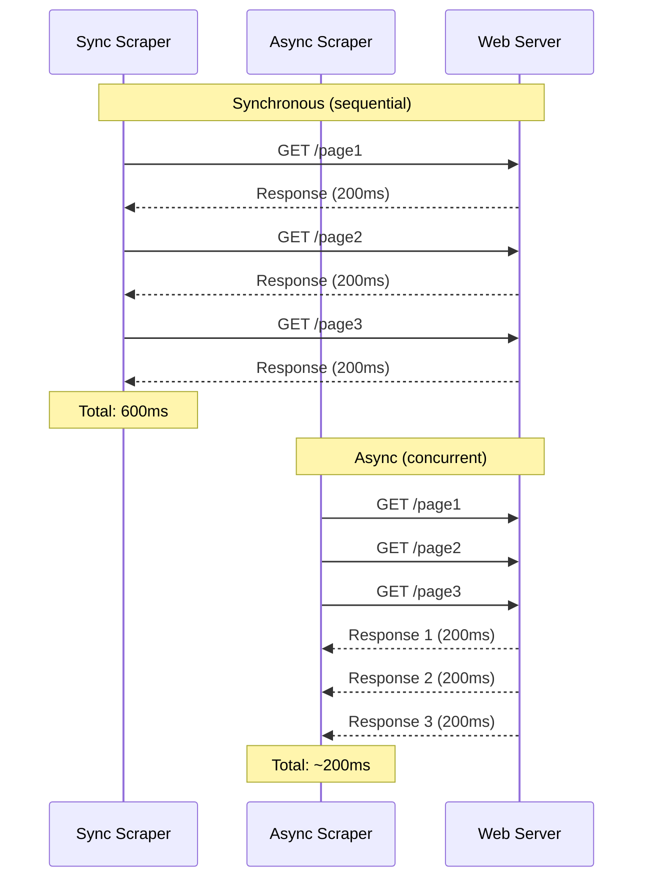
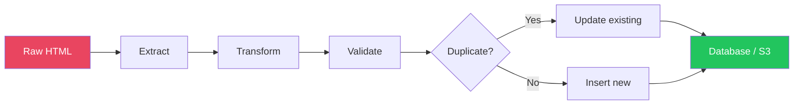

# Web Scraping Deep Dive — Part 5: Production Scraping — Async, Scheduling, and Monitoring

---

**Series:** Web Scraping — A Developer's Deep Dive
**Part:** 5 of 5 (Production)
**Audience:** Developers ready to deploy and operate scrapers in production
**Reading time:** ~45 minutes

---

## Table of Contents

1. [From Script to Service](#1-from-script-to-service)
2. [Async Scraping with asyncio + aiohttp](#2-async-scraping-with-asyncio--aiohttp)
3. [Async Scraping with httpx](#3-async-scraping-with-httpx)
4. [Job Scheduling — Cron, APScheduler, Celery](#4-job-scheduling--cron-apscheduler-celery)
5. [Data Pipelines — Clean, Deduplicate, Store](#5-data-pipelines--clean-deduplicate-store)
6. [Monitoring and Alerting](#6-monitoring-and-alerting)
7. [Error Recovery and Idempotent Scraping](#7-error-recovery-and-idempotent-scraping)
8. [Deployment — Docker and Cloud](#8-deployment--docker-and-cloud)
9. [Scraping API with FastAPI](#9-scraping-api-with-fastapi)
10. [Production Checklist](#10-production-checklist)
11. [Series Conclusion](#11-series-conclusion)

---

## 1. From Script to Service

A scraping script that runs on your laptop is not production-ready. Production scrapers must handle:

```mermaid
flowchart TD
    subgraph "Dev Scraper"
        A[Run manually] --> B[Print to terminal]
        B --> C[Crash on error]
    end

    subgraph "Production Scraper"
        D[Scheduled execution] --> E[Structured logging]
        E --> F[Error recovery + retries]
        F --> G[Data validation]
        G --> H[Deduplication]
        H --> I[Storage: DB / S3 / API]
        I --> J[Monitoring + alerts]
        J --> K[Health checks]
    end

    style C fill:#e94560,color:#fff
    style K fill:#22c55e,color:#fff
```



| Concern | Dev Script | Production Service |
|---------|-----------|-------------------|
| **Execution** | `python scraper.py` | Scheduled (cron/Celery) |
| **Error handling** | Crash and fix | Auto-retry with backoff |
| **Output** | JSON file on disk | Database, S3, webhook |
| **Logging** | print() | Structured logging (JSON) |
| **Monitoring** | None | Metrics, alerts, dashboards |
| **State** | Start from scratch | Resume from last checkpoint |
| **Deployment** | Local machine | Docker container / cloud function |

---

## 2. Async Scraping with asyncio + aiohttp

Synchronous scraping fetches one page at a time. Async scraping fetches many pages concurrently — 5-20x faster for I/O-bound workloads.

### 2.1 Why Async?



### 2.2 aiohttp — Async HTTP Client

```python
# filename: async_scraper.py
import asyncio
import time
import json
import logging
from dataclasses import dataclass, asdict

import aiohttp
from bs4 import BeautifulSoup

logger = logging.getLogger(__name__)


@dataclass
class ScrapedPage:
    url: str
    title: str
    content_length: int
    status: int
    elapsed_ms: float


class AsyncScraper:
    """High-performance async scraper with connection pooling and rate limiting."""

    def __init__(
        self,
        max_concurrent: int = 10,
        delay_per_domain: float = 1.0,
        timeout: int = 30,
    ):
        self.max_concurrent = max_concurrent
        self.delay_per_domain = delay_per_domain
        self.timeout = aiohttp.ClientTimeout(total=timeout)
        self.semaphore = asyncio.Semaphore(max_concurrent)
        self.domain_locks: dict[str, asyncio.Lock] = {}
        self.domain_last_request: dict[str, float] = {}
        self.results: list[ScrapedPage] = []
        self.errors: list[dict] = []

    async def _domain_rate_limit(self, domain: str):
        """Per-domain rate limiting."""
        if domain not in self.domain_locks:
            self.domain_locks[domain] = asyncio.Lock()

        async with self.domain_locks[domain]:
            last = self.domain_last_request.get(domain, 0)
            elapsed = time.time() - last
            if elapsed < self.delay_per_domain:
                await asyncio.sleep(self.delay_per_domain - elapsed)
            self.domain_last_request[domain] = time.time()

    async def fetch_one(self, session: aiohttp.ClientSession, url: str) -> ScrapedPage | None:
        """Fetch a single URL with rate limiting and error handling."""
        from urllib.parse import urlparse
        domain = urlparse(url).netloc

        async with self.semaphore:
            await self._domain_rate_limit(domain)
            start = time.time()

            try:
                async with session.get(url) as response:
                    html = await response.text()
                    elapsed = (time.time() - start) * 1000

                    if response.status == 200:
                        soup = BeautifulSoup(html, "html.parser")
                        title = soup.select_one("title")
                        page = ScrapedPage(
                            url=url,
                            title=title.text.strip() if title else "",
                            content_length=len(html),
                            status=response.status,
                            elapsed_ms=round(elapsed, 1),
                        )
                        self.results.append(page)
                        return page
                    elif response.status == 429:
                        retry_after = int(response.headers.get("Retry-After", 30))
                        logger.warning(f"429 for {url}. Waiting {retry_after}s")
                        await asyncio.sleep(retry_after)
                        return await self.fetch_one(session, url)  # Retry
                    else:
                        logger.warning(f"HTTP {response.status}: {url}")
                        self.errors.append({"url": url, "status": response.status})
                        return None

            except asyncio.TimeoutError:
                logger.warning(f"Timeout: {url}")
                self.errors.append({"url": url, "error": "timeout"})
            except aiohttp.ClientError as e:
                logger.warning(f"Client error for {url}: {e}")
                self.errors.append({"url": url, "error": str(e)})
            return None

    async def scrape_all(self, urls: list[str]) -> list[ScrapedPage]:
        """Scrape all URLs concurrently with connection pooling."""
        connector = aiohttp.TCPConnector(
            limit=self.max_concurrent,
            limit_per_host=5,         # Max connections per domain
            ttl_dns_cache=300,        # Cache DNS lookups for 5 minutes
            enable_cleanup_closed=True,
        )

        headers = {
            "User-Agent": "Mozilla/5.0 (Windows NT 10.0; Win64; x64) AppleWebKit/537.36",
            "Accept": "text/html,application/xhtml+xml",
            "Accept-Language": "en-US,en;q=0.9",
        }

        async with aiohttp.ClientSession(
            connector=connector,
            headers=headers,
            timeout=self.timeout,
        ) as session:
            tasks = [self.fetch_one(session, url) for url in urls]
            await asyncio.gather(*tasks, return_exceptions=True)

        return self.results


async def main():
    logging.basicConfig(level=logging.INFO)

    # Generate URLs to scrape
    urls = [
        f"https://books.toscrape.com/catalogue/page-{i}.html"
        for i in range(1, 51)  # 50 pages
    ]

    scraper = AsyncScraper(
        max_concurrent=5,
        delay_per_domain=1.0,
        timeout=30,
    )

    start = time.time()
    results = await scraper.scrape_all(urls)
    elapsed = time.time() - start

    logger.info(f"Scraped {len(results)} pages in {elapsed:.1f}s")
    logger.info(f"Errors: {len(scraper.errors)}")
    logger.info(f"Avg speed: {len(results) / elapsed:.1f} pages/sec")

    # Save results
    with open("async_results.json", "w") as f:
        json.dump([asdict(r) for r in results], f, indent=2)


if __name__ == "__main__":
    asyncio.run(main())
```

---

## 3. Async Scraping with httpx

`httpx` provides a cleaner async API that mirrors the synchronous `requests` interface.

```python
# filename: httpx_scraper.py
import asyncio
import time
import logging
from dataclasses import dataclass

import httpx
from bs4 import BeautifulSoup

logger = logging.getLogger(__name__)


async def scrape_with_httpx(urls: list[str], max_concurrent: int = 10) -> list[dict]:
    """Scrape URLs concurrently using httpx."""
    semaphore = asyncio.Semaphore(max_concurrent)
    results = []

    async def fetch(client: httpx.AsyncClient, url: str) -> dict | None:
        async with semaphore:
            try:
                response = await client.get(url, follow_redirects=True)
                if response.status_code == 200:
                    soup = BeautifulSoup(response.text, "html.parser")
                    return {
                        "url": url,
                        "title": soup.select_one("title").text.strip() if soup.select_one("title") else "",
                        "status": response.status_code,
                    }
                else:
                    logger.warning(f"HTTP {response.status_code}: {url}")
                    return None
            except httpx.RequestError as e:
                logger.warning(f"Error fetching {url}: {e}")
                return None

    limits = httpx.Limits(
        max_connections=max_concurrent,
        max_keepalive_connections=max_concurrent,
    )

    async with httpx.AsyncClient(
        limits=limits,
        timeout=httpx.Timeout(30.0),
        headers={
            "User-Agent": "Mozilla/5.0 (Windows NT 10.0; Win64; x64) AppleWebKit/537.36",
        },
        http2=True,  # HTTP/2 for better performance
    ) as client:
        tasks = [fetch(client, url) for url in urls]
        responses = await asyncio.gather(*tasks)
        results = [r for r in responses if r is not None]

    return results


# Async pagination pattern
async def scrape_paginated(base_url: str, max_pages: int = 50) -> list[dict]:
    """Scrape paginated content — sequential pagination, parallel detail fetching."""
    all_items = []

    async with httpx.AsyncClient(
        timeout=httpx.Timeout(30.0),
        headers={"User-Agent": "Mozilla/5.0 (Windows NT 10.0; Win64; x64) AppleWebKit/537.36"},
    ) as client:
        for page in range(1, max_pages + 1):
            # Sequential: fetch listing page
            url = f"{base_url}?page={page}"
            response = await client.get(url)

            if response.status_code != 200:
                break

            soup = BeautifulSoup(response.text, "html.parser")
            detail_urls = [
                response.url.join(a["href"])
                for a in soup.select(".product-card a[href]")
            ]

            if not detail_urls:
                break

            # Parallel: fetch all detail pages on this listing page
            detail_tasks = [client.get(str(u)) for u in detail_urls]
            detail_responses = await asyncio.gather(*detail_tasks, return_exceptions=True)

            for detail_resp in detail_responses:
                if isinstance(detail_resp, Exception):
                    continue
                if detail_resp.status_code == 200:
                    detail_soup = BeautifulSoup(detail_resp.text, "html.parser")
                    all_items.append({
                        "url": str(detail_resp.url),
                        "title": detail_soup.select_one("h1").text.strip()
                            if detail_soup.select_one("h1") else "",
                    })

            logger.info(f"Page {page}: {len(detail_urls)} items (total: {len(all_items)})")
            await asyncio.sleep(1.5)  # Rate limit between listing pages

    return all_items
```

> **Key insight:** Use sequential pagination (fetch page 1, then page 2, etc.) but parallel detail fetching (fetch all products on a page at once). This pattern maximizes throughput while respecting the natural browsing order.

---

## 4. Job Scheduling — Cron, APScheduler, Celery

### 4.1 Cron (Simplest)

```bash
# Run scraper every day at 2 AM
0 2 * * * cd /app && python scraper.py >> /var/log/scraper.log 2>&1

# Run every 6 hours
0 */6 * * * cd /app && python scraper.py --incremental

# Run on weekdays at 9 AM
0 9 * * 1-5 cd /app && python scraper.py --target=jobs
```

### 4.2 APScheduler (Python-Native)

```python
# filename: scheduled_scraper.py
from apscheduler.schedulers.blocking import BlockingScheduler
from apscheduler.triggers.cron import CronTrigger
from apscheduler.triggers.interval import IntervalTrigger
import logging

logger = logging.getLogger(__name__)


def scrape_products():
    """Daily product scraping job."""
    logger.info("Starting product scrape")
    # Your scraping logic here
    logger.info("Product scrape complete")


def scrape_prices():
    """Hourly price monitoring job."""
    logger.info("Starting price check")
    # Your scraping logic here
    logger.info("Price check complete")


def health_check():
    """Verify scrapers are working correctly."""
    logger.info("Running health check")
    # Check database connectivity, proxy health, etc.


scheduler = BlockingScheduler()

# Daily at 2 AM UTC
scheduler.add_job(
    scrape_products,
    trigger=CronTrigger(hour=2, minute=0),
    id="daily_products",
    name="Daily Product Scrape",
    misfire_grace_time=3600,  # Allow up to 1 hour late start
    max_instances=1,          # Prevent overlapping runs
)

# Every 4 hours
scheduler.add_job(
    scrape_prices,
    trigger=IntervalTrigger(hours=4),
    id="price_monitor",
    name="Price Monitor",
    max_instances=1,
)

# Every 30 minutes
scheduler.add_job(
    health_check,
    trigger=IntervalTrigger(minutes=30),
    id="health_check",
    name="Health Check",
)

if __name__ == "__main__":
    logging.basicConfig(level=logging.INFO)
    logger.info("Starting scheduler...")
    scheduler.start()
```

### 4.3 Celery (Distributed)

For large-scale scraping across multiple workers:

```python
# filename: celery_scraper/tasks.py
from celery import Celery
from celery.schedules import crontab
import logging

logger = logging.getLogger(__name__)

app = Celery("scraper", broker="redis://localhost:6379/0", backend="redis://localhost:6379/1")

app.conf.beat_schedule = {
    "daily-product-scrape": {
        "task": "tasks.scrape_products",
        "schedule": crontab(hour=2, minute=0),
        "args": (100,),  # max_pages
    },
    "hourly-price-monitor": {
        "task": "tasks.scrape_prices",
        "schedule": crontab(minute=0),  # Every hour
    },
}

app.conf.task_serializer = "json"
app.conf.result_serializer = "json"
app.conf.task_acks_late = True
app.conf.worker_prefetch_multiplier = 1


@app.task(bind=True, max_retries=3, default_retry_delay=60)
def scrape_products(self, max_pages: int = 50):
    """Scrape product listings."""
    try:
        # Your scraping logic
        logger.info(f"Scraping {max_pages} pages of products")
        # ...
        return {"status": "success", "items_scraped": 500}

    except Exception as exc:
        logger.error(f"Product scrape failed: {exc}")
        self.retry(exc=exc)


@app.task(bind=True, max_retries=3)
def scrape_single_url(self, url: str) -> dict:
    """Scrape a single URL — used for distributed crawling."""
    try:
        # Scrape the URL
        return {"url": url, "status": "success"}
    except Exception as exc:
        self.retry(exc=exc)


@app.task
def distribute_scraping(urls: list[str]):
    """Fan out scraping across multiple workers."""
    from celery import group
    job = group(scrape_single_url.s(url) for url in urls)
    result = job.apply_async()
    return result.id
```

```bash
# Start Celery worker
celery -A tasks worker --loglevel=info --concurrency=4

# Start Celery beat (scheduler)
celery -A tasks beat --loglevel=info
```

---

## 5. Data Pipelines — Clean, Deduplicate, Store

### 5.1 ETL Pipeline for Scraped Data



```python
# filename: data_pipeline.py
import hashlib
import json
import logging
from datetime import datetime, timezone
from dataclasses import dataclass, field

import sqlite3

logger = logging.getLogger(__name__)


@dataclass
class PipelineStats:
    """Track pipeline execution metrics."""
    total_input: int = 0
    valid: int = 0
    invalid: int = 0
    duplicates: int = 0
    new_inserts: int = 0
    updates: int = 0
    errors: int = 0
    start_time: datetime = field(default_factory=lambda: datetime.now(timezone.utc))

    def summary(self) -> str:
        elapsed = (datetime.now(timezone.utc) - self.start_time).total_seconds()
        return (
            f"Pipeline complete in {elapsed:.1f}s: "
            f"{self.total_input} input → {self.valid} valid, "
            f"{self.invalid} invalid, {self.duplicates} dupes, "
            f"{self.new_inserts} new, {self.updates} updated, "
            f"{self.errors} errors"
        )


class DataPipeline:
    """Complete ETL pipeline for scraped data."""

    def __init__(self, db_path: str = "scraped_data.db"):
        self.db_path = db_path
        self.stats = PipelineStats()
        self._init_db()

    def _init_db(self):
        with sqlite3.connect(self.db_path) as conn:
            conn.execute("""
                CREATE TABLE IF NOT EXISTS items (
                    id TEXT PRIMARY KEY,
                    url TEXT UNIQUE,
                    title TEXT,
                    price REAL,
                    data JSON,
                    content_hash TEXT,
                    first_seen TEXT,
                    last_seen TEXT,
                    times_seen INTEGER DEFAULT 1
                )
            """)
            conn.execute("""
                CREATE INDEX IF NOT EXISTS idx_url ON items(url)
            """)
            conn.execute("""
                CREATE INDEX IF NOT EXISTS idx_content_hash ON items(content_hash)
            """)

    @staticmethod
    def _generate_id(item: dict) -> str:
        """Generate a deterministic ID from the item's URL."""
        url = item.get("url", "")
        return hashlib.sha256(url.encode()).hexdigest()[:16]

    @staticmethod
    def _content_hash(item: dict) -> str:
        """Hash the content to detect changes."""
        content = json.dumps(item, sort_keys=True, default=str)
        return hashlib.md5(content.encode()).hexdigest()

    def clean(self, item: dict) -> dict:
        """Clean and normalize a single item."""
        cleaned = {}
        for key, value in item.items():
            if isinstance(value, str):
                # Normalize whitespace
                value = " ".join(value.split()).strip()
                # Remove null bytes
                value = value.replace("\x00", "")
            cleaned[key] = value

        # Normalize price
        if "price" in cleaned and isinstance(cleaned["price"], str):
            price_str = cleaned["price"].replace("$", "").replace("£", "").replace(",", "").strip()
            try:
                cleaned["price"] = float(price_str)
            except ValueError:
                cleaned["price"] = None

        return cleaned

    def validate(self, item: dict) -> list[str]:
        """Validate an item. Returns list of error messages (empty = valid)."""
        errors = []
        if not item.get("url"):
            errors.append("Missing URL")
        if not item.get("title"):
            errors.append("Missing title")
        if item.get("price") is not None and item["price"] < 0:
            errors.append(f"Negative price: {item['price']}")
        return errors

    def process_batch(self, items: list[dict]) -> PipelineStats:
        """Process a batch of scraped items through the full pipeline."""
        self.stats = PipelineStats(total_input=len(items))
        now = datetime.now(timezone.utc).isoformat()

        with sqlite3.connect(self.db_path) as conn:
            for raw_item in items:
                try:
                    # Clean
                    item = self.clean(raw_item)

                    # Validate
                    errors = self.validate(item)
                    if errors:
                        self.stats.invalid += 1
                        logger.debug(f"Invalid item: {errors}")
                        continue
                    self.stats.valid += 1

                    # Generate ID and content hash
                    item_id = self._generate_id(item)
                    content_hash = self._content_hash(item)

                    # Check for duplicates
                    existing = conn.execute(
                        "SELECT content_hash, times_seen FROM items WHERE id = ?",
                        (item_id,)
                    ).fetchone()

                    if existing:
                        old_hash, times_seen = existing
                        if old_hash == content_hash:
                            # Same content — just update last_seen
                            conn.execute(
                                "UPDATE items SET last_seen = ?, times_seen = ? WHERE id = ?",
                                (now, times_seen + 1, item_id)
                            )
                            self.stats.duplicates += 1
                        else:
                            # Content changed — update everything
                            conn.execute("""
                                UPDATE items SET
                                    title = ?, price = ?, data = ?, content_hash = ?,
                                    last_seen = ?, times_seen = ?
                                WHERE id = ?
                            """, (
                                item.get("title"), item.get("price"),
                                json.dumps(item), content_hash,
                                now, times_seen + 1, item_id,
                            ))
                            self.stats.updates += 1
                    else:
                        # New item
                        conn.execute("""
                            INSERT INTO items (id, url, title, price, data, content_hash, first_seen, last_seen)
                            VALUES (?, ?, ?, ?, ?, ?, ?, ?)
                        """, (
                            item_id, item.get("url"), item.get("title"),
                            item.get("price"), json.dumps(item), content_hash,
                            now, now,
                        ))
                        self.stats.new_inserts += 1

                except Exception as e:
                    self.stats.errors += 1
                    logger.error(f"Pipeline error: {e}")

            conn.commit()

        logger.info(self.stats.summary())
        return self.stats
```

---

## 6. Monitoring and Alerting

### 6.1 Structured Logging

```python
# filename: scraper_logging.py
import json
import logging
import sys
from datetime import datetime, timezone


class JSONFormatter(logging.Formatter):
    """Format log records as JSON for structured logging."""

    def format(self, record):
        log_entry = {
            "timestamp": datetime.now(timezone.utc).isoformat(),
            "level": record.levelname,
            "logger": record.name,
            "message": record.getMessage(),
        }

        # Add extra fields if present
        if hasattr(record, "url"):
            log_entry["url"] = record.url
        if hasattr(record, "status_code"):
            log_entry["status_code"] = record.status_code
        if hasattr(record, "elapsed_ms"):
            log_entry["elapsed_ms"] = record.elapsed_ms
        if hasattr(record, "items_scraped"):
            log_entry["items_scraped"] = record.items_scraped

        if record.exc_info:
            log_entry["exception"] = self.formatException(record.exc_info)

        return json.dumps(log_entry)


def setup_logging():
    """Configure structured JSON logging."""
    handler = logging.StreamHandler(sys.stdout)
    handler.setFormatter(JSONFormatter())

    root = logging.getLogger()
    root.setLevel(logging.INFO)
    root.addHandler(handler)

    return root


# Usage
logger = setup_logging()
logger.info("Scraping started", extra={"url": "https://example.com", "items_scraped": 0})
# Output: {"timestamp": "2024-01-15T10:00:00+00:00", "level": "INFO", "logger": "root",
#          "message": "Scraping started", "url": "https://example.com", "items_scraped": 0}
```

### 6.2 Metrics Collection

```python
# filename: scraper_metrics.py
import time
import json
from datetime import datetime, timezone
from dataclasses import dataclass, field, asdict
from pathlib import Path


@dataclass
class ScraperMetrics:
    """Collect and report scraper metrics."""
    run_id: str = ""
    spider_name: str = ""
    start_time: str = ""
    end_time: str = ""
    duration_seconds: float = 0

    # Request metrics
    total_requests: int = 0
    successful_requests: int = 0
    failed_requests: int = 0
    retried_requests: int = 0

    # Response metrics
    status_200: int = 0
    status_403: int = 0
    status_429: int = 0
    status_500: int = 0
    status_other: int = 0

    # Data metrics
    items_scraped: int = 0
    items_dropped: int = 0
    items_new: int = 0
    items_updated: int = 0
    items_duplicate: int = 0

    # Performance
    avg_response_time_ms: float = 0
    max_response_time_ms: float = 0
    bytes_downloaded: int = 0
    pages_per_second: float = 0

    # Errors
    errors: list = field(default_factory=list)

    _response_times: list = field(default_factory=list, repr=False)

    def record_request(self, status: int, elapsed_ms: float, size_bytes: int = 0):
        """Record a single request's outcome."""
        self.total_requests += 1
        self._response_times.append(elapsed_ms)
        self.bytes_downloaded += size_bytes

        if status == 200:
            self.successful_requests += 1
            self.status_200 += 1
        elif status == 403:
            self.failed_requests += 1
            self.status_403 += 1
        elif status == 429:
            self.retried_requests += 1
            self.status_429 += 1
        elif status >= 500:
            self.failed_requests += 1
            self.status_500 += 1
        else:
            self.status_other += 1

    def finalize(self):
        """Calculate final aggregate metrics."""
        if self._response_times:
            self.avg_response_time_ms = round(
                sum(self._response_times) / len(self._response_times), 1
            )
            self.max_response_time_ms = round(max(self._response_times), 1)

        if self.duration_seconds > 0:
            self.pages_per_second = round(
                self.successful_requests / self.duration_seconds, 2
            )

    def success_rate(self) -> float:
        if self.total_requests == 0:
            return 0
        return round(self.successful_requests / self.total_requests * 100, 1)

    def save(self, path: str = "metrics"):
        """Save metrics to a JSON file."""
        Path(path).mkdir(exist_ok=True)
        filename = f"{path}/{self.spider_name}_{self.run_id}.json"
        with open(filename, "w") as f:
            data = asdict(self)
            del data["_response_times"]
            json.dump(data, f, indent=2)

    def should_alert(self) -> list[str]:
        """Check if any metrics trigger an alert."""
        alerts = []

        if self.success_rate() < 80:
            alerts.append(f"Low success rate: {self.success_rate()}%")

        if self.status_403 > self.total_requests * 0.1:
            alerts.append(f"High 403 rate: {self.status_403} of {self.total_requests}")

        if self.status_429 > self.total_requests * 0.2:
            alerts.append(f"Heavy rate limiting: {self.status_429} of {self.total_requests}")

        if self.items_scraped == 0 and self.total_requests > 10:
            alerts.append("Zero items scraped despite successful requests")

        if self.avg_response_time_ms > 10000:
            alerts.append(f"Slow responses: avg {self.avg_response_time_ms}ms")

        return alerts
```

### 6.3 Alerting via Webhook

```python
# filename: alerts.py
import json
import requests
import logging

logger = logging.getLogger(__name__)


class AlertManager:
    """Send alerts when scraper metrics exceed thresholds."""

    def __init__(self, slack_webhook: str = None, email_config: dict = None):
        self.slack_webhook = slack_webhook
        self.email_config = email_config

    def send_slack(self, message: str, severity: str = "warning"):
        """Send alert to Slack webhook."""
        if not self.slack_webhook:
            return

        color_map = {"info": "#36a64f", "warning": "#ff9900", "error": "#ff0000"}
        payload = {
            "attachments": [{
                "color": color_map.get(severity, "#ff9900"),
                "title": f"Scraper Alert ({severity.upper()})",
                "text": message,
                "footer": "Scraper Monitoring",
            }]
        }

        try:
            requests.post(self.slack_webhook, json=payload, timeout=10)
        except Exception as e:
            logger.error(f"Failed to send Slack alert: {e}")

    def check_and_alert(self, metrics: ScraperMetrics):
        """Check metrics and send alerts if needed."""
        alerts = metrics.should_alert()
        if alerts:
            message = f"*Spider: {metrics.spider_name}*\n"
            message += f"Run ID: {metrics.run_id}\n"
            message += f"Duration: {metrics.duration_seconds:.0f}s\n\n"
            message += "Issues:\n" + "\n".join(f"  - {a}" for a in alerts)

            severity = "error" if metrics.success_rate() < 50 else "warning"
            self.send_slack(message, severity=severity)
            logger.warning(f"Alerts triggered: {alerts}")
```

---

## 7. Error Recovery and Idempotent Scraping

### 7.1 Checkpoint / Resume System

```python
# filename: checkpoint.py
import json
import logging
from pathlib import Path
from datetime import datetime, timezone

logger = logging.getLogger(__name__)


class CheckpointManager:
    """Save and resume scraping progress to handle crashes gracefully."""

    def __init__(self, checkpoint_dir: str = "./checkpoints"):
        self.checkpoint_dir = Path(checkpoint_dir)
        self.checkpoint_dir.mkdir(exist_ok=True)

    def _path(self, job_id: str) -> Path:
        return self.checkpoint_dir / f"{job_id}.json"

    def save(self, job_id: str, state: dict):
        """Save current scraping state."""
        state["_checkpoint_time"] = datetime.now(timezone.utc).isoformat()
        with open(self._path(job_id), "w") as f:
            json.dump(state, f, indent=2)

    def load(self, job_id: str) -> dict | None:
        """Load previous scraping state, if exists."""
        path = self._path(job_id)
        if not path.exists():
            return None
        with open(path) as f:
            state = json.load(f)
        logger.info(f"Resumed from checkpoint: {state['_checkpoint_time']}")
        return state

    def clear(self, job_id: str):
        """Clear checkpoint after successful completion."""
        path = self._path(job_id)
        if path.exists():
            path.unlink()


# Usage in a scraper
class ResumableScraper:
    def __init__(self, job_id: str):
        self.job_id = job_id
        self.checkpoint = CheckpointManager()

    def scrape(self, urls: list[str]):
        # Try to resume from checkpoint
        state = self.checkpoint.load(self.job_id)
        if state:
            completed_urls = set(state.get("completed_urls", []))
            items = state.get("items", [])
            logger.info(f"Resuming: {len(completed_urls)} URLs already done")
        else:
            completed_urls = set()
            items = []

        remaining = [u for u in urls if u not in completed_urls]
        logger.info(f"Remaining URLs: {len(remaining)}")

        for i, url in enumerate(remaining):
            try:
                item = self.fetch_and_parse(url)
                if item:
                    items.append(item)
                completed_urls.add(url)

                # Checkpoint every 10 URLs
                if (i + 1) % 10 == 0:
                    self.checkpoint.save(self.job_id, {
                        "completed_urls": list(completed_urls),
                        "items": items,
                    })
                    logger.info(f"Checkpoint saved: {len(completed_urls)} URLs")

            except KeyboardInterrupt:
                # Save progress on manual stop
                self.checkpoint.save(self.job_id, {
                    "completed_urls": list(completed_urls),
                    "items": items,
                })
                logger.info("Interrupted — checkpoint saved")
                raise

        # Success — clear checkpoint
        self.checkpoint.clear(self.job_id)
        return items

    def fetch_and_parse(self, url: str) -> dict | None:
        # Your scraping logic here
        pass
```

---

## 8. Deployment — Docker and Cloud

### 8.1 Dockerfile

```dockerfile
# Dockerfile
FROM python:3.12-slim

# Install system dependencies for Playwright
RUN apt-get update && apt-get install -y \
    wget \
    gnupg \
    && rm -rf /var/lib/apt/lists/*

WORKDIR /app

# Install Python dependencies
COPY requirements.txt .
RUN pip install --no-cache-dir -r requirements.txt

# Install Playwright browsers
RUN playwright install --with-deps chromium

# Copy scraper code
COPY . .

# Run the scraper
CMD ["python", "main.py"]
```

```
# requirements.txt
requests==2.31.0
beautifulsoup4==4.12.2
lxml==5.1.0
playwright==1.41.0
aiohttp==3.9.3
httpx[http2]==0.26.0
apscheduler==3.10.4
```

### 8.2 Docker Compose (with Redis + Scheduler)

```yaml
# docker-compose.yml
version: "3.8"
services:
  scraper:
    build: .
    environment:
      - LOG_LEVEL=INFO
      - DB_PATH=/data/scraped.db
      - SLACK_WEBHOOK=${SLACK_WEBHOOK}
    volumes:
      - scraper-data:/data
      - ./checkpoints:/app/checkpoints
    restart: unless-stopped
    depends_on:
      - redis

  redis:
    image: redis:7-alpine
    volumes:
      - redis-data:/data

  worker:
    build: .
    command: celery -A tasks worker --loglevel=info --concurrency=4
    depends_on:
      - redis

  beat:
    build: .
    command: celery -A tasks beat --loglevel=info
    depends_on:
      - redis

volumes:
  scraper-data:
  redis-data:
```

### 8.3 Cloud Deployment Options

| Platform | Best For | Cost Model |
|----------|----------|-----------|
| **AWS Lambda** | Lightweight scrapers (< 15 min) | Pay per invocation |
| **AWS ECS/Fargate** | Long-running scrapers | Pay per vCPU/memory/hour |
| **Google Cloud Run** | HTTP-triggered scrapers | Pay per request |
| **Railway / Render** | Simple deployment | Monthly subscription |
| **GitHub Actions** | Scheduled light scrapers | Free tier available |

```yaml
# .github/workflows/scraper.yml — GitHub Actions scheduled scraper
name: Daily Scrape
on:
  schedule:
    - cron: "0 2 * * *"  # 2 AM UTC daily
  workflow_dispatch:      # Manual trigger

jobs:
  scrape:
    runs-on: ubuntu-latest
    steps:
      - uses: actions/checkout@v4
      - uses: actions/setup-python@v5
        with:
          python-version: "3.12"

      - name: Install dependencies
        run: pip install -r requirements.txt

      - name: Run scraper
        env:
          SLACK_WEBHOOK: ${{ secrets.SLACK_WEBHOOK }}
        run: python scraper.py --max-pages 50

      - name: Upload results
        uses: actions/upload-artifact@v4
        with:
          name: scrape-results
          path: output/
          retention-days: 30
```

---

## 9. Scraping API with FastAPI

Expose your scrapers as an API service — trigger scrapes on-demand, check status, and retrieve results.

```python
# filename: scraper_api.py
import asyncio
import uuid
from datetime import datetime, timezone

from fastapi import FastAPI, BackgroundTasks, HTTPException
from pydantic import BaseModel, HttpUrl

app = FastAPI(title="Scraper API", version="1.0.0")

# In-memory job storage (use Redis/DB in production)
jobs: dict[str, dict] = {}


class ScrapeRequest(BaseModel):
    url: HttpUrl
    selectors: dict[str, str] = {"title": "h1", "content": "article"}
    max_pages: int = 1


class ScrapeResponse(BaseModel):
    job_id: str
    status: str
    message: str


class JobStatus(BaseModel):
    job_id: str
    status: str  # "pending", "running", "completed", "failed"
    created_at: str
    completed_at: str | None = None
    items_count: int = 0
    error: str | None = None
    results: list[dict] | None = None


async def run_scrape_job(job_id: str, url: str, selectors: dict, max_pages: int):
    """Background task that runs the actual scraping."""
    jobs[job_id]["status"] = "running"

    try:
        import httpx
        from bs4 import BeautifulSoup

        results = []
        async with httpx.AsyncClient(
            timeout=30.0,
            headers={"User-Agent": "Mozilla/5.0 (Windows NT 10.0; Win64; x64) AppleWebKit/537.36"},
        ) as client:
            response = await client.get(url, follow_redirects=True)
            if response.status_code == 200:
                soup = BeautifulSoup(response.text, "html.parser")
                item = {}
                for key, selector in selectors.items():
                    el = soup.select_one(selector)
                    item[key] = el.get_text(strip=True) if el else ""
                item["url"] = str(url)
                results.append(item)

        jobs[job_id]["status"] = "completed"
        jobs[job_id]["completed_at"] = datetime.now(timezone.utc).isoformat()
        jobs[job_id]["results"] = results
        jobs[job_id]["items_count"] = len(results)

    except Exception as e:
        jobs[job_id]["status"] = "failed"
        jobs[job_id]["error"] = str(e)
        jobs[job_id]["completed_at"] = datetime.now(timezone.utc).isoformat()


@app.post("/scrape", response_model=ScrapeResponse)
async def create_scrape_job(request: ScrapeRequest, background_tasks: BackgroundTasks):
    """Submit a new scraping job."""
    job_id = str(uuid.uuid4())[:8]

    jobs[job_id] = {
        "status": "pending",
        "created_at": datetime.now(timezone.utc).isoformat(),
        "completed_at": None,
        "results": None,
        "items_count": 0,
        "error": None,
    }

    background_tasks.add_task(
        run_scrape_job,
        job_id,
        str(request.url),
        request.selectors,
        request.max_pages,
    )

    return ScrapeResponse(
        job_id=job_id,
        status="pending",
        message="Scrape job submitted",
    )


@app.get("/scrape/{job_id}", response_model=JobStatus)
async def get_job_status(job_id: str):
    """Check the status of a scraping job."""
    if job_id not in jobs:
        raise HTTPException(status_code=404, detail="Job not found")

    job = jobs[job_id]
    return JobStatus(job_id=job_id, **job)


@app.get("/health")
async def health_check():
    """Health check endpoint."""
    active_jobs = sum(1 for j in jobs.values() if j["status"] in ("pending", "running"))
    return {
        "status": "healthy",
        "active_jobs": active_jobs,
        "total_jobs": len(jobs),
    }
```

```bash
# Run the API
uvicorn scraper_api:app --host 0.0.0.0 --port 8000

# Submit a scrape job
curl -X POST http://localhost:8000/scrape \
  -H "Content-Type: application/json" \
  -d '{"url": "https://books.toscrape.com", "selectors": {"title": "h1", "count": ".product_pod"}}'

# Check job status
curl http://localhost:8000/scrape/abc12345
```

---

## 10. Production Checklist

Before deploying a scraper to production, verify every item:

### Legal & Ethical
- [ ] Checked robots.txt for all target domains
- [ ] Reviewed Terms of Service
- [ ] Not scraping personal data (GDPR/CCPA compliance)
- [ ] Not scraping copyrighted content for redistribution
- [ ] Rate limiting is respectful (2+ second delays)

### Reliability
- [ ] Retry logic with exponential backoff
- [ ] Timeout on all network requests
- [ ] Graceful handling of 403, 429, 500 responses
- [ ] Checkpoint/resume for long-running jobs
- [ ] Duplicate detection and deduplication

### Data Quality
- [ ] Input validation on extracted data
- [ ] Handling missing/null fields gracefully
- [ ] Encoding handling (UTF-8 normalization)
- [ ] Content change detection (hash-based)

### Operations
- [ ] Structured logging (JSON)
- [ ] Metrics collection (success rate, latency, items/sec)
- [ ] Alerting on failures (Slack, email, PagerDuty)
- [ ] Health check endpoint
- [ ] Scheduled execution (cron/Celery/APScheduler)

### Security
- [ ] Credentials stored in environment variables (not code)
- [ ] Proxy credentials not logged
- [ ] Cookie files excluded from version control (.gitignore)
- [ ] API keys rotated regularly

### Deployment
- [ ] Docker container with pinned dependencies
- [ ] Resource limits (CPU, memory) configured
- [ ] Persistent storage for checkpoints and results
- [ ] CI/CD pipeline for updates
- [ ] Rollback strategy

---

## 11. Series Conclusion

Over this 6-part series, you have built a complete web scraping skill set:

| Part | What You Learned |
|------|-----------------|
| **0 — Foundations** | HTTP protocol, robots.txt, ethics, tools landscape |
| **1 — BeautifulSoup** | HTML parsing, CSS selectors, session handling, data extraction |
| **2 — Browser Automation** | Playwright, Selenium, JS-rendered pages, network interception |
| **3 — Scrapy** | Spiders, items, pipelines, middleware, large-scale crawling |
| **4 — Anti-Scraping** | Authentication, cookie injection, stealth, CAPTCHAs, proxies |
| **5 — Production** | Async scraping, scheduling, monitoring, deployment |

### Where to Go Next

- **Combine with ML:** Use scraped data to train models (see [Machine Learning Series](../Machine-Learning/))
- **Build RAG systems:** Feed scraped content into RAG pipelines (see [RAG Series](../RAG/))
- **Real-time pipelines:** Stream scraped data through Kafka (see [Kafka Series](../Kafka/))
- **Cache and queue:** Use Redis for URL queues and result caching (see [Redis Series](../Redis/))
- **Deploy APIs:** Expose scrapers as FastAPI services (see [Python & FastAPI Series](../Python-FastAPI/))

---

**Series:** [Web Scraping Deep Dive — Index](index.md)
**Previous:** [Part 4 — Anti-Scraping & Advanced Techniques](web-scraping-deep-dive-part-4.md)
